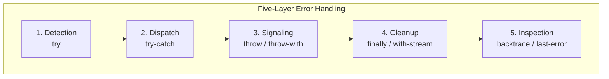
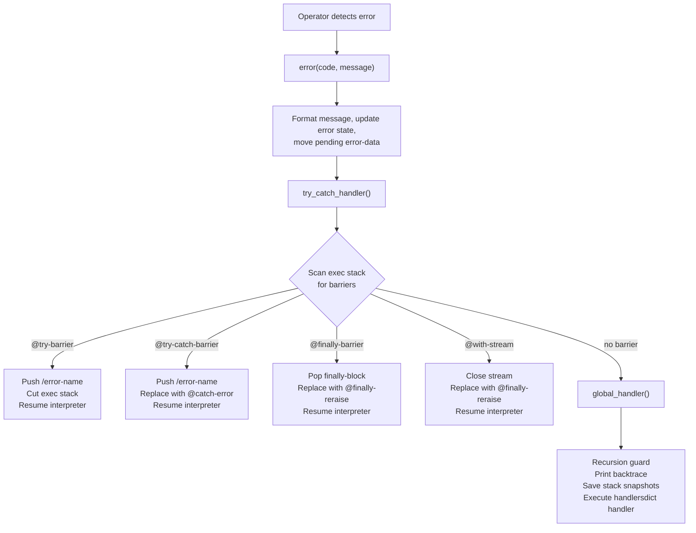

<!--
   ______    _
  /_  __/___(_)_  __
   / / / __/ /\ \/ /       Stack-Based Interpreter & VM
  / / / / / /  > · <      C++23 · Single-Header Library
 /_/ /_/ /_/  /_/\_\     Copyright 2026 Mark Guidarelli

Licensed under the Apache License, Version 2.0 (the "License");
you may not use this file except in compliance with the License.
You may obtain a copy of the License at

    https://www.apache.org/licenses/LICENSE-2.0

Unless required by applicable law or agreed to in writing, software
distributed under the License is distributed on an "AS IS" BASIS,
WITHOUT WARRANTIES OR CONDITIONS OF ANY KIND, either express or implied.
See the License for the specific language governing permissions and
limitations under the License.
-->

# Trix Error Handling

Trix provides a five-layer error handling system that combines the structured
exception handling of modern languages with the composability of a stack-based
architecture. Every error is a first-class name, every handler is a procedure,
and every cleanup guarantee is enforced by the VM -- not by programmer
discipline.

This document covers the full error handling system: operators, error codes,
architecture, patterns, and design rationale.

---

## Table of Contents

1. [Overview](#1-overview)
2. [Quick Reference](#2-quick-reference)
3. [Tutorial](#3-tutorial)
4. [Error Codes](#4-error-codes)
5. [The Error Dictionary](#5-the-error-dictionary)
6. [Patterns and Idioms](#6-patterns-and-idioms)
7. [Architecture](#7-architecture)
8. [Design Decisions](#8-design-decisions)

---

## 1. Overview

Trix errors are not exceptions in the C++/Java sense and not return codes in
the C sense. They are named values that propagate through five cooperating
layers:



| Layer | Operator | Purpose |
| --- | --- | --- |
| 1. Detection | `try` | Execute a procedure, report whether it succeeded or failed |
| 1b. Result | `try-result` | Execute a procedure, wrap outcome as `/ok` or `/err` tagged |
| 2. Dispatch | `try-catch` | Route errors to named handlers with `/default` fallback |
| 3. Signaling | `throw` / `throw-with` | Raise errors explicitly, optionally with structured data |
| 4. Cleanup | `finally` / `with-stream` | Guarantee resource release regardless of outcome |
| 5. Inspection | `backtrace` / `last-error` / etc. | Examine error context after the fact |

The system is **zero-cost on the success path** -- `try` and `try-catch` push
a single barrier marker onto the exec stack and proceed. Error propagation
walks the exec stack only when an error actually occurs.

Every built-in operator validates its operands before executing. There are no
silent failures, no implicit coercions, and no undefined behavior reachable
from Trix code. The 58 named error codes cover every failure mode the VM can
produce, and all 58 are throwable and catchable by user code.

---

## 2. Quick Reference

### Error Handling Operators

`try` -- `proc -- name`
    Execute proc; push `/no-error` on success, `/error-name` on failure.

`try-catch` -- `dict proc -- ...`
    Execute proc; dispatch to handler in dict by error name.

`try-result` -- `proc -- tagged`
    Execute proc; wrap result in `/ok value` or `/err error-name` tagged value.
    On error, rolls back the operand stack to its pre-call depth.

`throw` -- `name --`
    Raise the named error (sets error-data to null).

`throw-with` -- `name any --`
    Raise the named error with structured data.

`rethrow` -- `--`
    Re-raise the last error (preserves error name and message).

`finally` -- `finally-proc proc -- ...`
    Execute proc; run finally-proc whether proc succeeds or fails.

`with-stream` -- `filename mode proc -- ...`
    Open file, execute proc with stream, guarantee close.

`stopped` -- `proc -- bool`
    Execute proc; push `true` if `stop` was called, `false` otherwise.

`last-error` -- `-- name`
    Push the error name from the most recent error.

`last-error-data` -- `-- any`
    Push the error data from the most recent error (null if not set).

`last-error-message` -- `-- string`
    Push the error message string from the most recent error.

`backtrace` -- `-- array`
    Push an array of call-frame dicts from the current exec stack.

### Error Name Constants

Every error code has a corresponding name that can be used with `throw` and
matched in `try-catch` handlers. See [Section 4](#4-error-codes) for the
complete list.

---

## 3. Tutorial

### 3.1 Detecting Errors with `try`

The simplest form of error handling: execute a procedure and check whether it
succeeded.

```
% try executes the procedure and pushes an error name
{ 1 2 add } try % => 3 /no-error
pop             % discard /no-error, keep 3

{ 1 0 div } try % => /div-by-zero
/div-by-zero eq % => true
```

`try` always pushes exactly one name onto the operand stack after the procedure
completes. On success, the name is `/no-error`. On failure, it is the name of
the error that occurred (e.g., `/div-by-zero`, `/type-check`, `/undefined`).

The procedure's normal results remain on the stack below the error name:

```
{ 10 20 add } try      % stack: 30 /no-error
```

**Conditional error handling:**

```
{ some-risky-operation } try
dup /no-error eq {
    pop                 % discard /no-error
    (Success!) =
} {
    (Error: ) print =   % print error name
    clear               % discard partial results
} if-else
```

### 3.2 Pattern-Matching Errors with `try-catch`

`try-catch` dispatches errors to named handler procedures in a dictionary.
This is the primary error handling mechanism for production code.

```
% handler dict maps error names to handler procedures
<< /div-by-zero { pop 0 }                  % return 0 for division by zero
   /type-check  { pop (bad type!) = }      % print message for type errors
>>
{ 1 0 div }
try-catch
% handler ran: pop discarded /div-by-zero, pushed 0
% stack: 0
```

**How it works:**

1. `try-catch` takes a handler dictionary and a procedure
2. If the procedure succeeds, its results remain on the stack (no handler runs)
3. If an error occurs, Trix looks up the error name in the handler dictionary
4. If found, the matching handler procedure executes with `/error-name` on the stack
5. If not found, the error propagates to the next enclosing `try` or `try-catch`

**The `/default` fallback handler:**

When no specific handler matches, Trix checks for a `/default` entry before
propagating the error outward:

```
<< /type-check { pop (type error) }
   /default    { pop (something else) }
>>
{ 1 0 div }
try-catch
% /div-by-zero did not match /type-check, matched /default
% stack: (something else)
```

The `/default` handler is a catch-all -- it receives the error name on the
stack just like any other handler, so it can inspect and act on the specific
error:

<!-- doctest: skip (synopsis: risky-operation is a stand-in for the guarded procedure) -->
```
<< /default {
    dup /div-by-zero eq { pop 0 } {
        dup /type-check eq { pop -1 } {
            rethrow         % unknown error: propagate
        } if-else
    } if-else
} >>
{ risky-operation }
try-catch
```

**Clean execution path:**

When the procedure completes without error, no handler runs and the procedure's
results remain on the stack:

```
<< /type-check { pop 0 } >>
{ 42 }
try-catch
% no error: stack is just 42
```

### 3.3 Exception-to-Result Bridge with `try-result`

`try-result` wraps a procedure's outcome as a Tagged Result value: `/ok value`
on success, `/err error-name` on failure. On error, the operand stack is
automatically rolled back to its depth before the proc ran, ensuring no
leftover junk from partial execution.

```
% Success: wraps result in /ok
{ 6 7 mul } try-result          % => /ok 42 (tagged)
tag-value                       % => 42

% Error: wraps error name in /err
{ 1 0 div } try-result          % => /err /div-by-zero (tagged)
tag-value                       % => /div-by-zero
```

**Dispatching on the result with `tag-match`:**

```
{ some-risky-operation } try-result
<< /ok  { 1 add }                      % transform the success value
   /err { pop (fallback) }             % handle the error
>> tag-match
```

**Unwrapping with a default via `tag-value-or`:**

```
{ some-risky-operation } try-result
/ok 0 tag-value-or                     % => result value, or 0 on error
```

**Updating the payload with `tag-update`:**

```
{ 42 } try-result
{ 1 add } tag-update                   % => /ok 43 (tagged)
```

**Railway-oriented chaining with `tag-bind`:**

```
% Each step either succeeds (/ok) or short-circuits on error (/err)
{ parse-input } try-result
/ok { { validate } try-result } tag-bind
/ok { { transform } try-result } tag-bind
/ok { { save } try-result } tag-bind
/ok 0 tag-value-or                     % unwrap final result or default
```

**Nested `try-result` -- inner error becomes outer success:**

```
{ { 1 0 div } try-result } try-result
% => /ok /err /div-by-zero (tagged within tagged)
% Outer succeeds because inner try-result does not propagate the error.
```

**Contract:** The proc must leave exactly one value on the operand stack on
success (same contract as the proc argument to `map`, `filter`, etc.).

### 3.4 Raising Errors with `throw` and `throw-with`

`throw` raises a named error programmatically. Any Name may be thrown except
the `/no-error` sentinel; built-in Names surface as their own error category,
and user-defined Names surface through `/user-error` internally while
appearing as themselves to `last-error` and handler dicts.

```
% throw a built-in error
/type-check throw       % raises type-check

% catch it
{ /type-check throw } try
/type-check eq          % => true
```

`throw-with` attaches structured data to the error, accessible via
`last-error-data` in the handler:

```
<< /range-check { pop last-error-data } >>
{
    /range-check << /min 0 /max 100 /actual 200 >> throw-with
} try-catch
% stack: << /min 0 /max 100 /actual 200 >>

% inspect the structured error data
dup /min get        % => 0
exch /actual get    % => 200
```

The error data can be any Trix value -- integer, string, array, dictionary,
Long, Double, or null:

<!-- doctest: skip (syntax illustration; each uncaught throw-with halts) -->
```
% integer data
/type-check 42 throw-with

% string data
/undefined (missing config key: timeout) throw-with

% array data
/range-check [0 100 200] throw-with

% null data (equivalent to plain throw)
/type-check null throw-with
```

**Plain `throw` always sets error-data to null.** Built-in errors (those raised
by operators like `add`, `div`, `get`) also set error-data to null. Only
explicit `throw-with` sets a non-null value.

### 3.5 Re-raising Errors with `rethrow`

`rethrow` re-raises the most recent error with its original name and message.
Use it when a handler needs to perform cleanup or logging but cannot resolve
the error:

```
<< /type-check {
    pop
    (logging: type-check error) =    % side effect
    rethrow                          % propagate to outer handler
} >>
{
    1 (hello) add
}
try-catch
% rethrow propagates -- raises /type-check if no outer handler
```

**Note:** `rethrow` preserves the error name and message but clears
error-data. This is because rethrow calls the error machinery which resets
the pending error data.

### 3.6 Guaranteed Cleanup with `finally`

`finally` ensures a cleanup procedure runs whether the main procedure succeeds
or fails. The cleanup procedure runs as a side effect -- it does not affect the
main procedure's return values on success.

```
% finally-proc runs on BOTH success and error paths
{ (cleanup ran) = }         % finally-proc: always runs
{ 42 }                      % proc: succeeds, pushes 42
finally
% output: cleanup ran
% stack: 42
```

On the error path, the finally-proc runs first, then the original error
propagates:

```
/resource-acquired true def

{
    { /resource-acquired false def } % cleanup: release resource
    { /type-check throw }            % proc: throws error
    finally
} try
% cleanup ran, then error propagated
/type-check eq              % => true
resource-acquired           % => false (cleanup ran)
```

**Nested finally blocks execute inside-out:**

```
/inner false def
/outer false def

{
    { /outer true def }
    {
        { /inner true def }
        { /type-check throw }
        finally
    } finally
} try
/type-check eq      % => true
inner               % => true (inner finally ran first)
outer               % => true (outer finally ran second)
```

**If the finally-proc itself throws, its error replaces the original:**

```
{
    { /range-check throw }      % finally-proc throws!
    { /type-check throw }       % original error
    finally
} try
/range-check eq     % => true (finally's error replaced type-check)
```

### 3.7 Resource Management with `with-stream`

`with-stream` opens a file, executes a procedure with the stream on the
operand stack, and guarantees the stream is closed when the procedure
completes -- whether by normal return, error, or `stop`.

```
% Read a file safely
(data.txt) (r)#b { read-all } with-stream
% stream is guaranteed closed; file contents on stack

% Write a file safely
(output.txt) (w)#b { (hello world) write-string } with-stream
% stream is guaranteed closed; data flushed
```

The second argument is a byte specifying the access mode:

| Mode    | Meaning                            |
| ------- | ---------------------------------- |
| `(r)#b` | Read (file must exist)             |
| `(w)#b` | Write (creates or truncates)       |
| `(a)#b` | Append (creates or appends)        |
| `(e)#b` | Exclusive create (fails if exists) |
| `(R)#b` | Read-write (file must exist)       |

**Error path -- stream is always closed:**

```
{
    (data.txt) (r)#b { /type-check throw } with-stream
} try
/type-check eq      % => true
% stream was closed before error propagated
```

**Nested with-stream -- both streams closed on error:**

```
{
    (input.txt) (r)#b {
        read-all
        (output.txt) (w)#b {
            /range-check throw     % error in inner with-stream
        } with-stream
    } with-stream
} try
/range-check eq     % => true
% both input.txt and output.txt streams are closed
```

**Copy between files:**

```
(source.txt) (r)#b {
    read-all
    (dest.txt) (w)#b {
        exch write-string
    } with-stream
} with-stream
```

### 3.8 Inspecting Errors

Three operators provide runtime access to the most recent error state:

```
% Trigger an error
{ 1 0 div } try pop         % catch and discard error name

last-error                   % => /div-by-zero
last-error-message           % => (div: division by zero)
last-error-data              % => null (only set by throw-with)
```

After `throw-with`, `last-error-data` returns the user-supplied value:

```
{ /type-check << /context (parsing) /line 42 >> throw-with } try pop

last-error                   % => /type-check
last-error-data              % => << /context (parsing) /line 42 >>
last-error-message           % => (throw: type-check)
```

### 3.9 Call Stack Inspection with `backtrace`

`backtrace` returns an array of dictionaries representing the current call
stack. Each frame dictionary contains `/name`, `/file`, `/line`, and `/col`
keys.

```
/inner { backtrace } def
/outer { inner 0 pop } def     % 0 pop defeats tail-call optimization
outer
% => [ << /name (inner) /file (script.trx) /line 1 /col 10 >>
%      << /name (outer) /file (script.trx) /line 2 /col 10 >> ]
```

**Key behaviors:**

- At the top level (no named procedures on the call stack), `backtrace`
  returns an empty array
- Tail-call optimization collapses frames -- a tail call from `outer` to
  `inner` shows only `inner`'s frame
- Frame 0 is the innermost (most recent) call

```
% Top level
backtrace length 0 eq       % => true

% Single named proc
/f { backtrace } def
f length 1 eq                % => true
```

### 3.10 The `stopped` Operator

`stopped` catches the `stop` control flow signal, which is distinct from
errors. It is used for cooperative termination of long-running procedures.

```
{ stop } stopped             % => true (stop was called)
{ 42 } stopped               % => false (normal completion)
```

`stopped` does not catch errors -- only `stop`. Errors propagate through
`stopped` to the enclosing `try` or `try-catch`.

---

## 4. Error Codes

Trix defines 58 error codes, each with a corresponding name for use in `throw`
and `try-catch` handlers. Every error code is both throwable and catchable.

### Operand and Stack Errors

`/opstack-underflow` -- Too few operands on the stack for the operation.
`/opstack-overflow` -- Operand stack capacity exceeded.
`/execstack-overflow` -- Exec stack capacity exceeded (e.g., infinite recursion).
`/dictstack-overflow` -- Dict stack capacity exceeded (too many nested `begin`).
`/dictstack-underflow` -- `end` called with only the permanent dicts (systemdict, protocoldict, userdict) on stack.
`/errstack-overflow` -- Error stack capacity exceeded (too many nested try-catch/finally).
`/unmatched-mark` -- `count-to-mark` or `clear-to-mark` with no mark on stack.

### Type and Value Errors

`/type-check` -- Operand has wrong type for the operation.
`/range-check` -- Value is within the correct type but outside the valid range.
`/index-check` -- Array/string index out of bounds.
`/limit-check` -- Requested size exceeds implementation limits.
`/undefined` -- Name not found in any dictionary on the stack.
`/invalid-name` -- Name beginning with `@` (reserved for internal operators) passed to a binding op (`def`, `local-def`, etc.).
`/undefined-case` -- `case` key not found in handler dict and no `/default` (also: a protocol method called on a type with no implementation and no default method).
`/undefined-result` -- Operation produced a mathematically undefined result.

### Numerical Errors

`/div-by-zero` -- Division or modulo by zero.
`/numerical-overflow` -- Integer arithmetic overflow.
`/numerical-inf` -- Floating-point result is infinity.
`/numerical-nan` -- Floating-point result is NaN (does not arise organically from user arithmetic, but is throwable via `throw`).

### Dictionary Errors

`/dict-full` -- Dictionary at capacity (fixed-size dict).
`/read-only` -- Attempted modification of a read-only object.

### I/O and File Errors

`/file-open-error` -- File open failed (e.g., permission denied, ENOTDIR).
`/filename-not-found` -- File does not exist.
`/filename-exists` -- File already exists (exclusive create mode).
`/io-read-error` -- Read operation failed.
`/io-write-error` -- Write operation failed.
`/io-seek-error` -- Seek operation failed.
`/invalid-stream` -- Operation on a closed stream.
`/invalid-stream-access` -- Read from write-only or write to read-only stream.
`/set-file-position-required` -- Stream position cannot be determined.

### Control Flow Errors

`/invalid-exit` -- `exit` called outside a loop.
`/invalid-stop` -- `stop` called without an enclosing `stopped`.
`/invalid-throw` -- `throw` called with `/no-error`, the reserved success sentinel (a non-Name argument raises `/type-check` instead).
`/invalid-restore` -- `restore` called with an invalid, stale, or zero save token (or `-N` overshoot of `curr_save_level`).
`/above-barrier` -- Operation touched state above its save-level barrier (e.g. a `-persist` op at the wrong save level).

### Format String Errors

`/invalid-format-string` -- Malformed format string in `print-fmt` / `sprint-fmt`.
`/scan-input-fail` -- Input exhausted during `sscan-fmt` field scan.
`/scan-match-fail` -- Literal text in format did not match input.
`/scan-type-fail` -- Input could not be parsed as the expected type.
`/scan-type-mismatch` -- Scanned value type does not match the target operand.
`/scan-duplicate-arg-id` -- Same argument ID used twice in format string.

### Syntax and Parse Errors

`/syntax-error` -- Scanner encountered invalid syntax.

### VM and Internal Errors

`/vm-full` -- VM heap memory exhausted.
`/invalid-access` -- Attempted to store a restore-fragile local-VM value into a global container (e.g. `put`-ing a locally-built array into a global dict above a save barrier). Build the value in `${...}` so it lives in the global VM. See [Save/Restore -- Stack Rules During Restore](save-restore.md#2-quick-reference).
`/internal-error` -- Internal consistency check failed (bug in the VM).
`/user-error` -- The internal category (exit 58) under which user-thrown Names that are not built-in error names surface; directly throwable, and the slot a `try` / top-level sees -- and the key looked up in `handlersdict` -- when a custom thrown Name escapes every enclosing handler.
`/assert-failed` -- Assertion failed.
`/unsupported` -- Operation not supported in the current context.
`/execution-limit` -- Per-process or per-actor instruction budget exhausted (when a quantum/budget is set).

### Snapshot Errors

`/invalid-image-file` -- Snapshot file is corrupt or incompatible.
`/snap-shot-error` -- Error during snapshot save or restore.

### Logic, Pattern Matching, and Effects Errors

`/fail` -- Logic-programming operator failed explicitly (Prolog cut-style); caught by `choice` / `find-all` to drive backtracking.
`/match` -- A fatal pattern-match operator (`match`, `cond`) found no matching arm.
`/protocol` -- A protocol-definition op failed: duplicate or unknown protocol, or a method name already claimed or not part of the protocol (`def-protocol`, `extend-protocol`, `def-method`, `protocol-methods`, `protocol-satisfies?`). (A protocol method dispatched on a type with no implementation raises `/undefined-case`, not `/protocol`.)
`/effect-not-handled` -- `perform` reached the top level with no enclosing `handle-effect`.
`/unhandled-capture` -- `capture` invoked with no enclosing `delimit`.

### Contract Errors

`/require` -- Precondition check (`bool precondition`) failed.
`/ensure` -- Postcondition check (`check body postcondition`) failed.

### User-Defined Errors

Any Name may be passed to `throw` or `throw-with`.  The one exception is
`/no-error`, which is reserved as the success sentinel; attempting to throw
it raises `/invalid-throw` instead.  Everything else -- including Names that
begin with `/`, contain hyphens, or look like built-in error names you
haven't seen yet -- is valid.

Internally the VM classifies user-defined throws under the single
`/user-error` category, but this is never user-visible: `last-error`,
`try`, `try-catch`, and handler-dict dispatch all match on the exact Name
you threw.  Applications should therefore pick clear, domain-specific
Names (`/my-app-parse-error`, `/db-connection-lost`, etc.) and write
handlers keyed on those Names directly.

If a user-defined error escapes every enclosing `try` / `try-catch` frame,
the global handler looks up `/user-error` in `handlersdict` (the default
maps to the built-in diagnostic handler, which prints and exits); you may
override this entry to customize uncaught-user-error behavior.

---

## 5. The Error Dictionary

Trix maintains a global `errordict` dictionary that records the state of the
most recent error. This dictionary is updated automatically by the VM on every
error and is accessible from user code.

### errordict Fields

`/error-name` -- Name
    The error name (e.g., `/type-check`).

`/error-message` -- String
    Human-readable diagnostic message.

`/error-data` -- Any
    Structured data from `throw-with` (null for built-in errors).

`/command` -- Operator
    The operator that raised the error.

`/handlersdict` -- Dict
    The global handler dispatch dictionary.

`/ostack` -- Array
    Snapshot of the operand stack at the time of the error.

`/dstack` -- Array
    Snapshot of the dict stack at the time of the error.

`/estack` -- Array
    Snapshot of the exec stack at the time of the error.

### Accessing errordict

```
errordict                       % push the error dictionary
errordict /error-name get       % get last error name
errordict /error-message get    % get last error message
```

**Prefer the runtime accessor operators** over direct dictionary access:

```
% Preferred: runtime operators (safe inside { } procedure bodies)
last-error                      % => /error-name
last-error-data                 % => error data or null
last-error-message              % => error message string

% Caution: // immediate lookup resolves at SCAN TIME, not execution time.
% Inside { }, //errordict resolves when the procedure is parsed, capturing
% the dictionary's state at parse time -- not at execution time.
% This means { //errordict /error-name get } will NOT see the error
% that occurred inside the same try block.
```

### handlersdict

The `handlersdict` lives inside `errordict` and maps each error name to a
global handler procedure. When an error propagates past all `try` and
`try-catch` barriers, the VM looks up the error name in `handlersdict` and
executes the matching handler.

The default global handler (`default-handler`) prints a diagnostic to stderr
and exits:

```
Trix type-check 'add': operand #1 type mismatch: expected Byte|Integer|UInteger|Long|ULong|Real|Double|Int128|UInt128, actual String
```

**Customizing the global handler:**

```
% Replace the handler for a specific error.  handlersdict is a fixed-capacity
% dict keyed by error name; redefining an existing entry overrides it.
errordict /handlersdict get begin
    /type-check { pop pop pop pop pop (Custom type error handler) = } def
end
```

The global handler receives six arguments on the operand stack:

| Position | Value                  | Type     |
| -------- | ---------------------- | -------- |
| Top      | error name             | Name     |
| Top-1    | last operator          | Operator |
| Top-2    | error message          | String   |
| Top-3    | operand stack snapshot | Array    |
| Top-4    | exec stack snapshot    | Array    |
| Top-5    | dict stack snapshot    | Array    |

---

## 6. Patterns and Idioms

### 6.1 Validate-or-Default

Use `try` to attempt an operation and provide a fallback value:

```
/safe-div {
    % num1 num2 -- result
    2 dup-n                     % preserve originals
    { div } try
    /no-error eq {
        3 1 roll pop pop        % success: discard originals
    } {
        pop pop pop             % failure: discard error name and failed args
        0                       % default value
    } if-else
} def

10 3 safe-div       % => 3 (integer division)
10 0 safe-div       % => 0 (caught div-by-zero)
```

### 6.2 Retry with Backoff

```
/retry {
    % attempts proc -- result
    /proc exch def
    /attempts exch def

    /success false def
    /result null def

    attempts {
        { proc } try
        /no-error eq {
            /result exch def
            /success true def
            exit
        } {
        } if-else
    } repeat

    success not { /limit-check throw } if
    result
} def
```

### 6.3 Error Context Enrichment

Use `throw-with` to add domain-specific context to errors:

```
/parse-config {
    % filename -- dict
    /filename exch def

    << /type-check {
        pop
        /type-check << /phase (config-parse)
                       /file filename
                       /detail last-error-message
                    >> throw-with
    } >>
    {
        filename (r)#b { read-all } with-stream
        % ... parse the content ...
    }
    try-catch
} def
```

The caller can inspect the enriched error data:

<!-- doctest: skip (continues the parse-config example above) -->
```
<< /type-check {
    pop
    last-error-data
    dup /phase get =            % => config-parse
    /file get =                 % => settings.conf
} >>
{ (settings.conf) parse-config }
try-catch
```

### 6.4 Resource Acquisition with Validation

```
/open-validated {
    % filename -- stream-or-error
    /filename exch def

    << /filename-not-found { pop null }
       /file-open-error    { pop null }
    >>
    { filename (r)#b { } with-stream }
    try-catch
} def
```

### 6.5 Multi-Resource Cleanup with Nested finally

```
/with-two-resources {
    % proc -- result
    /body exch def

    { resource-B-release }
    {
        { resource-A-release }
        {
            resource-A-acquire
            resource-B-acquire
            body
        }
        finally
    }
    finally
} def
```

### 6.6 Error Classification

Use `/default` with inspection to classify errors:

```
/handle-classified {
    % Classify errors into categories
    << /default {
        dup /type-check eq
        1 index /range-check eq or
        1 index /index-check eq or
        {
            pop (validation error) =
        } {
            dup /io-read-error eq
            1 index /io-write-error eq or
            1 index /file-open-error eq or
            {
                pop (I/O error) =
            } {
                rethrow             % unclassified: propagate
            } if-else
        } if-else
    } >>
    { risky-operation }
    try-catch
} def
```

### 6.7 Transactional Save/Restore with Error Recovery

Use `save`/`restore` with `try-catch` for transactional semantics.
Save/restore journals array element writes and dict entry modifications, so
these are fully rolled back. Heap allocations made after the save point are
discarded. **Note:** String byte modifications via `put` are not journaled
and persist across a restore -- this is a deliberate space trade-off
(journaling a 1-byte write requires 12+ bytes of overhead). Use an array of
Byte values for journaled byte data, or allocate strings after the save point.

**Keeping a result past the rollback.** The usual way to carry a computed
value out of a rolled-back scope is to rebuild it below the save barrier after
`restore`. The alternative is to build it in the **global VM**: an operator
result produced inside a `${...}` block is allocated in the GCed global VM,
which the save journal skips, so it survives `restore` and stays on the stack
intact. This is the cleaner choice when the caught-and-rolled-back transaction
still needs to return a composite (array, string, dict, set) rather than just a
scalar. See [Save/Restore -- Stack Rules During Restore](save-restore.md#2-quick-reference)
for the local-vs-global rules and the `${ (literal) }` gotcha, and
[`local-global-vm.md`](local-global-vm.md) for the full values-vs-containers model.

```
/transactional {
    % proc -- (VM state rolled back on error)
    save exch

    << /default {
        pop
        restore             % roll back array/dict/heap changes
        rethrow             % propagate the error
    } >>
    exch
    try-catch
} def
```

### 6.8 Error Logging

```
/log-errors {
    % proc -- result
    << /default {
        dup                             % keep error name for rethrow
        (Error: ) print
        last-error-message =            % print message
        rethrow                         % propagate
    } >>
    exch
    try-catch
} def

{ 1 0 div } log-errors
% stderr: Error: div: division by zero
% rethrow propagates -- raises /div-by-zero with no outer handler
```

### 6.9 Collecting Errors

Process a list and collect all errors rather than stopping at the first:

```
/collect-errors {
    % array proc -- results errors
    /proc exch def
    /items exch def
    /results [] def
    /errors [] def

    items {
        /item exch def
        { item proc } try
        dup /no-error eq {
            pop                                       % drop /no-error; result remains
            /results exch results exch append def     % results <- results + result
        } {
            /errors exch errors exch append def       % errors <- errors + error name
        } if-else
    } for-all

    results errors
} def
```

### 6.10 Defensive Programming with User-Defined Errors

```
% Pick a domain-specific Name for your error category.
/validate-age {
    % int -- int
    dup 0 lt { /age-range-error << /reason (age cannot be negative) >> throw-with } if
    dup 150 gt { /age-range-error << /reason (age exceeds maximum) >> throw-with } if
} def

<< /age-range-error { pop last-error-data /reason get = } >>
{ -5 validate-age }
try-catch
% output: age cannot be negative
```

---

## 7. Architecture

### 7.1 Error Propagation Flow

When an operator detects an error condition, the following sequence occurs:



### 7.2 Barrier Placement on the Exec Stack

Each error handling operator places a barrier marker on the exec stack.
The barrier is a control operator that fires when the protected procedure
completes normally. On the error path, `try_catch_handler()` searches for
these barriers to determine where to unwind to.

**try:**
```
exec stack:  ... | [saved-depth] | @try-rollback | @try-barrier | proc
                                     ^               ^              ^
                                     rolls operand   fires on       executes
                                     stack back +    success        first
                                     replants /error-name on error
```

**try-catch:**
```
exec stack:  ... | @try-catch-barrier | proc
error stack: ... | handler-dict
```

**finally:**
```
exec stack:  ... | @finally-barrier | proc
error stack: ... | finally-block
```

**with-stream:**
```
exec stack:  ... | @with-stream | proc
error stack: ... | stream-object
op stack:    ... | stream-object    (also available to proc)
```

### 7.3 Cleanup During Stack Unwinding

When `try_catch_handler()` finds a barrier, it performs cleanup on the
exec stack range being discarded:

1. **@run streams**: Any file streams opened by `run` between the error site
   and the barrier are closed
2. **ExtValues**: Any Long, ULong, Double, or Address values on the discarded
   exec stack range are freed from the VM heap
3. **Frame dicts**: Any `@end-locals` markers are processed, popping
   and recycling frame dicts from the dict stack

This cleanup is essential for preventing resource leaks when errors occur
deep inside nested procedure calls.

### 7.4 The throw-with Staging Pattern

`throw-with` faces a design challenge: `error()` is `[[noreturn]]` (it never
returns to the caller), but the error data must be stored before `error()` is
called. The solution uses a staging area:

1. `throw-with` stores the data in `m_pending_error_data`
2. `throw-with` calls `error()` (which does not return)
3. Inside `error()`, the pending data is moved to `*m_last_error_data`
4. `m_pending_error_data` is reset to null

This staging pattern ensures the data is available in the handler without
requiring `error()` to take an additional parameter (which would affect every
error call site in the VM).

### 7.5 The Interrupt System

Trix has an 8-level interrupt system for external event signaling, separate
from the error system. Interrupts are checked at the top of the interpreter
loop and processed in priority order.

| Level        | Priority    | Purpose                              |
| ------------ | ----------- | ------------------------------------ |
| `Level0IRQ`  | Highest     | Critical external events             |
| `ErrorIRQ`   | High        | Error interrupt from external source |
| `Level1IRQ`  | Medium-high | General purpose                      |
| `SuspendIRQ` | Medium      | Pause execution                      |
| `ResumeIRQ`  | Medium      | Resume execution                     |
| `InvokeIRQ`  | Medium-low  | Call external function               |
| `Level2IRQ`  | Low         | General purpose                      |
| `ExitIRQ`    | Lowest      | Terminate execution                  |

Interrupts are thread-safe (protected by mutex) and can be raised from any
thread. They interact with but are distinct from the error handling system.

---

## 8. Design Decisions

### Why dict-only handlers?

Early versions of Trix supported arrays and packed arrays as handler
containers for `try-catch` and `case`. These were removed because:

- **Arrays allow duplicate keys.** Two handlers for the same error name is
  ambiguous -- which one wins? Dicts enforce uniqueness by construction.
- **Arrays require linear search.** Dicts provide O(1) lookup.
- **Arrays provide no benefit.** Any array-based handler can be trivially
  converted to a dict. The array form adds complexity without adding
  expressiveness.

### Why a staging area for throw-with?

The `error()` function is `[[noreturn]]` -- it never returns to the caller.
This means any data that must survive the error must be stored *before*
`error()` is called. The alternatives were:

1. **Add a parameter to `error()`.** This would affect every error call site
   in the VM (~100+ locations). The staging area (`m_pending_error_data`)
   affects only `throw_with_op`.

2. **Store data in errordict before calling error().** This would require
   errordict access from the operator, coupling operator code to dictionary
   internals.

3. **Staging area.** `throw-with` writes to `m_pending_error_data`; `error()`
   moves it to `*m_last_error_data` and clears the staging area. Simple,
   localized, and zero-cost for all non-throw-with error paths.

### Why 58 error codes instead of error classes?

Trix uses a flat enumeration of error codes rather than a class hierarchy
because:

- **Flat dispatch is simpler.** A dict mapping names to handlers is one hash
  probe. Class-based dispatch requires checking the error against a hierarchy
  of catch clauses.
- **No inheritance ambiguity.** In Python, `except ValueError` catches
  `UnicodeDecodeError` (a subclass). This surprises many programmers. In Trix,
  `/type-check` catches exactly `/type-check` and nothing else.
- **User-defined errors integrate cleanly.** Any Name other than `/no-error`
  may be thrown.  User-defined Names are peers of built-in errors -- they
  work with all error handling operators without any special registration.

### Why five layers?

Each layer serves a distinct purpose that cannot be cleanly absorbed by
another:

- **`try` without `try-catch`:** Sometimes you only need to know *whether* an
  error occurred, not which one. `try` is the minimal detection mechanism.
- **`try-catch` without `try`:** When you know which errors to handle, dict
  dispatch is cleaner than `try` + conditional logic.
- **`throw`/`throw-with` without try-catch:** Signaling must work regardless
  of whether the caller has a handler. The error propagates until something
  catches it.
- **`finally` without `try-catch`:** Cleanup is orthogonal to error handling.
  A `finally` block runs whether or not the error is caught.
- **`with-stream` without `finally`:** File streams are common enough and
  error-prone enough to warrant a dedicated operator that combines open +
  execute + close in one atomic operation.

### Why /default in try-catch?

Without `/default`, unmatched errors always propagate. This is correct
behavior, but it means catch-all handling requires wrapping `try-catch` in
another `try`:

```
% Without /default: awkward double-wrapping
{
    << /type-check { ... } >> { risky-op } try-catch
} try
dup /no-error ne {
    % handle everything else here
} if
```

With `/default`, the catch-all is a single entry in the handler dict:

```
% With /default: clean single-level handling
<< /type-check { ... }
   /default    { ... }
>> { risky-op } try-catch
```

### Why error-data instead of error objects?

Languages like Python and Java wrap error context in exception objects with
attributes. Trix separates the error *identity* (a name) from the error
*data* (any value) because:

- **Names are cheap.** Error names are interned in the name table and compared
  by pointer, not by string content.
- **Data is optional.** Most errors need only a name and a message. The data
  channel exists for the cases where structured context adds value, without
  imposing overhead on every error.
- **Any type works.** Error data can be an integer, a string, an array, or a
  dictionary -- whatever the throw site needs to communicate. No class
  definition required.

