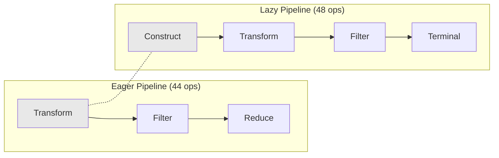
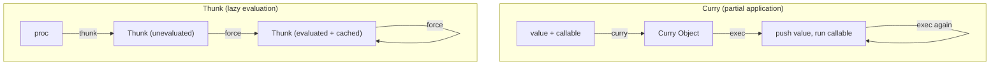

<!--
   ______    _
  /_  __/___(_)_  __
   / / / __/ /\ \/ /       Stack-Based Interpreter & VM
  / / / / / /  > · <      C++23 · Single-Header Library
 /_/ /_/ /_/  /_/\_\     Copyright 2026 Mark Guidarelli

Licensed under the Apache License, Version 2.0 (the "License");
you may not use this file except in compliance with the License.
You may obtain a copy of the License at

    https://www.apache.org/licenses/LICENSE-2.0

Unless required by applicable law or agreed to in writing, software
distributed under the License is distributed on an "AS IS" BASIS,
WITHOUT WARRANTIES OR CONDITIONS OF ANY KIND, either express or implied.
See the License for the specific language governing permissions and
limitations under the License.
-->

# Functional Programming in Trix

Trix is a concatenative, stack-based language — a paradigm that is inherently
functional.  Every operator is a function from stack state to stack state.
Composition is implicit: writing two words next to each other composes them.
There are no statements, no assignments (only definitions), and no mutable
variables (only mutable containers with explicit ReadOnly/ReadWrite access
control).

This document covers the complete functional programming toolkit available
in Trix: 31 types, 838 operators, and a set of design choices that make
Trix competitive with dedicated functional languages for higher-order
programming, while remaining a zero-GC, deterministic, embeddable scripting
engine.

---

## 1. First-Class Functions

In Trix, functions are **procs** (procedures) — executable arrays or packed
arrays created with `{ }` syntax.  They are first-class values: they can be
stored in variables, passed as arguments, returned as results, and stored in
collections.

```
% A proc is a value
{ 2 mul }               % pushes an executable packed array

% Store it in a variable
/double { 2 mul } def

% Pass it to a higher-order operator
[1 2 3 4 5] { 2 mul } map    % => [2 4 6 8 10]

% Return it from a function
/make-adder { { add } curry } def
5 make-adder                  % => curry(5, {add})
3 exch exec                   % => 8
```

Note the `{ add }` wrapper: a factory that returns a curry over an
**operator** must wrap that operator in a proc.  A bare `//add` inside a proc
body is an embedded executable that *runs* when the proc runs (see
`scanner-syntax.md` §4.3), so `{ //add curry }` would fire `add` instead of
building the curry.  Top-level `5 //add curry` (next section) is unaffected.

Procs are **closureless by default** — they capture no environment.
Names inside a proc are looked up at execution time via the dict
stack, not at definition time.  This is the concatenative paradigm's
approach to scope: definitions are global (or scoped via `begin`/`end`), and
procs are pure stack transformers.

For cases that require captured state, Trix provides two mechanisms:
**curry** (partial application) and **local bindings**.

---

## 2. Partial Application: `curry` and `uncurry`

The `curry` operator creates a new type — a **Curry object** — that pairs a
captured value with a callable.  When executed, the curry pushes the value
onto the operand stack, then dispatches the callable.

```
% curry: value callable -- curry-object
5 //add curry              % => curry(5, add)

% Execute the curry: pushes 5, then runs add
3 exch exec                % stack: 3 curry => curry fires => 3 5 add => 8
```

Curry objects are first-class: they can be stored in variables, placed in
arrays and dicts, passed to higher-order operators, compared with
`deep-eq`, serialized via snap-shot/thaw, and encoded in packed arrays.

```
% Named partial application — a reusable "add 10" function
/add10 10 //add curry def
[1 2 3] { add10 } map         % => [11 12 13]

% Curry with ExtValue types (Long, Double, etc.)
100l //add curry 200l exch exec   % => 300l

% Nested curries for multi-argument closure
% curry(1, curry(2, add)) — when executed: push 1, then exec inner
% which pushes 2 and runs add => 3
1 2 //add curry curry exec       % => 3

% Decompose a curry
5 //add curry uncurry             % => 5 add-operator
```

### Why a Native Type?

Curry could be implemented as a proc: `5 //add curry` is morally equivalent
to `{ 5 add }`.  But a native Curry type provides:

- **Inspectability**: `uncurry` decomposes a curry; `is-curry` tests for it;
  `type` returns `/curry-type`; `deep-eq` compares structurally.
- **Efficiency**: No proc allocation per partial application; just 2 Objects
  (16 bytes) in VM memory.
- **Packed encoding**: Curries encode compactly in packed arrays via a
  dedicated `PackedType::Curry` slot.
- **Save/restore integration**: Curry objects participate fully in
  transaction rollback and VM serialization.

---

## 3. Function Composition: `compose`

The `compose` operator creates a curry where both slots are executable.
When executed, the first callable runs, then the second.

```
% compose: callable1 callable2 -- curry-object
% Semantics: (f g compose exec) = (f exec g exec)

{ 2 mul } { 1 add } compose % "double then increment"
5 exch exec                 % => 11  (5*2=10, 10+1=11)

% Compose with operators
//dup //mul compose               % "square" = dup then mul
7 exch exec                       % => 49

% Triple composition
{ 1 add } { 2 mul } compose { 3 sub } compose
10 exch exec                      % => 19  ((10+1)*2 - 3)

% Named composition
/square //dup //mul compose def
7 square                          % => 49
```

### Composition in a Concatenative Language

In most languages, composition requires a dedicated operator or syntax.
In Trix, sequential execution **is** composition — writing `f g` applies
`f` then `g`.  The `compose` operator is useful when you need to build a
composed function as a **value** to pass around:

```
% Without compose: just write the operations in sequence
7 dup mul                         % => 49

% With compose: create a reusable function value
/square //dup //mul compose def
[3 4 5 6] { square } map         % => [9 16 25 36]
```

---

## 4. Combinators: `bi`, `dip`, `keep`

These three operators, borrowed from Factor, are the building blocks for
complex stack manipulation patterns without temporary variables.

### `bi` — Apply Two Functions to One Value

```
% bi: x proc1 proc2 -- result1 result2
% Clones x, applies proc1 to the clone, then applies proc2 to the original.

5 { 2 mul } { 3 add } bi        % => 10 8
```

`bi` is the stack-based equivalent of `(f(x), g(x))` in applicative
languages.  Use it when you need two different views of the same value.

### `dip` — Execute Below Top

```
% dip: any proc -- any
% Hides the top value, executes proc, restores the hidden value on top.

3 5 { 2 mul } dip               % => 6 5  (3*2=6, 5 restored on top)
```

`dip` reaches "under" the top of the stack.  It is the fundamental tool
for operating on non-top stack elements without named variables.

### `keep` — Execute and Preserve

```
% keep: any proc -- result any
% Executes proc with any on the stack, then restores a clone of any on top.

5 { 2 mul } keep                 % => 10 5  (5*2=10, original 5 on top)
```

`keep` is `dip` + duplication: the proc sees the value, and the original
survives.

### Combining Combinators

```
% Compute both sum and product of a pair (over over duplicates the pair so
% both inputs survive; dip computes the sum beneath the product)
3 5 over over mul { add } dip    % => 8 15  (sum=8, product=15)

% Apply a function to two items independently
3 5 { 2 mul } bi                 % NOT right — bi needs one value, two procs

% Use dip to apply the same function to two values
3 5 { 2 mul } dip 2 mul          % => 6 10
```

---

## 5. Local Bindings: `{ |a b c| body }`

When stack manipulation becomes unwieldy, local bindings name the top N
stack values for the duration of a proc body.

```
% Syntax: { |name1 name2 ... nameN| body }
% Pops N values from the stack and binds them to names (right to left).
% Names are accessible inside body via normal name lookup.

% Quadratic formula discriminant: b^2 - 4ac
/discriminant { |a b c|
    b b mul 4 a mul c mul sub
} def

1 5 6 discriminant =             % => 1  (25 - 24)
```

Local bindings create a **frame dict** (per-call dict, analogous to a
C/C++ stack frame; see the Glossary in `trix-reference.md`) pushed on the
dict stack.  The frame dict is automatically popped when the proc
exits (including on error paths).  Locals compose cleanly with curry:

```
% A function that returns a closure-like curry
/make-multiplier { |factor|
    factor { mul } curry
} def

3 make-multiplier                % => curry(3, {mul})
7 exch exec                      % => 21
```

As in Section 2, the operator is wrapped in `{ mul }`: a curry over a bare
`//mul` inside a proc body would execute `mul` when `make-multiplier` runs.

---

## 6. The Collection Pipeline

Trix provides 44 eager collection operators that work polymorphically on
both Arrays and Packed arrays.  Combined with curry and compose, they form
a complete data transformation pipeline.  For infinite or very large
sequences, Trix also provides 48 lazy sequence operators (see Section 13;
full details in [lazy-sequences.md](lazy-sequences.md)).



### Transform

`map` -- `arr proc -- arr`
    Apply proc to each element.

`flat-map` -- `arr proc -- arr`
    Map then flatten.

`flatten` -- `arr -- arr`
    Flatten nested arrays recursively to leaf elements (depth limit 64). For one-level, use `flat-map`.

`reverse` -- `arr -- arr`
    Reverse element order.

`sort` -- `arr -- arr`
    Natural-order sort.

`sort-by` -- `arr proc -- arr`
    Sort by key function.

`unique` -- `arr -- arr`
    Remove duplicates (order preserved).

`interpose` -- `arr sep -- arr`
    Insert separator between elements.

`enumerate` -- `arr -- arr`
    Pair each element with its index.

`map-dict` -- `dict proc -- dict`
    Transform dict values.

### Filter

`filter` -- `arr proc -- arr`
    Keep elements where proc returns true.

`partition` -- `arr proc -- arr arr`
    Split into passing/failing.

`take` -- `arr n -- arr`
    First n elements.

`drop` -- `arr n -- arr`
    All but first n elements.

`take-while` -- `arr proc -- arr`
    Longest prefix where proc is true.

`drop-while` -- `arr proc -- arr`
    Drop prefix where proc is true.

### Reduce

`reduce` -- `arr init proc -- any`
    Fold with accumulator.

`scan` -- `arr init proc -- arr`
    Fold collecting intermediates.

`sum` -- `arr -- num`
    Sum all elements.

`product` -- `arr -- num`
    Multiply all elements.

`kahan-sum` -- `arr -- num`
    Compensated sum (FP accuracy).

`dot-product` -- `arr arr -- num`
    Compensated inner product.

`min-of` -- `arr -- num`
    Minimum value.

`max-of` -- `arr -- num`
    Maximum value.

`count-if` -- `arr proc -- int`
    Count elements matching predicate.

`min-by` -- `arr proc -- any`
    Element with minimum key.

`max-by` -- `arr proc -- any`
    Element with maximum key.

`frequencies` -- `arr -- dict`
    Count occurrences.

### Search

`find` -- `arr proc -- any true | false`
    First match.

`any` -- `arr proc -- bool`
    Any element matches?

`all` -- `arr proc -- bool`
    All elements match?

`contains?` -- `str str -- bool`
    Substring search.

### Combine

`zip` -- `arr1 arr2 -- arr`
    Pairwise combine (shorter length).

`zip-longest` -- `arr1 arr2 fill -- arr`
    Pairwise combine (longer, fill gaps).

`join` -- `arr str -- str`
    Join string array with separator.

### Group

`group-by` -- `arr proc -- dict`
    Group by key function.

`chunk` -- `arr n -- arr`
    Split into fixed-size groups.

`sliding-window` -- `arr n -- arr`
    Overlapping windows.

### Set Operations

`intersect` -- `arr1 arr2 -- arr`
    Common elements.

`union` -- `arr1 arr2 -- arr`
    All unique elements from both.

`difference` -- `arr1 arr2 -- arr`
    Elements in first but not second.

### Structural Comparison

`deep-eq` -- `any any -- bool`
    Recursive structural equality.

`deep-ne` -- `any any -- bool`
    Recursive structural inequality.

### Iteration

`for-all` -- `container proc --`
    Execute proc for each element.

`array-load` -- `arr -- e0 ... eN arr`
    Unpack all elements onto stack.

### Pipeline Examples

```
% Sum of squares of even numbers 1-10
[1 2 3 4 5 6 7 8 9 10]
    { 2 mod 0 eq } filter % [2 4 6 8 10]
    { dup mul } map       % [4 16 36 64 100]
    sum                   % 220

% Group words by length, get the groups of length 3
[(the) (cat) (sat) (on) (a) (mat)]
    { length } group-by          % << 3 [(the)(cat)(sat)(mat)] 2 [(on)] 1 [(a)] >>
    3 get                        % [(the)(cat)(sat)(mat)]

% Top 3 most frequent elements
[1 3 2 3 1 3 2 1 1]
    frequencies                  % << 1 4 3 3 2 2 >>
    { exch } for-all             % flatten dict to alternating values
    % ... (use sort-by on the value arrays)

% Sliding average over window of 3
[10 20 30 40 50 60]
    3 sliding-window             % [[10 20 30] [20 30 40] [30 40 50] [40 50 60]]
    { sum 3 div } map            % [20 30 40 50] (integer division)

% Zip names with scores, filter passing, extract names
[(Alice) (Bob) (Carol)] [85 42 91] zip    % [[(Alice) 85] [(Bob) 42] [(Carol) 91]]
    { 1 get 50 gt } filter                % [[(Alice) 85] [(Carol) 91]]
    { 0 get } map                         % [(Alice) (Carol)]
```

---

## 7. Recursion and Tail Call Optimization

Trix provides automatic TCO for all named tail calls.  When a name is the
last element of a proc body, the `@call` frame is reused instead of
pushing a new one.  This makes recursion a first-class iteration mechanism
with constant stack usage.

```
% Tail-recursive countdown — runs in constant exec-stack space
/countdown {
    dup 0 le { pop } { 1 sub countdown } if-else
} def
100000 countdown    % completes without exec-stack overflow

% Tail-recursive accumulator (sum 1..n)
/sum-acc {
    exch dup 0 le { pop } {
        dup rot add exch 1 sub exch sum-acc
    } if-else
} def
10000 0 sum-acc     % => 50005000

% Mutual recursion — both tail calls get TCO
/is-even {
    dup 0 eq { pop true } { 1 sub is-odd } if-else
} def
/is-odd {
    dup 0 eq { pop false } { 1 sub is-even } if-else
} def
10000 is-even       % => true (constant exec-stack depth)
```

### TCO with Curry

Named curries in tail position get TCO.  The curry is dispatched via the
reused `@call` frame, so recursive functions that use curry internally
remain constant-space:

```
/dec-curry -1 //add curry def

/countdown-curry {
    dup 0 le { pop } { dec-curry countdown-curry } if-else
} def
100000 countdown-curry    % constant exec-stack depth
```

---

## 8. Control Flow as Higher-Order Operators

All control flow in Trix is implemented via higher-order operators that take
procs as arguments.  There are no special syntactic forms.

<!-- doctest: skip (syntax illustration: flag is a stand-in boolean) -->
```
% Conditional
flag { (yes) = } { (no) = } if-else

% Counted loop
5 { (hello) = } repeat

% Numeric for loop (init incr limit proc)
0 1 10 { = } for              % prints 0 through 10

% While loop
1 { dup 100 lt } { 2 mul } while    % => 128

% Do-while loop
1 { 2 mul dup 100 lt } do-while     % => 128

% Infinite loop with exit
0 { 1 add dup 10 gt { exit } if } loop   % => 11

% Case dispatch — look up the key's proc in the dict and run it (dict then key)
/op /add def
7 3 << /add { add } /sub { sub } /mul { mul } >> op case   % => 10

% Type dispatch
42 << /integer-type { (it is an int) } >> type-case
```

---

## 9. Error Handling

Trix's error handling uses the same higher-order pattern — procs as
arguments to `try`, `try-catch`, and `finally`.

```
% try: execute, push error name or /no-error
{ 1 0 div } try                  % => /div-by-zero

% try-result: exception to Result tagged value
{ 6 7 mul } try-result           % => /ok 42 (tagged)
{ 1 0 div } try-result           % => /err /div-by-zero (tagged)

% Unwrap with default
{ 1 0 div } try-result /ok 0 tag-value-or   % => 0

% Railway-oriented chaining with tag-bind
{ 10 } try-result
/ok { { 2 mul } try-result } tag-bind % => /ok 20
/ok { { 1 add } try-result } tag-bind % => /ok 21
/ok 0 tag-value-or                    % => 21

% try-catch: dispatch to handler by error name, with /default fallback
<< /div-by-zero { pop (caught div!) = }
   /default     { pop (caught other!) = }
>> { 1 0 div } try-catch

% throw-with: raise with structured error data
<< /type-check { pop last-error-data } >> {
    /type-check << /expected /integer /actual (hello) >> throw-with
} try-catch
% => << /expected /integer /actual (hello) >>

% last-error-data / last-error-message: runtime error inspection
{ 1 0 div } try pop
last-error            % => /div-by-zero
last-error-message    % => (div: division by zero)
last-error-data       % => null (only set by throw-with)

% finally: guaranteed cleanup
{ cleanup-resources } { risky-operation } finally

% with-stream: guaranteed stream close
(data.txt) (r)#b { 1024 read-string } with-stream
```

---

## 10. Immutability

Trix provides opt-in immutability via the `#r` suffix and `make-readonly`
operator.

```
% Read-only string
(hello)#r                        % cannot be modified

% Read-only array
[1 2 3]#r                        % cannot be put/sorted in place

% Make any container read-only at runtime
[1 2 3] make-readonly

% Packed arrays are always read-only
{ 1 2 add }                      % packed by default, immutable
```

Combined with save/restore transactions, Trix supports a programming model
where array, dict, and heap mutations can be rolled back:

```
save
    /x 42 def
    % ... modify arrays, dicts, define names ...
restore
% x is back to its pre-save value (or undefined if it didn't exist)
% array and dict modifications are undone; heap allocations are discarded
```

**Note:** String byte modifications via `put` are not journaled by
save/restore and persist across a restore. This is a deliberate space
trade-off: journaling a 1-byte string write would require 12+ bytes of
journal overhead. Use an array of Byte values for journaled byte data (at
8x memory cost), or allocate the string after the save point so it is
discarded with the heap.

---

## 11. FP Patterns via Existing Operators

Several functional programming patterns that have dedicated operators in
other languages are naturally expressed in Trix through composition of
existing operators.  This is not a deficiency — it is the concatenative
paradigm's strength.

### `apply` — Unpack Arguments from Array

```
% Haskell:  apply f [a, b, c] = f a b c
% Trix:     array-load pops the array, pushes elements + array on top
%           pop the array, then exec the callable

[3 4] array-load pop add         % => 7
% Or via a named function applied to the spread elements
/sum2 { add } def
[3 4] array-load pop sum2         % => 7
```

### `flip` — Swap Two Arguments

```
% Haskell:  flip f a b = f b a
% Trix:     exch before the operator

5 3 exch sub                     % => -2  (3 - 5, not 5 - 3)

% As a reusable combinator:
/flip { exch } def
5 3 flip sub                     % => -2
```

### `const` — Ignore Argument, Return Fixed Value

```
% Haskell:  const x _ = x
% Trix:     { pop VALUE } where VALUE is the constant

[1 2 3] { pop 42 } map          % => [42 42 42]

% Or with curry:
42 { exch pop } curry            % a callable that drops its input, returns 42
```

### `id` — Identity Function

```
% Haskell:  id x = x
% Trix:     { } — the empty proc is identity

[1 2 3] { } map                 % => [1 2 3]
```

### `on` / `comparing` — Compare by Key

```
% Haskell:  sortBy (comparing length) xs
% Trix:     sort-by IS this pattern

[(hello) (hi) (hey)] { length } sort-by    % => [(hi) (hey) (hello)]
```

### `negate` — Predicate Negation

```
% Haskell:  filter (not . even) xs
% Trix:     compose with { not }, wrapped in a proc

% compose yields a Curry, but filter requires a Proc — wrap it in { ... exec }:
[1 2 3 4 5] { { 2 mod 0 eq } { not } compose exec } filter   % => [1 3 5]

% Or simply inline the negation:
[1 2 3 4 5] { 2 mod 0 eq not } filter                % => [1 3 5]
```

### `iterate` — Infinite Sequence from Seed

```
% Haskell:  take 10 (iterate (*2) 1)
% For finite cases, scan generates the sequence eagerly.
% For true lazy evaluation, use thunk/force (see Section 11).

% Generate powers of 2: [1, 2, 4, 8, 16, ...]
[0 0 0 0 0 0 0 0 0] 1 { pop 2 mul } scan    % [1 2 4 8 16 32 64 128 256 512]
```

### `memoize` — Cache Function Results

```
% Use a growable dict as a cache: a << >> literal has a fixed capacity of 4
% and would raise dict-full once the cache exceeds four entries.
0 dynamic-dict /cache exch def

/memoized-fib { |n|
    cache n known-get {
        % already cached, value is on stack
    } {
        n 2 lt {
            n
        } {
            n 1 sub memoized-fib
            n 2 sub memoized-fib
            add
        } if-else
        dup cache exch n exch put
    } if-else
} def
```

### `unfold` — Build Collection from Seed

```
% Build an array by repeatedly applying a function until a condition
% Use a loop with array accumulation:
/unfold { |seed next done|
    [ seed { dup done exec not } { dup next exec } while pop ]
} def

1 { 2 mul } { 1000 gt } unfold     % => [1 2 4 8 16 32 64 128 256 512]
```

---

## 12. Lazy Evaluation: `thunk` and `force`

Trix provides native lazy evaluation via the **Thunk** type. A thunk wraps
a proc that is not executed until explicitly forced. Once forced, the
result is cached (memoized) and subsequent forces return the cached value
in O(1) time.

### Creating and Forcing Thunks

```
% Create a thunk -- proc is NOT executed
{ 3 4 add } thunk              % pushes a thunk object

% Force evaluates the proc and caches the result
dup force                       % => 7 (proc runs)
force                           % => 7 (cached, proc does NOT run again)
```

### Non-Thunk Pass-Through

`force` is a no-op for non-thunk values, enabling generic code:

```
42 force                        % => 42 (pass-through)
(hello) force                   % => (hello) (pass-through)
```

### Side Effects Prove Memoization

```
<< /n 0 >> /counter exch def
{ counter /n counter /n get 1 add put 42 } thunk
dup force                       % => 42, counter /n = 1
force                           % => 42, counter /n still 1 (cached)
```

### Thunk Inspection and Reset

```
{ expensive-computation } thunk
dup thunk-evaluated?            % => false
dup force pop
dup thunk-evaluated?            % => true
thunk-reset
thunk-evaluated?                % => false (reset, will re-evaluate on next force)
```

### Circular Detection

Forcing a thunk during its own evaluation raises `/undefined-result`:

```
<< >> /d exch def
d /t { d /t get force } thunk put
{ d /t get force } try          % => /undefined-result
```

### Lazy Fibonacci

```
{ 0 } thunk /fib0 exch def
{ 1 } thunk /fib1 exch def
{ fib0 force fib1 force add } thunk /fib2 exch def
{ fib1 force fib2 force add } thunk /fib3 exch def
{ fib2 force fib3 force add } thunk /fib4 exch def
fib4 force                     % => 3 (each intermediate computed once)
```

### Curry + Thunk: Complementary Pillars

Curry and Thunk are the two missing pillars of functional programming.
They serve complementary roles:



**Curry**
    Purpose: partial application.
    Created by `curry`, invoked by `exec` (pushes value, executes callable).
    Takes arguments (the captured value).  Does not memoize (executes every time).
    Internal state is immutable.

**Thunk**
    Purpose: lazy evaluation.
    Created by `thunk`, invoked by `force` (evaluates proc, caches result).
    Self-contained (no arguments).  Memoizes (evaluates once, caches permanently).
    Internal state is mutable (unevaluated -> evaluated).

---

## 13. Lazy Sequences

> **Full reference:** [lazy-sequences.md](lazy-sequences.md) — comprehensive
> documentation of the thunk primitive, all 48 operators with examples, architecture,
> performance characteristics, patterns/recipes, and competitive analysis.

Trix provides 48 built-in lazy sequence operators that bring streaming, on-demand
sequence processing to the language — bridging the gap between eager collection
pipelines and the thunk/force primitive.  This section is a summary; see the
dedicated document for complete operator-by-operator coverage.

A lazy-seq is a convention, not a new type: `null` represents the empty sequence,
and a 2-element array `[head, tail-thunk]` holds the first element and a thunk
that, when forced, yields the next node (or `null`).  No new Object types,
PackedType slots, or verify_t bits are consumed.

### Construction

```
% Infinite sequence: 1, 2, 3, ...
1 lazy-from

% Finite range: [1, 10) step 2
1 10 2 lazy-range               % => 1, 3, 5, 7, 9

% From array
[1 2 3 4 5] lazy-seq

% Infinite repetition
42 lazy-repeat

% Generate from seed: seed, f(seed), f(f(seed)), ...
1 { 2 mul } lazy-iterate        % => 1, 2, 4, 8, 16, ...

% Infinite cycling
[1 2 3] lazy-cycle              % => 1, 2, 3, 1, 2, 3, ...
```

### Transformation Pipeline

Lazy transformations compose without materializing intermediate results:

```
% Squares of even numbers from an infinite sequence
1 lazy-from
    { 2 mod 0 eq } lazy-filter
    { dup mul } lazy-map
    10 lazy-take
    lazy-to-array
% => [4 16 36 64 100 144 196 256 324 400]

% Running sum of first 5 naturals
1 lazy-from 5 lazy-take 0 { add } lazy-scan lazy-to-array
% => [0 1 3 6 10 15]
```

### Short-Circuit Evaluation

Terminal operators on infinite sequences stop as soon as the answer is known:

```
% Find first number > 1000 in an infinite sequence
1 lazy-from { 1000 gt } lazy-find      % => 1001 (does not OOM)

% Check if any square exceeds 100
1 lazy-from { dup mul } lazy-map { 100 gt } lazy-any   % => true
```

### Combining Sequences

```
% Zip two infinite sequences, take 5
1 lazy-from 100 lazy-from lazy-zip 5 lazy-take lazy-to-array
% => [[1 100] [2 101] [3 102] [4 103] [5 104]]

% Chain finite sequences
[1 2 3] lazy-seq [4 5 6] lazy-seq lazy-chain lazy-to-array
% => [1 2 3 4 5 6]

% Interleave
[1 2 3] lazy-seq [10 20 30] lazy-seq lazy-interleave lazy-to-array
% => [1 10 2 20 3 30]
```

### Note: `lazy-windowed` and `lazy-pairwise` Partial Windows

`lazy-windowed` and `lazy-pairwise` (which delegates to `lazy-windowed` with
n=2) include trailing partial windows when the source has fewer remaining
elements than the window size. This differs from the default behavior of
Kotlin, Scala, and Clojure, which drop partial trailing windows.

```
% Trix behavior (partialWindows=true):
[1 2 3 4] lazy-seq lazy-pairwise lazy-to-array
% => [[1 2] [2 3] [3 4] [4]]     -- trailing [4] has length 1

[1 2 3 4 5] lazy-seq 3 lazy-windowed lazy-to-array
% => [[1 2 3] [2 3 4] [3 4 5] [4 5] [5]]  -- last 2 are partial
```

To get standard behavior (full-size windows only), filter by length:

```
[1 2 3 4] lazy-seq lazy-pairwise { length 2 eq } lazy-filter lazy-to-array
% => [[1 2] [2 3] [3 4]]         -- partial windows removed
```

### Showcase: Fibonacci via lazy-iterate

```
% Pairs: [0, 1], [1, 1], [1, 2], [2, 3], ...
mark 0 1 array-from-mark
{ dup 0 get exch 1 get dup rot add mark 3 1 roll array-from-mark }
lazy-iterate
{ 0 get } lazy-map
10 lazy-take lazy-to-array
% => [0 1 1 2 3 5 8 13 21 34]
```

### Lazy vs Eager: When to Use Which

|                     | Eager (`map`/`filter`/`reduce`) | Lazy (`lazy-map`/`lazy-filter`/`lazy-fold`) |
| ------------------- | ------------------------------- | ------------------------------------------- |
| Data size           | Known, fits in memory           | Unknown, infinite, or very large            |
| Evaluation          | All at once                     | On demand                                   |
| Short-circuit       | No (all elements processed)     | Yes (`lazy-find`, `lazy-any`, etc.)         |
| Intermediate arrays | One per pipeline step           | None (streamed)                             |
| Performance         | Better for small collections    | Better for large/infinite streams           |
| Simplicity          | Simpler API, fewer gotchas      | Requires `lazy-to-array` to materialize     |

The 48 lazy operators mirror the eager collection pipeline: construction (10),
transformation (16), combining (5), partitioning (3), predicates/accessors (4),
and terminals (10) — with additional capabilities for infinite sequences and
short-circuit evaluation.

---

## 14. Complete Worked Examples

### Fibonacci Sequence (Accumulator with TCO)

```
/fib { |n|
    % n -- fib(n)
    0 1                          % a=fib(0) b=fib(1)
    n {
        exch over add            % a b -- b (a+b)   ; advance the pair
    } repeat
    pop                          % drop b, leave a = fib(n)
} def

10 fib    % => 55
20 fib    % => 6765
```

### Word Frequency Counter

```
% Count word frequencies in an array of words
/word-freq {
    frequencies
} def

[(the) (cat) (sat) (on) (the) (mat) (the)] word-freq
% => << (the) 3 (cat) 1 (sat) 1 (on) 1 (mat) 1 >>
```

### Pipeline: Data Processing

```
% Given student records as [name, score] pairs,
% find names of students who scored above average

/students [
    [(Alice) 85] [(Bob) 72] [(Carol) 91]
    [(Dave) 68] [(Eve) 95] [(Frank) 78]
] def

% Compute average
students { 1 get } map sum
students length div
/avg exch def

% Filter and extract names
students
    { 1 get avg gt } filter      % above-average records
    { 0 get } map                % extract names
% => [(Alice) (Carol) (Eve)]
```

### Recursive Descent with Curry

```
% A simple recursive processor.  process-tree recurses BY NAME; the per-node
% action is a named proc (visit).  Two things to note:
%   * `//process-tree curry` cannot self-reference: `//` binds at scan time,
%     but process-tree is still being defined — use the plain name to recurse.
%   * A proc bound to a |local| EXECUTES when referenced, so passing a handler
%     as a |local| value is fragile; a named handler is the simple choice.
/sink << /sum 0 >> def
/visit { sink /sum get add sink exch /sum exch put } def   % value --
/process-tree { |node|
    node 0 get visit                    % act on this node's value
    node 1 get { process-tree } for-all % recurse over [value children] nodes
} def

% A tree is [value children]; leaves have an empty children array.
/tree [ 1 [ [2 []] [3 []] ] ] def
tree process-tree
sink /sum get          % => 6   (1 + 2 + 3)
```

### Compose a Processing Pipeline

```
/normalize   { { lowercase } map } def           % [words] -- [lowercased]
/tokenize    { ( ) split } def                   % string -- [words]
/stopwords   [(the) (a) (an) (is) (it)] def
/remove-stop { { stopwords exch index-of 0 lt } filter } def  % keep non-stopwords

% Build pipeline: tokenize FIRST, then normalize, then remove stop words.
% (compose is left-to-right: { f } { g } compose applies f then g.)
/tokenize load /normalize load compose
/remove-stop load compose
/pipeline exch def

% compose yields a Curry, so fire it with exec:
(The Cat Is A Fine Animal) pipeline exec
% => [(cat) (fine) (animal)]
```

---

## Summary

Trix's functional programming support is a natural consequence of the
concatenative paradigm.  Every value is immutable or transactional.  Every
operator is a pure stack transformation.  Composition is the default mode of
expression.

The addition of `curry` and `compose` as native types, plus `thunk`/`force`,
48 lazy sequence operators, and Tagged values with `tag-update` (functional
payload update), `tag-value-or` (unwrap-with-default), and `try-result`
(exception-to-Result bridge), completes the toolkit: partial application,
function composition, a 92-operator collection pipeline (44 eager + 48 lazy)
with compensated arithmetic and infinite sequence support, algebraic data
types with pattern dispatch, stack combinators, local bindings, automatic TCO,
5-layer error handling with structured error data, 50 predicates, and
transactional state management.  For a zero-GC, deterministic, embeddable
scripting engine, this is a thorough functional programming toolkit.

---

## 15. Implementation Details

This section covers the C++ internals of how higher-order operators,
control flow, and the collection pipeline are implemented. For Trix
maintainers and contributors.

### 15.1 How Control Flow Operators Use the Exec Stack

Trix has no special control flow syntax. All control flow is implemented
by operators that manipulate the exec stack. Each iteration-based
operator places a **control operator** on the exec stack that fires after
the user's proc completes, checks a condition, and either re-pushes
itself + the proc for another iteration or cleans up.

### 15.2 if-else

`if-else` does not use a control operator. It pops three values (boolean,
true-proc, false-proc), selects one, and pushes it directly to the exec
stack:

```
if-else: bool true-proc false-proc --
  Pushes (boolean ? true-proc : false-proc) to exec stack.
  The interpreter dispatches it on the next iteration.
  No barrier, no control operator, no cleanup.
```

`if` is the same but with only one branch (no false-proc).

### 15.3 loop

Infinite loop. Control operator re-pushes itself unconditionally:

```
Exec stack layout:
  [proc] [@loop] [proc]
   ^       ^       ^
   saved   fires   executes
   copy    2nd     1st

@loop: unconditionally re-pushes [@loop] [proc].
Exit: the exit operator searches for @loop and pops it.
```

### 15.4 repeat

Counted loop. Control operator decrements a counter:

```
Exec stack layout (unsigned integer count):
  [proc] [count] [@uinteger-repeat] [proc]
   ^       ^          ^               ^
   saved   counter    fires           executes
   copy    (mutable)  after proc      1st

@uinteger-repeat:
  Decrement count.
  If count == 0: pop 2 slots (proc + count). Loop done.
  If count > 0:  re-push [@uinteger-repeat] [proc].
```

For Long counts, `@ulong-repeat` is used instead (handles ExtValue
allocation/deallocation of the counter).

### 15.5 for

Numeric loop with control variable. Type-specific control operators handle
different numeric types:

```
Exec stack layout:
  [proc] [limit] [increment] [control] [@typed-for]
   ^       ^         ^          ^           ^
   saved   loop      step       current     fires after proc
   copy    bound     size       value       (type-specific)

@typed-for (e.g., @integer-for):
  Push control value to operand stack.
  Check termination: (incr > 0) ? (control > limit) : (control < limit)
  If done: free ExtValues if needed, pop 4 slots.
  If more: add increment to control, re-push [@typed-for] [proc].
  Overflow/underflow protection: if adding the increment would wrap the control variable past the type's extreme, the limit is clamped so the next iteration terminates the loop gracefully (no error is raised).
```

### 15.6 while

Conditional loop. Control operator checks a boolean:

```
Exec stack layout:
  [body] [cond-copy] [@while] [cond]
   ^        ^            ^       ^
   saved    saved        fires   executes 1st
   body     cond copy    2nd     (pushes bool)

@while:
  Pop boolean from operand stack.
  If true:  re-push [@while] [cond-copy] [body].
  If false: pop 2 slots (body + cond-copy). Loop done.
```

### 15.7 map

Array transformation. Control operator collects results one at a time:

```
Exec stack layout:
  [proc] [src] [dst] [write-idx] [@array-map] [proc]
   ^      ^     ^        ^            ^          ^
   saved  mut.  pre-     position     fires      executes
   copy   copy  alloc'd  counter      after      1st
                array                  proc

Before @array-map fires:
  Operand stack has the proc's result on top.

@array-map:
  Store proc result in dst[write-idx]. Increment write-idx.
  Pop next element from src (mutating clone).
  If src exhausted: pop 4 exec slots, push dst to operand stack.
  If more elements: push clone to operand stack,
                    re-push [@array-map] [proc].
```

The destination array is pre-allocated to the source's length. Each
iteration stores one result. No intermediate arrays are created.

### 15.8 filter

Conditional array selection. Control operator keeps or discards elements:

```
Exec stack layout:
  [proc] [src] [dst] [write-idx] [saved-elem] [@array-filter] [proc]
   ^      ^     ^        ^           ^              ^            ^
   saved  mut.  max-     position    current        fires        executes
   copy   copy  size     counter     element        after proc   1st

@array-filter:
  Pop boolean from operand stack (proc's result).
  If true: copy saved-elem to dst[write-idx], increment write-idx.
  Pop next element from src, save in saved-elem slot.
  If src exhausted: trim dst to write-idx (vm_trim_alloc reclaims
                    unused heap), pop 5 exec slots, push dst.
  If more: clone element to operand stack,
           re-push [@array-filter] [proc].
```

The destination array is allocated at maximum size (source length), then
trimmed to actual size after filtering. `vm_trim_alloc` reclaims the
unused heap space.

### 15.9 reduce

Left fold. Uses the generic `push_forall_frame` which pushes elements
one at a time for sequential processing. The accumulator stays on the
operand stack between iterations.

```
reduce: arr init proc -- result

Initial operand stack: [init] (proc and arr consumed)
Each iteration: proc receives [acc, element] and produces [new-acc].
After all elements: acc is the result.
```

### 15.10 Curry Dispatch (execute_curry)

When the interpreter encounters a Curry on the exec stack:

1. Clone the value and callable from the 2-Object VM pair.
2. **Normal curry** (value is Literal): push value to operand stack, then
   dispatch callable via `execute_value()`.
3. **Composed curry** (value is Executable): push callable to exec stack
   (runs second), dispatch value via `execute_value()` (runs first).

This means `compose` creates a curry where `storage[0]` is marked
Executable. The dispatch path checks the Executable bit to determine
which execution order to use.

### 15.11 Control Operator Cleanup on Error

When an error occurs inside a higher-order operator (e.g., the proc passed
to `map` raises an error), `try_catch_handler()` walks the exec stack
looking for a barrier (`@try-barrier`, `@try-catch-barrier`, etc.). As it
walks past control operators like `@array-map`, `@while`, `@loop`, it:

1. Frees any ExtValues in the discarded exec stack slots
2. Closes any `@run` streams in the discarded range
3. Pops any `@end-locals` dict stack entries

The control operators themselves are simply discarded -- they have no
cleanup semantics beyond ExtValue and stream management.

### 15.12 Exit Operator

`exit` terminates the innermost loop by searching the exec stack for
a loop control operator (`@loop`, `@while`, `@repeat`, `@for`, etc.)
and cutting the exec stack to just below it. This is how `exit` works
inside `loop`, `for`, `repeat`, and `while`.

`exit` also works inside `map`, `filter`, and other collection operators
-- it terminates the iteration early. The partially-built result is
discarded (for `map` and `filter`) or the current accumulator is the
result (for `reduce`).
