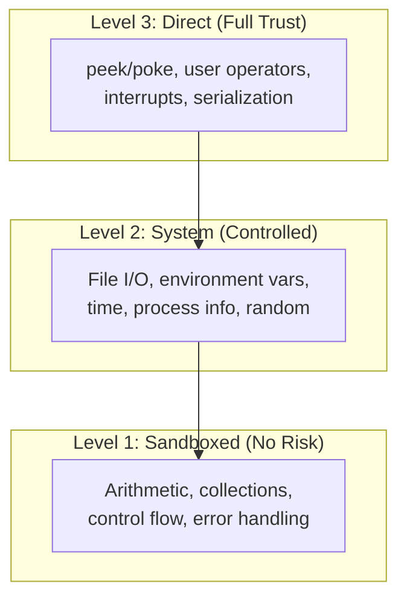

<!--
   ______    _
  /_  __/___(_)_  __
   / / / __/ /\ \/ /       Stack-Based Interpreter & VM
  / / / / / /  > · <      C++23 · Single-Header Library
 /_/ /_/ /_/  /_/\_\     Copyright 2026 Mark Guidarelli

Licensed under the Apache License, Version 2.0 (the "License");
you may not use this file except in compliance with the License.
You may obtain a copy of the License at

    https://www.apache.org/licenses/LICENSE-2.0

Unless required by applicable law or agreed to in writing, software
distributed under the License is distributed on an "AS IS" BASIS,
WITHOUT WARRANTIES OR CONDITIONS OF ANY KIND, either express or implied.
See the License for the specific language governing permissions and
limitations under the License.
-->

# Trix Host Integration

Trix is designed to run as a sandboxed virtual machine inside a host
application. The VM's internal world -- its heap, stacks, dicts, and
interpreter loop -- is isolated from the host environment. Every interaction
with the outside world goes through a controlled set of operators and APIs
with explicit safety checks.

This document covers the complete host integration surface: file and stream
I/O, environment and system access, direct memory access with address
validation, the user operator API, the interrupt system, VM serialization,
and embedded deployment.

---

## Table of Contents

1. [Overview](#1-overview)
2. [Quick Reference](#2-quick-reference)
3. [The Sandbox Model](#3-the-sandbox-model)
4. [Tutorial](#4-tutorial)
5. [File and Stream I/O](#5-file-and-stream-io)
6. [Environment and System](#6-environment-and-system)
7. [Direct Memory Access](#7-direct-memory-access)
8. [The User Operator API](#8-the-user-operator-api)
9. [The Interrupt System](#9-the-interrupt-system)
10. [VM Serialization](#10-vm-serialization)
11. [Random Number Generation](#11-random-number-generation)
12. [Embedded Deployment](#12-embedded-deployment)
13. [Design Decisions](#13-design-decisions)

---

## 1. Overview

Trix provides a layered integration model with three levels of host access:



| Level | Capabilities | Risk | Use Case |
| --- | --- | --- | --- |
| **Sandboxed** | Computation only: arithmetic, collections, control flow, error handling | None | Pure algorithms, data transformation |
| **System** | File I/O, environment variables, time, process info, random numbers | Controlled | Scripting, test automation, configuration |
| **Direct** | Host memory access (peek/poke), user operators, interrupts, serialization | Full trust | Embedded control, hardware drivers, C++ interop |

**Key capabilities:**

- **Pre-allocated memory constructor.** The host provides a fixed memory
  buffer; Trix never calls `malloc`. Zero dynamic allocation after
  construction.
- **Address validation.** The `peek` and `poke` operators validate memory
  addresses using a pipe-based probe before every access -- no segfaults
  from script code.
- **User operator API.** The host registers custom C++ functions as Trix
  operators at construction time. Scripts call them like built-in operators.
- **Thread-safe interrupt system.** 8 priority levels, mutex-protected
  signaling, scriptable handlers. The host can interrupt the VM from any
  thread.
- **Configurable I/O.** stdin, stdout, and stderr can be individually
  enabled or disabled at construction. A fully sandboxed Trix instance can
  have no I/O at all.
- **VM serialization.** `snap-shot` saves the complete VM state to a binary
  image; `thaw` restores it. File streams are automatically reconnected.

---

## 2. Quick Reference

### File and Stream I/O

| Operator | Stack Effect | Description |
| --- | --- | --- |
| `stream` | `str byte -- stream` | Open file stream (modes: r, w, a, e, x) |
| `with-stream` | `str byte proc -- ...` | Open file, execute proc, guarantee close |
| `close-stream` | `stream --` | Close stream |
| `flush-stream` | `stream --` | Flush stream buffer |
| `reset-stream` | `stream --` | Reset stream buffer |
| `read` | `stream -- byte true` or `-- false` | Read one byte (false at EOF) |
| `write` | `stream byte --` | Write one byte |
| `read-string` | `stream str -- str bool` | Read up to N bytes into buffer |
| `read-all` | `stream -- str` | Read entire stream to string |
| `read-line` | `stream str -- str bool` | Read one line (false at EOF) |
| `write-string` | `stream str --` | Write string to stream |
| `read-hex-string` | `stream str -- str bool` | Read hex-encoded data |
| `stream-position` | `stream -- long` | Get current byte position |
| `set-stream-position` | `stream long --` | Seek to byte position |
| `print` | `str --` | Write string to stdout |
| `flush` | `--` | Flush stdout |
| `print-fmt` | `fmt mark args... -- int bool` | Formatted print to stdout |
| `fprint-fmt` | `stream fmt mark args... -- int bool` | Formatted print to stream |
| `sprint-fmt` | `dst fmt mark args... -- str bool` | Formatted print into a destination string |
| `sscan-fmt` | `input fmt mark args... -- parsed... int` | Scan formatted input from string |
| `run` | `str --` | Execute file (always re-executes) |
| `require` | `str --` | Idempotent file load (run once per canonical path) |
| `token` | `str -- post any true` or `-- false` | Parse one token from string |

`require` vs `run`: `run` executes the file every time. `require`
canonicalizes the path via `realpath()` and tracks loaded files internally --
the file runs on the first call and is silently skipped on repeats. This is
the basic module loading mechanism: library files can declare their own
dependencies with `require`, and multiple files can safely require the same
library without double-loading. The tracking dict participates in
save/restore, and circular requires are safe (the entry is recorded before
execution begins).

### Environment and System

| Operator          | Stack Effect                    | Description                                |
| ----------------- | ------------------------------- | ------------------------------------------ |
| `getenv`          | `str -- str true` or `-- false` | Get environment variable                   |
| `setenv`          | `str str --`                    | Set environment variable (name, value)     |
| `getcwd`          | `-- str`                        | Get current working directory              |
| `chdir`           | `str --`                        | Change current working directory           |
| `getpid`          | `-- int`                        | Get process ID                             |
| `file-exists?`    | `str -- bool`                   | Test file existence                        |
| `file-size`       | `str -- long`                   | Get file size in bytes                     |
| `mkdir`           | `str --`                        | Create directory                           |
| `rmdir`           | `str --`                        | Remove empty directory                     |
| `delete-file`     | `str --`                        | Delete file by name                        |
| `rename-file`     | `str str --`                    | Rename file (old, new)                     |
| `clock`           | `-- ulong`                      | Steady-clock microseconds                  |
| `epoch-time`      | `-- ulong`                      | Milliseconds since Unix epoch              |
| `time`            | `proc -- ulong`                 | Measure proc execution time (microseconds) |
| `coroutine-sleep` | `int --`                        | Sleep for N milliseconds                   |

### Direct Memory Access

| Operator      | Stack Effect           | Description                               |
| ------------- | ---------------------- | ----------------------------------------- |
| `peek`        | `addr typename -- num` | Read typed value from host memory         |
| `poke`        | `num addr --`          | Write typed value to host memory          |
| `alloc`       | `int -- addr`          | Allocate host memory (malloc)             |
| `free`        | `addr --`              | Free host memory                          |
| `reinterpret` | `num typename -- num`  | Reinterpret bit pattern as different type |

### Interrupt System

| Operator              | Stack Effect | Description                      |
| --------------------- | ------------ | -------------------------------- |
| `enable-interrupts`   | `--`         | Unmask interrupt delivery        |
| `disable-interrupts`  | `--`         | Mask interrupt delivery          |
| `clear-interrupts`    | `--`         | Clear pending interrupts         |
| `interrupts-enabled?` | `-- bool`    | Query interrupt mask state       |
| `interrupts-pending`  | `-- int`     | Count of pending interrupts      |
| `l0-interrupt`        | `--`         | Raise Level 0 (highest priority) |
| `l1-interrupt`        | `--`         | Raise Level 1 interrupt          |
| `l2-interrupt`        | `--`         | Raise Level 2 interrupt          |

### VM Serialization

| Operator    | Stack Effect | Description                             |
| ----------- | ------------ | --------------------------------------- |
| `snap-shot` | `str --`     | Save VM state to binary image file      |
| `thaw`      | `str --`     | Restore VM state from binary image file |

### Random Numbers

| Operator                | Stack Effect         | Description                     |
| ----------------------- | -------------------- | ------------------------------- |
| `rand-seed`             | `ulong --`           | Seed the PCG32 PRNG             |
| `rand-uinteger`         | `-- uint`            | Random 32-bit unsigned integer  |
| `rand-bounded-uinteger` | `uint -- uint`       | Random integer in [0, bound)    |
| `rand-ulong`            | `-- ulong`           | Random 64-bit unsigned integer  |
| `rand-bounded-ulong`    | `ulong -- ulong`     | Random ulong in [0, bound)      |
| `rand-int128`           | `-- int128`          | Random 128-bit signed integer   |
| `rand-uint128`          | `-- uint128`         | Random 128-bit unsigned integer |
| `rand-bounded-uint128`  | `uint128 -- uint128` | Random uint128 in [0, bound)    |
| `rand-real`             | `-- real`            | Random float in [0.0, 1.0)      |
| `rand-double`           | `-- double`          | Random double in [0.0, 1.0)     |

### Introspection

| Operator          | Stack Effect    | Description                                           |
| ----------------- | --------------- | ----------------------------------------------------- |
| `query-status`    | `/key -- value` | Query VM status (save-level, vm-used, vm-total, etc.) |
| `vm-size`         | `any -- int`    | VM heap bytes consumed by value                       |
| `to-binary-token` | `any -- str`    | Encode value as compact binary token                  |

---

## 3. The Sandbox Model

### Inside the Sandbox

Everything within the Trix VM is self-contained and deterministic:

- **VM heap** -- a single contiguous memory region. All strings, arrays,
  dicts, names, and packed arrays live here.
- **Four stacks** -- operand, exec, dict, and error stacks.
  Fixed-depth, allocated within the VM.
- **Interpreter loop** -- pops from the exec stack, dispatches by type.
  Pure computation with no external side effects.

Code running inside the sandbox cannot corrupt the host, cannot access
arbitrary memory, and cannot call arbitrary system functions. The only way
out is through the controlled operator interface.

### Outside the Sandbox

The host environment provides:

- **File system** -- files, directories, environment variables
- **Host memory** -- memory-mapped hardware, shared data structures, C libraries
- **Time and process info** -- clocks, PID, working directory
- **Custom functionality** -- user-registered C++ operators

### The Boundary

Every operator that crosses the boundary follows these principles:

1. **Operand validation first.** Types, ranges, and access modes are checked
   before any external call. A script cannot pass a string to `peek` or an
   integer to `stream`.

2. **Errors, not crashes.** Invalid addresses are detected and reported as
   catchable Trix errors (`/range-check`, `/read-only`). File operations
   report failures as errors (`/file-open-error`, `/filename-not-found`).

3. **Resource cleanup is guaranteed.** `with-stream` closes files even when
   errors occur. `alloc`/`free` use validated pointers. Stream slots are
   limited by configuration.

4. **Capabilities are configured at construction.** I/O streams, user
   operators are set in the Config struct before the
   VM starts. Scripts cannot enable capabilities that the host did not grant.

---

## 4. Tutorial

### 4.1 Reading and Writing Files

```
% Write a file
(output.txt) (w)#b {
    (Hello, world!) write-string
} with-stream

% Read it back
(output.txt) (r)#b { read-all } with-stream
% stack: (Hello, world!)
```

`with-stream` guarantees the file is closed whether the body succeeds or
fails. The mode byte controls access: `(r)#b` for read, `(w)#b` for write,
`(a)#b` for append, `(e)#b` for exclusive create.

### 4.2 Querying the Environment

```
% Get an environment variable
(HOME) getenv
% stack: (/home/user) true    -- or: false

% Set an environment variable
(MY_APP_MODE) (production) setenv

% Current working directory
getcwd                          % => (/home/user/project)

% Process ID
getpid                          % => 12345
```

### 4.3 Measuring Time

```
% Wall-clock time (milliseconds since Unix epoch)
epoch-time                      % => 1774000000000ul (approx)

% Measure execution time of a proc
{ 1000000 { } repeat } time
% stack: elapsed-microseconds

% High-resolution monotonic clock
clock                           % => microseconds (steady, not wall-clock)

% Sleep (cooperative -- yields to the scheduler; runs in the main coroutine)
100 coroutine-sleep             % sleep 100 milliseconds
```

### 4.4 Direct Memory Access

```
% Allocate 4 bytes of host memory
4 alloc                         % => address

% Write an integer to it
dup 42 exch poke

% Read it back (= prints it, leaving the address on the stack)
dup /integer-type peek =        % => 42

% Free the memory
free
```

Every `peek` and `poke` validates the address before accessing it. An invalid
or null address raises `/range-check`. A read-only address raises `/read-only`
on `poke`.

### 4.5 Random Numbers

```
% Seed the PRNG (optional -- auto-seeded from /dev/urandom)
12345ul rand-seed

% Random unsigned integer
rand-uinteger                   % => 2847193642u (example)

% Random integer in range [0, 100)
100u rand-bounded-uinteger      % => 73u (example)

% Random float in [0.0, 1.0)
rand-real                       % => 0.4817... (example)

% Random double in [0.0, 1.0)
rand-double                     % => 0.7291...d (example)
```

---

## 5. File and Stream I/O

### Stream Access Modes

| Mode Byte | Mode       | Creates?              | Truncates? | Description          |
| --------- | ---------- | --------------------- | ---------- | -------------------- |
| `(r)#b`   | Read       | No                    | No         | File must exist      |
| `(w)#b`   | Write      | Yes                   | Yes        | Creates or truncates |
| `(a)#b`   | Append     | Yes                   | No         | Creates or appends   |
| `(e)#b`   | Exclusive  | Yes (fails if exists) | No         | Atomic create        |
| `(R)#b`   | Read-Write | No                    | No         | File must exist      |

### Guaranteed Cleanup with `with-stream`

`with-stream` is the preferred way to work with files. It opens the stream,
pushes it on the operand stack, executes the body, and guarantees the stream
is closed -- even if the body throws an error or calls `stop`:

```
% Copy between files
(source.txt) (r)#b {
    read-all
    (dest.txt) (w)#b {
        exch write-string
    } with-stream
} with-stream
% both streams are guaranteed closed
```

### Formatted I/O

```
% Print formatted to stdout
({} + {} = {}) mark 1 2 3 print-fmt
% output: 1 + 2 = 3

% Print formatted to a file stream
(log.txt) (a)#b {
    ({}: event {}\n) mark epoch-time (startup) fprint-fmt
} with-stream

% Format to string (no I/O) -- sprint-fmt needs a destination buffer first
=string ({:08x}) mark 255 sprint-fmt    % => (000000ff) true

% Scan formatted input from string.  sscan-fmt is
%   input-str fmt-str mark type-template... -- parsed... count
% Each placeholder takes one type-template argument that selects the parse type.
(42 314) ({0} {1}) mark 0 0 sscan-fmt
% stack: 42 314 2   (two integers parsed, count 2)
```

### Standard Streams

Three standard streams are available when enabled in Config:

| Stream          | Variable | Default                    |
| --------------- | -------- | -------------------------- |
| Standard input  | `stdin`  | Enabled                    |
| Standard output | `stdout` | Enabled                    |
| Standard error  | `stderr` | Available for `fprint-fmt` |

```
% Print to stderr
//stderr ({}: warning: {}\n) mark epoch-time (low memory) fprint-fmt
```

### Low-Level Stream Operations

```
% Open/close manually (prefer with-stream instead)
(data.bin) (r)#b stream         % => stream object
dup read                        % => byte true (or false at EOF)
pop pop close-stream

% Stream position for random access
(data.bin) (R)#b {
    dup stream-position          % => 0l (start of file)
    dup 100l set-stream-position % seek to byte 100
    dup stream-position          % => 100l
} with-stream
```

---

## 6. Environment and System

### Environment Variables

```
% Read (returns value + true, or false if not set)
(PATH) getenv                   % => (/usr/bin:...) true
(NONEXISTENT) getenv            % => false

% Write (overwrites existing)
(MY_VAR) (my_value) setenv

% Pattern: read with default
/get-or-default {
    % str default -- str
    exch getenv { exch pop } { } if-else
} def

(EDITOR) (vim) get-or-default   % => editor or vim
```

### File System

```
% Check existence before opening
(config.txt) file-exists? {
    (config.txt) (r)#b { read-all } with-stream
} {
    (using defaults) =
} if-else

% Get file size before reading
(data.bin) file-size            % => 1048576l (bytes as Long)

% Create directory
(output) mkdir

% Remove empty directory
(output) rmdir

% Change working directory
(/tmp) chdir

% Delete file
(temp.txt) delete-file

% Rename file
(old.txt) (new.txt) rename-file
```

### Time

Three time operators serve different purposes:

| Operator     | Clock  | Resolution   | Returns | Use Case                                      |
| ------------ | ------ | ------------ | ------- | --------------------------------------------- |
| `clock`      | Steady | Microseconds | ULong   | Benchmarking (monotonic, no wall-clock drift) |
| `epoch-time` | System | Milliseconds | ULong   | Timestamps, logging (wall-clock)              |
| `time`       | Steady | Microseconds | ULong   | Measure a proc's execution time               |

```
% Benchmark a proc
{ [1 2 3 4 5] { 1 add } map pop } time
% stack: elapsed-microseconds (ULong)

% Timestamp for logging
epoch-time                      % => 1774000000000ul
```

---

## 7. Direct Memory Access

### The Address Type

Address is a 64-bit type stored via ExtValue, holding a raw host memory
pointer. It supports arithmetic and typed read/write through `peek`/`poke`.

```
42a                             % address literal (points to 0x2A)
0a                              % null pointer as address

% Address arithmetic
100a 8 add                      % => 108a (address + integer offset)
200a 100a sub                   % => 100l (address - address = Long offset)
```

### Address Validation

Before every `peek` or `poke`, Trix validates the address using a
pipe-based probe. This is a novel technique: a write to a pipe tests
readability (EFAULT if invalid), and a read-back tests writability.

| State       | Meaning                                 | `peek` | `poke` |
| ----------- | --------------------------------------- | ------ | ------ |
| Invalid     | Address is not mapped                   | Error  | Error  |
| IsNullPtr   | Null pointer                            | Error  | Error  |
| IsReadOnly  | Mapped, read-only (e.g., .text segment) | OK     | Error  |
| IsReadWrite | Mapped, read-write                      | OK     | OK     |

```
% Attempting to peek at an invalid address raises /range-check
{ 0a /integer-type peek } try   % => /range-check (null pointer)

% Attempting to poke at a read-only address raises /read-only
% (e.g., address pointing into .rodata)
```

This means scripts **cannot segfault the host** through `peek`/`poke`. Every
invalid access is caught and reported as a catchable Trix error.

### Peek and Poke

`peek` reads a typed value from a host memory address. The type name
determines how many bytes are read and how the bits are interpreted:

<!-- doctest: skip (synopsis: addr is a stand-in host memory address) -->
```
% Read different types from memory
addr /byte-type peek            % read 1 byte
addr /integer-type peek         % read 4 bytes as signed 32-bit
addr /uinteger-type peek        % read 4 bytes as unsigned 32-bit
addr /long-type peek            % read 8 bytes as signed 64-bit
addr /ulong-type peek           % read 8 bytes as unsigned 64-bit
addr /real-type peek            % read 4 bytes as IEEE 754 float
addr /double-type peek          % read 8 bytes as IEEE 754 double
```

`poke` writes a typed value to a host memory address:

```
42 addr poke                    % write Integer (4 bytes)
42b addr poke                   % write Byte (1 byte)
3.14 addr poke                  % write Real (4 bytes)
3.14d addr poke                 % write Double (8 bytes)
```

### Alloc and Free

`alloc` and `free` manage host memory outside the VM heap:

```
% Allocate 1024 bytes
1024 alloc                      % => address

% Use it
dup 42 exch poke                % write integer at base
dup 4 add 99 exch poke          % write integer at offset +4

% Read back (= prints each value, leaving the base address on the stack)
dup /integer-type peek =        % => 42
dup 4 add /integer-type peek =  % => 99

% Free when done
free
```

`alloc` reserves the ExtValue slot before calling `malloc`, so a vm-full
error will not leak the malloc'd pointer. `free` validates the address
before calling `std::free`.

### FFI Pattern: Accessing C Structs

```
% Given a C struct:
%   struct Sensor { uint32_t id; float temperature; uint8_t status; };
% and its address on the operand stack:

/read-sensor {
    % addr -- id temperature status
    dup /uinteger-type peek             % id (offset 0)
    1 index 4 add /real-type peek       % temperature (offset 4)
    2 index 8 add /byte-type peek       % status (offset 8)
    4 -1 roll pop                       % drop address
} def
```

---

## 8. The User Operator API

### Registering Custom Operators

The host application registers custom operators at construction time via the
Config struct. Each operator is a C++ function with the signature
`static void my_op(Trix *trx)`:

```cpp
// C++ host code
static void gpio_read_op(Trix *trx) {
    // pop pin number from operand stack
    trx->verify_operands(VerifyInteger);
    auto pin = trx->m_op_ptr->integer_value();
    --trx->m_op_ptr;

    // read hardware register
    auto value = gpio_read(pin);

    // push result to operand stack
    trx->require_op_capacity(1);
    *++trx->m_op_ptr = Object::make_integer(value);
}

static void gpio_write_op(Trix *trx) {
    trx->verify_operands(VerifyInteger, VerifyInteger);
    auto value = trx->m_op_ptr->integer_value();
    auto pin = (trx->m_op_ptr - 1)->integer_value();
    trx->m_op_ptr -= 2;

    gpio_write(pin, value);
}

// Register operators (null-terminated array)
static const Trix::Operator user_ops[] = {
    {gpio_read_op,  "gpio-read"},
    {gpio_write_op, "gpio-write"},
    {nullptr, {}}                   // null terminator
};

// Construct Trix with custom operators
Trix::Config config;
config.m_useroperators = user_ops;
Trix vm(config);
```

Scripts call user operators like any built-in:

```
% Trix script
13 gpio-read                    % read pin 13
13 1 gpio-write                 % set pin 13 high
```

### Worked example: the native-kernel hybrid (`tetrix.cpp`)

`tetrix.cpp` at the repo root is the canonical worked example of this API used
to accelerate a real program.  It is a dedicated binary -- the same Trix
runtime as `./trix` -- whose `user_ops[]` registers two C++ kernels
(`field-copy-fast`, `score-board-fast`) that replace the hottest inner loops of
`examples/tetrix.trx`'s AI search.  The Trix-level reference implementations
stay in the script and are selected at runtime via `--ai-kernel=trix` (default
`--ai-kernel=native` uses the C kernels).  Keeping the kernels out of the
default `trix` binary preserves the language surface for everyone else.  See
the design header in `tetrix.cpp` for the field-representation contract the
kernels hard-validate.

`chip8.cpp` is the second worked example, with a different acceleration
shape: instead of several leaf kernels it registers ONE batch kernel
(`chip8-step-fast`) that runs up to N instructions of
`examples/chip8.trx`'s CHIP-8 CPU per call against the same Trix-side
state objects, returning a *defer* reason for the rare instructions
(mode switches, RPL, EXIT, error paths) that the Trix reference
dispatch then executes -- the script stays the semantic authority.  Its
`--self-test` runs both implementations in lockstep from identical PCG
seeds (the kernel draws from the engine RNG via the
`rand_bounded_uint32` host API) and requires byte-identical machine
state.  Selected via `--cpu-kernel=native|trix`.

---

## 9. The Interrupt System

### 8 Priority Levels

The interrupt system provides asynchronous signaling from the host to the
running VM. Interrupts are checked at the top of the interpreter loop and
processed in priority order:

| Level        | Constant | Priority    | Purpose                  |
| ------------ | -------- | ----------- | ------------------------ |
| `Level0IRQ`  | `0x01`   | Highest     | Critical events          |
| `ErrorIRQ`   | `0x02`   | High        | External error injection |
| `Level1IRQ`  | `0x04`   | Medium-high | General purpose          |
| `SuspendIRQ` | `0x08`   | Medium      | Pause execution          |
| `ResumeIRQ`  | `0x10`   | Medium      | Resume execution         |
| `InvokeIRQ`  | `0x20`   | Medium-low  | Call external function   |
| `Level2IRQ`  | `0x40`   | Low         | General purpose          |
| `ExitIRQ`    | `0x80`   | Lowest      | Terminate execution      |

### Raising Interrupts from the Host

The `raise_interrupt()` method is thread-safe -- it can be called from any
thread (e.g., a hardware interrupt handler, a timer thread, or a UI thread):

```cpp
// C++ host: signal the VM from another thread
vm.raise_interrupt(Trix::Level0IRQ);

// The VM will process this at the next interpreter loop iteration
```

### Thread-Safe Host Methods

Three `[[nodiscard]] bool` methods signal a running VM from another thread.
Each returns `false` on rejection rather than throwing:

- **`raise_interrupt(interrupt_t irq)`** -- sets a single IRQ bit. Returns
  `false` for a multi-bit mask or for `ErrorIRQ` / `InvokeIRQ` (those carry
  protocol state and have their own entry points below).
- **`raise_error(Error err)`** -- injects a Trix error (the `ErrorIRQ` path).
  Returns `false` if `err` is `NoError` or an error is already pending (the
  single-slot guard prevents clobbering an unconsumed error).
- **`invoke(const void *data, size_t length)`** -- feeds a buffer of Trix
  tokens for the running VM to execute (the `InvokeIRQ` path). Returns `false`
  if the pointer is unreadable or an invoke is already pending. The caller must
  keep the buffer alive until the interpreter has consumed it (which may be a
  later loop iteration).

```cpp
// Inject an error from a watchdog thread, checking the result.
if (!vm.raise_error(Trix::Error::LimitCheck)) {
    // rejected: an error was already pending
}
```

### Handling Interrupts in Scripts

Scripts define one handler proc per level in userdict -- `l0-interrupt`,
`l1-interrupt`, `l2-interrupt` (stack effect `--`; the level is implied by
the name, no operand is passed):

```
% One handler per level
/l0-interrupt { (Level0 interrupt!) = } def
/l1-interrupt { (Level1 interrupt!) = } def
```

### Masking and Querying

```
% Disable all interrupts (deferred, not lost)
disable-interrupts

% Critical section: no interrupts delivered here
% ... sensitive operations ...

% Re-enable: any pending interrupts are delivered now
enable-interrupts

% Check state
interrupts-enabled? % => true/false
interrupts-pending  % => int (count of pending interrupts)

% Clear pending interrupts without processing
clear-interrupts
```

Interrupts raised while masked are recorded and delivered when interrupts are
re-enabled. They are never silently lost.

### Use Cases

- **Watchdog timer:** Host thread raises `Level0IRQ` if computation takes too
  long. Script handler saves state and exits cleanly.
- **External event notification:** Hardware interrupt triggers `Level1IRQ`.
  Script handler reads sensor data via `peek`.
- **Graceful shutdown:** Host raises `ExitIRQ`. Destructor does this
  automatically with a 5-second wait.

---

## 10. VM Serialization

### Snap-Shot: Save Complete VM State

`snap-shot` writes the entire VM state -- all objects, stacks, dicts,
names, and interpreter state -- to a binary image file:

```
(checkpoint.img) snap-shot      % save everything
```

The image format includes:
- Header with magic number, version, CRC-32 checksums
- Complete VM heap blob
- Stack depths and pointers
- Stream metadata for reconnection
- All configuration state

### Thaw: Restore VM State

`thaw` loads a previously saved image and restores the VM to that exact state:

```
(checkpoint.img) thaw           % restore everything
% execution continues from where snap-shot was called
```

### Image Startup

The host can construct a Trix instance that starts from an image file instead
of a script file, providing instant startup with pre-initialized state:

```cpp
Trix::Config config;
config.m_filename = "app.img";
config.m_mode = Trix::StartupMode::ImageFile;
Trix vm(config);
```

### Stream Reconnection

When thawing, file streams that were open at snap-shot time are automatically
reconnected to their original files. The image records each stream's filename,
access mode, and file position. On thaw, the file is reopened and seeked to
the saved position.

---

## 11. Random Number Generation

Trix includes a PCG32 (Permuted Congruential Generator) for high-quality
pseudo-random number generation. PCG32 has excellent statistical properties,
a 2^64 period, and is fast enough for real-time use.

### Seeding

```
% Auto-seeded from /dev/urandom at construction (default)

% Manual seed for reproducibility
42ul rand-seed

% Deterministic sequence after seeding
rand-uinteger                   % => always same value for same seed
```

### Generation

```
% Uniform 32-bit unsigned integer
rand-uinteger                   % => 0 to 4294967295u

% Uniform integer in range [0, N)
6u rand-bounded-uinteger 1u add % => 1u to 6u (dice roll)

% Uniform float in [0.0, 1.0)
rand-real                       % => 0.0 to 0.999...

% Uniform double in [0.0, 1.0)
rand-double                     % => 0.0d to 0.999...d
```

### Patterns

```
% Swap arr[i] and arr[j] in place.
/arr-swap {
    | arr i j |
    arr j  arr i get        % stack: arr j arr[i]
    arr i  arr j get        % stack: arr j arr[i] arr i arr[j]
    put put                 % arr[i] = arr[j], then arr[j] = saved arr[i]
} def

% Shuffle an array (Fisher-Yates).
/shuffle {
    % arr -- arr (mutates in place)
    | arr |
    arr length 1 sub                % i = len-1, kept on the operand stack
    { dup 0 gt }
    {
        dup                         % i i
        dup 1 add /uinteger-type cast
        rand-bounded-uinteger
        /integer-type cast          % i i j     (j in [0, i])
        arr 3 1 roll arr-swap       % swap arr[i], arr[j]; leaves i
        1 sub
    }
    while
    pop
    arr
} def

% Random selection.
/random-choice {
    % arr -- elem
    dup length /uinteger-type cast rand-bounded-uinteger /integer-type cast get
} def
```

---

## 12. Embedded Deployment

### VM Lifecycle

The interpreter runs **synchronously inside the constructor**. Constructing a
`Trix` calls `init_and_interpret()`, which drives the script, REPL, or image to
completion before returning -- there is no separate `run()` / `step()` /
`eval()` method. Consequences a host must know:

- The script has **already fully executed** by the time the constructor
  returns. `int exit_code() const` is read *after* construction; the value
  follows the process exit-code mapping in
  [errors-cheatsheet.md](errors-cheatsheet.md#process-exit-codes).
- The thread-safe methods -- `raise_interrupt()`, `raise_error()`, and
  `invoke()` -- are only meaningful when called from a **separate thread**
  while the constructor is still running. `trix.cpp` demonstrates this: a
  background worker captures the `Trix*` and signals it mid-run.
- **Resident / server mode**: set `Config::m_resident = true` (CLI:
  `--resident`) to keep the instance alive after startup work drains -- it
  parks and serves host-delivered work instead of exiting. See
  [Resident / Server Mode](#resident--server-mode) below.
- Construction can throw: `std::invalid_argument` (vm_size below `MinVmSize`,
  or null `mem`), `std::bad_alloc` (heap allocation failed in the allocating
  overloads).

There are four constructor overloads:

| Constructor                       | Memory                  | Notes                     |
| --------------------------------- | ----------------------- | ------------------------- |
| `Trix()`                          | `malloc(DefaultVmSize)` | All Config fields default |
| `Trix(Config)`                    | `malloc(DefaultVmSize)` | Config-driven             |
| `Trix(vm_size_t, Config)`         | `malloc(vm_size)`       | Explicit heap size        |
| `Trix(void *, vm_size_t, Config)` | caller-supplied buffer  | No malloc -- see below    |

### Resident / Server Mode

By default the constructor pushes a `quit` floor under the startup streams, so
the instance exits the moment its script (or `--stdin` input, or thawed image)
drains. Setting `Config::m_resident = true` (CLI: `--resident`) removes that
floor: when startup work drains the constructor does **not** return -- the
interpreter parks on the interrupt wait and the instance becomes a long-lived
**compute server** embedded in your process, servicing work delivered from
other threads. This is how you run Trix as a service rather than a one-shot
script.

The lifecycle:

1. Startup work (script / `--stdin` / thawed image) runs to completion.
2. Instead of exiting, the interpreter parks on the interrupt wait.
3. A host thread delivers work through the thread-safe methods of
   [§9](#9-the-interrupt-system): `invoke(buf, len)` runs a buffer of Trix
   tokens; `raise_interrupt(level)` fires a script interrupt handler
   (`l0-interrupt` ...); `raise_error(err)` injects an error.
4. The instance services the item and parks again.
5. A `quit` inside an invoked buffer, or `raise_interrupt(Trix::ExitIRQ)`,
   unparks and stops the instance; the constructor returns and `exit_code()`
   becomes readable.

Because the constructor blocks for the lifetime of a resident instance, run it
on a dedicated thread and hand its `Trix *` to the workers that deliver jobs.
The reference embedder `trix.cpp` shows the mechanism: a user operator captures
`trx`, and a background thread calls the thread-safe methods on it. The delivery
calls themselves are just:

```cpp
const char *job = "[1 2 3] { 2 mul } map ==\n";
vm->invoke(job, std::strlen(job));   // run a Trix buffer in the parked instance
// ... when finished serving:
vm->raise_interrupt(Trix::ExitIRQ);  // unpark and stop; the constructor returns
```

You can watch the park-then-stop cycle with the shipped binary, whose reference
operator `my-raise-interrupt` raises `ExitIRQ` at level 3:

```console
$ printf '(server up; parking for host work) =\n3 my-raise-interrupt\n' \
    | ./trix --resident --stdin
server up; parking for host work
```

The script prints, schedules `ExitIRQ` from a background worker, and the
instance parks; the delivered `ExitIRQ` then unparks and stops it, so the
process exits cleanly instead of hanging.

### Pre-Allocated Memory Constructor

For embedded systems where dynamic allocation is prohibited, the host provides
a fixed memory buffer:

```cpp
// C++: allocate VM from static storage
static uint8_t vm_memory[65536];  // 64KB, no malloc

Trix::Config config;
config.m_filename = "controller.trx";
Trix vm(vm_memory, sizeof(vm_memory), config);
// Trix never calls malloc, free, new, or delete
```

The minimum VM size is 256KB (`MinVmSize`). The default is 1 MB
(`DefaultVmSize`).

### Disabling I/O

For a pure computation sandbox with no file or console access:

```cpp
config.m_stream_enable = 0;         // no stdin, stdout, stderr
config.m_stream_count = 0;          // no file streams
```

With streams disabled, operators like `print`, `stream`, and `with-stream`
raise `/unsupported`.

This is distinct from `--sandbox` (`m_sandbox`): the sandbox disables
filesystem, system, and raw-memory ops but leaves stdout intact (`print` still
works under `--sandbox`). Silencing console output requires clearing
`m_stream_enable`, not the sandbox flag.

### Configuration Summary

Every Config parameter can be set programmatically in C++ or from the command
line via `parse_args` (see Section 12.4).

| Parameter | Default | CLI Flag | Purpose |
| --- | --- | --- | --- |
| `m_filename` | nullptr | `[filename]` | Script or image file to load |
| `m_mode` | ScriptFile | `-i`, `-l`, `--stdin` | ScriptFile, ImageFile, StdIn, Interactive, FileAndInteractive, or InspectFile (debugger builds only) |
| `m_stream_enable` | StdIOEnabled | `--stream-io` | Bitmask: stdin, stdout, stderr, stdedit |
| `m_stream_count` | 4 | `--stream-count` | Max simultaneous file streams |
| `m_stream_buffer_size` | 4K | `--stream-buffer` | Per-stream I/O buffer size |
| `m_operand_depth` | 1024 | `--operand-depth` | Operand stack depth |
| `m_execution_depth` | 2048 | `--exec-depth` | Exec stack depth |
| `m_dictionary_depth` | 64 | `--dict-depth` | Dict stack depth |
| `m_error_depth` | 64 | `--error-depth` | Error stack depth |
| `m_save_count` | 64 | `--save-depth` | Maximum save/restore nesting |
| `m_scratch_depth` | 128 | `--scratch-depth` | Per-coroutine scratch arena depth |
| `m_userdict_maxlength` | 512 | `--userdict-size` | User dict capacity |
| `m_useroperators` | nullptr | *(C++ only)* | Custom C++ operator table |
| `m_name_bucket_count` | 2053 | `--name-buckets` | Name table hash buckets (snapped to prime) |
| `m_eqstring_length` | 128 | `--eq-string` | Equality comparison string buffer |
| `m_eqarray_length` | 32 | `--eq-array` | Equality comparison array buffer |
| `m_eqproc_length` | 32 | `--eq-proc` | Equality comparison proc buffer |
| `m_eqdict_maxlength` | 32 | `--eq-dict` | Equality comparison dict buffer |
| `m_sandbox` | false | `--sandbox` | Disable filesystem, system, and raw memory ops |
| `m_coroutine_quantum` | 0 | `--quantum` | Default quantum for new coroutines (0 = unlimited) |
| `m_max_ops` | 0 | `--max-ops` | Execution-limit cap on total ops (0 = unlimited) |
| `m_sleep_budget_ms` | 0 | `--sleep-budget` | Cumulative wall-clock park grant in ms; spent budget turns timed parks into immediate wakes (0 = unlimited) |
| `m_module_path` | nullptr | `--module-path` | Colon-separated `require` / `require-module` search path |
| `m_debug` | false | `-d`, `--debug` | Enable interactive debugger |
| `m_quiet` | false | `-q`, `--quiet` | Suppress startup banner AND all diagnostic stderr (error messages, backtraces, warnings) |
| `m_no_banner` | false | `--no-banner` | Suppress only the startup banner; diagnostics unaffected |
| *(vm_size)* | 1M | `--vm-size` | VM heap size (separate constructor arg) |

All parameters are frozen at construction time. The same binary can serve
different use cases by varying the Config.

### Command-Line Argument Parsing

`Trix::parse_args` provides a complete `getopt_long`-based command-line parser
that populates a Config struct from `argc`/`argv`. It is the recommended way to
bridge user-facing CLI options to the Config constructor parameter.

**ParseResult struct:**

```cpp
struct ParseResult {
    Config config;                  // populated Config
    vm_size_t vm_size = DefaultVmSize;  // separate from Config
    bool should_exit = false;       // --help, --version, --about handled
    int exit_code = 0;              // 0 for info, 1 for errors
};
```

**Typical main():**

```cpp
#include "trix.h"

int main(int argc, char *argv[]) {
    auto result = Trix::parse_args(argc, argv);
    if (result.should_exit)
        return result.exit_code;

    // Application-specific overrides after parse_args
    result.config.m_useroperators = my_ops;  // C++ only
    result.config.m_stream_count = 16;       // override default

    Trix vm(result.vm_size, result.config);
    return 0;
}
```

**Informational options:**

| Flag              | Effect                                                                  |
| ----------------- | ----------------------------------------------------------------------- |
| `-h`, `--help`    | Print usage with all options, defaults, and ranges                      |
| `-v`, `--version` | Print `trix MAJOR.MINOR.PATCH` (one line)                               |
| `--about`         | Print banner, version, compiler, build date, default config             |
| `--error-codes`   | Print every `Error` name with its process exit code (`code`-TAB-`name`) |

**Startup mode options:**

| Flag              | Effect                                                                           |
| ----------------- | -------------------------------------------------------------------------------- |
| *(no args)*       | Interactive REPL via stdedit (default)                                           |
| `[filename]`      | Run script file, then exit                                                       |
| `-i`, `--stdedit` | Interactive REPL (explicit; combined with filename runs file then REPL)          |
| `--stdin`         | Read from stdin (no readline, no prompt; for piped commands)                     |
| `-l`, `--image`   | Load snap-shot image instead of script                                           |
| `-q`, `--quiet`   | Suppress startup banner AND all diagnostic stderr (errors, backtraces, warnings) |
| `--no-banner`     | Suppress only the startup banner; diagnostics unaffected                         |

**Numeric value parsing:**

- All numeric options validate against the corresponding `Min*` and `Max*`
  constants. Out-of-range values are clamped with a warning to stderr.
- Options with types wider than `uint8_t` accept **K**, **M**, **G** suffixes
  (multipliers of 1024, 1048576, 1073741824). Examples: `--vm-size=1M`,
  `--stream-buffer=8K`, `--operand-depth=2K`.
- `uint8_t` fields (`--stream-count`, `--save-depth`) accept plain integers
  only.
- `--name-buckets` snaps the value to the nearest prime in the built-in bucket
  table (131 to 65537).

**Stream I/O modes:**

`--stream-io` controls which standard streams are enabled at construction:

| Value           | Effect                                              |
| --------------- | --------------------------------------------------- |
| `none`          | All standard streams disabled (pure sandbox)        |
| `all`           | stdin + stdout + stderr + stdedit enabled (default) |
| comma-separated | Selective: `stdin,stdout`, `stderr,stdedit`, etc.   |

Valid tokens: `stdin`, `stdout`, `stderr`, `stdedit`.

**Design notes:**

- `parse_args` is a static method on `Trix` with access to all constants,
  type aliases, and the Config struct. No external dependencies beyond
  `<getopt.h>` (system header, available on all target platforms).
- `m_useroperators` has no CLI flag -- operator registration is inherently a
  C++ compile-time decision. The host sets it after `parse_args` returns.
- `vm_size` is returned separately in ParseResult because it is a constructor
  argument, not a Config field. This matches the existing Trix constructor
  signature: `Trix(vm_size_t, Config)`.
- The positional `[filename]` argument sets `m_filename`. If omitted with no
  mode flags, the default startup mode is Interactive (readline REPL).
  If `-i` is combined with a filename, mode is FileAndInteractive (run file
  then drop to REPL).  `--stdin` and `-i` are mutually exclusive, as are
  `--stdin` and a filename.

### VM Budgeting

```
% Monitor VM usage from script
//:status:vm-total              % total heap bytes
//:status:vm-used               % bytes allocated
//:status:vm-free               % bytes remaining
//:status:vm-temp-used          % bytes in temp region

% Measure specific allocations
[1 2 3 4 5] vm-size     % => 40 (array cost)
<< /a 1 /b 2 >> vm-size % => header + buckets + entries
(hello) vm-size         % => 6 (5 chars + NUL)
```

### Reference Embedders

Three programs in the source tree are working embedders worth reading:

- **`trix.cpp`** -- the shipped `main`: `parse_args`, a custom-operator table,
  the background-thread interrupt-worker pattern, and the default-filename
  logic. The canonical full-feature host.
- **`fuzz/fuzz_trix.cpp`** -- the minimal locked-down embedding: sandbox +
  `StdIn` + `--max-ops` + quiet. The template for a hardened, no-output host.
- **`tests/snapshot_test_helper.cpp`** -- the `ImageFile` startup path,
  including the user-operator CRC-mismatch case.

---

## 13. Design Decisions

### Why Pipe-Based Address Validation?

The standard approaches to address validation are:

- **Signal handlers (SIGSEGV).** Complex, non-portable, interferes with
  debuggers, not thread-safe.
- **/proc/self/maps parsing.** Linux-only, expensive (file I/O on every
  check), races with mmap.
- **mincore() / msync().** Inconsistent across platforms, only checks page
  mapping not permissions.

The pipe approach is simple and portable: `write(pipe, addr, n)` returns
EFAULT if the address is not readable; `read(pipe, addr, n)` returns EFAULT
if not writable. It works on any POSIX system, is thread-safe, requires no
signal handling, and distinguishes all four states (invalid, null, read-only,
read-write) in two syscalls.

### Why Configure Capabilities at Construction?

Allowing scripts to enable their own capabilities (e.g., granting themselves
file access) would defeat the sandbox model. By freezing capabilities in the
Config struct, the host maintains control:

- A test runner enables full I/O for test scripts
- A production sandbox disables I/O entirely
- An embedded controller enables only user operators
- All use the same Trix binary with different Config values

### Why User Operators Instead of FFI?

A general-purpose FFI (foreign function interface) like Lua's `ffi` module
would let scripts call arbitrary C functions. This is powerful but dangerous
-- it bypasses all type checking and can corrupt memory. Trix's user operator
approach requires the host to write a C++ wrapper for each exposed function:

- The wrapper validates operands using the verify system
- The wrapper manages ExtValue lifetime
- The wrapper reports errors through the Trix error system
- Scripts cannot call functions the host did not explicitly expose

The cost is that each host function needs a small wrapper. The benefit is that
scripts cannot escape the sandbox.

### Why Pre-Allocated Memory?

Many embedded systems prohibit dynamic allocation after startup (MISRA rules,
safety-critical standards, deterministic real-time requirements). The
pre-allocated constructor lets Trix meet these requirements:

- The host allocates memory once (from a static array, a reserved memory
  region, or a DMA buffer)
- Trix uses that memory for its entire lifetime
- No fragmentation, no allocation failures, no non-deterministic latency

### Why 8 Interrupt Priority Levels?

The priority scheme mirrors hardware interrupt controllers (ARM NVIC, x86
APIC). Each level is a single bit in an 8-bit mask, enabling efficient
masking and priority comparison:

- Levels 0-2 are for application use (high/medium/low priority events)
- ErrorIRQ and InvokeIRQ have special protocol state
- SuspendIRQ/ResumeIRQ support cooperative scheduling
- ExitIRQ is used by the destructor for graceful shutdown

The bitmask design means interrupt masking is a single bitwise AND -- no
priority comparison loops, no sorting, no dynamic allocation.

---

