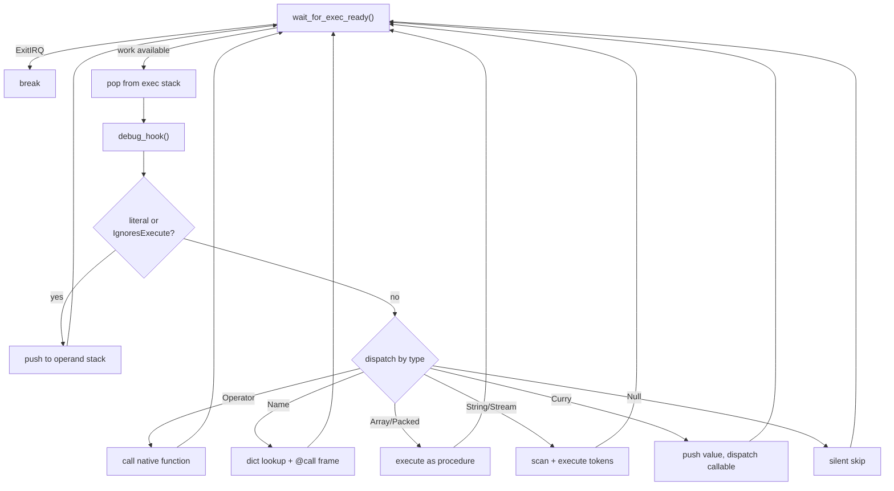

<!--
   ______    _
  /_  __/___(_)_  __
   / / / __/ /\ \/ /       Stack-Based Interpreter & VM
  / / / / / /  > · <      C++23 · Single-Header Library
 /_/ /_/ /_/  /_/\_\     Copyright 2026 Mark Guidarelli

Licensed under the Apache License, Version 2.0 (the "License");
you may not use this file except in compliance with the License.
You may obtain a copy of the License at

    https://www.apache.org/licenses/LICENSE-2.0

Unless required by applicable law or agreed to in writing, software
distributed under the License is distributed on an "AS IS" BASIS,
WITHOUT WARRANTIES OR CONDITIONS OF ANY KIND, either express or implied.
See the License for the specific language governing permissions and
limitations under the License.
-->

# Trix Interpreter: Execution Model and Architecture

## 1. Introduction

The interpreter is the heart of the Trix virtual machine.  It takes the stream
of `(Lexeme, Object)` pairs produced by the scanner and executes them: pushing
values, calling operators, looking up names, running procedures, and handling
errors.

Trix's interpreter descends from the PostScript execution model -- a stack-based
loop that pops objects from an execution stack and dispatches them by type.  But
Trix extends this model in ways that make it faster, safer, and more expressive:

- **Look-ahead direct execution** of operators eliminates unnecessary exec
  stack round-trips
- **Executable null as noop** provides a safe sentinel for optional dispatch slots
- **Tail call optimization** reuses call frames for constant-space recursion
- **Named call frames** (`@call`) enable backtraces with function names and
  source locations -- without a separate call stack
- **Dictionary-based `case`** provides pattern matching with error-checked
  fallback
- **Five-layer exception handling** (`try`, `try-catch`, `finally`, `stopped`,
  `with-stream`) with barrier-based unwinding
- **Verbose error messages** with scanner location context and operand stack
  snapshots
- **Thread-safe interrupt system** with 8 priority levels and condition-variable
  parking
- **Interactive debug hook** on every operation, enabling single-stepping and
  breakpoints

This document explains how each piece works, why the design choices were made,
and how they combine to create an execution engine that goes well beyond its
PostScript roots.

---

## 2. The Four Stacks

Trix's execution state lives on four stacks, each with a dedicated role:

| Stack          | Default depth | Purpose                                                     |
| -------------- | ------------- | ----------------------------------------------------------- |
| **Operand**    | 1024          | Data values -- numbers, strings, arrays, dicts              |
| **Execution**  | 2048          | Objects pending execution -- procedures, operators, streams |
| **Dictionary** | 64            | Active dictionaries for name lookup                         |
| **Error**      | 64            | Exception handler state (catch dicts, finally blocks)       |

All stack depths are configurable via the `Config` struct at construction time.

Each stack uses a base/pointer/limit model:
```
m_xxx_base     first valid slot
m_xxx_ptr      current top (points at the topmost occupied slot)
m_xxx_limit    one-past-last valid slot
```

Push and pop are single-instruction operations:
```
*++m_op_ptr = value;        // push: pre-increment, then store
auto obj = *m_op_ptr--;     // pop: read, then post-decrement
```

**Capacity checks** guard every push.  Overflowing any stack raises its
corresponding error (`OpStackOverflow`, `ExecStackOverflow`, `DictStackOverflow`,
`ErrStackOverflow`) rather than corrupting memory.

---

## 3. The Interpreter Loop

The interpreter is a single `while(true)` loop that repeats three steps:

1. **Wait** for the exec stack to have work (or an exit interrupt)
2. **Pop** the top object from the exec stack
3. **Dispatch** based on the object's type and attributes



```
interpreter():
    while true:
        if wait_for_exec_ready() == ExitIRQ:
            break

        current = *exec_ptr--         // pop
        ++op_count                    // statistics
        debug_hook(current)           // breakpoint check

        if current.is_literal() or current.ignores_execute():
            push current to operand stack
        else:
            dispatch by current.type()

        catch Exception::Error:
            resume (handler already ran)
        catch Exception::Exit:
            break
```

The `wait_for_exec_ready()` function parks the interpreter in a condition
variable when the exec stack is empty, allowing the interrupt system to
wake it with new work.  This is how Trix supports asynchronous invocation from
host code without busy-waiting.

---

## 4. Object Dispatch: Literal vs. Executable

Every Trix object carries two critical attributes in its 8-bit `aat_t` header:

```
  7   6   5   4   3   2   1   0
+---+---+---+---+---+---+---+---+
| X | W | F |     Type          |
+---+---+---+---+---+---+---+---+
  |   |   |
  |   |   +--- F: SpecialFlag (Dict dynamic mode, packed prefix, eqref marker)
  |   +------- access: 0=ReadOnly, 1=ReadWrite
  +----------- execute: 0=Literal, 1=Executable
```

The execute bit (X) determines the fundamental dispatch decision: push or
execute.  But two additional type-level attributes refine this:

### 4.1 IgnoresExecute

Some types are inherently data -- they can never be meaningfully "executed."
Numbers, booleans, marks, dicts, and sets have the `IgnoresExecute` attribute.
When the interpreter encounters one of these on the exec stack, it pushes
it to the operand stack regardless of the X bit.

This is a safety feature: if an executable dict somehow reaches the exec
stack, it becomes data rather than causing a dispatch error.

### 4.2 PushOpDirect

Arrays and packed arrays have a subtle dual nature.  When an executable array
is reached via name lookup, it should execute as a procedure.  But when the
same array appears as an element inside a procedure body, it should be pushed
as data -- it's a nested array literal, not a sub-procedure call.

The `PushOpDirect` attribute controls this.  During procedure execution
(`execute_proc`), elements with `PushOpDirect` are pushed to the operand
stack.  During name-driven execution (`execute_name`), `IgnoresExecute` is
checked instead -- and arrays do NOT have `IgnoresExecute`, so they execute
as procedures.

### 4.3 Complete Dispatch Table

This table shows what happens to each type in every execution context:

| Type | Literal | Executable (exec stack) | Executable (in proc body) | Executable (via name) |
| --- | --- | --- | --- | --- |
| **Null** | push | noop (silent skip) | noop | noop |
| **Byte** | push | push (IgnoresExecute) | push (PushOpDirect) | push (IgnoresExecute) |
| **Integer** | push | push (IgnoresExecute) | push (PushOpDirect) | push (IgnoresExecute) |
| **UInteger** | push | push (IgnoresExecute) | push (PushOpDirect) | push (IgnoresExecute) |
| **Long** | push | push (IgnoresExecute) | push (PushOpDirect) | push (IgnoresExecute) |
| **ULong** | push | push (IgnoresExecute) | push (PushOpDirect) | push (IgnoresExecute) |
| **Address** | push | push (IgnoresExecute) | push (PushOpDirect) | push (IgnoresExecute) |
| **Real** | push | push (IgnoresExecute) | push (PushOpDirect) | push (IgnoresExecute) |
| **Double** | push | push (IgnoresExecute) | push (PushOpDirect) | push (IgnoresExecute) |
| **Boolean** | push | push (IgnoresExecute) | push (PushOpDirect) | push (IgnoresExecute) |
| **Operator** | push | call native function | call native function | call native function |
| **Mark** | push | push (IgnoresExecute) | push (PushOpDirect) | push (IgnoresExecute) |
| **Name** | push | look up + dispatch | look up + dispatch | *(is the lookup itself)* |
| **Array** | push | execute as procedure | push (PushOpDirect) | execute as procedure |
| **Packed** | push | execute as procedure | push (PushOpDirect) | execute as procedure |
| **String** | push | scan + execute tokens | scan + execute tokens | scan + execute tokens |
| **Stream** | push | scan + execute tokens | scan + execute tokens | scan + execute tokens |
| **Dict** | push | push (IgnoresExecute) | push (PushOpDirect) | push (IgnoresExecute) |
| **Curry** | push | dispatch value+callable | push (PushOpDirect) | dispatch value+callable |
| **Thunk** | push | force thunk | push (PushOpDirect) | force thunk |
| **Continuation** | push | restore continuation | push (PushOpDirect) | restore continuation |

**Key observations:**

- **Array/Packed/Curry/Thunk/Continuation** (all `PushOpDirect`-without-`IgnoresExecute` types) push as data in a proc body but dispatch on the exec stack; proc-body behavior differs from
  exec-stack behavior.  This is the `PushOpDirect` vs `IgnoresExecute`
  distinction in action.
- **String/Stream** do NOT have `PushOpDirect` -- an executable string inside
  a procedure body is scanned and executed, not pushed.  This enables
  `(code)#x` as inline executable source.
- **Operator** does not have `IgnoresExecute` or `PushOpDirect` -- operators
  are always called when executable, always pushed when literal.
- **Null** has neither attribute -- but the interpreter has an explicit check
  that makes executable null a silent noop.

### 4.4 Example: PushOpDirect in Action

```trix
% Array literal INSIDE a procedure body: pushed as data (PushOpDirect)
{ [1 2 3] length }    % when executed: pushes [1 2 3], then length → 3

% Executable array bound to a name: executed as a procedure -- via-name
% dispatch does NOT honor PushOpDirect
/my-proc {1 2 3}#a def
my-proc               % executes: pushes 1, then 2, then 3 (three values!)

% A literal array is data everywhere -- bound to a name, lookup pushes the
% array object itself, never its elements
/my-data [1 2 3] def
my-data               % pushes [1 2 3] as a single value
```

This distinction is what lets a procedure body carry array data: an array
element is pushed for a later operator (`{ [1 2 3] for-all }`,
`{ [1 2 3] length }`) instead of being run as a nested procedure.

---

## 5. Look-Ahead Direct Execution

In the classic PostScript model, executing an operator found via name lookup
requires two exec stack operations:

```
PostScript model:
  1. Look up name → find operator
  2. Push operator onto execution stack
  3. Next loop iteration: pop operator from execution stack
  4. Call operator's native function
```

Trix eliminates steps 2 and 3.  The `execute_value()` helper detects operators
and calls them directly:

```
Trix model:
  1. Look up name → find operator
  2. Call operator's native function immediately
```

This optimization applies everywhere an executable value is dispatched:
- `execute_name()` -- after dictionary lookup
- `execute_proc()` -- for operator elements in procedure bodies
- `execute_string()` / `execute_stream()` -- for scanned operator tokens
- `execute_curry()` -- for operator callables
- `execute_input_token()` -- for scanner output

The result is that operators -- the most common executable type -- never
touch the exec stack.  For operator-heavy code (arithmetic, stack
manipulation, control flow), this eliminates roughly half of all exec
stack operations.

**The dispatch filter pattern:** This is the same design principle used for
executable null (Section 6).  The `execute_value()` helper is the central
dispatch point for all executable values, and it applies two look-ahead
filters before resorting to an exec stack push:

```
execute_value(value):
    if value is Operator  → call native function directly (no exec stack)
    if value is Null      → skip silently (no exec stack)
    otherwise             → push to exec stack for next loop iteration
```

Only non-operator, non-null executable values (procedures, strings, streams)
actually reach the exec stack.  Operators -- which account for the vast
majority of executable values in typical code -- are handled inline, saving
a push, a loop iteration, and a pop for each one.  Nulls are rare but are
filtered at the same point for consistency and zero cost.

**Why PostScript doesn't do this:** PostScript's execution model is defined
as "push to exec stack, pop and dispatch."  The two-step semantics are
observable because user code can inspect the exec stack.  Trix treats
the exec stack as internal state, making the optimization transparent.

---

## 6. Executable Null as Noop

When the interpreter encounters an executable Null, it silently skips it.
No error, no stack change, no side effect.

```trix
null exec             % does nothing
```

This is a deliberate design choice with practical applications:

- **Optional dispatch slots:** A dictionary used with `case` can map some keys
  to `null` to indicate "do nothing" without needing a `{ }` noop procedure
- **Sparse arrays:** An executable array can contain nulls as placeholder
  elements that are silently skipped during execution
- **Conditional construction:** Code that dynamically builds procedure bodies
  can insert nulls for disabled steps

**Design rationale:** Null means "no value" -- executing "no value" should
produce "no effect," not an error.  This is consistent with how null behaves
in other contexts (null in a dictionary slot means "not defined").  PostScript
also treats executable null as a no-op; Trix preserves this behavior and
extends it with the look-ahead optimization described below.

**Look-ahead optimization:** The null check is applied not only in the main
interpreter loop but also in `execute_value()`, `execute_name()`, and the
string/stream execution helpers.  When a name resolves to null, or a procedure
element is null, it is filtered out before it ever reaches the exec stack.
This turns the noop from a two-step operation (push to exec stack, pop and
skip on the next loop iteration) into a zero-cost filter -- the null never
touches the exec stack, and no loop iteration is consumed.

---

## 7. Name Resolution and Call Frames

When the interpreter encounters an executable name, it searches the dict
stack from top to bottom for a matching entry.  The found value is then
dispatched based on its type and attributes.

### 7.1 The @call Frame

For non-operator executable values (procedures, strings, streams), the
interpreter constructs a 4-slot call frame on the exec stack before
dispatching:

```
Exec stack (bottom to top):
  SourceLoc    -- file:line:col where the name was scanned
  Name         -- the name that was looked up (set literal for safety)
  @call        -- control operator: pops Name+SourceLoc on return
  value        -- the executable object (runs first)
```

When the value finishes executing, `@call` runs and pops its two companions
(Name and SourceLoc), cleaning up the frame.  This frame structure serves
two purposes:

1. **Backtraces:** When an error occurs, the backtrace walker scans the
   exec stack for `@call` operators and reads their companion Name and
   SourceLoc objects to construct a named call stack with source locations.

2. **Tail call optimization:** The interpreter detects when the current name
   is in tail position by checking whether the top of the exec stack
   is an `@call` operator.  If so, it reuses the existing frame instead of
   pushing a new one.

### 7.2 Tail Call Optimization

If a named call occurs in tail position -- meaning the next thing on the
exec stack is `@call` -- the interpreter overwrites the existing frame's
SourceLoc and Name instead of allocating a new 4-slot frame:

```
Normal call: +4 slots          Tail call: +1 slot
  loc                            loc' (overwritten)
  name                  -->      name' (overwritten)
  @call                          @call (kept)
  clone                          clone (new value)
```

This means tail-recursive functions use constant exec stack space:

```trix
/countdown { |n|
    n 0 le { } { n 1 sub countdown } if-else
} def

1000000 countdown       % constant stack depth, no overflow
```

TCO is automatic -- the programmer doesn't need to request it.  It applies to:
- Direct tail calls: `{ ... foo }`
- Via exec: `{ ... { foo } exec }`
- Mutual recursion: each tail call replaces the caller's frame
- Single-layer closures: `{ |n| ... foo }` -- @end-locals cleaned up early
- Any combination where the name call is the last operation before `@call`

TCO is naturally prevented when barriers exist on the exec stack between
the call and the `@call` frame.  However, the impact depends on barrier type:
- **External barriers** (try, stopped, dip, finally, with-stream): sit below
  @call.  Only the initial call is non-tail; recursive calls get full TCO.
- **Single-layer closures** (one @end-locals above @call): closure-aware TCO
  pops the frame dict early and reuses @call.  Full TCO.
- **Nested closures** (two+ @end-locals above @call): only one @end-locals
  is handled; nested closures still overflow the dict stack.
- **Loop barriers** (@loop, @for, @repeat): reestablished each iteration.
  Recursive calls inside loop bodies are always non-tail.

### 7.3 Operators Don't Need Frames

Operators found via name lookup are dispatched immediately (Section 5) and
do not create `@call` frames.  This is safe because:
- Operators identify themselves via `m_last_operator` for error reporting
- Operators are atomic native functions -- there is no "return" to manage
- The backtrace always shows the innermost operator as frame #0

---

## 8. Procedure Execution

When an executable Array or Packed array is dispatched, `execute_proc()`
runs:

1. Pop the first element (head) from the procedure
2. If elements remain, push the shortened procedure back on the exec
   stack (the tail)
3. Dispatch the head

```trix
{ dup mul add }
% Execution steps:
%   1. Pop 'dup', push tail { mul add }, dispatch dup
%   2. Pop 'mul', push tail { add }, dispatch mul
%   3. Pop 'add', dispatch add (no tail to push)
```

The head element is dispatched using `PushOpDirect` semantics: if the head has
`PushOpDirect` set (numbers, arrays, booleans, marks, dicts), it is pushed to
the operand stack as data.  If not, it is dispatched via `execute_value()`.

This is where the Array/Packed `PushOpDirect` attribute matters most:

```trix
{ [1 2 3] length }
% Step 1: Pop [1 2 3]
%   Array has PushOpDirect → push to operand stack as data
% Step 2: Pop 'length'
%   Operator → call native function (returns 3)
```

Without `PushOpDirect`, the array `[1 2 3]` would be executed as a procedure
(pushing 1, 2, 3 individually), and `length` would never see the array object.

### 8.1 Representation Cost: Packed vs. Array in Hot Loops

Step 1 above -- "pop the first element" -- is not the same price for the
two procedure representations.  A **packed** body stores its elements as a
compact byte stream, so popping the head runs `extract_next_packed`: it
reads a header byte, assembles the element's length and value bytes, and
applies a type-specific fixup.  An **array** body (`#a`) stores fully
formed `Object`s, so popping the head is a 16-byte struct copy with no
decode.

Crucially, a loop re-pushes a *fresh copy of the body* every iteration --
with the cursor reset to the first element -- so a packed body is
re-decoded in full on every pass.  `repeat`, `for`, and `while` over a
packed proc therefore pay the decode once per element per iteration:

```trix
N { 1 2 add pop } repeat   % decodes 4 elements N times = 4N decodes
N { 1 2 add pop }#a repeat % zero decodes; pops copy formed Objects
```

On a dispatch-bound microbenchmark (100M ops, `{ 1 2 add pop }` x 25M) the
array form is about 15% faster in wall-clock (2.21 s -> 1.89 s).  The
decode is not pure straight-line work the CPU can hide: the byte-cursor
advance and the header-dependent fixup form a dependency chain, so
removing it moves real wall-clock here, not just instruction count.

That microbenchmark is the **best case**, and the win does not generalize
to whole programs.  Two things bound it: (1) instruction share is not
wall-clock -- in the bundled Z-machine interpreter `extract_next_packed`
is ~23% of executed *instructions*, but that is a profiler figure, not a
promised speedup; and (2) an array body is 8-16x larger than its packed
encoding (see `scanner.md` Section 9.5), so converting *many* procs bloats
the cache working set and can erase or reverse the gain.  The microbench
wins because it is one tiny body kept L1-resident and reused millions of
times -- perfect amortization and locality.  Applying the array form
broadly does not.

So use `#a` as a **targeted** tool: a single small proc that you have
measured to dominate a hot loop, reused enough to amortize its larger
footprint.  Leave the default packed form everywhere else.  (An automatic
"quicken hot procs" cache was prototyped and rejected for exactly this
reason -- it measured net-negative on real workloads.)

### 8.2 Name-Lookup Cost: Late vs. Early Binding (`#e`)

The decode cost above is only one of two per-execution overheads a procedure
body carries.  The other is **name lookup**: every executable name in a
late-bound body (`add`, `get`, a user proc) is resolved on *every* execution by
searching the dictionary stack.  Early binding (`#e`, see `scanner.md` Section
6.4) resolves the names that point at *operators* once, at scan time, rewriting
them in place to direct operator references -- so each call skips the lookup.
It is orthogonal to `#a`: `#a` removes the decode, `#e` removes the lookup, and
`#ae` removes both.

Unlike `#a`, `#e` has **no working-set cost** -- the body stays packed, and an
operator reference actually encodes *smaller* than the name it replaces -- so
the gain TRANSLATES to whole programs instead of evaporating in cache pressure.
On the same `{ 1 2 add pop }` x 25M microbenchmark the late-bound body runs
2.21 s; `#e` runs 1.68 s (**-23.9%**, larger than `#a`'s -14.6%); `#ae` stacks
to 1.41 s (-36.1%).  And because there is no footprint penalty, applying `#e`
across a hot path *helps* rather than backfires: early-binding the hot core of
the bundled Z-machine interpreter -- 44 per-access and per-instruction procs
(the byte/word readers and writers, the eval-stack and call-frame accessors,
the variable dispatchers, the operand decoders, and the decode/dispatch/step/run
drivers) -- cut **10.7% off the wall-clock of a 350-command real-game
walkthrough** (16.4 s -> 14.6 s, min-of-7).  That is the opposite of the array
form's broad-application penalty.

`#e` is correct only when a name's scan-time meaning is also its run-time
meaning.  Two cases break that: a body that relies on an operator being
*redefined* later, and a `|locals|` (or any frame) variable whose name collides
with an operator -- `#e` freezes the name to the operator at scan time, before
the local exists, so the frozen body ignores the local.  The opt-in lint
`tests/check_operator_shadows.py` flags the operator-named-local hazard.  Note
`#e` binds **recursively**, reaching *through* a `|locals|` body's nested packed
proc -- the one place `#a` is a silent no-op (`scanner.md` Section 6.4) -- which
is why `#e`, not `#a`, is the lever for procedures that declare locals.

Diminishing returns are real: extending `#e` past that hot core to the
Z-machine's individual opcode handlers measured perf-neutral (each handler runs
only for its own opcode and is dominated by its body work and the `exec`
dispatch, not name lookup).  So `#e`, like `#a`, is a targeted tool aimed at the
genuinely hot inner path -- not something to spray everywhere.

---

## 9. String and Stream Execution

Executable strings and streams are scanned token by token, with each token
dispatched to the interpreter before the next is scanned.

### 9.1 String Execution

```trix
(1 2 add)#x exec      % scans "1", "2", "add" → executes → 3
```

The scanner extracts one token from the string, produces a `(Lexeme, Object)`
pair, and the interpreter dispatches it.  If the string has more content, the
remaining substring is pushed back on the exec stack for the next
iteration.

### 9.2 Stream Execution

File streams work the same way, but with a read-access check:

```trix
(my-script.trx) run     % opens file stream, pushes as executable
```

If the stream lacks read access, the interpreter raises `InvalidStreamAccess`
with a descriptive message identifying the stream source.  This catches a
common error -- accidentally executing a write-only stream -- at the point of
execution rather than producing cryptic scanner failures.

### 9.3 The @run Marker

When a stream is opened via `run`, an `@run` control operator is placed below
the stream object on the exec stack:

```
Exec stack:
  @run              -- marker for error handling
  stream_object     -- the executable stream (one slot above @run)
```

This marker serves two purposes:
1. **Error handling:** When `try_catch_handler()` unwinds the exec stack,
   it looks for `@run` markers and closes the associated streams to prevent
   resource leaks
2. **Backtrace:** The backtrace walker reads the stream's source location from
   the object above `@run` to print `at file:line:col` entries

### 9.4 Executable Strings: Runtime Code Generation

The `#x` string suffix marks a string as executable at construction time.
When the interpreter encounters an executable string, it scans and executes
its contents token by token -- the same path as any other source input.  This
gives Trix a safe, integrated `eval()` capability.

**Basic eval:**
```trix
(1 2 add)#x exec % → 3
(dup mul)#x exec % squares top of stack
```

**Dynamic code construction:**

The `#x` suffix is a *scanner* suffix -- it can only mark a string *literal* as
executable.  A string built at runtime (e.g. by `concat`) must be marked with
the runtime `make-executable` operator instead:

```trix
% Build an operator call from a string at runtime
/op-name (mul) def
3 (dup ) op-name concat make-executable exec    % → 9 (runs: dup mul)
```

**Computed dispatch:**
```trix
% Select and execute an operation based on data
/operations << /square (dup mul) /negate (neg) /double (dup add) >> def

/action (square) def
5  operations action get make-executable exec    % → 25

/action (negate) def
5  operations action get make-executable exec    % → -5
```

**Code generation with format strings:**
```trix
% Generate an executable string that adds a specific constant.
% sprint-fmt is dst-and-format-first: dst fmt mark any... -- str bool.
/make-adder { |n|
    32 string ({:d} add) mark n sprint-fmt pop make-executable
} def

5 make-adder           % → executable string "5 add"
3 exch exec            % → 8
```

**Differences from PostScript:**

PostScript supports `(code) cvx exec` -- converting a string to executable and
running it.  Trix's `#x` suffix differs in three important ways:

1. **Construction-time intent:** The `#x` suffix declares executability when the
   string is created, not retroactively.  This makes the code's intent clear at
   the point of definition.

2. **Scanner integration:** Executable strings are scanned token-at-a-time with
   continuation -- if the string contains multiple tokens, the remaining
   substring is pushed back on the exec stack between tokens.  This means
   executable strings participate correctly in the interpreter's normal flow,
   including interrupt processing between tokens.

3. **Error integration:** Scanner errors inside executable strings produce
   `SyntaxError` with the context "(while scanning an Executable --string--),"
   and the error propagates through the normal `try`/`try-catch` system.
   Backtraces show the string execution context.

**When to use executable strings vs. procedures:**

Procedures (`{ ... }`) are compiled once and executed many times.  Executable
strings are scanned every time they execute.  Use procedures for fixed code
and executable strings for dynamically constructed code:

```trix
% Fixed code: use a procedure (compiled once)
/square { dup mul } def

% Dynamic code: wrap the executable string in a proc so it is stored, not
% run immediately -- the string is re-scanned on every call.
/dynamic-op { (dup mul)#x } def
```

The scanning overhead of executable strings is measurable but acceptable for
code that is constructed at runtime -- the alternative would be building
procedure objects programmatically, which Trix (like PostScript) does not
expose as a user-level operation.

---

## 10. Curry Execution

Curry objects implement partial application and function composition as
first-class interpreter operations.  A curry stores two values: a captured
value and a callable.

### 10.1 Partial Application (curry)

```trix
/add-10  10 /add load curry def
5 add-10                       % → 15
```

When executed, the curry pushes its captured value (10) to the operand stack,
then dispatches the callable (`add`).  Note `/add load` -- this loads the `add`
operator as a value for `curry` to capture; a bare `\add` would dispatch `add`
immediately instead of building the curry.

### 10.2 Function Composition (compose)

```trix
/square-then-negate  { dup mul } { neg } compose def
5 square-then-negate           % → -25
```

When executed, the compose object dispatches its first value (which is itself
executable), then dispatches the callable.  The first value runs to completion
before the callable executes, achieving function composition.

---

## 11. The Case Operator

Trix provides dictionary-based pattern matching via the `case` operator:

```trix
<<
    /red   { (warm) }
    /blue  { (cool) }
    /green { (natural) }
    /default { (unknown) }
>> /red case =
% => warm
```

`case` pops a key and a dictionary, looks up the key, and:
- If found and executable: pushes the value to the exec stack
- If found and literal: pushes a clone to the operand stack
- If not found: falls back to the `/default` key
- If neither found: raises `UndefinedCase`

**Why dictionary-based case?**

Chained `if-else` is O(N) in the number of branches.  A dictionary lookup is
O(1) amortized.  For N > 3 branches, `case` is both faster and more readable:

```trix
/color (red) def

% O(N) chain:
color (red) eq { (warm) } {
    color (blue) eq { (cool) } {
        color (green) eq { (natural) } {
            (unknown)
        } if-else
    } if-else
} if-else

% O(1) case (dict pushed first, key on top):
<< /red { (warm) } /blue { (cool) } /green { (natural) }
   /default { (unknown) } >> color case
```

The `/default` key is required by convention -- omitting it when the key is
unknown causes `UndefinedCase`, which is a safety net rather than a silent
failure.

---

## 12. Exception Handling

Trix provides a five-layer exception handling system, each layer built on
barrier operators placed on the exec stack.

### 12.1 The Barrier Model

Each exception handling form places a **barrier operator** on the exec
stack below the protected code.  On normal completion, the barrier runs its
cleanup logic.  On error, `try_catch_handler()` scans the exec stack
top-to-bottom for the innermost barrier and unwinds to it.

```
Exec stack during protected code:

  [protected code objects]
  @try-barrier              ← barrier operator
  [caller's continuation]
```

### 12.2 try

The simplest form -- catch any error, report it as a name:

```trix
{ 1 0 div } try           % → /div-by-zero
{ 1 2 add } try           % → 3 /no-error
```

`try` pushes `@try-barrier` below the procedure.  On normal completion,
`@try-barrier` pushes `/no-error` to the operand stack.  On error, the
barrier is found during unwinding, the error name is pushed, and execution
resumes after the barrier.

### 12.3 try-catch

Selective error handling with a handler dictionary:

```trix
<<
    /type-check  { (wrong type) = }
    /div-by-zero { (div zero) = }
    /default     { (other error) = }
>> { 1 0 div } try-catch
% => div zero
```

`try-catch` pushes `@try-catch-barrier` on the exec stack and the handler
dictionary on the error stack.  The handler dictionary is pushed first, the
protected procedure on top.  On error:

1. `try_catch_handler()` finds `@try-catch-barrier`
2. Replaces it with `@catch-error`
3. `@catch-error` looks up the error name in the handler dictionary
4. If found: executes the handler
5. If `/default` found: executes the default handler
6. If neither: re-raises the original error

### 12.4 finally

Guaranteed cleanup regardless of error:

```trix
{ (closing resource) = }       % cleanup block
{ (using resource) = }         % protected body
finally
% => using resource
% => closing resource
```

`finally` takes the cleanup block first and the protected body on top.  It
pushes `@finally-barrier` on the exec stack and the cleanup block on the
error stack.  The cleanup block executes in both cases:
- Normal completion: `@finally-barrier` pops and executes the finally block
- Error: `try_catch_handler()` replaces the barrier with `@finally-reraise`,
  which executes the finally block and then re-raises the original error

### 12.5 with-stream

Guaranteed stream cleanup:

```trix
(file.trx) (r)#b { |s|
    s read-all =
} with-stream
```

`with-stream` takes the filename, a Byte open-mode (`(r)#b`), and a procedure.
It opens the file itself -- do not call `stream` first -- binds the open stream
to the procedure's local `s`, and places a `@with-stream` barrier that
automatically closes the stream on both normal completion and error.  This prevents resource leaks
without requiring explicit close/finally pairs.

### 12.6 stopped

The PostScript-compatible primitive:

```trix
{ some-operation  stop } stopped    % → true
{ some-operation       } stopped    % → false
```

`stopped` pushes `@stop` below the procedure.  If the procedure calls `stop`,
execution resumes at `@stop` with `true` on the operand stack.  If the
procedure completes normally, `@stop` pushes `false`.

### 12.7 Unwinding

When an error occurs, `try_catch_handler()` performs a careful unwinding pass:

1. Scans the exec stack top-to-bottom for the innermost barrier
2. Closes any `@run` streams in the discarded range (preventing resource leaks)
3. Frees any `ExtValue` objects in the discarded range (preventing memory leaks)
4. Cleans up any `@end-locals` markers (popping frame dicts from the dict stack)
5. Resets the exec stack pointer to the barrier position
6. Transforms the barrier as appropriate (replace, remove, or re-raise)
7. Throws `Exception::Error` to resume the interpreter loop

If no barrier is found, the error escalates to the global handler, which
prints the backtrace and terminates.

Which exec-stack atoms are barriers, closers, or frame-bearers -- and what each
does on unwind, capture, and backtrace walks -- is not hard-coded into
`try_catch_handler` per atom; it is read from a single descriptor table
(`OpKind` / `UnwindAction` in `src/op_descriptor.inl`).  That table is the one
source of truth shared by `format_backtrace`, `perform_op`, `capture_op`, and
`try_catch_handler`, so the walkers cannot disagree about which ops push
err-stack companions.  Any new `@`-control atom that participates here must add
a descriptor row.

---

## 13. Error Reporting

### 13.1 Error Codes

Trix defines 58 error codes covering every category of failure:

| Category               | Errors | Examples                                                           |
| ---------------------- | ------ | ------------------------------------------------------------------ |
| Stack overflow         | 4      | `OpStackOverflow`, `ExecStackOverflow`, `DictStackOverflow`        |
| Stack underflow        | 2      | `OpStackUnderflow`, `DictStackUnderflow`                           |
| Type & range           | 4      | `TypeCheck`, `RangeCheck`, `IndexCheck`, `UndefinedCase`           |
| Access                 | 3      | `ReadOnly`, `InvalidAccess`, `InvalidStreamAccess`                 |
| Numeric                | 5      | `DivByZero`, `NumericalOverflow`, `NumericalNaN`, `NumericalINF`   |
| Name                   | 2      | `Undefined`, `InvalidName`                                         |
| I/O & filesystem       | 8      | `FileOpenError`, `FilenameNotFound`, `IOReadError`, `IOWriteError` |
| Scanner                | 8      | `SyntaxError`, `LimitCheck`, `ScanMatchFail`, `UnmatchedMark`      |
| VM & snapshot          | 4      | `VMFull`, `SnapShotError`, `InvalidImageFile`, `InvalidRestore`    |
| Control flow & effects | 6      | `InvalidExit`, `InvalidThrow`, `AboveBarrier`, `EffectNotHandled`  |
| Contracts & assertions | 6      | `Fail`, `Require`, `Ensure`, `Match`, `Protocol`, `AssertFailed`   |
| Limits & misc          | 4      | `DictFull`, `ExecutionLimit`, `Unsupported`, `InvalidFormatString` |
| Internal & user        | 2      | `InternalError`, `UserError`                                       |

Each error code maps to a Name object (`/type-check`, `/div-by-zero`,
etc.) that can be used as a `try-catch` handler key.

### 13.2 Verbose Error Messages

Every error carries a formatted message string with full context:

```
tests/test_math.trx:42:5: division by zero in 'div' operator
```

The format is `source:line:col: message`.  The source location comes from the
scanner's current stream position at the time of the error.  The message is
constructed using `std::format_to_n` with type-safe format strings -- no
truncation bugs, no buffer overflows.

### 13.3 Backtraces

When an error reaches the global handler (no `try`/`try-catch` caught it),
Trix prints a backtrace showing the call chain:

```
  #0: 'div'
  #1: reciprocal at tests/test_math.trx:15:3
  #2: safe-divide at tests/test_math.trx:22:5
      [try-catch boundary]
  #3: main at tests/test_math.trx:30:1
      at tests/test_math.trx:30:1
  operands: --integer-- 0 --real-- 3.14
```

The backtrace is constructed by walking the exec stack:
- **`@call` frames** provide function name and source location
- **`@run` frames** provide file:line:col for stream execution points
- **Barrier annotations** show exception handling boundaries
- **Operand stack snapshot** shows the top 8 values with types and compact
  representations

This is possible because the `@call` frame structure (Section 7.1) weaves
location tracking directly into the exec stack.  There is no separate
call stack, shadow stack, or metadata table -- the exec stack IS the
call stack.  The walker classifies each atom it passes (frame-bearer,
stream-bearer, barrier, closer, helper) via the `op_descriptor` table
described under [Unwinding](#127-unwinding).

---

## 14. The Interrupt System

Trix supports 8 interrupt priority levels for asynchronous communication
between host code and the interpreter:

| Priority | IRQ          | Purpose                                |
| -------- | ------------ | -------------------------------------- |
| Highest  | `Level0IRQ`  | User-defined high-priority interrupt   |
| 2        | `ErrorIRQ`   | Raise an error from host code          |
| 3        | `Level1IRQ`  | User-defined medium-priority interrupt |
| 4        | `SuspendIRQ` | Pause interpreter (parks in condvar)   |
| 5        | `ResumeIRQ`  | Wake a suspended interpreter           |
| 6        | `InvokeIRQ`  | Execute a memory stream (best-effort)  |
| 7        | `Level2IRQ`  | User-defined low-priority interrupt    |
| Lowest   | `ExitIRQ`    | Terminate the interpreter              |

### 14.1 Delivery Model

Interrupts are delivered between interpreter loop iterations -- never mid-
operator.  This means operators are always atomic; the interrupt system cannot
corrupt partial results.

The delivery sequence:
1. Host code sets interrupt bits atomically
2. `process_interrupt()` checks pending bits at the top of each loop iteration
3. Highest-priority pending interrupt is serviced
4. User interrupts (Level0/1/2) push an executable Name onto the exec
   stack, triggering a handler defined in Trix code

### 14.2 Masking

Each interrupt level can be masked (disabled) via `m_interrupt_mask`.  Masked
interrupts remain pending but are not serviced until unmasked.  This allows
critical sections in Trix code that must not be interrupted.

### 14.3 Thread Safety

The interrupt bits are accessed via `std::atomic` operations with relaxed
memory ordering.  The condition variable (`m_cond`) is used for `SuspendIRQ`
(park until `ResumeIRQ` or `ExitIRQ`) and for `wait_for_exec_ready()` (park
until exec stack has work).  All state transitions are protected by a
mutex.

---

## 15. The Debug Hook

The interpreter calls `debug_hook()` on every operation.  In normal execution,
this is a no-op (the debug mode flag is checked and returns immediately).
When debugging is enabled, the hook provides:

- **Single-stepping:** Step through operations one at a time, with a
  description of the next object to be dispatched
- **Step-N:** Execute N operations, then pause
- **Interactive prompt:** `dbg>` readline prompt with command history
- **Object inspection:** Each step shows the type and value of the next object

The debug hook is called after the object is popped from the exec stack
but before dispatch.  This means the debugger sees the operation that is about
to happen, not the one that just completed -- the natural perspective for
stepping through code.

---

## 16. Interpreter Instrumentation

The interpreter tracks runtime statistics that serve two purposes:
verifying correctness of the execution model, and right-sizing stack
allocations for memory-constrained deployments.

### 16.1 Stack High-Water Marks

Each of the four stacks maintains a high-water mark -- the peak depth
reached since VM initialization.  The marks are updated at every stack push
via the capacity-check functions, adding a single pointer comparison per
push (branch-predicted not-taken after warmup, effectively zero cost).

```trix
//:status:op-high-water       % peak operand stack depth
//:status:exec-high-water     % peak exec stack depth
//:status:dict-high-water     % peak dict stack depth
//:status:error-high-water    % peak error stack depth
```

These are reported alongside the configured maximum in the global error
handler's backtrace output:

```
  high-water: op 47/1024 exec 18/2048 dict 4/64 error 2/64
```

**Verifying interpreter correctness:** High-water marks make the interpreter's
key optimizations directly testable from Trix code:

```trix
% Prove TCO keeps exec stack bounded during deep recursion
/countdown { |n| n 0 le { } { n 1 sub countdown } if-else } def
//:status:exec-high-water
100000 countdown                   % 100,000 tail-recursive calls
//:status:exec-high-water
exch sub 20 lt (exec stayed bounded) exch assert   % grew by < 20 slots
```

Without high-water marks, TCO correctness can only be tested indirectly ("it
didn't overflow").  With high-water marks, the test asserts the actual property
("exec stack stayed bounded") -- a much stronger guarantee.

**Right-sizing for embedded deployment:** A developer targeting a 256KB VM can
run their program on a full-sized VM, query the high-water marks, and set
`Config` depths to just above the observed peaks:

```trix
% After running the full application:
//:status:op-high-water    =    % "47"  → set m_operand_depth to 64
//:status:exec-high-water  =    % "18"  → set m_execution_depth to 32
//:status:dict-high-water  =    % "4"   → set m_dictionary_depth to 8
//:status:error-high-water =    % "2"   → set m_error_depth to 4
```

This eliminates guesswork: instead of allocating generous defaults and hoping,
the programmer sees exactly how much of each stack their program actually uses.

### 16.2 TCO Counter

The interpreter counts the number of tail calls optimized:

```trix
//:status:tco-count               % ULong: total tail calls since init
```

This enables precise verification of TCO behavior:

```trix
//:status:tco-count
/countdown { |n| n 0 le { } { n 1 sub countdown } if-else } def
100 countdown
//:status:tco-count
exch sub 100ul eq (exactly 100 tail calls) exch assert
```

Combined with the exec-high-water mark, this provides a two-part proof: TCO
is firing (tco-count increments) AND it achieves constant space (exec-high-water
stays bounded).  Non-tail recursion can be verified to NOT increment the counter:

```trix
//:status:tco-count
/non-tail { dup 0 le { pop } { 1 sub non-tail 1 pop } if-else } def
{ 50 non-tail } try pop
//:status:tco-count
eq (tco-count unchanged) exch assert
```

### 16.3 Operation Counter

The total number of interpreter loop iterations is tracked as a ULong:

```trix
//:status:op-count                % ULong: total operations since init
```

This is useful for performance analysis and for establishing baselines in
regression tests.

---

## 17. Streaming Execution: No AST, No Full-Source Requirement

Most modern scripting languages require the entire program source to be in
memory before execution begins.  Python parses source into an AST, compiles
to bytecode, then executes.  JavaScript engines parse to AST, optimize, and
JIT-compile.  Ruby builds a syntax tree from the complete source.  All of
these require O(source) memory before the first instruction runs.

Trix requires O(1) memory relative to source size.

The scanner reads from a buffered stream -- a disk file, a memory buffer, a
Unix pipe, readline input, or stdin -- and produces one `(Lexeme, Object)`
pair at a time.  The interpreter consumes that pair immediately: pushing to
the operand stack or dispatching for execution.  The source bytes behind
that token can be discarded as soon as the next buffer fill overwrites them.
The stream buffer defaults to 4 KB (configurable down to 128 bytes), regardless
of program size.

```
Source stream                Scanner              Interpreter
  [disk file]       →   read buffer (4 KB)   →   one Object
  [memory buffer]        extract one token        push or dispatch
  [Unix pipe]            produce Object           consume immediately
  [readline]             advance buffer
  [stdin]                (repeat)
```

This streaming model is shared with PostScript and is a natural consequence
of the stack-based execution model: there is no syntax that requires
lookahead beyond the current token.  Procedures delimited by `{ }` are the
one case where the scanner must collect multiple tokens before producing a
result -- but the collection buffer is the operand stack, so procedure size
is bounded by available operand stack capacity, not by program size.

**Binary tokens amplify the advantage.** A binary-encoded Trix program is
already in its final form -- each token is 1-9 bytes that the scanner reads
and converts directly to a typed Object.  There is no parsing, no number
conversion, no name interning overhead beyond what the token itself encodes.
Compare this to text source where the scanner must classify characters,
accumulate token buffers, parse numeric formats, and intern name strings.

The practical impact is measurable in two scenarios:

- **Embedded deployment:** A microcontroller with 256KB of VM can execute a
  program of any length from external storage (SD card, flash, serial link).
  The entire program never needs to be resident -- only the current stream
  buffer and the operand/exec stacks.

- **Pipeline execution:** Trix can execute from a Unix pipe (`generator |
  trix`) where the source is produced incrementally by an upstream process.
  Execution begins immediately with the first token, without waiting for the
  pipe to close.  This enables streaming computation where the producer and
  consumer run concurrently.

| Language        | Memory model                     | Minimum memory for 1MB source |
| --------------- | -------------------------------- | ----------------------------- |
| Python          | Full AST + bytecode              | ~3-5x source size             |
| JavaScript (V8) | AST + optimized IR + JIT code    | ~5-10x source size            |
| Ruby            | AST + bytecode                   | ~3-5x source size             |
| Lua             | Full parse to bytecode           | ~2-3x source size             |
| PostScript      | Streaming (256B buffer)          | ~256 bytes + stack space      |
| Trix (text)     | Streaming (4KB buffer)           | ~4 KB + stack space           |
| Trix (binary)   | Streaming (4KB buffer, no parse) | ~4 KB + stack space           |

---

## 18. The SourceLoc Type

`SourceLoc` is an internal type used exclusively by the interpreter for
backtrace tracking.  It stores a stream ID, line number, and column position
in the 8-byte Object format.

SourceLoc has `IgnoresExecute` set -- if it somehow reaches the exec stack
as an executable object, it is silently pushed to the operand stack rather than
causing a dispatch error.  It has no user-visible operators and cannot be
constructed by Trix code.

The interpreter creates SourceLoc objects in `execute_name()` when building
`@call` frames.  They are consumed by `@call` (which pops them) and by the
backtrace walker (which reads them for file:line:col information).

---

## 19. Quick Reference

### Execution Priority

```
1. Interrupt check (process_interrupt)
2. Pop object from execution stack
3. Debug hook
4. Dispatch:
   a. Literal / IgnoresExecute → push to operand stack
   b. Executable Null → noop
   c. Executable Operator → direct native call
   d. Executable Name → dict lookup + @call frame + dispatch
   e. Executable Array/Packed → head/tail procedure execution
   f. Executable String → scan one token, dispatch, push continuation
   g. Executable Stream → scan one token, dispatch, re-push stream
   h. Executable Curry → dispatch captured value, then callable
```

### Exception Handling Stack Layout

```
try:        @try-barrier              proc
try-catch:  @try-catch-barrier        proc    (handler dict on error stack)
finally:    @finally-barrier          proc    (finally block on error stack)
with-stream: @with-stream            body    (stream on error stack)
stopped:    @stop                    proc
```

### @call Frame Layout

```
            SourceLoc    (file:line:col)
            Name         (function name, set literal)
            @call        (cleanup operator)
exec top →  value        (the executable object)
```
