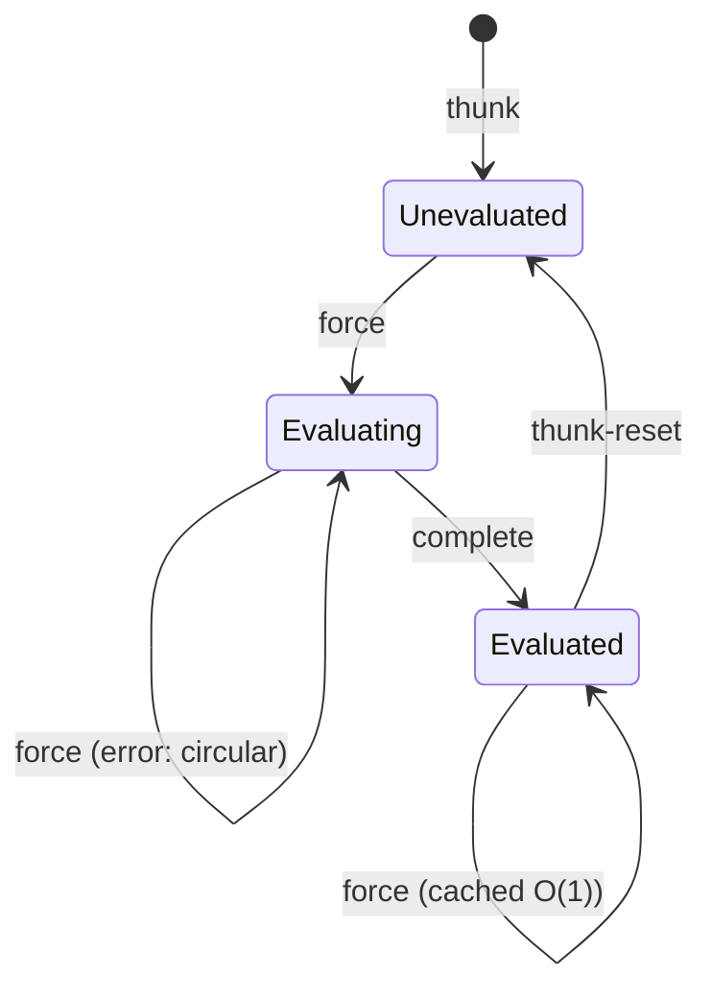
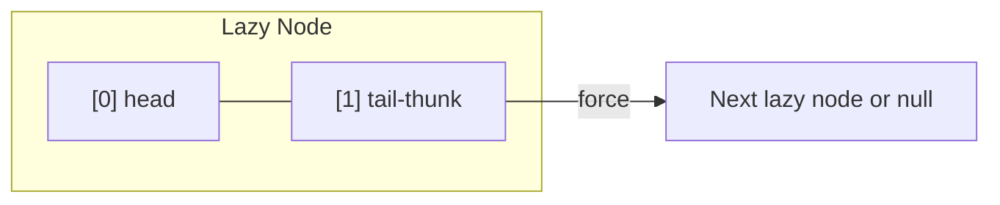
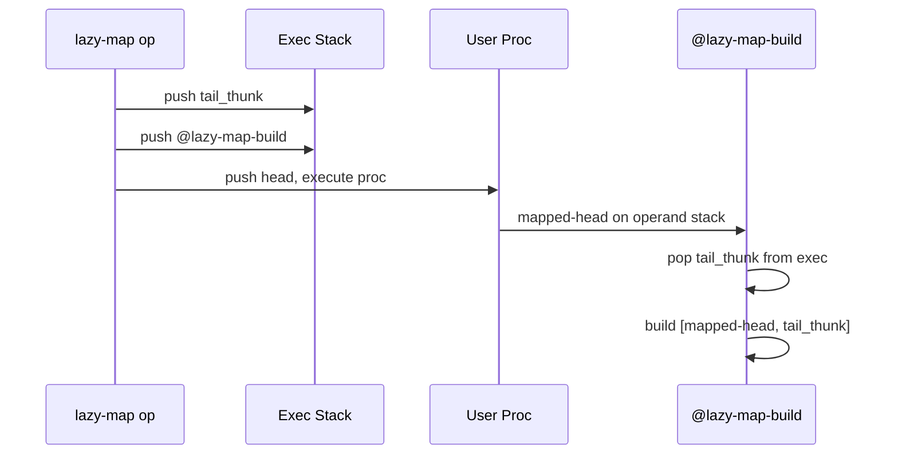
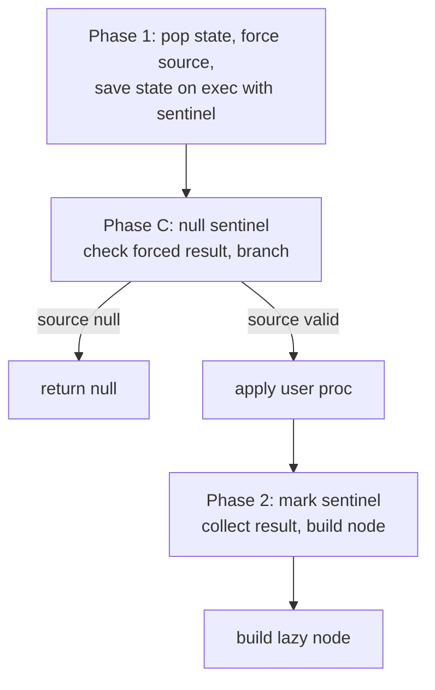
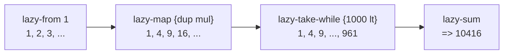

<!--
   ______    _
  /_  __/___(_)_  __
   / / / __/ /\ \/ /       Stack-Based Interpreter & VM
  / / / / / /  > · <      C++23 · Single-Header Library
 /_/ /_/ /_/  /_/\_\     Copyright 2026 Mark Guidarelli

Licensed under the Apache License, Version 2.0 (the "License");
you may not use this file except in compliance with the License.
You may obtain a copy of the License at

    https://www.apache.org/licenses/LICENSE-2.0

Unless required by applicable law or agreed to in writing, software
distributed under the License is distributed on an "AS IS" BASIS,
WITHOUT WARRANTIES OR CONDITIONS OF ANY KIND, either express or implied.
See the License for the specific language governing permissions and
limitations under the License.
-->

# Lazy Sequences in Trix

## Overview

Trix provides a lazy evaluation system built on two primitives — **Thunk**
(deferred computation with memoization) and **Curry** (partial application) — combined
into a 48-operator lazy sequence library with 33 internal control operators.

### What This Enables

- **Infinite data structures** — represent the natural numbers, Fibonacci sequence,
  or an infinite stream of sensor readings as a single value
- **Streaming pipelines** — chain map/filter/take/fold without materializing
  intermediate arrays
- **Short-circuit evaluation** — `lazy-find` on an infinite sequence stops the
  instant it finds a match, using constant stack space
- **Deferred computation** — thunks wrap expensive calculations that execute only
  when (and if) their result is needed, then cache it permanently
- **Memory-efficient processing** — process a million-element dataset by forcing
  one element at a time, never holding more than one in memory

### Design Principles

1. **Convention, not a new type.** A lazy-seq is `null` (empty) or a 2-element array
   `[head, tail-thunk]`.  No new Object type, no new PackedType slot, no new
   verify_t bit consumed.  The existing Thunk type (added for general lazy evaluation)
   provides the machinery.

2. **All operators are built-in C++.** Every lazy operator is a native function in
   the interpreter, like every other Trix operator.  No `.trx` library files, no
   bootstrap scripts.

3. **Compositional.** Lazy operators compose with each other and with eager operators.
   `lazy-seq` converts an array to a lazy sequence; `lazy-to-array` materializes
   it back.  `lazy-filter` accepts any predicate proc.  `lazy-fold` accepts any
   binary proc.  The user writes the logic; the lazy infrastructure handles the
   streaming.

---

## 1. The Thunk Primitive

A **thunk** is a deferred computation.  You give it a proc; it doesn't execute the
proc until you `force` it.  After the first force, the result is cached — subsequent
forces return the cached value in O(1) without re-executing the proc.

### 1.1 Creating Thunks

```
thunk    proc -- thunk
```

Wraps an executable proc in a thunk.  The proc is not executed yet.

```
{ 3 4 mul } thunk      % => thunk (unevaluated, proc = { 3 4 mul })
```

The proc can be arbitrarily complex — it can call other functions, access
dicts, even force other thunks:

```
{ expensive-database-query } thunk    % deferred until needed
{ config-file read-and-parse } thunk  % parsed on first access, cached forever
```

### 1.2 Forcing Thunks

```
force    any -- value
```

If the argument is a thunk:
- **Unevaluated:** executes the proc, caches the result, returns it
- **Evaluated:** returns the cached result immediately (O(1))
- **Evaluating:** error — circular dependency detected

If the argument is not a thunk, `force` is a no-op (pass-through).  This makes
it safe to call `force` on any value without type-checking first.

```
{ 3 4 mul } thunk
dup force       % => 12 (proc executes, result cached)
force           % => 12 (cached, proc does NOT re-execute)
```

**Why pass-through matters:** lazy sequence operators internally call `force` on
tail thunks.  If a tail is already a concrete lazy-seq (not a thunk), `force`
returns it unchanged.  This simplifies the implementation — operators don't need
separate code paths for "thunk tail" vs "concrete tail."

### 1.3 Thunk State Lifecycle



A thunk has exactly three states:

`Unevaluated` -- `thunk-evaluated?` returns `false`
    `force` executes the proc, caches the result, transitions to Evaluated.

`Evaluating` -- transient state (not directly observable)
    `force` raises `/undefined-result` (circular thunk detected).

`Evaluated` -- `thunk-evaluated?` returns `true`
    `force` returns the cached result in O(1) without re-executing the proc.

The **Evaluating** state is a cycle guard.  If a thunk's proc tries to force the
same thunk (directly or indirectly), the guard catches the infinite recursion and
raises `/undefined-result`.

### 1.4 Inspecting and Resetting

```
thunk-evaluated?    thunk -- bool
thunk-reset         thunk -- thunk
```

`thunk-evaluated?` checks whether a thunk has been forced.  `thunk-reset` reverts
an evaluated thunk to unevaluated, discarding the cached result.  The next `force`
will re-execute the proc.

```
{ expensive-computation } thunk
dup thunk-evaluated?     % => false
dup force pop
dup thunk-evaluated?     % => true
thunk-reset
thunk-evaluated?         % => false (reset to unevaluated)
```

**Why reset exists:** configuration reload, cache invalidation, testing.  When a
thunk wraps a computation that depends on external state (environment variables,
file contents), resetting allows re-evaluation when that state changes.

### 1.5 Memoization Guarantee

Once a thunk is evaluated, its proc **never runs again** (until explicitly reset).
This is the fundamental guarantee that makes lazy sequences efficient: each element
in a lazy sequence is computed at most once, no matter how many times the sequence
is traversed.

```
<< /n 0 >> /counter exch def
{ counter /n counter /n get 1 add put 42 } thunk

dup force pop       % counter = 1, proc ran
dup force pop       % counter = 1, cached result returned
force pop           % counter = 1, still cached
counter /n get      % => 1 (proc executed exactly once)
```

### 1.6 Thunk VM Storage

Each thunk occupies 24 bytes in VM (3 Objects of 8 bytes each):

```
offset+0:  state    (integer: 0=Unevaluated, 1=Evaluating, 2=Evaluated)
offset+1:  proc     (the callable to execute on first force)
offset+2:  result   (cached result after evaluation, initially null)
```

Thunks participate in save/restore.  If you force a thunk after a `save`, then
`restore`, the thunk reverts to unevaluated — the cached result is discarded
along with all other VM changes made after the save point.

### 1.7 Error Handling During Force

If the proc raises an error during evaluation, the error **propagates** and the
thunk's state is **reset to Unevaluated** — a failed force caches nothing.  The
next `force` therefore simply re-runs the proc: the same original error is
replayed if the underlying problem persists, or the force succeeds (and caches)
if it has been resolved.  `thunk-reset` also forces re-evaluation, but is not
required for error recovery.

```
{ /range-check throw } thunk /t exch def
{ t force } try           % => /range-check (error propagated)
t thunk-evaluated?        % => false (state reset to Unevaluated)
{ t force } try           % => /range-check (re-ran the proc, same error)
```

A thunk whose underlying issue resolves between forces succeeds on the retry.
Here the proc throws only on its first attempt (tracked via an external
counter), then succeeds:

```
<< /n 0 >> /state exch def
{ state /n get 1 add /m exch def
  state /n m put
  m 1 eq { /range-check throw } if
  m
} thunk /rt exch def

{ rt force } try          % => /range-check (first attempt throws)
rt force                  % => 2 (retry succeeds and caches)
```

---

## 2. Lazy Sequence Architecture

### 2.1 The Convention

A lazy sequence is not a new type.  It is a **convention** using existing types:



- `null` represents the empty sequence (like `nil` in Lisp, `[]` in Haskell)
- A non-empty node is a 2-element array where index 0 is the **head** (any value)
  and index 1 is a **thunk** that, when forced, yields the next lazy-seq (or null)

This convention costs 16 bytes per node (2 Objects for the array) plus 24 bytes
for the tail thunk, plus the curry chain that encodes the thunk's computation.
Typical total: **56 bytes** for sources like `lazy-from` (a single curry) up to
**~104 bytes** for transformers like `lazy-map`, whose tail thunk carries a
4-link curry/compose chain (see §10.2 for per-operator figures).

### 2.2 Memory Budget

With the default 1MB VM and ~124KB boot overhead, roughly 876KB is available:

| Elements | Bytes/node | Total VM |
| -------- | ---------- | -------- |
| 1,000    | 72         | ~70 KB   |
| 5,000    | 72         | ~352 KB  |
| 10,000   | 72         | ~703 KB  |

The 72 B/node figure is a mid-range estimate (source/simple operators);
transformation operators like `lazy-map` run heavier (~104 B/node), so budget
proportionally fewer nodes for transformer-heavy pipelines.

For streaming use (force one element, process it, move on), the retained set
is tiny — only the current node and its thunk.  Lazy sequences shine when you
**don't** materialize the entire thing.

Use `save`/`restore` to reclaim VM after materializing large sequences:

```
/sv save def
1 lazy-from 500 lazy-take lazy-to-array    % materializes 500 nodes
% ... process the array ...
sv restore                                  % reclaim all lazy node allocations
```

### 2.3 Why This Design?

**Why not a new Object type?**  Trix has 1 PackedType slot and 1 verify_t bit
remaining.  A new type would consume these scarce resources for something that
can be expressed as a convention on existing types.  The 2-element array + thunk
convention is zero-cost at the type-system level.

**Why thunks instead of procs?**  Memoization.  A bare proc `{ compute-next }`
would re-execute every time the tail is accessed.  A thunk executes once and
caches.  This means traversing a lazy sequence twice (e.g., `lazy-count` then
`lazy-to-array`) doesn't recompute elements — the thunks are already evaluated
from the first pass.

**Why built-in C++ instead of user-code library?**  Performance and correctness.
The async continuation model (exec stack manipulation, curry chains, control
operators) cannot be expressed in Trix user code.  User code cannot push to the
exec stack or create control operators.

### 2.4 The Curry Chain Pattern

Most lazy operators build **tail thunks** using curry chains.  A curry chain is a
nested sequence of curry/compose pairs that, when executed, reconstructs the
operator's state and calls the operator recursively.

Example — `lazy-map`'s tail thunk:

```
curry(proc, curry(source_tail, compose(Force, compose(Exch, @lazy-map-impl))))
```

When this thunk is forced:
1. Push `proc` (literal) to operand stack
2. Push `source_tail` (literal) to operand stack
3. `Force` — forces `source_tail`, yielding the next lazy-seq or null
4. `Exch` — swaps so proc is on top: `[forced_tail, proc]`
5. `@lazy-map-impl` — the internal recursive entry point; re-enters lazy-map on
   the forced tail with proc (it skips operand re-verification, since the
   callable arrives literal from the curry)

This pattern is used throughout: curry captures state, compose sequences
operations, and the final operator call produces the next lazy node.

### 2.5 Internal Control Operators

Some operators need to apply a user proc to an element (map, filter, scan, etc.).
Since user procs execute asynchronously through the interpreter loop, these
operators use **internal control operators** (prefixed with `@`) as exec-stack
continuations.

Pattern for `lazy-map`:



More complex operators like `lazy-filter` and `lazy-scan` use **multi-phase
control operators** with sentinel values (null or mark) on the exec stack to
distinguish which phase is executing:



This pattern was proven in `at_lazy_scan_build_op` and subsequently applied to
fix `lazy-flat-map` and `lazy-map-indexed`.

---

## 3. Predicates and Accessors

### 3.1 `lazy-seq?` — Type Predicate

```
lazy-seq?    any -- bool
```

Returns `true` if the value is a valid lazy-seq: either `null` or a 2-element
array with a thunk at index 1.  Returns `false` for everything else.

```
null lazy-seq?                      % => true (empty lazy-seq)
1 lazy-from lazy-seq?               % => true (infinite seq)
42 lazy-seq?                        % => false (integer)
[1 2 3] lazy-seq?                   % => false (3-element array, not [head, thunk])
```

**Why it exists:** defensive programming.  Before operating on a value that might
or might not be a lazy-seq, check with `lazy-seq?`.  Especially useful in
generic code that handles both eager arrays and lazy sequences.

### 3.2 `lazy-empty?` — Emptiness Test

```
lazy-empty?    lazy -- bool
```

Returns `true` if the lazy-seq is `null` (empty).  Equivalent to `null eq` but
more self-documenting.

```
null lazy-empty?                    % => true
1 lazy-from lazy-empty?             % => false
[1 2 3] lazy-seq lazy-empty?        % => false
```

**Why it exists:** readability.  `lazy-empty?` communicates intent better than
`null eq` when working with lazy sequences.

### 3.3 `lazy-head` — First Element

```
lazy-head    lazy -- val
```

Returns the first element of a non-empty lazy-seq.  Errors with `/range-check`
if the sequence is empty (null).

```
1 lazy-from lazy-head               % => 1
[10 20 30] lazy-seq lazy-head       % => 10
{ null lazy-head } try              % => /range-check
```

**Why it exists:** direct access to the head without destructuring.  The head
is always immediately available (no thunk forcing needed) — it's stored directly
in the array at index 0.

### 3.4 `lazy-tail` — Rest of Sequence

```
lazy-tail    lazy -- lazy
```

Forces the tail thunk and returns the resulting lazy-seq (or null if the source
is exhausted).  Errors with `/range-check` if called on an empty sequence.

```
1 lazy-from lazy-tail lazy-head         % => 2 (forced tail, got next node)
[10 20 30] lazy-seq lazy-tail lazy-head % => 20
[42] lazy-seq lazy-tail                 % => null (singleton, tail is empty)
```

**Why it exists:** manual traversal.  While most users will use higher-level
operators (map, filter, fold), `lazy-tail` enables low-level element-by-element
processing.  Note that `lazy-tail` forces the thunk — subsequent calls on the
same node return the cached result (no recomputation).

---

## 4. Construction Operators

These operators create lazy sequences from various sources.

### 4.1 `lazy-nil` — Empty Sequence

```
lazy-nil    -- null
```

Pushes `null`, the empty lazy-seq.  Equivalent to `null` but self-documenting.

```
lazy-nil lazy-empty?                % => true
lazy-nil lazy-seq?                  % => true
```

**Why it exists:** symmetry with `lazy-cons`.  `lazy-nil` is to lazy-seqs what
`[]` is to arrays — the base case for recursive construction.

### 4.2 `lazy-cons` — Prepend Element

```
lazy-cons    val tail -- lazy
```

Builds a lazy-seq node with `val` as the head and `tail` as the rest.  `tail`
may be `null`, a lazy-seq, or a thunk.

```
42 null lazy-cons                   % => [42, thunk(null)] — singleton
1 2 null lazy-cons lazy-cons        % => [1, thunk([2, thunk(null)])]
```

**Why it exists:** the fundamental constructor.  Every other construction
operator is built on top of this pattern (allocate a 2-element array with a
head and a tail thunk).

### 4.3 `lazy-seq` — Array to Lazy Sequence

```
lazy-seq    array -- lazy
```

Converts an eager array to a lazy sequence.  Empty arrays produce `null`.

```
[1 2 3 4 5] lazy-seq lazy-head     % => 1
[1 2 3 4 5] lazy-seq lazy-to-array % => [1 2 3 4 5] (round-trip)
[] lazy-seq                        % => null
```

**Why it exists:** bridging eager and lazy worlds.  You have an array; you want
to use lazy operators on it (filter, map, take-while, etc.) without materializing
intermediates.  `lazy-seq` is the on-ramp.

### 4.4 `lazy-from` — Infinite Integer Sequence

```
lazy-from    n -- lazy
```

Creates an infinite sequence: n, n+1, n+2, n+3, ...

```
0 lazy-from 5 lazy-take lazy-to-array    % => [0 1 2 3 4]
100 lazy-from 3 lazy-take lazy-to-array  % => [100 101 102]
```

**Why it exists:** the most common infinite sequence.  Natural numbers, counting
from an offset, index generation — `lazy-from` is the workhorse for numeric
processing pipelines.

### 4.5 `lazy-range` — Finite Numeric Range

```
lazy-range    start stop step -- lazy
```

Creates a finite sequence from `start` (inclusive) to `stop` (exclusive) with
the given step.  Supports negative steps for descending ranges.  Returns `null`
if the range is empty or the step direction is wrong.

```
0 10 1 lazy-range lazy-to-array     % => [0 1 2 3 4 5 6 7 8 9]
0 10 2 lazy-range lazy-to-array     % => [0 2 4 6 8]
10 0 -2 lazy-range lazy-to-array    % => [10 8 6 4 2]
5 5 1 lazy-range                    % => null (empty: start = stop)
0 5 -1 lazy-range                   % => null (wrong direction)
```

**Why it exists:** bounded numeric sequences without materializing an array.
`0 1000000 1 lazy-range` creates a million-element range that occupies ~72 bytes
(one node) until you start forcing elements.

### 4.6 `lazy-repeat` — Infinite Repetition

```
lazy-repeat    val -- lazy
```

Creates an infinite sequence where every element is `val`.

```
42 lazy-repeat 3 lazy-take lazy-to-array  % => [42 42 42]
(hello) lazy-repeat lazy-head             % => (hello)
```

**Why it exists:** default values, padding, constant streams.  Combine with
`lazy-zip-with` to add a constant to every element, or with `lazy-take` to
generate n copies of a value.

### 4.7 `lazy-repeat-n` — Finite Repetition

```
lazy-repeat-n    val n -- lazy
```

Creates a finite sequence of `n` copies of `val`.  Returns `null` if n <= 0.

```
7 3 lazy-repeat-n lazy-to-array     % => [7 7 7]
7 0 lazy-repeat-n                   % => null
7 1 lazy-repeat-n lazy-to-array     % => [7]
```

**Why it exists:** bounded repetition.  Unlike `lazy-repeat` + `lazy-take`,
this encodes the count directly in the thunk chain — no separate take wrapper.

### 4.8 `lazy-iterate` — Iterated Function Application

```
lazy-iterate    seed proc -- lazy
```

Creates an infinite sequence: seed, f(seed), f(f(seed)), f(f(f(seed))), ...

```
1 { 2 mul } lazy-iterate 5 lazy-take lazy-to-array
% => [1 2 4 8 16]

% Fibonacci via pairs
[0 1] { dup 0 get exch 1 get dup rot add mark 3 1 roll array-from-mark }
lazy-iterate { 0 get } lazy-map 10 lazy-take lazy-to-array
% => [0 1 1 2 3 5 8 13 21 34]
```

**Why it exists:** the most general recursive sequence constructor.  Any sequence
defined by "next = f(current)" is expressible as `lazy-iterate`.  Fibonacci,
powers, factorial sequences, Newton's method iterations, state machines — all
are one-liners.

### 4.9 `lazy-cycle` — Infinite Cycling

```
lazy-cycle    array -- lazy
```

Creates an infinite sequence that cycles through the elements of an array
repeatedly.

```
[1 2 3] lazy-cycle 7 lazy-take lazy-to-array
% => [1 2 3 1 2 3 1]

[true false] lazy-cycle 5 lazy-take lazy-to-array
% => [true false true false true]
```

**Why it exists:** periodic patterns.  Round-robin scheduling, alternating
flags, repeating color palettes.  Combine with `lazy-zip-with` to apply a
cyclic pattern to a data stream.

### 4.10 `lazy-unfold` — General Generator

```
lazy-unfold    seed proc -- lazy
```

The most general constructor.  The proc receives a seed value and must return
either:
- A 2-element array `[value, new-seed]` to emit `value` and continue with `new-seed`
- `null` to terminate the sequence

```
% Generate 1..10
1 { dup 10 gt { pop null } { dup 1 add mark 3 1 roll array-from-mark } if-else }
lazy-unfold lazy-to-array
% => [1 2 3 4 5 6 7 8 9 10]
```

**Why it exists:** sequences where the generation logic doesn't fit the
`lazy-iterate` pattern.  State machines with termination conditions, parsers
that consume input and emit tokens, any producer that needs to signal "done."
`lazy-unfold` is the dual of `lazy-fold` — unfold builds a sequence from a
seed, fold reduces a sequence to a value.

---

## 5. Transformation Operators

These operators produce new lazy sequences from existing ones.  The **tail** of
each result is always lazy, but several force the **head** element eagerly at
construction time: `lazy-map`, `lazy-map-indexed`, `lazy-filter-map`, and
`lazy-take-while` evaluate the first element when you call them, and `lazy-filter`
scans the source up to the first matching element.  Don't rely on zero work
happening before the result is consumed when the proc has side effects.

### 5.1 `lazy-map` — Transform Each Element

```
lazy-map    lazy proc -- lazy
```

Applies `proc` to each element, producing a new lazy-seq of the results.

```
1 lazy-from { 2 mul } lazy-map 5 lazy-take lazy-to-array
% => [2 4 6 8 10]

[10 20 30] lazy-seq { 1 add } lazy-map lazy-to-array
% => [11 21 31]

null { 1 add } lazy-map             % => null (map on empty)
```

**Why it exists:** the fundamental transformation.  Every element goes through
`proc`, one at a time, on demand.  No intermediate array is allocated.

### 5.2 `lazy-filter` — Keep Matching Elements

```
lazy-filter    lazy pred -- lazy
```

Keeps only elements where `pred` returns `true`.  Eagerly searches for the first
matching element (must force elements to test them), then builds a lazy tail for
the rest.

```
1 lazy-from { 2 mod 0 eq } lazy-filter 5 lazy-take lazy-to-array
% => [2 4 6 8 10]

[1 2 3 4 5] lazy-seq { 3 gt } lazy-filter lazy-to-array
% => [4 5]

[1 3 5] lazy-seq { 2 mod 0 eq } lazy-filter   % => null (no matches)
```

**Why it exists:** selection.  Combined with `lazy-map`, it forms the core of
every streaming pipeline.  The eager search for the first match is necessary —
you can't lazily "promise" a matching element without actually finding one.

**Implementation note:** `lazy-filter` is the most complex transformation
internally.  It uses a search loop with exec-stack continuations: apply predicate,
check result, if false force next and repeat, if true build node.

### 5.3 `lazy-filter-not` — Keep Non-Matching Elements

```
lazy-filter-not    lazy pred -- lazy
```

The complement of `lazy-filter`: keeps elements where `pred` returns `false`.

```
[1 2 3 4 5] lazy-seq { 2 mod 0 eq } lazy-filter-not lazy-to-array
% => [1 3 5]
```

**Why it exists:** convenience.  `{ pred not }` works but `lazy-filter-not`
is clearer and avoids wrapping the predicate.

### 5.4 `lazy-filter-map` — Map and Filter in One Pass

```
lazy-filter-map    lazy proc -- lazy
```

Applies `proc` to each element.  If `proc` returns `null`, the element is
skipped.  If `proc` returns a non-null value, that value is included.

```
[1 2 3 4 5] lazy-seq
    { dup 2 mod 0 eq { 2 mul } { pop null } if-else }
    lazy-filter-map lazy-to-array
% => [4 8]  (only even elements, doubled)
```

**Why it exists:** fused map+filter avoids two passes.  Common in data
pipelines where the transformation and the keep/skip decision are intertwined.
Equivalent to `lazy-map` + `{ null ne } lazy-filter` but in a single operator.

### 5.5 `lazy-take` — First N Elements

```
lazy-take    lazy n -- lazy
```

Returns a lazy-seq of the first `n` elements.  If the source has fewer than `n`
elements, returns all of them (truncates silently).  Returns `null` if n <= 0.

```
1 lazy-from 5 lazy-take lazy-to-array     % => [1 2 3 4 5]
[1 2] lazy-seq 10 lazy-take lazy-to-array % => [1 2] (truncated)
1 lazy-from 0 lazy-take                   % => null
```

**Why it exists:** bounding infinite sequences.  `lazy-take` is almost always
paired with an infinite source — it's the operator that makes infinite sequences
safe to materialize.

### 5.6 `lazy-drop` — Skip First N Elements

```
lazy-drop    lazy n -- lazy
```

Eagerly forces and discards the first `n` elements, returning the remaining
lazy-seq.  Returns `null` if the source has `n` or fewer elements.

```
1 lazy-from 3 lazy-drop lazy-head              % => 4
[1 2 3 4 5] lazy-seq 2 lazy-drop lazy-to-array % => [3 4 5]
[1 2] lazy-seq 5 lazy-drop                     % => null (exhausted)
```

**Why it exists:** pagination, skipping headers, offsetting into a stream.
Note that `lazy-drop` is **eager** for the dropped elements (it must force
n thunks to skip them), but lazy for the remaining tail.

### 5.7 `lazy-take-while` — Take While Predicate Holds

```
lazy-take-while    lazy pred -- lazy
```

Returns elements from the front of the sequence as long as `pred` returns `true`.
Stops (returns null tail) at the first element where `pred` returns `false`.

```
1 lazy-from { 10 lt } lazy-take-while lazy-to-array
% => [1 2 3 4 5 6 7 8 9]

1 lazy-from { dup mul 100 lt } lazy-take-while lazy-to-array
% => [1 2 3 4 5 6 7 8 9]  (squares < 100)
```

**Why it exists:** conditional termination.  Unlike `lazy-take` (which takes a
fixed count), `lazy-take-while` stops based on the data.  Essential for
processing sorted/monotonic streams where you want "all values below threshold."

### 5.8 `lazy-drop-while` — Drop While Predicate Holds

```
lazy-drop-while    lazy pred -- lazy
```

Eagerly skips elements while `pred` returns `true`, then returns the remaining
lazy-seq starting from the first non-matching element.

```
[1 2 3 4 5] lazy-seq { 3 lt } lazy-drop-while lazy-to-array
% => [3 4 5]

[1 2 3] lazy-seq { 10 lt } lazy-drop-while    % => null (all dropped)
```

**Why it exists:** skip past a known prefix.  Skip timestamps before a cutoff,
skip sorted values below a threshold, skip leading whitespace.

### 5.9 `lazy-dedupe` — Remove Consecutive Duplicates

```
lazy-dedupe    lazy -- lazy
```

Removes consecutive duplicate elements.  Non-consecutive duplicates are kept.

```
[1 1 2 2 2 3 3 1] lazy-seq lazy-dedupe lazy-to-array
% => [1 2 3 1]
```

**Why it exists:** deduplication of sorted or grouped data.  Sensor readings
that repeat, log entries with duplicate timestamps, run-length-encoded streams.
For full deduplication (not just consecutive), combine with a dict-based filter.

### 5.10 `lazy-intersperse` — Insert Separator Between Elements

```
lazy-intersperse    lazy val -- lazy
```

Inserts `val` between every pair of elements.  The first and last elements are
not affected.

```
[1 2 3] lazy-seq 0 lazy-intersperse lazy-to-array
% => [1 0 2 0 3]

[42] lazy-seq 0 lazy-intersperse lazy-to-array
% => [42]  (singleton, no pairs to separate)
```

**Why it exists:** formatting.  Join elements with a delimiter (commas between
items, newlines between paragraphs, separators between records).

### 5.11 `lazy-step-by` — Every Nth Element

```
lazy-step-by    lazy n -- lazy
```

Takes every nth element, starting from the first.  Errors if n <= 0.

```
1 lazy-from 3 lazy-step-by 4 lazy-take lazy-to-array
% => [1 4 7 10]

[1 2 3 4 5 6 7 8 9 10] lazy-seq 2 lazy-step-by lazy-to-array
% => [1 3 5 7 9]
```

**Why it exists:** subsampling.  Downsample a data stream by a factor of n,
take every other element, stride through a sequence.

### 5.12 `lazy-scan` — Running Fold

```
lazy-scan    lazy init proc -- lazy
```

Like `lazy-fold`, but emits every intermediate accumulator value as a lazy
sequence.  The first element is always `init`.  The sequence is one element
longer than the source.

```
[1 2 3 4 5] lazy-seq 0 { add } lazy-scan lazy-to-array
% => [0 1 3 6 10 15]  (running sums)

[1 2 3] lazy-seq 1 { mul } lazy-scan lazy-to-array
% => [1 1 2 6]  (running products)
```

**Why it exists:** cumulative aggregation.  Running totals, prefix sums,
cumulative maximums.  Each element in the output depends on all previous
elements of the input — `lazy-scan` computes this incrementally.

### 5.13 `lazy-flat-map` — Map and Flatten

```
lazy-flat-map    lazy proc -- lazy
```

Applies `proc` to each element.  `proc` must return a lazy-seq (or null).
The resulting inner sequences are concatenated into a single flat sequence.

```
[1 2 3] lazy-seq { dup mark 3 1 roll array-from-mark lazy-seq } lazy-flat-map
    lazy-to-array
% => [1 1 2 2 3 3]  (each element duplicated)

% Expand each number to a countdown
[3 2 1] lazy-seq { 0 exch 1 lazy-range } lazy-flat-map lazy-to-array
% => [0 1 2 0 1 0]
```

**Why it exists:** the monadic bind of sequences.  Any time one input element
produces a variable number of output elements, you need `lazy-flat-map`.
Tokenization (one line -> many tokens), graph traversal (one node -> its
neighbors), database joins (one key -> many matching rows).

**Implementation note:** this is one of the most complex operators.  It uses a
2-phase internal control operator (`@lazy-flat-map-resume`) to handle the
interleaving of inner and outer sequences: yield from the inner sequence until
exhausted, then advance the outer source and map the next element.

### 5.14 `lazy-flatten` — Flatten Nested Sequences

```
lazy-flatten    lazy -- lazy
```

Flattens a lazy-seq of lazy-seqs into a single lazy-seq.  Equivalent to
`{ } lazy-flat-map` (flat-map with identity proc).

```
[1 2] lazy-seq [3 4] lazy-seq mark 3 1 roll array-from-mark lazy-seq
    lazy-flatten lazy-to-array
% => [1 2 3 4]
```

**Why it exists:** when you already have a sequence of sequences (from grouping,
chunking, or external sources) and want a flat stream.

### 5.15 `lazy-map-indexed` — Map with Index

```
lazy-map-indexed    lazy proc -- lazy
```

Like `lazy-map`, but `proc` receives `(element index)` on the stack.  The
index is zero-based and incremented automatically through the tail thunk chain.

```
[10 20 30] lazy-seq { add } lazy-map-indexed lazy-to-array
% => [10 21 32]  (10+0, 20+1, 30+2)

1 lazy-from { mul } lazy-map-indexed 6 lazy-take lazy-to-array
% => [0 2 6 12 20 30]  (elem*index: 1*0, 2*1, 3*2, 4*3, 5*4, 6*5)

% Extract just the indices (ignore elements)
[100 200 300 400 500] lazy-seq { exch pop } lazy-map-indexed lazy-to-array
% => [0 1 2 3 4]
```

**Why it exists:** numbering, position-dependent transformations.  Adding line
numbers to a file, weighting elements by position, interleaving with a counter.

**Note:** The index is always an integer.  If your elements are Long, you must
cast: `{ /long-type cast add } lazy-map-indexed`.

### 5.16 `lazy-into` — Apply a Transducer to a Lazy Sequence

```
lazy-into    lazy-seq xf -- lazy-seq'
```

`lazy-into` applies a **transducer** (built with `xf-map`, `xf-filter`,
`xf-compose`, etc.) to a lazy sequence, producing a new lazy sequence.  It is
the lazy counterpart of the eager `into` operator: nothing is forced until the
result is consumed, so a transducer can be applied lazily — even to an infinite
sequence — and short-circuits with `lazy-take`.

```
1 lazy-from { 2 mul } xf-map lazy-into 5 lazy-take lazy-to-array
% => [2 4 6 8 10]

% Composed transducer (filter then scale) applied lazily
[1 2 3 4 5 6] lazy-seq
{ 2 mod 0 eq } xf-filter { 10 mul } xf-map xf-compose
lazy-into lazy-to-array
% => [20 40 60]
```

**Why it exists:** lets a single transducer be reused across both eager
collections (`into`) and lazy streams (`lazy-into`) without rewriting the
transformation.  See `transducers.md` for the full transducer family and the
`into` / `lazy-into` / `pipe-into` application operators.

---

## 6. Combining Operators

These operators merge two or more lazy sequences.

### 6.1 `lazy-zip` — Pair Elements

```
lazy-zip    lazy1 lazy2 -- lazy
```

Pairs corresponding elements from two sequences into 2-element arrays.  Stops
at the shorter sequence.

```
[1 2 3] lazy-seq [10 20 30] lazy-seq lazy-zip lazy-to-array
% => [[1 10] [2 20] [3 30]]

% Zip finite with infinite: stops at finite
[1 2] lazy-seq 1 lazy-from lazy-zip lazy-to-array
% => [[1 1] [2 2]]
```

**Why it exists:** parallel iteration.  Process two data sources in lockstep,
correlate data by position, build key-value pairs from separate key and value
streams.

### 6.2 `lazy-zip-with` — Combine Elements with Function

```
lazy-zip-with    lazy1 lazy2 proc -- lazy
```

Like `lazy-zip`, but instead of pairing into arrays, applies `proc` to each
pair of elements.

```
[1 2 3] lazy-seq [10 20 30] lazy-seq { add } lazy-zip-with lazy-to-array
% => [11 22 33]

[1 2 3] lazy-seq [1 2 3] lazy-seq { mul } lazy-zip-with lazy-to-array
% => [1 4 9]  (element-wise product)
```

**Why it exists:** element-wise operations.  Vector addition, dot products,
difference sequences.  More efficient than `lazy-zip` + `lazy-map` because it
doesn't allocate intermediate pair arrays.

### 6.3 `lazy-chain` — Concatenate Sequences

```
lazy-chain    lazy1 lazy2 -- lazy
```

Yields all elements of `lazy1`, then all elements of `lazy2`.

```
[1 2 3] lazy-seq [4 5 6] lazy-seq lazy-chain lazy-to-array
% => [1 2 3 4 5 6]

null [1 2 3] lazy-seq lazy-chain lazy-to-array
% => [1 2 3]  (null + seq = seq)

null null lazy-chain                % => null
```

**Why it exists:** sequence concatenation.  Append a trailer to a data stream,
combine paginated results, chain multiple data sources into a unified stream.

### 6.4 `lazy-interleave` — Alternate Elements

```
lazy-interleave    lazy1 lazy2 -- lazy
```

Alternates elements: first from `lazy1`, then from `lazy2`, then `lazy1`, etc.
When one sequence is exhausted, the remaining elements of the other are appended.

```
[1 3 5] lazy-seq [2 4 6] lazy-seq lazy-interleave lazy-to-array
% => [1 2 3 4 5 6]
```

**Why it exists:** merge sorted streams, round-robin combination, fair
interleaving of two producers.

### 6.5 `lazy-enumerate` — Add Indices

```
lazy-enumerate    lazy -- lazy
```

Wraps each element in a `[index, element]` pair where index is zero-based.

```
[10 20 30] lazy-seq lazy-enumerate lazy-to-array
% => [[0 10] [1 20] [2 30]]
```

**Why it exists:** numbered iteration.  Python's `enumerate()`, Rust's
`.enumerate()`.  Useful when you need both the element and its position in
downstream processing.

---

## 7. Partitioning Operators

These operators divide a lazy sequence into groups.

### 7.1 `lazy-chunked` — Fixed-Size Groups

```
lazy-chunked    lazy n -- lazy
```

Groups consecutive elements into arrays of size `n`.  The last chunk may be
shorter if the source doesn't divide evenly.  Errors if n <= 0.

```
1 lazy-from 9 lazy-take 3 lazy-chunked lazy-to-array
% => [[1 2 3] [4 5 6] [7 8 9]]

1 lazy-from 10 lazy-take 3 lazy-chunked lazy-to-array
% => [[1 2 3] [4 5 6] [7 8 9] [10]]  (last chunk has 1 element)
```

**Why it exists:** batch processing.  Process a stream in groups of n (database
batch inserts, parallel work distribution, page-sized I/O).

### 7.2 `lazy-windowed` — Sliding Windows

```
lazy-windowed    lazy n -- lazy
```

Produces sliding windows of size `n` as arrays.  Each window overlaps with
the previous by `n-1` elements.  Errors if n <= 0.

**Behavior note:** trailing partial windows (shorter than n) are included at the
end of the sequence.  This matches Kotlin's `partialWindows=true` behavior.  To
get only full-size windows, filter by length.

```
[1 2 3 4 5] lazy-seq 3 lazy-windowed lazy-to-array
% => [[1 2 3] [2 3 4] [3 4 5] [4 5] [5]]

% Full-size windows only:
[1 2 3 4 5] lazy-seq 3 lazy-windowed { length 3 eq } lazy-filter lazy-to-array
% => [[1 2 3] [2 3 4] [3 4 5]]
```

**Why it exists:** moving averages, n-gram extraction, convolution,
change detection (compare current window with previous).

### 7.3 `lazy-pairwise` — Consecutive Pairs

```
lazy-pairwise    lazy -- lazy
```

Equivalent to `2 lazy-windowed`.  Produces consecutive pairs as 2-element arrays.
Includes a trailing partial window (single element) at the end.

```
[1 2 3 4] lazy-seq lazy-pairwise lazy-to-array
% => [[1 2] [2 3] [3 4] [4]]

% Full pairs only:
[1 2 3 4] lazy-seq lazy-pairwise { length 2 eq } lazy-filter lazy-to-array
% => [[1 2] [2 3] [3 4]]
```

**Why it exists:** difference computation, slope/gradient, detecting transitions
in a data stream (compare each element with its successor).

---

## 8. Terminal Operators

Terminal operators **consume** the lazy sequence and produce a non-lazy result.
Calling a terminal on an infinite sequence without a bound (take, take-while)
will loop forever or exhaust VM.

### 8.1 `lazy-to-array` — Materialize

```
lazy-to-array    lazy -- array
```

Forces all elements and collects them into an eager array.  The source must be
finite.

```
1 lazy-from 5 lazy-take lazy-to-array % => [1 2 3 4 5]
null lazy-to-array                    % => []
```

Has a sync fast path: if all thunks in the chain are already evaluated (from a
previous traversal), it counts elements and allocates an exact-size array in one
pass.  Otherwise, it forces thunks one at a time via exec-stack continuations.

**Why it exists:** the off-ramp from lazy to eager.  After building a pipeline
of lazy transformations, `lazy-to-array` materializes the final result for
indexing, printing, or passing to eager operators.

### 8.2 `lazy-fold` — Left Fold

```
lazy-fold    lazy init proc -- result
```

Reduces the sequence to a single value by applying `proc` to the accumulator and
each element, left to right.

```
[1 2 3 4 5] lazy-seq 0 { add } lazy-fold % => 15
[1 2 3 4 5] lazy-seq 1 { mul } lazy-fold % => 120
null 42 { add } lazy-fold                % => 42 (empty: returns init)
```

**Why it exists:** aggregation.  Sum, product, maximum, string concatenation,
building a dict from a stream — any reduction of a sequence to a single value.

**Type note:** `init` and the elements must be type-compatible for `proc`.  To
fold Long elements, use a Long init: `0l { add } lazy-fold`.

### 8.3 `lazy-for-each` — Side Effects

```
lazy-for-each    lazy proc --
```

Forces each element and applies `proc` for its side effects.  Returns nothing.

```
0 [1 2 3] lazy-seq { add } lazy-for-each   % => 6 (accumulated on stack)
```

**Why it exists:** when you need the side effects, not a collected result.
Printing elements, writing to a stream, updating a counter.

### 8.4 `lazy-any` — Short-Circuit Existential

```
lazy-any    lazy pred -- bool
```

Returns `true` if any element satisfies `pred`.  Short-circuits: stops at the
first match without forcing remaining elements.

```
[1 2 3 4 5] lazy-seq { 3 eq } lazy-any % => true
[1 2 3 4 5] lazy-seq { 9 eq } lazy-any % => false
null { true } lazy-any                 % => false (empty)

% Safe on infinite sequences:
1 lazy-from { 100 eq } lazy-any              % => true (stops at 100)
```

**Why it exists:** existence testing on potentially infinite streams.  "Is there
a sensor reading above threshold?" — the answer comes as soon as one is found,
without processing the entire stream.

### 8.5 `lazy-all` — Short-Circuit Universal

```
lazy-all    lazy pred -- bool
```

Returns `true` if all elements satisfy `pred`.  Short-circuits: stops at the
first non-match.

```
[2 4 6 8] lazy-seq { 2 mod 0 eq } lazy-all % => true (all even)
[2 4 5 8] lazy-seq { 2 mod 0 eq } lazy-all % => false (5 is odd)
null { false } lazy-all                    % => true (vacuous truth)
```

**Why it exists:** validation.  "Are all inputs within range?" — the answer
comes as soon as one violates the predicate.

### 8.6 `lazy-find` — First Match

```
lazy-find    lazy pred -- val
```

Returns the first element satisfying `pred`.  Short-circuits on infinite
sequences.  Errors with `/range-check` if no element matches (on a finite
sequence).

```
1 lazy-from { 7 eq } lazy-find               % => 7
[10 20 30 40] lazy-seq { 30 eq } lazy-find   % => 30
{ [1 2 3] lazy-seq { 99 eq } lazy-find } try % => /range-check
```

**Why it exists:** search.  Find the first prime above a million, the first log
entry matching a pattern, the first element satisfying a complex condition.

### 8.7 `lazy-find-index` — Index of First Match

```
lazy-find-index    lazy pred -- int
```

Returns the zero-based index of the first element satisfying `pred`.  Errors
with `/range-check` if not found.

```
[10 20 30 40] lazy-seq { 30 eq } lazy-find-index   % => 2
1 lazy-from { 50 eq } lazy-find-index              % => 49
```

**Why it exists:** position-finding.  "Where in the stream does this condition
first occur?"

### 8.8 `lazy-nth` — Element at Index

```
lazy-nth    lazy n -- val
```

Returns the element at zero-based index `n`.  Forces `n+1` thunks.  Errors
with `/range-check` if the index is out of range.

```
1 lazy-from 0 lazy-nth         % => 1
1 lazy-from 4 lazy-nth         % => 5
[10 20 30] lazy-seq 2 lazy-nth % => 30
```

**Why it exists:** random access into a lazy sequence.  Useful when you need a
specific element without materializing the entire sequence up to that point.

### 8.9 `lazy-count` — Count Elements

```
lazy-count    lazy -- int
```

Forces all elements and returns the count.  The source must be finite.

```
[1 2 3 4 5] lazy-seq lazy-count      % => 5
null lazy-count                      % => 0
1 lazy-from 100 lazy-take lazy-count % => 100
```

**Why it exists:** length measurement.  When you need to know how many elements
pass through a pipeline (after filtering, taking, etc.) without retaining them.

### 8.10 `lazy-sum` — Sum Elements

```
lazy-sum    lazy -- num
```

Sums all elements.  The source must be finite.  Uses integer 0 as the initial
accumulator.

```
1 lazy-from 10 lazy-take lazy-sum % => 55
null lazy-sum                     % => 0
```

**Why it exists:** convenience.  `0 { add } lazy-fold` is equivalent, but
`lazy-sum` is a common enough operation to warrant its own name.

**Type note:** `lazy-sum` uses integer 0 as the initial value.  For Long
elements, use `0l { add } lazy-fold` instead (integer + Long is a type error).

---

## 9. Patterns and Recipes

### 9.1 Fibonacci Sequence

```
% Via pairs: [a, b] -> [b, a+b]
[0 1] { dup 0 get exch 1 get dup rot add mark 3 1 roll array-from-mark }
lazy-iterate { 0 get } lazy-map

10 lazy-take lazy-to-array
% => [0 1 1 2 3 5 8 13 21 34]
```

### 9.2 Sum of Squares Pipeline



```
1 lazy-from                         % 1, 2, 3, ...
{ dup mul } lazy-map                % 1, 4, 9, 16, ...
{ 1000 lt } lazy-take-while         % 1, 4, 9, ..., 961
lazy-sum                            % => 10416
```

### 9.3 Streaming Filter Pipeline

```
1 lazy-from
{ 2 mul } lazy-map                  % 2, 4, 6, 8, ...
{ 3 mod 0 eq } lazy-filter          % 6, 12, 18, 24, ...
3 lazy-take lazy-to-array
% => [6 12 18]
```

### 9.4 Flat-Map: Expand and Flatten

```
% Each number n becomes [n, n*10]
[1 2 3] lazy-seq
{ dup 10 mul mark 3 1 roll array-from-mark lazy-seq } lazy-flat-map
lazy-to-array
% => [1 10 2 20 3 30]
```

### 9.5 Running Average via Scan

```
% Running sum, divided by position for running average
[10 20 30 40 50] lazy-seq 0 { add } lazy-scan
% => [0 10 30 60 100 150]
% (Drop first element which is the init, then divide by index)
```

### 9.6 Enumerate and Filter by Index

```
% Keep only even-indexed elements
[10 20 30 40 50] lazy-seq lazy-enumerate
    { 0 get 2 mod 0 eq } lazy-filter
    { 1 get } lazy-map
    lazy-to-array
% => [10 30 50]
```

### 9.7 Infinite Primes (Trial Division)

```
% Simple trial-division primality test (n -- bool).  A |local| n keeps the
% stack choreography simple: test divisors d = 2, 3, ... while d*d <= n.
/prime? { |n|
    n 2 lt
    { false }
    {
        true                            % result flag (assume prime)
        2 /d exch def                   % first divisor
        { d d mul n le } {
            n d mod 0 eq { pop false } if   % found a divisor -> not prime
            /d d 1 add def
        } while
    } if-else
} def

2 lazy-from { prime? } lazy-filter 10 lazy-take lazy-to-array
% => [2 3 5 7 11 13 17 19 23 29]
```

### 9.8 Short-Circuit Search on Infinite Stream

```
% Find first number whose cube exceeds 1,000,000
1 lazy-from { dup dup mul mul 1000000 gt } lazy-find
% => 101 (101^3 = 1,030,301 > 1,000,000)
% Only forced 101 elements, not the entire infinite stream
```

### 9.9 Parallel Streams with Zip-With

```
% Element-wise difference of two streams
[10 20 30 40] lazy-seq [1 2 3 4] lazy-seq { sub } lazy-zip-with lazy-to-array
% => [9 18 27 36]
```

### 9.10 Chunked Batch Processing

```
% Process a stream in batches of 3, summing each chunk.  Chunks are arrays,
% so fold each with for-all (lazy-fold is for lazy sequences, not arrays).
1 lazy-from 9 lazy-take 3 lazy-chunked
    { 0 exch { add } for-all } lazy-map
    lazy-to-array
% => [6 15 24]  (sum of [1,2,3], [4,5,6], [7,8,9])
```

---

## 10. Performance and Memory

### 10.1 Lazy vs Eager Cost

`map` 1000 elements
    Eager: one 1000-element intermediate array.
    Lazy: zero arrays; one thunk active at a time.

`filter` 1000 to 100
    Eager: 1000-element scan, 100-element result array.
    Lazy: forces only until next match found.

`take 5` from 1M
    Eager: materializes all 1M, then takes 5.
    Lazy: forces exactly 5 thunks.

`find` in sorted stream
    Eager: scans entire array.
    Lazy: stops at first match.

Lazy sequences win when:
- The source is large or infinite
- You only need a prefix of the result (take, find, any)
- The pipeline has multiple stages (each stage would allocate an intermediate)

Eager sequences win when:
- The source is small and fits in memory
- You need all elements anyway (sort, reverse, random access)
- The pipeline is simple (single map or filter)

### 10.2 VM Memory Per Node

| Component                   | Bytes      | Purpose                           |
| --------------------------- | ---------- | --------------------------------- |
| Lazy node (2-element array) | 16         | `[head, tail-thunk]`              |
| Tail thunk (3 Objects)      | 24         | state + proc + result             |
| Curry chain (varies)        | 16-64      | 1-3 curries plus up to 2 composes |
| **Total per node**          | **56-104** | Depends on transformation         |

For a simple `lazy-from` (no transformation), each node is 56 bytes (one curry).
For `lazy-map`, the tail thunk holds 2 curries plus 2 compose pairs
(Force/Exch) = a 64-byte chain, so each node is 104 bytes.

### 10.3 Reclaiming Memory

Lazy sequences allocate in the VM heap.  The heap grows monotonically — there is
no garbage collection.  To reclaim memory after processing large sequences, use
save/restore:

```
/sv save def
% ... lazy pipeline, materialize, process ...
sv restore          % reclaims all VM allocated since save
```

This pattern is essential for loops that process many sequences:

```
/sv-outer save def
200 {
    /sv-inner save def
        1 lazy-from 50 lazy-take lazy-to-array
        % ... process ...
        pop
    sv-inner restore        % reclaim 50 lazy nodes
} repeat
sv-outer restore
```

### 10.4 Thunk Caching Across Traversals

Forcing a thunk caches its result.  A second traversal of the same lazy sequence
does not recompute anything — all thunks are already evaluated.

<!-- doctest: skip (synopsis: expensive-op is a stand-in for a costly map step) -->
```
[1 2 3] lazy-seq { expensive-op } lazy-map /my-seq exch def

my-seq lazy-to-array    % forces all thunks (expensive-op runs 3 times)
my-seq lazy-to-array    % instant: all thunks cached (expensive-op runs 0 times)
```

This means `lazy-count` followed by `lazy-to-array` on the same sequence is
efficient — the count forces all thunks, and the to-array just reads cached values.

### 10.5 Exec Stack Depth

Lazy operators use the exec stack for async continuations.  During a force chain,
the exec stack grows temporarily (typically 5-15 entries per pending force).  The
stack depth returns to baseline after materialization completes.

For deeply nested pipelines (map + filter + map + scan + take), the peak exec
usage is the sum of each operator's continuation overhead.  With the default
2048-entry exec stack, this is not a practical concern.

---

## 11. Error Reference

`/range-check`
    `lazy-head` or `lazy-tail` on null (empty sequence).
    `lazy-find` or `lazy-find-index` with no match (finite source).
    `lazy-nth` with index out of range.
    `lazy-windowed`, `lazy-step-by`, or `lazy-chunked` with n <= 0.

`/type-check`
    `lazy-head`, `lazy-tail`, `lazy-map`, etc. on non-lazy-seq input.
    `thunk` with a non-Proc argument (it rejects executables too — an
    Operator or a Curry both raise `/type-check`, not just literals).
    `thunk-evaluated?` or `thunk-reset` on non-thunk.

`/undefined-result`
    `force` on a thunk that is currently being evaluated (circular dependency).

`/opstack-underflow`
    Any operator with insufficient operands.

`/vm-full`
    Too many lazy nodes allocated without save/restore reclamation.

---

