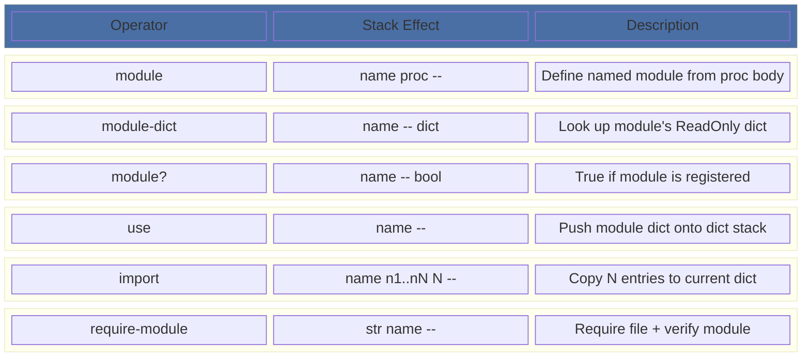
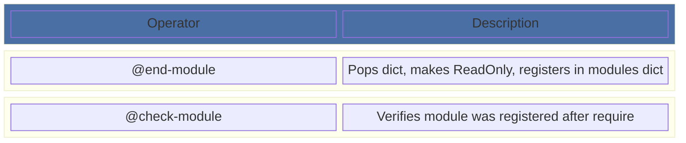
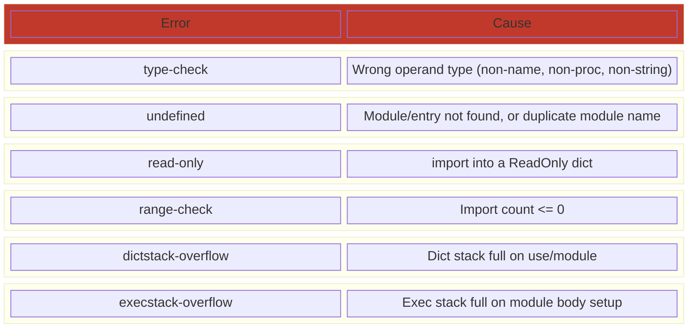
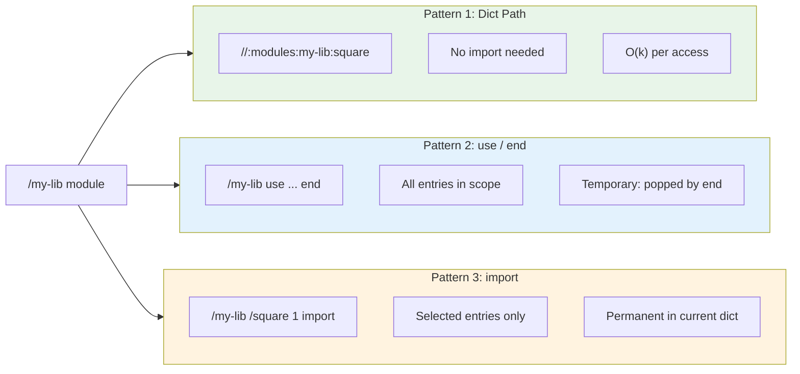
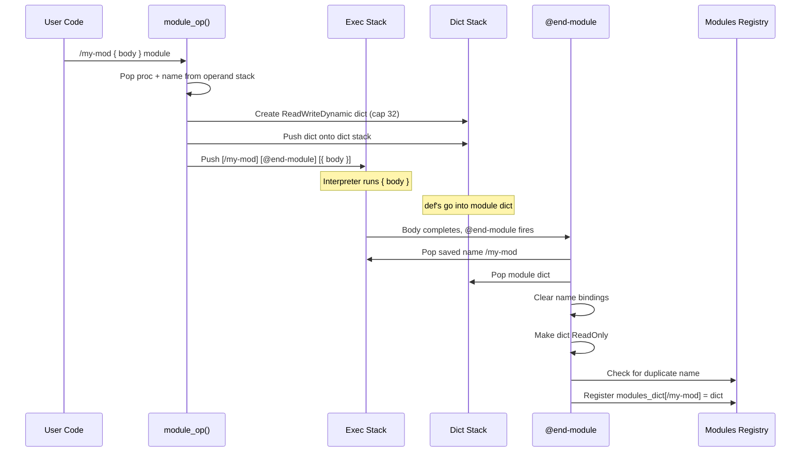
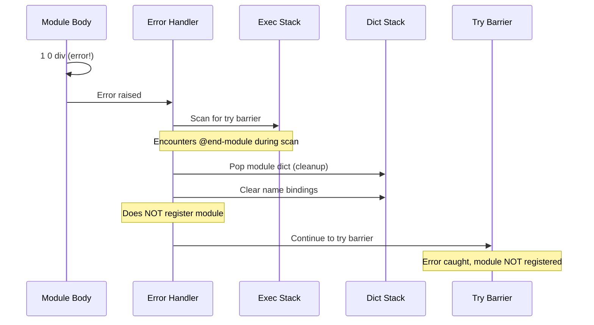
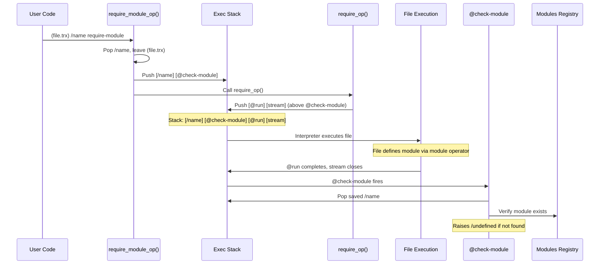
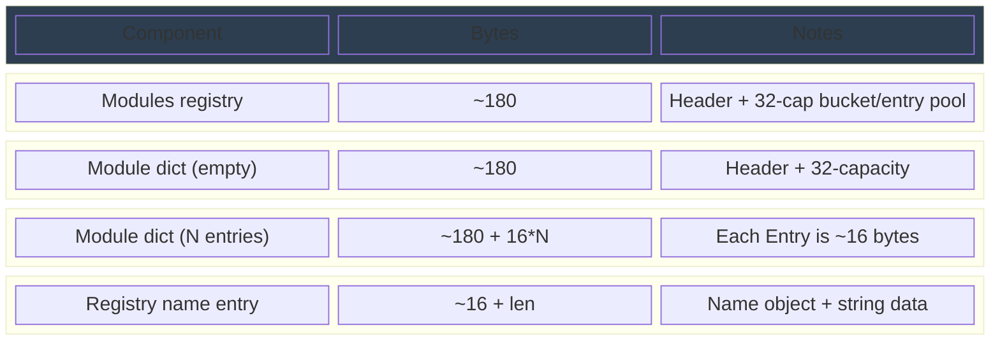
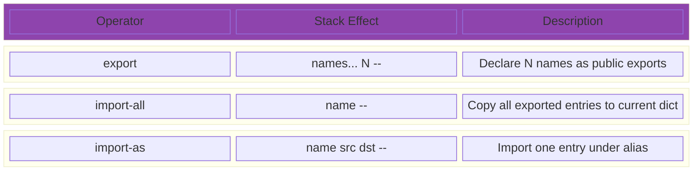

<!--
   ______    _
  /_  __/___(_)_  __
   / / / __/ /\ \/ /       Stack-Based Interpreter & VM
  / / / / / /  > · <      C++23 · Single-Header Library
 /_/ /_/ /_/  /_/\_\     Copyright 2026 Mark Guidarelli

Licensed under the Apache License, Version 2.0 (the "License");
you may not use this file except in compliance with the License.
You may obtain a copy of the License at

    https://www.apache.org/licenses/LICENSE-2.0

Unless required by applicable law or agreed to in writing, software
distributed under the License is distributed on an "AS IS" BASIS,
WITHOUT WARRANTIES OR CONDITIONS OF ANY KIND, either express or implied.
See the License for the specific language governing permissions and
limitations under the License.
-->

# Module System in Trix

## Overview

Trix provides a first-class module system that brings scoped namespaces,
controlled imports, and idempotent loading to a stack-based language. Six
user-facing operators and two internal control operators give library authors
the tools to define clean APIs, and library consumers the tools to use them
without name collisions.

### What This Enables

- **Scoped namespaces** -- a module's definitions live in their own dict,
  not in the global userdict
- **Name collision prevention** -- two libraries can define `/parse` without
  conflicting
- **Controlled imports** -- consumers choose what they pull into scope: nothing
  (dict path access), everything (`use`), or specific entries (`import`)
- **Idempotent loading** -- `require-module` loads a file once and verifies it
  defined the expected module
- **Dict path access** -- `//:modules:math-utils:square` resolves a module
  entry without any import at all
- **Library ecosystem foundation** -- the prerequisite for reusable, composable
  Trix libraries

### Design Principles

1. **No new types.** A module is a ReadOnly Dict registered in a well-known
   modules dict.  No new Object type, no new PackedType slot, no new
   verify_t bit consumed.  The existing Dict infrastructure provides all the
   machinery.

2. **All operators are built-in C++.** Every module operator is a native
   function in the interpreter, identical in status to `def`, `begin`, or
   `require`.  No bootstrap scripts.

3. **Convention-based privacy.** Underscore-prefixed names (`_helper`) are
   private by convention.  All entries are technically accessible, but the `_`
   prefix signals "internal -- do not depend on this."  This matches the
   convention used by Lua, Python, and Go, and avoids the complexity and VM
   cost of export filtering.

4. **Integrates with everything.** Modules work with `require` (load-once),
   dict paths (`//:modules:`), save/restore (transactional rollback), and
   snap-shot/thaw (VM serialization).  No special cases.

5. **Minimal operator count.** Six user-facing operators cover definition,
   lookup, scoping, import, and loading.  This is the smallest set that provides
   complete module semantics.

---

## Table of Contents

1. [Quick Reference](#1-quick-reference)
2. [Defining Modules](#2-defining-modules)
3. [Consuming Modules](#3-consuming-modules)
4. [Loading Modules from Files](#4-loading-modules-from-files)
5. [Dict Path Access](#5-dict-path-access)
6. [Privacy Convention](#6-privacy-convention)
7. [Working Examples](#7-working-examples)
8. [Implementation Details](#8-implementation-details)
9. [Interaction with Other Systems](#9-interaction-with-other-systems)
10. [Design Trade-offs](#10-design-trade-offs)
11. [Limitations and Future Work](#11-limitations-and-future-work)

---

## 1. Quick Reference

### Operators



### Internal Control Operators



### Error Conditions



---

## 2. Defining Modules

### Basic Syntax

<!-- doctest: skip (basic-syntax illustration with placeholder value) -->
```trix
/module-name {
    /entry-name value def
    /another-entry value def
} module
```

The `module` operator takes a literal name and an executable proc.  It:

1. Creates a fresh ReadWriteDynamic dict (capacity 32)
2. Pushes it onto the dict stack
3. Executes the proc body -- all `def` calls go into the new dict
4. Pops the dict from the dict stack
5. Makes the dict ReadOnly
6. Registers it in the modules dict under the given name

After `module` completes, the module's definitions are no longer on the dict
stack.  They are accessible only through the module system operators or dict
path syntax.

### Example

```trix
/math-utils {
    /square { |x| x x mul } def
    /cube { |x| x x mul x mul } def
    /pi 3 def
    /_internal-helper { ... } def         % private by convention
} module

% math-utils is now registered; its entries are NOT in userdict
```

### Duplicate Module Names

Attempting to define a module with a name that is already registered raises
`undefined`:

```trix
/my-mod { } module
{ /my-mod { } module } try   % => /undefined
```

This is intentional: silent redefinition would mask bugs in library loading.
To redefine a module, use save/restore to roll back the registration first.

---

## 3. Consuming Modules

Three consumption patterns, from least to most invasive:



### 3.1 Dict Path Access (No Import)

```trix
//:modules:math-utils:square              % pushes the proc
5 //:modules:math-utils:square exec       % => 25
//:modules:math-utils:pi                  % => 3
```

**When to use:** One-off access, or when you want to be explicit about the
source of every name.

**Cost:** O(k) dict path resolution per access (not cached).

### 3.2 Scoped Import with `use` / `end`

<!-- doctest: skip (continues the math-utils module example above) -->
```trix
/math-utils use
    5 square        % => 25
    3 cube          % => 27
    pi              % => 3
end
% square, cube, pi are no longer in scope
```

**When to use:** A block of code that needs many entries from one module.

**How it works:** `use` pushes the module's ReadOnly dict onto the dict
stack, exactly like `begin`.  Name lookup finds module entries via the normal
dict stack walk.  `end` pops the dict.  The module dict is ReadOnly, so `def`
inside a `use` block goes into the dict below it (usually userdict), not into
the module.

**Cost:** O(1) `use` (push + binding cache pre-warm).  O(1) `end` (pop +
cache invalidation).

### 3.3 Selective Import with `import`

<!-- doctest: skip (continues the math-utils module example above) -->
```trix
/math-utils /square /cube 2 import

5 square        % => 25, now in current dict permanently
3 cube          % => 27
```

**When to use:** You want specific entries available without the `use`/`end`
block, and you want to be explicit about which names you are importing.

**How it works:** `import` looks up each named entry in the module dict,
clones the value (to preserve ExtValue ownership), and `put`s it into the
current dict with binding cache update.

**Stack layout:** `module-name entry-name1 ... entry-nameN count`

**Cost:** O(N) for N imported entries.  Each clone is O(1) for scalars, O(1)
for ExtValue types (allocates a new ExtValue slot).

---

## 4. Loading Modules from Files

### `require` + Manual Check

```trix
(math-utils.trx) require % idempotent file load
/math-utils module?      % => true (if the file defined it)
```

### `require-module` (Recommended)

```trix
(math-utils.trx) /math-utils require-module
```

This is the preferred pattern.  `require-module` combines:

1. **`require`** -- idempotent file loading with circular dependency prevention
2. **Module verification** -- after the file executes, checks that the named
   module was registered.  Raises `undefined` if the file did not define the
   expected module.

The verification is asynchronous: `require-module` pushes `@check-module` onto
the exec stack below the file's execution stream.  When the file finishes
executing, `@check-module` fires and validates the module exists.

### Transitive Dependencies

```trix
% math-utils.trx
/math-utils { ... } module

% physics.trx
(math-utils.trx) /math-utils require-module
/physics {
    /velocity { |d t| d t div } def
} module

% main.trx
(physics.trx) /physics require-module
% math-utils is also loaded (transitively via physics.trx)
```

`require`'s idempotent loading prevents double-execution regardless of how many
files depend on the same module.

---

## 5. Dict Path Access

Modules are accessible via the `//:modules:` dict path root:

```trix
//:modules:math-utils:square        % => the proc
//:modules:math-utils:pi            % => 3
```

This works because the modules registry is a regular Dict, and `check_systemdicts()`
in the name lookup code recognizes `:modules:` as a root path alongside
`:systemdict:`, `:userdict:`, `:errordict:`, and `:handlersdict:`.

**Nested dict access:** If a module entry is itself a dict, the path can
continue:

```trix
% if math-utils has a /constants entry that is a dict with /e:
//:modules:math-utils:constants:e   % => 2.718...
```

---

## 6. Privacy Convention

Trix modules use **convention-based privacy**, matching the approach of Lua,
Python, and Go:

- Names prefixed with `_` are private by convention
- All entries are technically accessible (via `module-dict`, dict paths, etc.)
- The `_` prefix signals "internal implementation detail -- do not depend on this"

```trix
/my-lib {
    /public-api { ... } def
    /_internal-helper { ... } def     % private by convention
} module

% Both are accessible, but _ signals "don't use this":
//:modules:my-lib:public-api          % intended
//:modules:my-lib:_internal-helper    % works, but you're on your own
```

### Why Convention Over Enforcement

1. **Zero VM cost.** Export filtering requires creating a second dict and
   abandoning the original -- doubling VM memory per module.  Convention costs
   nothing.
2. **Debugging.** When something goes wrong, you want to inspect internals.
   Enforced privacy makes debugging harder.
3. **Pragmatism.** Lua's `_` convention has served a massive ecosystem well.
   Python's `_` convention is the standard despite `__name_mangling` existing.
   Go's uppercase/lowercase convention is the primary access control.
4. **Extensibility.** If enforced privacy becomes necessary, `export` and
   `import-all` can be added as a backwards-compatible extension (Option C in
   the design plan) without changing any existing module code.

---

## 7. Working Examples

### 7.1 Math Library

```trix
% file: math-utils.trx
/math-utils {
    /square { |x| x x mul } def
    /cube { |x| x x mul x mul } def
    /abs { |x| x 0 lt { x neg } { x } if-else } def
    /clamp { |x lo hi| x lo max hi min } def
    /pi 3 def                            % integer approximation
} module
```

```trix
% file: main.trx
(math-utils.trx) /math-utils require-module

/math-utils /square /abs 2 import
-5 abs square     % => 25
```

### 7.2 String Utilities

```trix
% file: string-utils.trx
/string-utils {
    /blank? { |s| s length 0 eq } def
    /not-blank? { |s| s length 0 ne } def
    /quote { |s| ({) s (}) concat concat } def
} module
```

```trix
% file: main.trx
(string-utils.trx) /string-utils require-module

/string-utils use
    (hello) blank? not       % => true
    () blank?                % => true
end
```

### 7.3 Transitive Dependencies

```trix
% file: base.trx
/base {
    /double { 2 mul } def
    /triple { 3 mul } def
} module

% file: derived.trx
(base.trx) /base require-module
/derived {
    /six-times { /base use double triple end } def
} module

% file: app.trx
(derived.trx) /derived require-module
5 //:modules:derived:six-times exec      % => 30
```

### 7.4 Module with ExtValue Types

```trix
/constants {
    /max-int64  9223372036854775807l def
    /pi-double  3.141592653589793d def
    /tau-double  6.283185307179586d def
} module

//:modules:constants:pi-double type /double-type eq   % => true
```

### 7.5 Nested Module Definitions

```trix
/outer {
    /outer-val 1 def

    % inner is a separate module, not nested in outer's dict
    /inner {
        /inner-val 2 def
    } module
} module

//:modules:outer:outer-val    % => 1
//:modules:inner:inner-val    % => 2
```

Note: `inner` is registered as a top-level module, not as a sub-module of
`outer`.  The `module` operator always registers in the flat modules dict.
Hierarchical module namespacing can be simulated by naming convention
(`/outer.inner`).

---

## 8. Implementation Details

### 8.1 Architecture

The module system adds three components to the Trix interpreter:

1. **Modules dict** (`m_modules_dict_offset`) -- a ReadWriteDynamic Dict
   in the VM heap that maps module names to their ReadOnly dicts.  Initialized
   with capacity 32 at interpreter startup.

2. **Dict path root** -- the string `:modules:` is recognized by
   `check_systemdicts()` as a root path, providing `//:modules:name:entry`
   syntax.

3. **Control operators** -- `@end-module` and `@check-module` handle the
   asynchronous completion of module definition and require-module verification.

### 8.2 Module Definition Flow



### 8.3 Error During Module Body



The dict stack is restored to its pre-module state.  The abandoned dict remains
in the VM heap but is unreachable.  If inside a save/restore scope, the heap
allocation is reclaimed on restore.

### 8.4 require-module Flow



### 8.5 VM Memory Budget



A module with 10 entries costs approximately 340 bytes of VM heap.  The modules
registry itself costs ~180 bytes (allocated once at startup).

### 8.6 Snap-Shot/Thaw

The `m_modules_dict_offset` field is stored in the `SnapShotHeader` alongside
`m_require_dict_offset`.  On snap-shot, the modules registry dict (and all
module dicts it references) are serialized as part of the VM blob.  On thaw,
the offset is restored and all modules are immediately available.

The `m_modules_dict_offset` is one `vm_offset_t` (4 bytes) in the header;
`sizeof(SnapShotHeader)` is currently 592 bytes, guarded by a `static_assert`.

### 8.7 SystemName Entries

The module system adds 8 SystemName entries:

- **Control operators (2):** `atEndModule`, `atCheckModule`
- **Standard operators (6):** `Module`, `ModuleDict`, `ModulePred`, `Use`,
  `Import`, `RequireModule`

---

## 9. Interaction with Other Systems

### 9.1 Save/Restore

The modules dict participates in save/restore like any other Dict:

```trix
save /sv exch def

/temp-mod { /x 42 def } module
/temp-mod module?             % => true

sv restore
/temp-mod module?             % => false (rolled back)
```

Entries added to the modules dict after a save point are removed on restore.
The module dicts themselves are also rolled back (heap allocation reclaimed).

### 9.2 Error Handling

Module operators raise standard Trix errors:

```trix
{ /bad 42 module } try                       % /type-check (42 is not executable)
{ /nonexistent module-dict } try             % /undefined
{ /nonexistent use } try                     % /undefined
{ (no-such-file.trx) /x require-module } try % /filename-not-found
```

If an error occurs during the module body, the dict stack is cleaned up:

```trix
{ /err-mod { 1 0 div } module } try % /div-by-zero
/err-mod module?                    % false (body failed, not registered)
```

### 9.3 begin-locals

`{ |x| ... }` local variable bindings work inside module bodies:

```trix
/my-mod {
    /transform { |x y| x y add 2 mul } def
} module
```

### 9.4 Dict Stack

`module` and `use` both push dicts onto the dict stack.  The default dict
stack depth is 64.  Each `module` definition uses one slot during body
execution; each `use` uses one slot until `end`.  Deeply nested module
definitions or many concurrent `use` blocks can exhaust the dict stack.

### 9.5 Name Binding Cache

`module` clears the name binding cache for the module dict when the body
completes (same cleanup as `end`).  `use` pre-warms the cache on entry and
clears it on `end`.  This ensures O(1) amortized name lookup inside `use`
blocks.

---

## 10. Design Trade-offs

### Modules as Dicts (Not a New Type)

**Trade-off:** Modules are structurally identical to regular dicts.  There is no
`is-module` type predicate -- only `module?` which checks the registry.

**Why:** Object types are scarce.  `TypeCount` is 31, and the type-acceptance
region of `verify_t` (a `uint64_t`) is its low 32 bits -- so only one type slot
remains before the verify system would need restructuring.  Adding a Module type
would consume that last slot.  Using dicts costs nothing and inherits all dict
infrastructure: save/restore journaling, name binding cache, dict path access,
packed encoding.

**Consequence:** A user can pass any dict where a module dict is expected, or
vice versa.  This is by design -- it means `begin` works with module dicts, and
`use` could work with any dict (though it currently validates via the registry).

### Convention-Based Privacy (Not Enforced)

**Trade-off:** Private entries are accessible if you know their name.

**Why:** Enforced privacy via export filtering (the Option C design) would
double VM cost per module (create a filtered copy, abandon the original) and
add 3 more operators.  For a language without an ecosystem yet, this is
premature optimization.

**Upgrade path:** `export`, `import-all`, and `import-as` can be added later
as backwards-compatible extensions.  No existing module code would need to
change.

### Flat Module Registry (Not Hierarchical)

**Trade-off:** All modules share a single flat namespace.  `/outer.inner` is
a naming convention, not a language feature.

**Why:** A hierarchical module registry would require recursive dict-of-dicts
management, module path resolution rules, and significantly more complexity.
The flat registry maps directly to how `require` works (one file = one module).

**Workaround:** Use dotted naming conventions (`/my-lib.utils`, `/my-lib.core`)
for logical grouping.  Dict path access still works:
`//:modules:my-lib.utils:entry`.

### Asynchronous require-module Verification

**Trade-off:** `require-module` does not verify the module synchronously.  The
check happens after the file finishes executing via the `@check-module` control
operator.

**Why:** `require_op` is asynchronous -- it pushes the file stream onto the
exec stack and returns.  The file executes when the interpreter processes the
stream.  Synchronous verification would require either blocking (incompatible
with the interpreter model) or a fundamentally different execution strategy.

**Consequence:** If the file defines the module name but not via `module` (e.g.,
by manually registering in the modules dict), `require-module` still succeeds.
This is benign -- what matters is that the module exists after the file runs.

---

## 11. Limitations and Future Work

### Current Limitations

1. **Flat registry.** No hierarchical module namespaces.  All modules share
   one namespace.
2. **No enforced privacy.** The `_` convention is just a convention.
3. **No `import-all`.** To import everything from a module, use `use`/`end`
   (scoped) or manually list names with `import`.
4. **No aliasing.** Cannot import a name under a different local name.
5. **Fixed initial capacity.** Module dicts start at capacity 32.  Modules
   with more than ~24 entries (75% load factor) trigger dynamic expansion.
6. **No module unloading.** Once registered, a module persists until
   save/restore rollback or interpreter shutdown.
7. **No module metadata.** No version, author, or dependency declaration.

### Planned Extensions (Option C)

These operators can be added as backwards-compatible extensions:



With `export`, `@end-module` would create a filtered ReadOnly dict containing
only exported entries.  The unfiltered dict would be abandoned in the VM heap
(reclaimed by save/restore if applicable).

### Longer-Term Ideas

- **Module metadata:** `module-version`, `module-author` stored as special
  keys in the module dict
- **Dependency declaration:** `module-requires` listing required modules with
  version constraints
- **Package manager:** External tool that resolves dependencies and downloads
  module files
- **Module search path:** Configurable list of directories to search when
  `require-module` cannot find a file in the current directory

