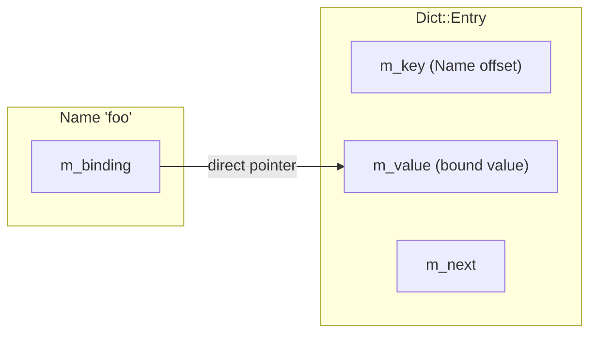
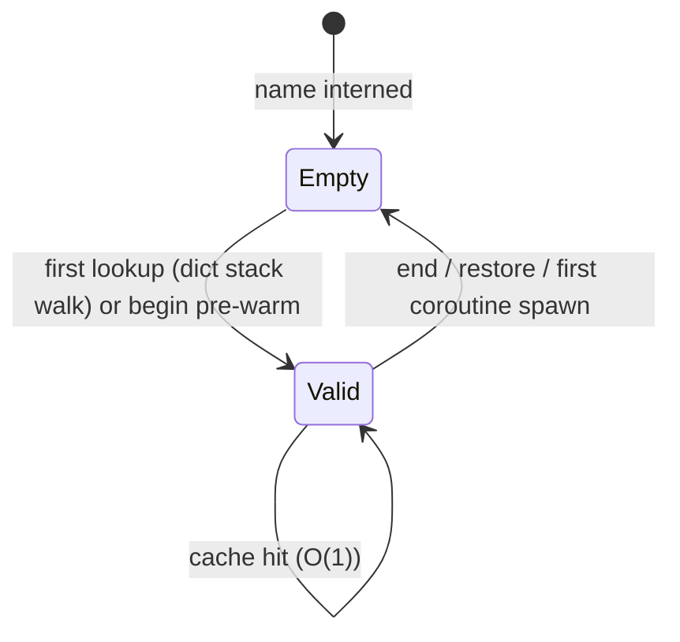

<!--
   ______    _
  /_  __/___(_)_  __
   / / / __/ /\ \/ /       Stack-Based Interpreter & VM
  / / / / / /  > · <      C++23 · Single-Header Library
 /_/ /_/ /_/  /_/\_\     Copyright 2026 Mark Guidarelli

Licensed under the Apache License, Version 2.0 (the "License");
you may not use this file except in compliance with the License.
You may obtain a copy of the License at

    https://www.apache.org/licenses/LICENSE-2.0

Unless required by applicable law or agreed to in writing, software
distributed under the License is distributed on an "AS IS" BASIS,
WITHOUT WARRANTIES OR CONDITIONS OF ANY KIND, either express or implied.
See the License for the specific language governing permissions and
limitations under the License.
-->

# Name Lookup and Binding Cache in Trix

Every operator dispatch in Trix begins with a name lookup. The interpreter
pops a name from the exec stack, finds its value, and executes it. This
happens millions of times per second. Trix makes it fast through three
interlocking mechanisms: singleton name interning, a per-name binding cache,
and offset-based identity comparison.

The result is O(1) amortized name lookup. The first access to a name walks the
dict stack; every subsequent access in the same scope is a single pointer
dereference. No hash table probe, no string comparison, no dict walk --
just follow the cached pointer.

---

## Table of Contents

1. [Overview](#1-overview)
2. [Quick Reference](#2-quick-reference)
3. [Name Interning](#3-name-interning)
4. [The Binding Cache](#4-the-binding-cache)
5. [Cache Lifecycle](#5-cache-lifecycle)
6. [The Lookup Chain](#6-the-lookup-chain)
7. [Dictionary Paths](#7-dictionary-paths)
8. [Hash Table Configuration](#8-hash-table-configuration)
9. [Performance Analysis](#9-performance-analysis)
10. [Design Decisions](#10-design-decisions)

---

## 1. Overview

The Trix name system has three properties that together produce O(1) amortized
lookup:

| Property | Mechanism | Effect |
| --- | --- | --- |
| **Singleton interning** | wyhash table; same string always yields same VM offset | Name-to-name comparison is offset equality (4-byte integer compare) |
| **Binding cache** | Each Name stores a direct pointer to its most recent dict value | Cache hit (single-coroutine fast path): one pointer dereference |
| **Pre-warming** | `begin` pre-populates the cache for all names in the pushed dict | Names defined in the current scope hit the cache from the first access |

**The hot path** (the single-coroutine fast path, executed on every name lookup):

```
1. Gate: m_live_coroutine_count == 0 -- use the global one-pointer cache?
2. Read Name.m_binding (4 bytes)     -- non-null means a cache hit
3. Dereference m_binding             -- return the cached value
```

A process-wide gate read plus, on the per-name path, one offset read and one
dereference. No hashing, no string comparison, no dict walking, **no per-name
save-level check**. This is the path taken for every `add`, `sub`, `def`,
`if-else`, and every other operator called by name. The cache holds no save
level; the events that could make `m_binding` stale -- `end`, `restore`, and
the first coroutine spawn -- null it directly (see
[§4](#4-the-binding-cache) and [§5](#5-cache-lifecycle)).

---

## 2. Quick Reference

### Lookup Cost Summary

| Path                        | Cost              | When                                          |
| --------------------------- | ----------------- | --------------------------------------------- |
| Binding cache hit           | O(1) -- one deref | Most lookups (after first access or begin)    |
| Cache miss, dict stack walk | O(k * m)          | First access to name, or after invalidation   |
| Dictionary path             | O(p * m)          | `//:systemdict:numbers:pi` hierarchical paths |

Where k = dict stack depth (typically 3-5), m = average hash chain
length (~1.0), p = path segment count.

### Introspection Keys

| Key                           | Returns | Description                               |
| ----------------------------- | ------- | ----------------------------------------- |
| `//:status:name-count`        | Integer | Total names in the interning table        |
| `//:status:name-vm-used`      | Integer | VM bytes consumed by all Name objects     |
| `//:status:name-max-chain`    | Integer | Longest hash chain (worst-case probe)     |
| `//:status:name-avg-chain`    | Real    | Average comparisons per successful lookup |
| `//:status:name-bucket-count` | Integer | Hash table bucket count                   |

### Cache Lifecycle Events

| Event | Action | Cost |
| --- | --- | --- |
| First lookup | Cache miss; walk dict stack; populate cache on hit | O(k * m) once |
| `begin` (push dict) | Pre-warm cache for all names in dict | O(n) per dict |
| `end` (pop dict) | Invalidate cache for all names in dict | O(n) per dict |
| `save` | No action (cache points to live entry slots, unaffected by the level bump) | O(0) |
| `restore` | Single-coroutine: flush every cached binding. Multi-coroutine: prune entries above the barrier | O(total names) |
| `def` / `store` | No explicit action; next lookup populates cache | O(0) for def; O(1) for next lookup |

---

## 3. Name Interning

### Singleton Guarantee

Every string that appears as a name in Trix is stored exactly once in the VM.
The first time the scanner encounters `/foo`, it allocates a Name object in
the VM heap and inserts it into the name hash table. Every subsequent
occurrence of `foo` -- whether as `/foo`, `\foo`, `//foo`, or in any
dict key -- resolves to the same VM offset.

```
/foo                            % allocates Name "foo" (first time)
/foo                            % returns same offset (already interned)
<< /foo 1 >>                    % dict key uses same Name offset
{ foo } def                     % executable name uses same Name offset
```

This means two Name Objects with the same string content are guaranteed to
have the same `m_name` offset. Comparing them is a 4-byte integer comparison,
not a string comparison.

### The Name Object

Each Name is a variable-length structure in the VM heap:

```
+--------+--------+--------+--------+-----------+
| m_next | m_bind | m_hash | m_len  | m_data... |
| 4 bytes| 4 bytes| 4 bytes| 2 bytes| N bytes   |
+--------+--------+--------+--------+-----------+
  chain    binding  cached    string   string
  link     cache    hash      length   content
```

| Field       | Size    | Purpose                                                     |
| ----------- | ------- | ----------------------------------------------------------- |
| `m_next`    | 4 bytes | Next Name in hash bucket chain (nulloffset = end)           |
| `m_binding` | 4 bytes | Cached pointer to Dict::Entry value (nulloffset = no cache) |
| `m_hash`    | 4 bytes | wyhash of the string (computed once at creation)            |
| `m_length`  | 2 bytes | String length                                               |
| `m_data[]`  | N bytes | String content (inline, no separate allocation)             |

The four fixed fields total 14 bytes; with the inline `m_data` flexible array
member, `static_assert(sizeof(Name) == 16)` holds for a one-character name (the
remaining bytes are alignment padding). Note there is **no per-name save-level
field**: the binding cache's validity is positional (`m_binding` is either a
live pointer or `nulloffset`), not level-stamped -- see [§4](#4-the-binding-cache).

### wyhash Hashing

Names are hashed using wyhash (Wang Yi, public domain), a fast
non-cryptographic hash with SMHasher-clean avalanche:

```
% Read 8 bytes at a time and fold through a 64x64 -> 128 multiply:
seed ^= mul_fold(read8(p) ^ S1, read8(p + 8) ^ seed)
% Final stir and truncation to 32 bits for the hash_t field.
```

The hash is computed once at Name creation and stored in `m_hash`. It is
never recomputed. All subsequent lookups use the cached hash for bucket
indexing. See `hash.inl` for the implementation.

### Deduplication Process

When a new name string is encountered:

1. Compute `hash = wyhash32_sv(string)`
2. Index into bucket: `bucket = fastmod_u32(hash, m_name_bucket_magic, m_name_bucket_count)`
   (Lemire fastmod: ~3-4 cycles vs ~20 for division; magic precomputed on init/thaw)
3. Walk the chain from `m_name_buckets[bucket]`:
   - Compare `hash == entry.m_hash` first (fast rejection)
   - If hashes match, compare `memcmp(string, entry.m_data, length)`
   - If both match: return existing entry (singleton hit)
4. If not found: allocate new Name, link to chain, return new offset

The hash-first comparison rejects most non-matching names without a string
comparison. Chains with good hash distribution are typically length 1,
making the walk trivial.

### Identity Comparison

Because names are interned singletons, comparing two Name Objects is a
single integer comparison:

```
% In dict lookup: Name-to-Name comparison
key.name_offset() == entry.m_key.name_offset()
```

No hashing, no string comparison. Two names are equal if and only if they
have the same VM offset. This is the comparison used in the inner loop of
dict lookup.

### String/Name Hash Equivalence

Names and Strings hash identically -- both use wyhash over the same byte
content. This means a dict keyed by Name can be looked up with a
String (and vice versa) with no rehashing or conversion:

```
% Dictionary with Name keys
<< /foo 42 /bar 99 >> begin

% Lookup with a runtime-constructed String key
(foo) load                      % => 42 (String matches Name key)

% Lookup with a Name key (normal)
/foo load                       % => 42
end
```

`Dict::name_lookup_in_stack()` handles both cases in its inner loop: when the entry
key is a Name, it compares by offset equality (fast path); when the entry
key is a String, it falls back to `memcmp` against the Name's string data.
The hash bucket is the same either way because the hash values are identical.

This equivalence enables patterns where keys are constructed dynamically from
string data (e.g., parsed from input, concatenated at runtime) and used to
access dicts that were defined with literal name keys -- a common
pattern in configuration parsing, protocol handling, and metaprogramming.

---

## 4. The Binding Cache

### The One-Pointer Cache

Each Name object carries a direct pointer to its most recently resolved
dict value. This pointer (`m_binding`) points into a `Dict::Entry`
value slot -- not to a copy, but to the actual storage location in the
dict.



When the cache is valid (single-coroutine mode), looking up `foo` is:
1. Read `m_binding` (4-byte offset)
2. If non-null, dereference the offset to get the value pointer

One offset read and one dereference. No hash computation, no bucket indexing,
no chain walking, no dict stack traversal, and no per-name save-level compare.

### Cache Validity



In single-coroutine mode the cache is valid whenever it is **populated**:
`m_binding != nulloffset`. There is no save-level stamp to check. The pointer
targets a `Dict::Entry` value slot that never relocates, so it stays correct
for as long as that entry sits on an active dict -- and the three events that
could change that answer null the binding eagerly:

- **`end`** clears the binding for every name in the popped dict
  (`clear_name_bindings`).
- **`restore`** flushes **every** cached binding (`flush_all_name_bindings`,
  O(total interned names)) -- conservative but simple, since rolled-back
  entries' value slots may have changed.
- The **first coroutine spawn** (the `0 -> 1` live-coroutine transition)
  flushes every `m_binding` and hands lookup off to the per-coroutine binding
  tables described below.

`save` does **not** touch the cache: it only bumps the save level and pushes a
barrier, leaving every `m_binding` pointing at its still-live value slot.

### Why Direct Pointers Are Safe

The binding cache points directly into a Dict::Entry. This is safe because:

- **Dict entries never relocate.** Trix dicts do not compact or rehash
  in place. New entries are appended to the entry pool; existing entries stay
  at their original VM offset for their entire lifetime.
- **The pointer is to the value slot, not a copy.** If `def` or `store`
  updates the value, the cached pointer still points to the right place --
  it now sees the updated value.
- **Save/restore journals the entry.** If a dict entry is modified after a
  save, the old value is journaled. On restore, the entry is restored to
  its pre-save value. The cached pointer still points to the same slot, which
  now holds the restored value.

### No Rehashing: The Binding Cache Constraint

The "entries never relocate" guarantee is the reason Trix dicts never
rehash or grow their bucket array. In most hash table implementations, when
the load factor exceeds a threshold, the table doubles its bucket count and
redistributes all entries. In Trix, this is impossible for two reasons:

1. **Binding cache pointers.** Rehashing would change bucket assignments and
   potentially relocate entries, invalidating every binding cache pointer
   that points into the old entry layout.

2. **Save/restore journal complexity.** The save/restore system journals
   individual dict entries and bucket chain heads so they can be restored on
   rollback. A rehash would replace the entire bucket array and redistribute
   all entries -- journaling this would require saving the complete pre-rehash
   state (old bucket array, old chain links, old entry positions), making the
   journal cost proportional to the entire dict size rather than the
   single entry being modified. Rolling back a rehash across multiple
   interleaved save levels would be prohibitively complex.

Instead, when a dynamic dict exceeds its initial capacity, Trix appends
a new entry pool block and chains new entries into the existing bucket array.
The bucket count remains fixed at the value determined when the dict
was created. This preserves all existing entry pointers and keeps the journal
protocol simple (one entry at a time) at the cost of longer hash chains as
the dict grows.

**Practical consequence:** Dict hash chain efficiency degrades as a
dynamic dict grows beyond its initial capacity, because more entries
share the same fixed number of buckets. The bucket count is sized for the
initial capacity, not the eventual size.

**Best practice:** Allocate dicts with the expected final capacity
when possible, rather than relying on dynamic growth:

```trix
% Poor: start small, grow dynamically (chains get longer).
% Note: a plain `N dict` is FIXED capacity and raises /dict-full on overflow;
% only `dynamic-dict` grows. So this growth discussion is about dynamic dicts.
2 dynamic-dict begin
/a 1 def /b 2 def /c 3 def /d 4 def /e 5 def
% 5 entries in a dict sized for 2 -> long chains
end

% Good: allocate for the expected size up front (chains stay short)
8 dynamic-dict begin
/a 1 def /b 2 def /c 3 def /d 4 def /e 5 def
% 5 entries in a dict sized for 8 -> optimal chains
end
```

A fixed-capacity `N dict` does not grow at all -- a 6th `def` into a `5 dict`
raises `/dict-full`. Use `dynamic-dict` when the final size is unknown.

For dict literals (`<< /a 1 /b 2 >>`), Trix automatically sizes the
bucket array to match the number of entries, so literals always have optimal
chain lengths.

### Per-Coroutine Binding Tables

The one-pointer `Name::m_binding` cache shown above is the **single-coroutine**
fast path.  Because Names are interned globally, a cache that lived on the Name
object would race under multiple coroutines: coroutine A `def`s `/x = 1`,
coroutine B `def`s `/x = 2`, A wakes after a yield and reads `/x` and sees `2`
-- silent, far-from-source, uncatchable by `try`.

The binding cache is therefore **per-coroutine**.  Each `CoroutineContext`
owns a small chained hash table keyed by Name offset (a mini-version of the
global Name table: fixed bucket array, one chain per bucket, entries on the VM
heap), lazy-allocated on first `def` and returned to pooled free lists on
coroutine death.  The lookup dispatcher (`cached_binding` in `src/name.inl`)
picks the mechanism by live-coroutine count:

- **Single-coroutine mode** (`m_live_coroutine_count == 0` -- ordinary
  scripts, including those that never spawn) reads `Name::m_binding` directly:
  one deref, exactly the cost described above.
- **Multi-coroutine mode** consults the running coroutine's `BindingTable`
  instead, so two coroutines never share a binding entry and the race cannot
  occur.

The design header is in `src/binding_table.inl`; the dispatch is
`src/name.inl`.

---

## 5. Cache Lifecycle

### Population: First Lookup

The first time a name is looked up (cache miss), `Dict::name_lookup_in_stack()` walks
the dict stack, finds the value, and populates the cache:

```
% First lookup of "add" in a fresh VM:
%   1. name_search: m_binding == nulloffset -> cache miss
%   2. Dict::name_lookup_in_stack: walk dict stack top to bottom
%   3. Found in systemdict: populate cache
%      name->m_binding = offset_to(&entry.m_value)
%   4. Return cached pointer

% Second lookup of "add":
%   1. name_search: m_binding != nulloffset -> cache hit
%   2. Return cached pointer directly
```

### Pre-Warming: begin

When a dict is pushed onto the dict stack via `begin`, Trix
pre-warms the binding cache for every Name-keyed entry in that dict:

```
% Script pushes a dictionary
<< /x 42 /y 99 >> begin

% Behind the scenes: set_name_bindings() runs
%   For each entry in the dict:
%     entry.m_key.set_name_binding(trx, &entry.m_value)
%
% Now /x and /y hit the cache on their FIRST access
x                               % cache hit: O(1)
y                               % cache hit: O(1)
```

This means names defined in a local scope are cached before any script code
runs. There is no warm-up penalty.

### Invalidation: end

When a dict is popped via `end`, all its names have their binding cache
cleared:

```
end

% Behind the scenes: clear_name_bindings() runs
%   For each entry in the popped dict:
%     entry.m_key.clear_name_binding(trx)
%
% Names that were only in the popped dict now have no cache
% Names that exist in lower dicts will be re-cached on next access
```

This preserves correctness: without invalidation, a cached binding to a
popped dict would return a value from a scope that is no longer active.

### Invalidation: restore

When `restore` rolls back to a save point, every cached binding is flushed
(single-coroutine mode calls `flush_all_name_bindings`; multi-coroutine mode
prunes each coroutine's table of entries above the barrier):

```
save /sv exch def
/x 42 def  % cache populated while the save is active
sv restore % flush all bindings; x's cache is now clear
% next lookup of any name re-walks the dict stack and re-populates
```

This is a blanket flush, not a per-name level test -- the cache carries no save
level, so `restore` clears it wholesale (O(total interned names)) and lets the
next lookup of each name re-populate lazily. Names allocated after the save
point are also removed from the hash table entirely (their VM storage is
reclaimed by the heap rollback).

### Save Cost

A subtle efficiency: `save` does not invalidate any caches. Each `m_binding`
points at a `Dict::Entry` value slot that the level bump neither moves nor
modifies, so every cached pointer stays valid across `save` with no work. This
keeps `save` O(1) -- no name-table scan.

The split between cheap eager invalidation on `end` and a blanket flush on
`restore` gives:
- `save` is O(1) (no name scanning)
- `begin`/`end` are O(n) where n is the size of the pushed/popped dict
- `restore` is O(total_names) but only runs on transactional rollback

---

## 6. The Lookup Chain

### name_search: The Three-Stage Pipeline

Every name lookup in the interpreter goes through `name_search()`:

```
name_search(key):
    1. BINDING CACHE: cached_binding(trx, name, name_offset)
       - If non-null: return immediately (O(1))

    2. DICTIONARY PATH: dict_path_search(trx, key.sv)
       - If key starts with ":" prefix: walk path hierarchy
       - Returns value or null

    3. DICTIONARY STACK: Dict::name_lookup_in_stack(trx, key)
       - Walk dict stack top to bottom
       - For each dict: hash lookup + chain walk
       - On hit: populate binding cache, return value
       - On miss: return null (triggers /undefined error)
```

### Stage 1: Cache Hit (Hot Path)

```cpp
auto binding = Name::cached_binding(trx, name, name_offset);
if (binding != nulloffset) {
    return trx->offset_to_ptr<Object>(binding);  // O(1): one deref
}
```

This is the path taken for the vast majority of lookups. Once a name has been
accessed once in the current scope, every subsequent access takes this path.

### Stage 2: Dictionary Path (Special Cases)

Dictionary paths like `//:systemdict:numbers:real-type:pi` bypass the
dict stack and walk a hierarchy of nested dicts:

```
//:systemdict:numbers:real-type:pi

% Parsed as:
%   Root: systemdict
%   Path: numbers -> real-type -> pi
%   Walk: systemdict["numbers"]["real-type"]["pi"]
```

This stage is only entered when the name string starts with `:`, which
indicates a path. Normal names skip this stage entirely.

### Stage 3: Dict Stack Walk (Cache Miss)

On a cache miss for a normal name, `Dict::name_lookup_in_stack()` searches the
dict stack from top to bottom:

```
For each dict on dict stack (top to bottom):
    bucket = name.hash % dict.bucket_count
    Walk chain from dict.buckets[bucket]:
        If entry.key.name_offset == key.name_offset:   // identity compare
            Populate cache: key.set_name_binding(&entry.value)
            Return &entry.value
    // Not in this dict, try next
Return null   // not found -> /undefined error
```

The inner comparison is offset equality (4 bytes), not string comparison.
The outer loop iterates over 3-5 dicts in typical usage (systemdict +
protocoldict + userdict + 0-2 frame dicts). Each dict lookup is O(m) where m is the
average chain length (~1.0 for well-sized tables).

**On hit, the cache is populated.** Subsequent lookups for the same name
take the O(1) cache path.

---

## 7. Dictionary Paths

### Syntax

Dictionary paths provide direct access to values in nested dicts
without relying on the dict stack:

```
//:systemdict:numbers:real-type:pi      % => 3.1415927
//:systemdict:numbers:double-type:e     % => 2.718281828459045d
//:errordict:error-name                 % => /no-error (or current error)
//:status:vm-free                       % => remaining VM bytes
```

### Path Resolution

1. **Root dispatch:** The first segment identifies the root dict:
   - `:systemdict:` -> systemdict
   - `:userdict:` -> userdict
   - `:errordict:` -> errordict
   - `:handlersdict:` -> handlersdict
   - `:status:` -> VM introspection (computed on demand)
   - `:modules:` -> the module registry
   - Any other first segment that names a dict in systemdict acts as a
     root too (e.g. `:records:`, `:pipeline:`, `:actors:`).

2. **Segment walk:** Each subsequent segment is looked up in the current
   dict, producing a nested dict for intermediate segments and
   a value for the final segment.

3. **No caching:** Dictionary paths bypass the binding cache. They are
   intended for configuration access and introspection, not hot-path lookup.

### When to Use Paths vs Names

| Use Case | Approach | Reason |
| --- | --- | --- |
| Operator calls | Names (`add`, `def`, `if-else`) | Cached, O(1) amortized |
| User variables | Names (`/x`, `/counter`) | Cached, O(1) amortized |
| Constants | Paths (`//:systemdict:numbers:real-type:pi`) | One-time access, no dict stack dependency |
| VM introspection | Paths (`//:status:vm-free`) | Computed on demand, not cached |
| Nested config | Paths (`//:systemdict:numbers:environment:fe-to-nearest`) | Hierarchical access |

### Runtime Path Construction

Paths can be constructed and resolved at runtime using `load` and `to-name`:

```
% Dynamic path resolution
(:status:vm-free) to-name load  % equivalent to //:status:vm-free prefix
% (the leading colon triggers the path machinery; a bare (status)
% would just resolve the `status` operator on the dict stack)
```

---

## 8. Hash Table Configuration

### Bucket Count

The name hash table size is configurable at construction time via the Config
struct:

```cpp
config.m_name_bucket_count = 2053;  // larger table for name-heavy scripts
```

The default is 2053 buckets (a prime number for good hash distribution).
Available prime sizes: 131, 257, 521, 1031, 2053, 4099, 8209, 16411,
32771, 65537 -- smallest prime >= 2^n + 1 for n in 7..16.

### Monitoring Chain Performance

The `//:status:name-*` introspection keys let scripts monitor hash table
health at runtime:

```
//:status:name-count            % => 450 (total interned names)
//:status:name-bucket-count     % => 2053 (hash table buckets)
//:status:name-max-chain        % => 3 (longest chain)
//:status:name-avg-chain        % => 1.12 (average comparisons per lookup)
//:status:name-vm-used          % => 14208 (bytes consumed by Name objects)
```

**Interpreting the metrics:**

| Metric | Healthy | Action Needed |
| --- | --- | --- |
| `name-avg-chain` < 1.5 | Good distribution | None |
| `name-avg-chain` 1.5 - 2.5 | Acceptable | Consider larger bucket count |
| `name-avg-chain` > 2.5 | Poor distribution | Increase `m_name_bucket_count` |
| `name-max-chain` > 10 | Possible degenerate hash | Increase bucket count or investigate name patterns |
| `name-count / bucket-count` > 2.0 | High load factor | Increase bucket count |

### Average Chain Computation

The `name-avg-chain` metric uses the Complementary Sum Technique to compute
the expected number of comparisons for a successful lookup:

```
For each chain of length L:
    A successful lookup requires 1..L comparisons (uniform probability)
    Expected comparisons = (L + 1) / 2

Total expected comparisons = Sum over all chains of L(L+1)/2
Average = total / name_count
```

This gives the true average-case lookup cost, not just the chain length
distribution.

---

## 9. Performance Analysis

### Amortized O(1) Argument

The binding cache transforms the lookup cost profile:

| Operation                 | Frequency               | Cost     | Amortized Contribution               |
| ------------------------- | ----------------------- | -------- | ------------------------------------ |
| Cache hit                 | ~95%+ of lookups        | O(1)     | O(1)                                 |
| Cache miss (first access) | Once per name per scope | O(k * m) | O(k * m / N) where N = total lookups |
| `begin` pre-warming       | Once per scope entry    | O(n)     | O(n / lookups_in_scope)              |
| `end` invalidation        | Once per scope exit     | O(n)     | O(n / lookups_in_scope)              |

For a typical program with 200 defined names, 3-deep dict stack, and
millions of operator calls, the cache hit rate approaches 100%. The amortized
cost per lookup converges to O(1).

### Concrete Numbers

For a program defining 200 names with 2053 hash buckets:

| Metric                    | Value                                                |
| ------------------------- | ---------------------------------------------------- |
| Load factor               | 200 / 2053 = 0.10                                    |
| Expected chain length     | ~1.05                                                |
| Cache hit (after warm-up) | 1 offset read + 1 deref (single-coroutine)           |
| Cache miss (dict walk)    | ~3 dict probes * ~1.1 chain steps = ~3.3 comparisons |
| Each comparison           | 4-byte offset equality (not string compare)          |

### Why It's Fast for Embedded

On a microcontroller with limited cache:
- Name lookup touches 2 cache lines on hit (the Name, then the Dict::Entry value slot)
- No hash computation on cache hit (hash is only used on miss)
- No string comparison (offset equality is 4 bytes)
- No heap allocation (all structures are in the contiguous VM heap)

---

## 10. Design Decisions

### Why wyhash?

wyhash (Wang Yi, public domain) reads 8 bytes per 64x64 -> 128
multiply-and-fold, giving SMHasher-clean distribution and 4-5x the
throughput of byte-at-a-time hashes on typical name lengths (3-20 bytes).
Alternatives considered:

| Hash        | Speed                   | Quality                    | Complexity          |
| ----------- | ----------------------- | -------------------------- | ------------------- |
| FNV-1a      | Fair (byte-at-a-time)   | Fair (fails SMHasher)      | 3 lines             |
| wyhash      | Very fast (8B/multiply) | Excellent (SMHasher-clean) | ~40 lines           |
| MurmurHash3 | Fast (word-at-a-time)   | Good                       | ~30 lines           |
| CityHash    | Very fast               | Excellent                  | Large code size     |
| CRC32       | Fast (HW-accelerated)   | Good                       | Requires HW support |

wyhash wins on the speed/quality/code-size curve for short-key workloads.
With 2053 buckets and 200-500 names the expected chain length is ~1.1
regardless of algorithm, so quality matters less than raw throughput on
the scanner hot path.

### Why a Level-Free Positional Cache?

An earlier design stamped each binding with the save level it was cached at and
re-checked that level on every lookup. The current single-coroutine cache drops
the per-name level entirely and relies on the binding being a direct pointer
into a never-relocating `Dict::Entry` value slot:

- **The pointer cannot silently go wrong.** Trix dicts never rehash or compact,
  so a cached value-slot pointer stays valid for the entry's whole lifetime. A
  `def`/`store` updates the slot in place; the cache transparently sees the new
  value.
- **The only events that change the answer are handled eagerly.** `end` and the
  first coroutine spawn null the affected bindings directly; `restore` flushes
  them all. None of these needs a per-name level field to be correct.
- **`save` costs nothing.** Because validity is positional, bumping the save
  level requires no cache work at all -- the pointers still target live slots.
- **One field saved per Name.** Dropping the level keeps the Name header at four
  fixed fields (`static_assert(sizeof(Name) == 16)`).

The trade-off is that `restore` flushes the whole cache instead of selectively
clearing above-barrier entries -- O(total interned names) per restore. But
`restore` is rare relative to lookups, and each name re-populates lazily on its
next access.

### Why Pre-Warm on begin?

Lazy population (cache on first access) is simpler. Pre-warming on `begin`
was chosen because:

- **Eliminates first-access penalty.** In a tight loop that uses local
  variables, every variable hits the cache from the first iteration.
  Without pre-warming, the first iteration pays the dict-walk cost.
- **O(n) cost is bounded.** The number of entries in a pushed dict
  is typically small (5-50). Pre-warming this many cache entries is
  cheaper than one wasted cache miss in a hot loop.
- **Symmetry with end.** `end` must invalidate to maintain correctness.
  `begin` pre-warms for performance. The cost is symmetric.

### Why Not LRU or Generational Caching?

Sophisticated cache strategies (LRU eviction, generational invalidation)
were considered and rejected:

- **One cache slot per name is sufficient.** A name resolves to at most one
  value at any point in time (the topmost dict stack entry). There is
  nothing to evict -- the cache holds exactly the right answer or nothing.
- **Generational schemes add complexity.** A generation counter would need
  to be checked on every lookup. The positional cache needs no such per-lookup
  check -- a non-null `m_binding` is already the answer.
- **The cache is not a guess.** It is a direct pointer to the authoritative
  value. It is either correct (populated) or absent (nulled). There
  is no "stale but close enough" state.

### Why Not a Global Lookup Cache (Like Python's Module Dict)?

Python optimizes module-level names via `LOAD_GLOBAL` bytecode that indexes
directly into the module dict. Trix has a module system (see modules.md), but
it routes lookups through the ordinary dict stack; the binding cache achieves
the same O(1) effect without a dedicated module-dict index:

- Python's `LOAD_GLOBAL`: index into per-module dict -> O(1)
- Trix's binding cache: dereference per-name pointer -> O(1)

The difference is that Trix's cache works across all scopes (not just the
module level) and adapts automatically when the dict stack changes.

---

