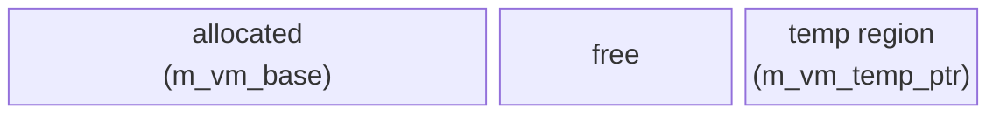
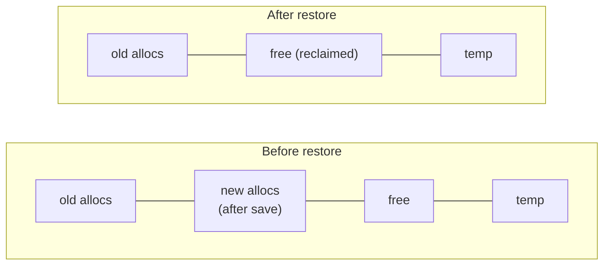

<!--
   ______    _
  /_  __/___(_)_  __
   / / / __/ /\ \/ /       Stack-Based Interpreter & VM
  / / / / / /  > · <      C++23 · Single-Header Library
 /_/ /_/ /_/  /_/\_\     Copyright 2026 Mark Guidarelli

Licensed under the Apache License, Version 2.0 (the "License");
you may not use this file except in compliance with the License.
You may obtain a copy of the License at

    https://www.apache.org/licenses/LICENSE-2.0

Unless required by applicable law or agreed to in writing, software
distributed under the License is distributed on an "AS IS" BASIS,
WITHOUT WARRANTIES OR CONDITIONS OF ANY KIND, either express or implied.
See the License for the specific language governing permissions and
limitations under the License.
-->

# Save/Restore Transactions in Trix

Trix provides transactional rollback for its virtual machine through the
`save` and `restore` operators. `save` creates a checkpoint of the VM state;
`restore` rolls back all modifications to that checkpoint. Array element
writes, dictionary entry changes, heap allocations, interned names, open
streams, and ExtValue free lists are all reversed in a single operation.

For the **local VM** (the bump-allocated arena where ordinary
allocations land), `restore` is the bulk reclamation mechanism: it
rolls the heap pointer back to the checkpoint in O(1).  The **global
VM** has its own reclamation path -- a mark-sweep garbage collector
-- and global allocations are skipped by the save journal so they
survive `restore`.  Together, the local journaled arena and the
global GCed region give you a choice per allocation: rollback or
persistence.  See [`gvm-heap-gc.md`](gvm-heap-gc.md) for the global
side.

---

## Table of Contents

1. [Overview](#1-overview)
2. [Quick Reference](#2-quick-reference)
3. [Why Save/Restore Matters](#3-why-saverestore-matters)
4. [Tutorial](#4-tutorial)
5. [Use Cases](#5-use-cases)
6. [What Gets Rolled Back](#6-what-gets-rolled-back)
7. [What Does Not Get Rolled Back](#7-what-does-not-get-rolled-back)
8. [The Journal System](#8-the-journal-system)
9. [Nested Transactions](#9-nested-transactions)
10. [Interaction with Other Systems](#10-interaction-with-other-systems)
11. [Design Decisions](#11-design-decisions)

---

## 1. Overview

Save/restore provides three capabilities in one mechanism:

| Capability             | How                                                | Cost                  |
| ---------------------- | -------------------------------------------------- | --------------------- |
| **Memory reclamation** | Restore rolls back `m_vm_ptr` to the checkpoint    | O(1) heap reclamation |
| **State rollback**     | Journal replays undo array/dict modifications      | O(journal entries)    |
| **Scope isolation**    | Names and streams created after save are discarded | O(names + streams)    |

**Key properties:**

- **Nestable.** Up to 63 nested levels by default (`save-depth=64` counts the
  BASE slot); configurable to 255 for 254 levels. Inner restore rolls back to
  the inner checkpoint; outer state is preserved.
- **Automatic stream cleanup.** Streams opened after a save point are
  closed on restore, preventing file descriptor leaks.
- **Binding cache aware.** The name binding cache is automatically
  invalidated for entries that would be stale after rollback.
- **ExtValue/WideValue safe.** 64-bit values (Long, ULong, Double, Address)
  and 128-bit values (Int128, UInt128) on the operand or exec stack above
  the checkpoint are relocated to safe storage below the checkpoint before
  rollback.
- **Two-phase restore.** Stacks are validated before any modifications
  begin. An invalid restore (stale save token, *local* composites above the
  barrier) raises a catchable error with the VM untouched. Global-VM
  composites built in `${...}` are not affected -- they survive restore.

---

## 2. Quick Reference

### Operators

| Operator | Stack Effect | Description |
| --- | --- | --- |
| `save` | `-- int` | Create checkpoint; push inline-Integer save token |
| `restore` | `int --` | Roll back to checkpoint (positive token, or `-N` for relative pop) |
| `query-status` | `/key query-status -- value` | Query VM status by key (e.g. `/save-level`, `/vm-used`, `/vm-total`) |
| `save-level?` | `int -- int` | Decode a save token's save level |
| `recover-save` | `int -- int` | Recreate the exact token for an active save level (1..curr) |

### Save Level Configuration

| Parameter      | Default | Range | Purpose                                           |
| -------------- | ------- | ----- | ------------------------------------------------- |
| `m_save_count` | 64      | 4-255 | Save-stack size (BASE + up to N-1 nesting levels) |

### What Gets Rolled Back

| Component                       | Rolled Back? | Mechanism                                        |
| ------------------------------- | ------------ | ------------------------------------------------ |
| Local-VM allocations            | Yes          | Pointer rollback (O(1))                          |
| **Global-VM allocations**       | **No**       | **Journal skips the global VM; reclaimed by GC** |
| Array element writes            | Yes          | Per-element journal                              |
| Dict entry writes               | Yes          | Per-entry journal                                |
| Set entry writes                | Yes          | Per-entry journal                                |
| Packed name bindings            | Yes          | Per-name journal                                 |
| Interned names                  | Yes          | Chain truncation at barrier                      |
| Binding cache                   | Yes          | Level-based invalidation                         |
| Open streams                    | Yes          | Close streams above save level                   |
| ExtValue free lists             | Yes          | Clear lists for rolled-back levels               |
| Dict recycle pool               | Yes          | Clear pools for rolled-back levels               |
| Temp allocator                  | Yes          | Pointer restore from snapshot                    |
| **String byte writes**          | **No**       | Not journaled (design trade-off)                 |
| **`-persist` family mutations** | **No**       | Write-time barrier check; no journal entry       |

### Stack Rules During Restore

Restore rolls back the **local VM** heap to the save barrier. Any object on
the operand or exec stack that references *local* heap memory above the
barrier would become a dangling pointer. Whether an object causes a problem
depends on which VM region it lives in (local vs global) and, for local
objects, whether it is a composite or an ExtValue:

**Local composite objects (Array, Packed, String, Dict, Set, Name) on any
stack above the barrier cause an `/invalid-restore` error.** These objects
reference variable-length *local* VM data that will be reclaimed. Relocating
them would require copying their entire contents (and recursively, their
elements' contents) -- an unbounded operation. Restore rejects this and the
VM is untouched:

```trix
save /sv exch def
[1 2 3]                         % LOCAL array allocated above barrier, now on operand stack
{ sv restore } try              % => /invalid-restore (local array above barrier)
pop pop                         % clean up; VM is untouched
sv restore                      % works after removing the array
```

**Global-VM composites built inside `${...}` SURVIVE restore.** A composite
produced by an operator inside a `${...}` block is allocated in the global
VM, which the save journal skips entirely (it is reclaimed by the global
GC, not by pointer rollback). Such a value is not "above the barrier" in the
journaled sense, so it stays on the stack across `restore` -- fully intact:

```trix
save /sv exch def
${ << /k 42 >> }                % GLOBAL dict built inside ${...}
{ sv restore } try              % => /no-error (global composite survives)
pop                             % discard the /no-error sentinel
/k get                          % => 42 (the dict is still on the stack, intact)
```

The same holds for `${ [1 2 3] }`, `${ (a)(b) concat }`, and `${ 5 string }`:
each is an operator-built global composite and survives restore on the stack.

> **Gotcha -- a bare string *literal* inside `${...}` is still local.** Only
> *operator results* land in the global VM; a `${...}` block does not
> relocate the literals scanned inside it. A bare string literal (e.g.
> `${ (hello) }`) is scanned and allocated in the **local** VM, so it still
> raises `/invalid-restore` if left on the stack across restore:
>
> ```trix
> save /sv exch def
> ${ (hello) }                   % a LITERAL, allocated LOCAL despite the ${...}
> { sv restore } try             % => /invalid-restore (still a local composite)
> pop pop
> sv restore
> ```
>
> Contrast `${ (a)(b) concat }`, whose `concat` *result* is global and
> survives. (An array literal of *inline scalars* such as `${ [1 2 3] }` is
> built by the `]` operator and is global, so it survives; but an array literal
> containing string literals -- `${ [(a) (b)] }` -- raises `/invalid-access`
> at scan time **when a save level is active** (the local strings are
> restore-fragile); with no open save it builds successfully.)

**ExtValue and WideValue objects (Long, ULong, Double, Address; Int128,
UInt128) are NOT composites and will never cause `/invalid-restore`.** Although
they use VM heap, they are treated as value objects. Restore automatically
relocates them to new storage below the barrier before rolling back the heap:

```trix
save /sv exch def
42l                             % Long allocated above barrier (ExtValue)
sv restore                      % works: Long is relocated, value preserved
% stack: 42l (same value, new VM storage)
```

The same applies to the 128-bit WideValue types `Int128` (`q` suffix) and
`UInt128` (`uq` suffix):

```trix
save /sv exch def
999999999999999999999q          % Int128 (WideValue) above barrier
sv restore                      % works: relocated, value preserved
% stack: 999999999999999999999q
```

This relocation happens transparently -- the value on the stack is unchanged
from the programmer's perspective. The relocation processes ExtValues in
ascending VM-offset order to prevent overwriting pending entries.

**Summary of stack behavior during restore:**

| Type on Stack | Behavior |
| --- | --- |
| Inline values (Integer, Real, Boolean, Byte, etc.) | Always safe (no VM reference) |
| ExtValue/WideValue (Long, ULong, Double, Address, Int128, UInt128) | Always safe (automatically relocated) |
| **Local** composites (Array, Packed, String, Dict, Set, Name) | `/invalid-restore` if above barrier |
| **Global** composites (built by an operator inside `${...}`) | Always safe (in the GCed region; survive restore) |
| Operators, Marks, Booleans, Null | Always safe (no VM reference) |

**Practical rule:** Before calling `restore`, ensure no *local* arrays,
strings, dicts, sets, or packed arrays allocated after the save point remain
on any stack. Either (a) `def` the result to a name (dictionaries are journaled
and rolled back), (b) extract scalar values into local variables before restore,
or (c) build the composite in `${...}` (global VM) so it persists on the stack
across `restore`.

See [`local-global-vm.md`](local-global-vm.md) for the full model of how
values and containers move between the local and global VM.

---

## 3. Why Save/Restore Matters

### Local-Heap Reclamation

Trix's **local VM** uses a bump allocator: `m_vm_ptr` advances upward
on every allocation and never moves backward -- except during
`restore`.  No reference counting, no mark-and-sweep here; reclamation
is rollback.

(The **global VM** above `m_vm_global` is the other end of the same
contiguous region and has its own reclaimer.  Mark-sweep GC runs on
`Error::VMFull` or on explicit `vm-global-gc`; see
[`gvm-heap-gc.md`](gvm-heap-gc.md).  The two regions share bytes but
have independent allocation and reclamation policies.)



When `restore` is called, `m_vm_ptr` is reset to the save barrier:



All memory between the barrier and the old `m_vm_ptr` is reclaimed in a
single pointer assignment. No scanning, no marking, no freeing individual
objects. O(1) bulk reclamation.

This means **every Trix program that allocates temporary data should use
save/restore to reclaim it:**

```
% Without save/restore: memory is never freed
1000 { 100 string pop } repeat     % 100KB leaked

% With save/restore: memory is reclaimed each iteration
1000 {
    save
    100 string pop % temporary allocation
    restore        % reclaimed
} repeat           % net allocation: 0
```

### Error Recovery with Rollback

Save/restore combined with `try-catch` provides error recovery that undoes
all side effects:

```
save /sv exch def
<< /default {
    pop
    sv restore                      % undo all modifications
    rethrow                         % propagate the error
} >>
{
    % risky operations that modify arrays, dicts, etc.
    % if any error occurs, ALL modifications are undone
}
try-catch
```

### Speculative Execution

Try an operation; if it fails, roll back as if it never happened:

```
/try-parse {
    % str -- result true | false
    save exch
    { parse-complex-format true } try
    dup /no-error eq {
        pop exch pop true           % success: discard save token
    } {
        pop exch restore false      % failure: roll back all state
    } if-else
} def
```

---

## 4. Tutorial

### 4.1 Basic Save and Restore

```
/x 42 def

save /sv exch def % create checkpoint
/x 99 def         % modify x
x                 % => 99

sv restore                      % roll back
x                               % => 42 (reverted)
```

`save` pushes an inline Integer save token that must be passed to `restore`.
The token packs `level | (gen ^ barrier_low23) << 8` and identifies which
checkpoint to roll back to.

### 4.2 Array Modification Rollback

```
3 array /arr exch def
arr 0 10 put
arr 1 20 put
arr 2 30 put                    % arr = [10, 20, 30]

save /sv exch def
arr 0 99 put                    % modify element 0
arr 0 get                       % => 99

sv restore
arr 0 get                       % => 10 (reverted)
```

Each array element write is journaled individually. On restore, the original
values are copied back.

### 4.3 Dictionary Modification Rollback

```
<< /a 1 /b 2 >> begin

save /sv exch def
/a 99 def                       % modify a in current dict
/a load                         % => 99

sv restore
/a load                         % => 1 (reverted)
end
```

### 4.4 Heap Reclamation

```
//:status:vm-used                % => N bytes used

save /sv exch def
1000 string pop % allocate 1001 bytes
[1 2 3 4 5] pop % allocate 40 bytes
<< /a 1 >> pop  % allocate dict overhead
sv restore      % ALL reclaimed

//:status:vm-used                % => N (back to original)
```

### 4.5 Nested Save/Restore

```
/val 1 def

save /outer exch def
/val 2 def

    save /inner exch def
    /val 3 def
    val                         % => 3

    inner restore
    val                         % => 2 (inner rolled back)

outer restore
val                             % => 1 (outer rolled back)
```

Each save level creates an independent checkpoint. Inner restore rolls back
to the inner checkpoint without affecting the outer save's journal.

### 4.6 Memory-Efficient Loop Processing

```
% Process a large dataset item by item, reclaiming temp memory each iteration
/process-items {
    % items -- results
    /items exch def
    /results [] def

    items {
        /item exch def
        save /sv exch def

        % Build the kept result in the GLOBAL VM so it survives restore;
        % leave it on the stack (the save journal skips the global region).
        ${ item 16 string to-string (processed: ) exch concat }

        sv restore                  % reclaim the local temps from this iteration

        % the global string is still on the stack -- append it to results
        results exch append /results exch def
    } for-all

    results
} def
```

---

## 5. Use Cases

### 5.1 Test Isolation

Each test starts from a known state, and any modifications are rolled back:

```
% Test framework pattern
/run-test {
    % name proc -- passed?
    /test-proc exch def
    /test-name exch def

    save /sv exch def
    { test-proc true } try
    dup /no-error eq {
        pop exch pop                % success
        sv restore true
    } {
        pop sv restore false        % failure: rollback + report
    } if-else
} def

(test-add) { 1 2 add 3 eq } run-test       % => true
(test-div) { 1 0 div } run-test            % => false (rolled back)
```

### 5.2 Speculative Parsing

Try to parse input in one format; if it fails, roll back and try another:

```
/parse-flexible {
    % str -- result
    save exch
    { parse-json true } try
    dup /no-error eq { pop exch pop } {
        pop exch restore            % rollback failed JSON parse
        save exch
        { parse-csv true } try
        dup /no-error eq { pop exch pop } {
            pop exch restore        % rollback failed CSV parse
            /type-check throw       % neither format worked
        } if-else
    } if-else
} def
```

### 5.3 A/B Configuration Testing

```
% Establish baseline
% ... initialize application state ...
save /baseline exch def

% Test configuration A
/mode (fast) def
run-benchmark /results-a exch def
baseline restore

% Test configuration B (identical starting state)
/mode (safe) def
run-benchmark /results-b exch def
baseline restore

% Compare results
results-a results-b compare-results
```

### 5.4 Temporary Workspace

Allocate scratch space for an algorithm, then reclaim it:

```
/matrix-multiply {
    % a b -- result
    save 3 1 roll                   % save below matrices

    % allocate temporary arrays for computation
    /rows a-rows def
    /cols b-cols def
    rows cols mul array /temp exch def

    % ... compute into temp ...
    % ... copy result to final array ...

    /result exch def
    exch restore                    % reclaim all temp arrays
    result                          % only the result survives
} def
```

### 5.5 Bounded Memory Operations

Ensure an operation stays within a memory budget:

```
/with-memory-limit {
    % budget proc -- result
    /proc exch def
    /budget exch def

    save /sv exch def
    /start //:status:vm-used def

    proc

    /used //:status:vm-used start sub def
    used budget gt {
        sv restore
        /limit-check throw
    } if
} def
```

<!-- doctest: skip (synopsis: large-computation is a stand-in workload) -->
```
10000 { large-computation } with-memory-limit
```

---

## 6. What Gets Rolled Back

### Heap Allocations (O(1) Rollback)

All VM memory allocated after the save point is reclaimed by resetting
`m_vm_ptr` to the barrier. This includes:

- String data (the string bytes in the heap)
- Array element storage
- Packed array encoded data
- Dictionary headers, buckets, and entry pools
- Set headers, buckets, and entry pools
- Name objects (interned strings + metadata)
- ExtValue slots (Long, ULong, Double, Address)
- Save journal entries themselves

### Array Element Writes (Journaled)

When an array element is modified via `put`, the old value is saved in a
journal entry before the new value is written. On restore, the journal is
replayed in reverse, copying original values back:

```
[10 20 30] /arr exch def
save /sv exch def
arr 0 99 put                    % journal: save old arr[0], write 99
arr 1 88 put                    % journal: save old arr[1], write 88
sv restore                      % replay: arr[1] = old, arr[0] = old
```

Journal deduplication: if the same location is written multiple times within
one save level, only the first write creates a journal entry. Subsequent
writes to the same slot are free.

### Dictionary Entry Writes (Journaled)

Dictionary modifications are journaled at two levels:

- **Entry writes:** When `def` or `store` modifies an existing entry, the
  entire 20-byte Entry (key + value + chain link) is saved.
- **Structural changes:** When a new entry is added, the bucket chain
  head (DictHeader) is saved. This is done at most once per dict per save
  level.

### Set Entry Writes (Journaled)

Set modifications follow the same pattern as dictionaries, journaling at two
levels:

- **Entry writes (SetEntry, 12 bytes):** When a new set member reuses a
  recycled pool slot whose prior key was written at an older save level (or
  when `set-remove` unlinks a member), the entire 12-byte SetEntry (key Object
  + chain link) is journaled. The save-level check (`entry->m_key.save_level()`
  vs current save level) is the same as `Dict::put`. Re-adding an
  already-present key is a no-op and journals nothing -- a Set has no value to
  overwrite.
- **Structural changes (SetEntryNext, 4 bytes):** When `set-remove` unlinks a
  non-head element, the predecessor's `m_next` field is journaled. New
  insertions go to the bucket-chain head and need no relink journal.

On restore, the SetEntry case frees the key's ExtValue (if any) before
overwriting with the saved data, ensuring 64-bit key values are not leaked.

Note: `=set-from-mark` (whole-set replacement) bypasses journaling, the same
as `=dict-from-mark`.

### Packed Name Bindings (Journaled)

Early-bound packed arrays store resolved name offsets inline. When a packed
name is bound (replacing the string name with an offset), the original
2-4 bytes are journaled for potential restore.

### Interned Names (Chain Truncation)

Names are appended to hash bucket chains during execution. On restore,
chains are truncated at the barrier offset: any Name allocated after the
save point is removed from its chain. The Name's heap storage is reclaimed
by the pointer rollback.

### Binding Cache (Level-Based Invalidation)

On restore the name binding cache is invalidated. In the common
single-coroutine case every `Name::m_binding` (a fast-path offset cache,
`nulloffset` = miss) is flushed; the next lookup walks the dict stack and
repopulates. In multi-coroutine mode each coroutine's binding table is pruned
of entries established at or above the restored save level, preserving
pre-save bindings. This prevents stale cache entries from returning values in
rolled-back dictionaries.

### Open Streams (Closed on Restore)

Streams carry a `m_stream_save_level`. On restore, any stream opened after
the save point is closed automatically. This prevents file descriptor leaks
from rolled-back operations.

### ExtValue Free Lists (Per-Level Clearing)

ExtValue (Long, ULong, Double, Address) free lists are maintained per save
level. On restore, free lists for rolled-back levels are cleared. ExtValues --
and the 128-bit WideValue types (Int128, UInt128) -- on the operand or
exec stack above the barrier are relocated to new storage below the
barrier before rollback.

### Dictionary Recycle Pool (Per-Level Clearing)

Small dictionaries (capacity 1-16) are recycled via a per-save-level pool.
On restore, pool entries for rolled-back levels are cleared.

### Temp Allocator (Pointer Restore)

The top-end temporary allocator's pointer (`m_vm_temp_ptr`) is snapshotted
at each save level and restored on rollback, reclaiming any temp allocations
made after the save.

---

## 7. What Does Not Get Rolled Back

### String Byte Writes

String element modifications via `put` write directly to VM memory without
creating a journal entry. Changes to string contents persist across restore:

```
5 string /s exch def
s 0 65b put                     % write 'A' to position 0

save /sv exch def
s 0 66b put                     % write 'B' to position 0
sv restore

s 0 get                         % => 66b ('B' -- NOT rolled back)
```

This is a deliberate design trade-off. A string element is a single byte,
but a journal entry requires 12+ bytes of overhead. Journaling each byte
write would consume space disproportionate to the data being protected.
Arrays do not have this problem because each element is an 8-byte Object --
the journal entry and the data are the same size.

**Workaround -- array of bytes:** When journaled byte-level data is required,
use an array of Byte values. Array elements are fully journaled (the array
must exist below the save barrier, so it survives the rollback while its
element write is undone):

```
[ 65b 66b 67b ] /bytes exch def
save /sv exch def
bytes 0 90b put                 % modify element 0
sv restore
bytes 0 get                     % => 65b (rolled back)
```

**Workaround -- allocate after save:** If the string is allocated after the
save point, it is discarded entirely by the heap rollback:

```
save /sv exch def
5 string /s exch def            % allocated after save
s 0 65b put
sv restore                      % string reclaimed with heap
```

A string of N bytes costs N+1 bytes of heap. An array of N Byte values
costs N*8 bytes. For most use cases -- parsing, formatting, I/O buffers --
the 8x memory savings outweigh the journal limitation.

---

## 8. The Journal System

### Journal Entry Structure

Each journal entry records the original value of a modified location:

```
[m_next]           4 bytes    Next entry in chain (LIFO linked list)
[m_ptr]            4 bytes    VM location being saved
[m_bucket_count]   2 bytes    Used by DictHeader flavor only
[m_flavor]         1 byte     What kind of data is saved
[m_data[]]         variable   The saved bytes
```

### Journal Flavors

| Flavor            | Data Size   | Trigger                                                      |
| ----------------- | ----------- | ------------------------------------------------------------ |
| Object            | 8 bytes     | Array element overwrite                                      |
| DictHeader        | Variable    | Dict bucket array mutation (at most once per dict per level) |
| DictEntry         | 20 bytes    | Dict entry overwrite (key + value + chain link)              |
| DictEntryNext     | 4 bytes     | Collision chain relink                                       |
| SetEntry          | 12 bytes    | Set entry overwrite (key + chain link)                       |
| SetEntryNext      | 4 bytes     | Set collision chain relink                                   |
| PackedName2/3/4   | 3/4/5 bytes | Packed array name binding                                    |
| StreamInfixOffset | 4 bytes     | Stream infix parse offset (infix expression state)           |
| LvarBinding       | 8 bytes     | Logic-var binding (sole journaled global slot; backtracking) |

### Journal Cost Model

| Operation | Journal Cost | Notes |
| --- | --- | --- |
| Array element `put` (first write) | 19 bytes (11-byte entry header + 8-byte Object; the 12th struct byte overlaps the first payload byte) | Only the first write per slot per level |
| Array element `put` (repeat) | 0 bytes | Deduplication: same slot already saved |
| Dict `def` (existing key) | 31 bytes (entry + 20-byte DictEntry, 1 byte embedded) | First write to this entry per level |
| Dict `def` (new key) | 31 + variable | DictEntry + DictHeader (once per dict per level) |
| Set `set-add` (new key) | 23 bytes (entry + 12-byte SetEntry, 1 byte embedded) | Re-adding a present key journals nothing |
| Set `set-add` (new key, with growth) | 23 + variable | SetEntry + DictHeader (once per set per level) |
| String `put` | 0 bytes | Not journaled |
| Heap allocation | 0 bytes | Reclaimed by pointer rollback, no journal needed |

### Deduplication

Before creating a new journal entry, the system checks the chain head. If
the most recent entry records the same location and flavor, no new entry is
created. This catches the common pattern of repeated writes to the same
variable:

```
save /sv exch def
/x 1 def   % journal: save original x (31 bytes)
/x 2 def   % deduplicated: same location, no new entry
/x 3 def   % deduplicated: same location, no new entry
sv restore % replay: x = original (one entry)
```

### Replay Order

Journal entries are replayed in LIFO order (newest to oldest) within each
save level, and save levels are replayed from the current level down to the
restored level. This ensures that nested modifications are undone in the
correct order.

---

## 9. Nested Transactions

### Multiple Save Levels

Save/restore supports up to 63 nested levels by default (`save-depth=64`
counts the BASE slot; configurable to 255 for 254 levels). Each level is
independent:

```
/a 1 def

save /s1 exch def               % level 1
/a 10 def

    save /s2 exch def           % level 2
    /a 100 def

        save /s3 exch def      % level 3
        /a 1000 def
        a                       % => 1000

        s3 restore % back to level 2
        a          % => 100

    s2 restore                  % back to level 1
    a                           % => 10

s1 restore                      % back to level 0
a                               % => 1
```

### Inner Rollback Preserves Outer Journal

When an inner save level is restored, only its journal is replayed. The
outer level's journal is untouched:

```
save /outer exch def
/x 1 def                       % outer journal: save original x

    save /inner exch def
    /x 2 def      % inner journal: save x=1 (from outer def)
    inner restore % replay inner: x = 1

% outer journal still has original x
outer restore                   % replay outer: x = original
```

### Partial Rollback

You can restore to any save level, not just the most recent:

```
save /s1 exch def
save /s2 exch def
save /s3 exch def

% Skip s3 and s2, restore directly to s1:
s1 restore                      % rolls back levels 3, 2, and 1
```

All levels between the current level and the target are rolled back in order.

---

## 10. Interaction with Other Systems

### try-catch + save/restore

The most powerful pattern: catch errors and undo all side effects:

```
/transactional {
    % proc -- result (or error with full rollback)
    save exch

    << /default {
        pop
        restore                     % undo everything
        rethrow
    } >>
    exch
    try-catch
} def
```

<!-- doctest: skip (synopsis: risky-operation is a stand-in for the guarded procedure) -->
```
{ risky-operation } transactional
```

Note: `try-catch` does not use save/restore internally. They are independent
mechanisms that compose well.

### finally + save/restore

`finally` guarantees cleanup; save/restore guarantees rollback. Together they
handle both resource cleanup and state rollback:

```
save /sv exch def
{ sv restore }                  % finally: always rollback
{
    % allocate resources, modify state
    % if error: finally runs restore, then error propagates
    % if success: finally runs restore, result preserved on stack
}
finally
```

### with-stream + save/restore

Streams opened inside a save scope are closed on restore. `with-stream`
also guarantees closure. Using both provides belt-and-suspenders safety:

```
save /sv exch def
(data.txt) (r)#b {
    read-all
    % process data
} with-stream                   % stream closed by with-stream
sv restore                      % all allocations reclaimed
```

### Binding Cache

Save/restore automatically manages the name binding cache:

- **save:** Does not invalidate caches (cache entries remain valid at the
  new level). This makes `save` fast -- no name table scanning.
- **restore:** Invalidates the binding cache. In single-coroutine mode every
  `Name::m_binding` is flushed; in multi-coroutine mode each coroutine's
  binding table is pruned of entries established at or above the restored
  level. This prevents stale lookups to names in rolled-back dictionaries.
- **begin/end within save:** Pre-warming and invalidation work normally.
  The save level ensures that cache entries from a `begin` inside a save
  scope are cleared when that scope is restored.

### TCO (Tail Call Optimization)

TCO operates on the exec stack; save/restore operates on the VM heap.
They do not interfere. A tail-recursive function inside a save scope gets
full TCO:

```
save /sv exch def
/countdown { dup 0 le { pop } { 1 sub countdown } if-else } def
100000 countdown                % TCO: constant stack space
sv restore                      % reclaim all allocations
```

---

## 11. Design Decisions

### Why Bump Allocator + Rollback Instead of GC?

A garbage collector (mark-sweep, copying, generational) introduces:
- **Non-deterministic pauses** -- unacceptable for real-time embedded systems
- **Complex implementation** -- root scanning, write barriers, finalization
- **Memory overhead** -- object headers, forwarding pointers, free lists
- **Fragmentation** -- over time, allocation patterns create gaps

The bump allocator has none of these problems:
- **O(1) allocation** -- advance a pointer
- **O(1) reclamation** -- reset the pointer
- **Zero fragmentation** -- allocations are contiguous
- **Zero overhead** -- no object headers, no write barriers
- **Deterministic** -- no pauses, no scanning, no surprises

The trade-off is that individual allocations cannot be freed -- only bulk
rollback via save/restore. This is acceptable because Trix's execution model
naturally scopes allocations: test bodies, loop iterations, function calls,
and error recovery blocks all have clear lifetimes.

### Why Per-Entry Journaling?

Alternative approaches:
- **Copy-on-write pages:** Snapshot entire memory pages before modification.
  Simple but wastes memory for sparse modifications.
- **Shadow copies:** Maintain two heaps and swap on commit/rollback.
  Doubles memory usage.
- **Undo log (Trix's approach):** Record only the modified fields. Space
  proportional to modifications, not total data size.

Per-entry journaling is optimal when modifications are sparse relative to
total data (the common case in Trix -- a few dict entries changed out of
thousands of heap bytes).

### Why Save-Level Instead of Version Counter?

Each journal entry and free-list slot is tagged with a save level (0-254),
not a monotonic version counter. This enables:

- **Efficient nesting:** Each level has its own journal chain, free lists,
  and dict pool. Rolling back level N does not affect level N-1's data.
- **Lazy cache invalidation:** `save` does not scan the name table. The
  level increment automatically makes old cache entries stale (they were
  set at level N-1, but we are now at level N).
- **Bounded storage:** Save levels are a small integer (uint8_t). Version
  counters would grow unboundedly.

### Why Not Journal String Writes?

A string element is 1 byte. A journal entry is 12 bytes (11-byte header + the
1 data byte embedded in the entry's tail). Journaling every `put` on a string
would consume 12x the memory being protected. For a 1000-byte string being
filled one byte at a time, the journal would use 12,000 bytes to protect
1,000 bytes of data.

Array elements do not have this problem because each element is an 8-byte
Object. A journal entry (11 + 8 = 19 bytes) for an 8-byte element is a
2.375x overhead -- proportionate and acceptable.

The design choice: strings are a compact representation (N bytes for N
characters) that trades journaling for space efficiency. Arrays of Byte
values provide journaled byte-level data at 8x the memory cost. The
programmer chooses the appropriate trade-off.

### Why Automatic Stream Cleanup?

Without stream cleanup on restore, file descriptors would leak every time a
save scope that opened files is rolled back. The programmer would need to
manually track and close every stream -- defeating the purpose of automatic
rollback.

By tagging each stream with its creation save level and closing streams
above the restored level, Trix ensures that save/restore is truly
transactional: all side effects within the scope are undone, including I/O
resource acquisition.

---

