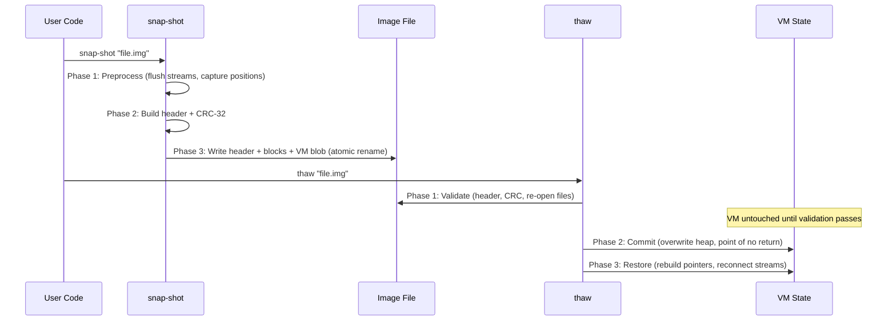

<!--
   ______    _
  /_  __/___(_)_  __
   / / / __/ /\ \/ /       Stack-Based Interpreter & VM
  / / / / / /  > · <      C++23 · Single-Header Library
 /_/ /_/ /_/  /_/\_\     Copyright 2026 Mark Guidarelli

Licensed under the Apache License, Version 2.0 (the "License");
you may not use this file except in compliance with the License.
You may obtain a copy of the License at

    https://www.apache.org/licenses/LICENSE-2.0

Unless required by applicable law or agreed to in writing, software
distributed under the License is distributed on an "AS IS" BASIS,
WITHOUT WARRANTIES OR CONDITIONS OF ANY KIND, either express or implied.
See the License for the specific language governing permissions and
limitations under the License.
-->

# Snap-Shot/Thaw: VM State Serialization

Trix can serialize its complete virtual machine state -- all objects, stacks,
dictionaries, names, streams, and interpreter state -- to a single binary
image file, and restore it later. The restored VM continues execution from
exactly where the snapshot was taken, with open file streams automatically
reconnected to their original files at their original positions.

This is not object serialization (like Python's pickle). It is complete VM
state capture -- every byte of **both VM regions** (the local bump arena
and the global dlmalloc-managed heap), every stack entry, every dictionary
binding, every save/restore checkpoint, plus the GC mark-generation bit
so the post-thaw GC starts from a clean baseline. The restored VM is
indistinguishable from the original.

---

## Table of Contents

1. [Overview](#1-overview)
2. [Quick Reference](#2-quick-reference)
3. [Use Cases](#3-use-cases)
4. [Tutorial](#4-tutorial)
5. [How It Works](#5-how-it-works)
6. [The Image File Format](#6-the-image-file-format)
7. [Stream Handling](#7-stream-handling)
8. [Startup vs Runtime Thaw](#8-startup-vs-runtime-thaw)
9. [Limitations](#9-limitations)
10. [Design Decisions](#10-design-decisions)

---

## 1. Overview

Snap-shot/thaw provides three capabilities:

| Capability | Mechanism | Use Case |
| --- | --- | --- |
| **Checkpoint** | `snap-shot` operator during execution | Save progress, create restore points |
| **Restore** | `thaw` operator during execution | Return to a checkpoint, load pre-built state |
| **Image startup** | `StartupMode::ImageFile` at construction | Fast startup from pre-initialized state |

**Key properties:**

- **Complete.** Every byte of VM memory, all four stacks, all dictionaries,
  all interned names, the PRNG state, error state, save/restore levels, and
  stream metadata are captured.
- **Offset-based.** All references in the VM are 32-bit offsets from the heap
  base, not raw pointers. The image can be loaded at any address without
  pointer rebasing.
- **Integrity-checked.** CRC-32 covers the header, stream metadata, and the
  entire VM blob. Corrupt or truncated images are detected before the VM is
  modified.
- **Two-phase thaw.** All validation happens before the VM is touched. If
  any check fails, the running VM is untouched and the error is catchable.
- **Stream reconnection.** Open file streams are automatically reopened and
  seeked to their saved positions. Append-mode streams seek to EOF to
  preserve append semantics.

---

## 2. Quick Reference

### Operators

| Operator    | Stack Effect | Description                          |
| ----------- | ------------ | ------------------------------------ |
| `snap-shot` | `str --`     | Save complete VM state to named file |
| `thaw`      | `str --`     | Restore VM state from named file     |

### Startup Mode

```cpp
// C++ host: start from an image instead of a script
Trix::Config config;
config.m_filename = "app.img";
config.m_mode = Trix::StartupMode::ImageFile;
Trix vm(config);
```

### File Format Summary

```
[SnapShotHeader]     592 bytes   Magic, version, CRC, all VM state metadata
[Memory Blocks]      variable    In-memory stream buffers, startup file tail
[File Stream Blocks] variable    Filename, mode, position for each open file
[VM Blob]            variable    Raw heap contents (m_vm_base to m_vm_ptr)
```

### Limitations at a Glance

| Limitation                                        | Reason                                         |
| ------------------------------------------------- | ---------------------------------------------- |
| Address objects contain stale pointers after thaw | Raw host pointers cannot be serialized         |
| Same endianness required                          | Native byte order, no conversion               |
| Non-seekable file streams are closed              | Cannot capture/restore pipe or socket position |
| Same user operator table required                 | Operator function pointers are not serialized  |
| Target VM must have sufficient capacity           | vm_used bytes must fit                         |

---

## 3. Use Cases

### 3.1 Fast Startup from Pre-Initialized State

A complex application may require loading configuration, defining hundreds of
procedures, populating dictionaries, and initializing data structures. This
startup work can take significant time. Snap-shot captures the fully
initialized state; image startup skips the initialization entirely:

```
% First run: initialize everything
% ... load config, define procedures, build data structures ...
(app.img) snap-shot            % save initialized state

% Subsequent runs: instant startup from image
% C++: config.m_mode = StartupMode::ImageFile
% C++: config.m_filename = "app.img"
% VM starts with everything already initialized
```

The image file contains the fully parsed, bound, and cached state. No
scanning, no parsing, no dictionary construction -- the VM is ready to
execute immediately.

### 3.2 Binary Distribution Without Source Code

Snap-shot produces a binary image that contains all compiled procedures,
data, and bindings but not the original source text. This enables
distributing applications as frozen images:

```
% Build step: compile source to image
(mylib.trx) run       % load and execute library source
(mylib.img) snap-shot % capture compiled state

% Distribution: ship mylib.img (binary), not mylib.trx (source)
% User runs: config.m_filename = "mylib.img"
```

The image contains packed arrays (compressed bytecode), bound names, and
initialized dictionaries -- the executable form of the program, not the
source code. This can be a business decision for proprietary scripting
logic.

### 3.3 Checkpoint and Resume Long Computations

For computations that take hours or days, snap-shot provides crash recovery:

```
/process-batch {
    % ... process items ...
    /batch-number batch-number 1 add def

    % checkpoint every 100 batches
    batch-number 100 mod 0 eq {
        (checkpoint.img) snap-shot
        (Checkpoint saved at batch ) print batch-number =
    } if

    % continue processing
    more-items? { process-batch } if
} def
```

If the process crashes, thaw resumes from the most recent checkpoint:

```
% Resume from checkpoint
(checkpoint.img) thaw
% execution continues from exactly where snap-shot was called
```

### 3.4 A/B Testing and Configuration Comparison

Snap-shot enables comparing different configurations against the same
initialized state:

```
% Create baseline state
% ... initialize application ...
(baseline.img) snap-shot

% Test configuration A
(baseline.img) thaw
/mode (aggressive) def
run-benchmark
(results-a.txt) (w)#b { results write-string } with-stream

% Test configuration B (same starting state)
(baseline.img) thaw
/mode (conservative) def
run-benchmark
(results-b.txt) (w)#b { results write-string } with-stream
```

Both tests start from identical VM state. Any difference in results is due
to the configuration change, not initialization order or timing.

### 3.5 Regression Bisecting and Test Isolation

Snap-shot captures the exact VM state at a known-good point. When a bug is
discovered, thaw restores to the pre-bug state for investigation:

```
% During normal operation: periodic snapshots
(state-001.img) snap-shot
% ... operations ...
(state-002.img) snap-shot
% ... operations ...
(state-003.img) snap-shot
% ... bug discovered ...

% Bisect: which snapshot was last good?
(state-002.img) thaw
% inspect VM state, run targeted tests
```

For test suites, each test can start from a known snapshot instead of
re-executing the entire setup:

<!-- doctest: skip (synopsis: setup-test-environment is a stand-in helper) -->
```
% Test framework: setup once, snapshot, restore per test
setup-test-environment
(test-baseline.img) snap-shot

% Each test restores to clean baseline
/run-test {
    (test-baseline.img) thaw
    % run test body
} def
```

### 3.6 Embedded Firmware Images

For embedded systems, the image file can be stored in flash memory and loaded
at boot time, providing instant startup without a file system:

```cpp
// C++ embedded host: load image from memory-mapped flash
extern const uint8_t app_image[];
extern const size_t app_image_size;

// Use pre-allocated constructor + image startup
static uint8_t vm_mem[65536];
Trix::Config config;
config.m_filename = "/dev/flash/app.img";
config.m_mode = Trix::StartupMode::ImageFile;
Trix vm(vm_mem, sizeof(vm_mem), config);
```

---

## 4. Tutorial

### 4.1 Basic Snap-Shot and Thaw

`thaw` (and image startup) does **not** run the code that follows it -- it
resumes the snapshotted *continuation*, i.e. execution picks up exactly where
`snap-shot` was called in the original program. So the observable work must be
placed **after** `snap-shot`; it then runs on the original execution and again
each time the image is thawed.

The program that builds the image:

```trix
% Define some state
/greeting (Hello, World!) def
/counter 42 def
/data [1 2 3 4 5] def

% Save everything. Execution continues here on the original run AND resumes
% here on every thaw / image startup:
(demo.img) snap-shot

greeting =                      % => Hello, World!
counter =                       % => 42
data length =                   % => 5
```

Later, or in a different process, resume that continuation by thawing the
image. Note the code *after* `thaw` never runs -- `thaw` transfers control to
the snapshotted continuation:

```trix
(demo.img) thaw
(this line is never reached) =  % thaw resumed the snapshot's continuation
```

Resuming prints `Hello, World!` / `42` / `5` -- the output of the snapshotted
continuation, not of the lines following `thaw`. Image startup
(`trix --image demo.img`) resumes the same continuation.

### 4.2 Image Startup from C++

```cpp
// First execution: build the image
{
    Trix::Config config;
    config.m_filename = "build_image.trx";
    Trix builder(config);
}
// build_image.trx contains: ... setup ... (app.img) snap-shot

// Subsequent executions: start from image
{
    Trix::Config config;
    config.m_filename = "app.img";
    config.m_mode = Trix::StartupMode::ImageFile;
    Trix app(config);
    // VM starts with pre-initialized state
}
```

### 4.3 Snap-Shot with Open File Streams

```
% Open a file, write some data, snap-shot, then thaw
(data.txt) (w)#b stream /outfile exch def
outfile (first line\n) write-string
outfile flush-stream

(checkpoint.img) snap-shot

% ... later ...
(checkpoint.img) thaw
% outfile is automatically reconnected to data.txt
% file position is restored (after "first line\n")
outfile (second line\n) write-string
outfile close-stream
```

After thaw, the file stream is reopened at the same position. Writing
continues from where it left off.

### 4.4 Preserving PRNG State

The PCG32 random number generator state is included in the snapshot. This
means random sequences are deterministic across snap-shot/thaw:

```
42ul rand-seed
rand-uinteger                   % => some value X
(prng.img) snap-shot

% Later:
(prng.img) thaw
rand-uinteger                   % => same value that would have followed X
```

### 4.5 Error Handling on Thaw

Thaw validates the image before modifying the VM. If validation fails, the
running VM is untouched and the error is catchable:

```
% Try to thaw a corrupt or missing image
{ (nonexistent.img) thaw } try
/file-open-error eq             % => true (file not found)

% Try to thaw a truncated image
{ (truncated.img) thaw } try
/invalid-image-file eq          % => true (CRC mismatch or header error)

% VM state is unchanged after failed thaw
```

---

## 5. How It Works



### 5.1 Snap-Shot: Three Phases

**Phase 1: Preprocessing**

Before writing anything, snap-shot prepares the VM state for serialization:

1. Pop the filename from the operand stack (so the stack is in its final
   state for capture)
2. Verify no temporary allocations are active
3. For each open seekable file stream:
   - Flush pending write data
   - Seek back to account for unread buffered data
   - Reset the stream buffer (empty read buffer, reset write pointer)
   - Capture the logical file position via `lseek`
   - Resolve the filename to an absolute path (so thaw works even if the
     working directory changes)
   - Record the open mode and flags (read/write/append)
4. Close any non-seekable file streams (pipes, sockets -- cannot be
   reconnected)
5. Capture any remaining startup file content (the portion of the script
   file beyond the current buffer)
6. Flush stdout and stderr

**Phase 2: Header Construction and CRC**

Build the 592-byte SnapShotHeader containing:
- Magic number, version, endianness flag
- VM extents (base address, used bytes, required capacity)
- All scalar interpreter state (save level, error state, interrupt mask,
  PRNG state)
- All VM pointer fields converted to offsets
- User operator table identity (count + name CRC)
- Memory stream block metadata (count + CRC)
- User file stream block metadata (count + CRC)
- Overall CRC-32 covering header + all blocks + VM blob

**Phase 3: File Write**

Write to a temporary file, then rename atomically on success:
1. Write SnapShotHeader (592 bytes)
2. Write memory stream blocks (in-memory stream buffers)
3. Write user file stream blocks (filename, mode, position per stream)
4. Write VM blob (raw heap contents)
5. Rename `.tmp` to target filename (atomic on POSIX)

### 5.2 Thaw: Three Phases

**Phase 1: Validation (VM untouched)**

All validation happens before the running VM is modified. If any check fails,
`trx->error()` raises a catchable error and the VM is untouched:

1. Read and validate the header:
   - Magic bytes: `{'T', 'R', 'I', 'X'}`
   - Version compatibility
   - Endianness must match the host
   - VM capacity must be sufficient
2. Read and validate memory stream blocks (into malloc'd buffers)
3. Pre-open user file streams:
   - Open each file at its saved path
   - Seek to the saved position (or EOF for append mode)
   - Verify the file is at least as large as the saved position
4. Compute and verify CRC-32 over the entire file
5. Verify user operator table identity (count and name CRC must match)

**Phase 2: Commit (point of no return)**

Past this point, the VM is being overwritten. `trx->error()` must not be
called:

1. Free existing in-memory stream buffers
2. Close non-stdio file descriptors (except reconnected ones)
3. Read the VM blob directly into the heap
4. Close the image file

**Phase 3: Restore**

Rebuild the live VM from the loaded data:

1. Restore all scalar fields and convert offsets back to pointers
2. Apply stream fixups:
   - Reconnect stdio streams to their file descriptors
   - Transfer pre-opened file descriptors to their Stream objects
   - Restore in-memory stream buffers
3. Reset transient interpreter state (debugger, scanner, invoke data)
4. Invalidate the dictionary pool (stale from pre-thaw)

### 5.3 The Two-Phase Commit Model

The critical design property: **Phase 1 of thaw does not modify the VM.**
All file I/O, CRC verification, and user operator validation happen while
the running VM is still intact. Only after every check passes does Phase 2
begin overwriting the heap.

This means:

```
{ (image.img) thaw } try
/invalid-image-file eq {
    % Image was corrupt, but our VM is fine
    % Continue with current state
} if
```

A failed thaw is a recoverable error, not a crash.

---

## 6. The Image File Format

### Header (592 bytes)

| Section | Contents |
| --- | --- |
| Identity | Magic `{'T','R','I','X'}`, `snapshot_version` (`uint32_t`, currently 176), endianness flag |
| VM extents | Base address (diagnostic), local-VM `vm_used`, **global-VM `vm_global_used`**, capacity required by thaw |
| **Global allocator state** | **`gvm_free_head` (general free list), `gvm_fastbins[4]` (Phase 3c LIFO bin heads), `gc_scratch_offset` (lazy GC scratch block), `gvm_user_block_count` (live user-block gate)** |
| Scalars | Save levels, error state, interrupt mask, stream config, **`curr_alloc_global` (per-main-coroutine alloc-global flag)**, **`gc_current_gen` (GC mark-generation bit)** |
| Objects | 13 Object fields (eq-strings, default name, stdio name strings) |
| PRNG | PCG32 state and increment |
| Pointers | 60+ `vm_offset_t` fields (all C++ pointers as offsets) |
| User ops | Operator count + name CRC |
| Memory streams | Block count + data CRC |
| File streams | Block count + data CRC |
| Checksum | CRC-32 over header + all blocks + VM blob (must be the last field) |

The header is protected by static_assert guards in `src/snapshot.inl`:

- `sizeof(SnapShotHeader) == 592` -- catches accidental field additions.
- `offsetof(SnapShotHeader, checksum) == 584` -- checksum must be last.

### Memory Stream Blocks

For each in-memory (IsMemory) stream with unread data, and for the startup
file tail (script content beyond the buffer):

```
[vm_offset_t offset]    4 bytes   Stream's VM offset
[size_t remaining]      8 bytes   Bytes of buffered data
[uint8_t data[]]        variable  The buffered content
```

### User File Stream Blocks

For each seekable user file stream that was open at snap-shot time:

```
[vm_offset_t offset]    4 bytes   Stream's VM offset
[int64_t file_offset]   8 bytes   File position at snap-shot time
[uint8_t open_mode]     1 byte    0=read, 1=write, 2=read-write
[uint8_t flags]         1 byte    Bit 0: IsAppend
[uint16_t fnlen]        2 bytes   Filename length
[char filename[]]       variable  Absolute path to file
```

### VM Blob

The raw VM contents.  Two byte-exact regions are serialized:

1. **Local VM**: from `m_vm_base` to `m_vm_ptr` (the bump arena) --
   strings, arrays, packed arrays, dictionaries, names, ExtValues,
   WideValues, save journals, and stack contents.
2. **Global VM**: from `m_vm_global` to `m_vm_limit` (the global VM
   region) -- every `GvmBlock` with its 16-byte header, payload, and
   4-byte tail tag.  Free blocks are serialized too (the free list
   threads through their payloads as offsets, so the topology
   reconstructs without a walk).

Because all references within the VM use 32-bit offsets from `m_vm_base`
(not raw pointers), the blob can be loaded at any address. No pointer
rebasing or relocation is needed.

#### Heap-Resident Value Cells

Two kinds of side-table cells live in the VM heap alongside composite
objects. Both are preserved byte-for-byte by snap-shot and both use the
same CRC-covered region as the rest of the heap:

| Cell | Size | Types stored | Free-list head | Save-level record |
| --- | --- | --- | --- | --- |
| `ExtValue` | 8 bytes | Long, ULong, Double, Address | `m_extvalue_free_offset` | `m_extvalue_save_level` |
| `WideValue` | 16 bytes | Int128, UInt128 | `m_widevalue_free_offset` | `m_widevalue_save_level` |

Both free-list heads and both save-level records are fields of the `Trix`
instance captured in the snapshot header (not the VM blob), so thaw can
re-attach the free chains without walking the heap. Each cell's save level
is journaled in the cell itself so save/restore correctly unlinks cells
allocated after a checkpoint.

WideValue additionally uses three offset-XOR'd sentinel words (rather than
a fixed sentinel) to give a 1-in-2^96 false-positive rate when validating
that a cell is still on the free list. The sentinel values are recomputed
from the cell's own offset at thaw time; no cross-image drift is possible.

**SNAPSHOT_VERSION = 176** is the current snapshot format (see
`src/types.inl`).  Earlier images are rejected by thaw with a
`InvalidImageFile` error.  The counter is a single monotonic integer:
any change to header layout, blob format, or stored-state semantics
that would invalidate an older image bumps it.  Recent revisions
include the global-VM allocator state (`gvm_free_head`, fastbins,
GC scratch), `curr_alloc_global` per-coroutine flag persistence, and
`gc_current_gen` -- all required for the global VM to round-trip
without false marks or stale free-list state.

### CRC-32 Integrity

Four CRC-32 checksums protect the image:

| CRC                      | Covers                        | Purpose                          |
| ------------------------ | ----------------------------- | -------------------------------- |
| `useroperator_names_crc` | Encoded operator names        | Verify same user operator table  |
| `memory_stream_crc`      | All memory stream blocks      | Verify stream data integrity     |
| `user_file_stream_crc`   | All file stream blocks        | Verify stream metadata integrity |
| `checksum`               | Header + all blocks + VM blob | Overall integrity of entire file |

The overall checksum is computed with the checksum field itself zeroed, then
written as the last field. On thaw, the checksum field is saved, zeroed, the
CRC is recomputed over the file, and compared.

---

## 7. Stream Handling

### Stream Categories

Snap-shot handles five categories of streams, each with different
serialization behavior:

| Category | Snap-Shot Behavior | Thaw Behavior |
| --- | --- | --- |
| **stdio** (stdin, stdout, stderr) | Flush; capture name strings | Reconnect to host file descriptors |
| **Seekable file streams** | Flush, seek, capture position + absolute path | Reopen file, seek to saved position |
| **Append-mode file streams** | Same as seekable, plus IsAppend flag | Reopen file, seek to EOF (not saved position) |
| **Memory streams** | Serialize unread buffer content | Restore buffer from image |
| **Non-seekable streams** | Close with warning | Not reconnected (marked closed) |

### File Stream Reconnection

The heroic effort to restore file streams involves:

1. **Buffer normalization before snap-shot.** Read buffers are cleared (unread
   data is "put back" by seeking the fd backward). Write buffers are flushed.
   This ensures the file position reflects the logical stream position, not
   an internal buffering artifact.

2. **Absolute path resolution.** Filenames are resolved to absolute paths
   via `realpath()` before saving. This means thaw works even if the working
   directory has changed.

3. **Pre-opening during validation.** Thaw opens all files during Phase 1
   (before touching the VM). If any file is missing or truncated, the error
   is raised while the VM is still intact.

4. **Position verification.** For non-append streams, thaw verifies that the
   file is at least as large as the saved position. A truncated file is
   detected before any writes could extend it.

5. **Append mode semantics.** Append-mode streams seek to EOF on reconnection
   (not to the saved position). This preserves the append contract: new
   writes always go to the end, regardless of what was appended between
   snap-shot and thaw.

### Startup File Handling

The startup file (the script being executed) gets special treatment:

- Any unread content beyond the stream buffer is captured as a memory stream
  block
- On thaw, the startup file stream is replaced with `/dev/null` (the original
  file may not exist)
- The captured tail content is restored from the memory block

This ensures that a script can snap-shot itself and thaw will correctly
have the remaining script content available.

### Memory Stream Handling

In-memory streams (created from strings) have their external buffers
serialized as memory blocks:

- Only streams with unread data (`m_ext_remaining > 0`) are serialized
- The buffer content is captured verbatim
- On thaw, buffers are malloc'd and attached to their Stream objects
- The Stream continues reading from where it left off

---

## 8. Startup vs Runtime Thaw

### Construction-Time Image Loading

When configured with `StartupMode::ImageFile`, the Trix constructor loads an
image instead of parsing a script:

```cpp
Trix::Config config;
config.m_filename = "app.img";
config.m_mode = Trix::StartupMode::ImageFile;
Trix vm(config);                // VM starts from image, not from source
```

### Runtime Thaw

The `thaw` operator replaces the running VM state with the image contents:

```
(checkpoint.img) thaw           % running VM is replaced
```

### Differences

| Aspect              | Image Startup                             | Runtime Thaw                     |
| ------------------- | ----------------------------------------- | -------------------------------- |
| When                | At construction (before interpreter runs) | During execution                 |
| File streams        | Not reconnected (no prior state)          | Reconnected to original files    |
| Error handling      | Returns bool; prints to stderr            | Raises catchable Trix error      |
| User operator check | Validated (count + CRC)                   | Validated (count + CRC)          |
| VM state prior      | Fresh (uninitialized)                     | Running (overwritten on success) |
| Stdio               | Reattached to host fds                    | Reattached to host fds           |

The key difference is file stream reconnection: runtime thaw reopens user
file streams at their saved positions, while image startup does not (there
is no prior execution context to reconnect from). User file streams from the
image are silently marked closed at startup.

---

## 9. Limitations

### Address Objects

Address objects store raw host memory pointers. These pointers are meaningless
after thaw -- the host process has a different memory layout. Address values
survive the snap-shot/thaw cycle as bit patterns, but they point to invalid
or wrong memory. This is not a safety hazard: `peek` and `poke` validate
every address via the pipe-based probe before each access, so a stale address
from a thawed image raises a catchable `/range-check` error rather than
crashing the host.

**Mitigation:** Scripts that use Address objects should re-acquire addresses
after thaw (e.g., via `alloc` or user operator calls). Do not store addresses
in persistent state that will be snap-shotted. If a stale address is
accidentally used, the `peek`/`poke` validation catches it safely.

### Endianness

Images are written in the host's native byte order. A little-endian image
cannot be loaded on a big-endian host (and vice versa). Thaw validates the
endianness flag and rejects mismatches.

**Mitigation:** Build separate images for each target architecture. In
practice, this is rarely an issue -- embedded targets are typically a single
architecture.

### Non-Seekable Streams

File streams connected to pipes, sockets, or other non-seekable sources
cannot be captured (there is no file position to save). Snap-shot closes
these streams with a warning to stderr.

**Mitigation:** Use seekable file streams for data that must survive
snap-shot. For pipe-based workflows, re-establish pipe connections after thaw.

### User Operator Table Identity

User operators are C++ function pointers registered at construction time.
These pointers are not serialized (they are process-specific). Thaw validates
that the live user operator table has the same number of operators and the
same names (via CRC) as the table at snap-shot time:

```
% If the operator table changed between snap-shot and thaw:
{ (image.img) thaw } try
/invalid-image-file eq          % => true (operator table mismatch)
```

This is not a limitation -- it is a safety check. The image contains
references to user operators by index. If the operator table at thaw time
has different entries (reordered, renamed, or a different count), those
indices would dispatch to wrong functions. The CRC check detects this
before the VM is modified.

**Best practice:** Keep the user operator table stable across versions. Add
new operators at the end to preserve existing indices. If the table must
change, rebuild affected images.

### Version Compatibility

The SnapShotHeader records the Trix version (major.minor.patch) at
snap-shot time. Thaw performs a best-effort compatibility check:

- **Major version mismatch:** Rejected. Major version changes indicate
  breaking changes to the VM layout, Object representation, or instruction
  set.
- **Minor/patch version mismatch:** Accepted with caution. Trix makes a
  best effort to keep images forward-compatible across minor releases, but
  new operators or system names added between versions may create subtle
  incompatibilities.

The practical concern is the **name table**. When a new version of Trix adds
built-in operators (new SystemName entries), the name table in the image does
not contain those names. The new operators are accessible (they are dispatched
by the C++ operator table, not the name table), but their interned name
entries will be created on first use rather than at initialization. This is
transparent to the script -- the operator works correctly -- but the name
table grows slightly compared to a fresh VM.

Conversely, if an image was created with a newer Trix version that has
operators the thaw-time version does not, those operator names exist in the
image's name table but have no dispatch entry. Attempting to call them raises
`/undefined` -- the same error as any unknown name.

**Best practice:** Rebuild images when upgrading Trix versions. Use the
header version fields to track which Trix version created each image. For
production deployments, pin the Trix version and rebuild images as part of
the release process.

### VM Capacity

The target VM must have at least `vm_used` bytes of capacity (the heap size
at snap-shot time). A smaller VM rejects the image:

```
% Image was created with a 256KB VM; host has 64KB:
{ (big.img) thaw } try
/invalid-image-file eq          % => true (insufficient capacity)
```

**Mitigation:** Size the target VM to at least the maximum expected image
size. Use `vm-size` and `//:status:vm-used` to estimate requirements.

### String Journal Caveat

String byte modifications via `put` are not journaled by save/restore and
are not protected by snap-shot/thaw in any special way. The string content
at snap-shot time is captured verbatim. If a string was modified via `put`
after a `save` but before `snap-shot`, the modification is in the image.

---

## 10. Design Decisions

### Why Offset-Based (No Rebasing)?

The VM's use of 32-bit offsets instead of raw pointers means the heap blob
can be loaded at any base address. This eliminates the most complex and
error-prone part of image loading in other systems:

- **Smalltalk** must traverse the entire object table and rewrite every
  object pointer. This is O(n) in the number of objects and requires
  understanding the object graph.
- **Trix** copies the blob into the heap. Done. The offsets are relative to
  `m_vm_base`, which is set after loading. No traversal, no rewriting, no
  object graph analysis.

This design was not chosen for snap-shot/thaw -- it is a fundamental property
of the VM (chosen for compact 4-byte references on 64-bit hosts). Snap-shot/
thaw is a free benefit of the offset architecture.

The trade-off is a 4GB maximum VM size (2^32 byte addressable range). This is
an intentional design choice for the intended embedded and low-memory execution
environment. A 256KB default heap is typical; even generous configurations
rarely exceed a few megabytes. The 4GB ceiling is orders of magnitude beyond
any practical embedded deployment, while the 4-byte offset (vs 8-byte pointer)
saves 50% on every reference in the VM -- every array element, every
dictionary entry, every name binding, every ExtValue link, and every
WideValue link.

### Why CRC-32?

CRC-32 (IEEE 802.3, reflected polynomial 0xEDB88320) was chosen over stronger
hashes because:

- **Speed:** Table-driven CRC-32 processes one byte per table lookup. For a
  256KB VM blob, CRC-32 takes ~0.1ms. SHA-256 would take ~1ms.
- **Sufficient for integrity:** CRC-32 detects all single-bit errors, all
  burst errors up to 32 bits, and >99.99% of random corruption. The threat
  model is accidental corruption (disk errors, truncation), not adversarial
  tampering.
- **Small code size:** The CRC-32 table is 1KB. The computation is 5 lines.
  For a single-header library, code size matters.

### Why Two-Phase Thaw?

The alternative is "load and hope" -- overwrite the VM, then validate. If
validation fails, the VM is in an undefined state.

Two-phase thaw costs extra I/O (the file is read twice during CRC
verification: once to validate, once to load). This is a small price for
the guarantee that a failed thaw is a catchable error with the running VM
intact.

### Why Absolute Paths for File Streams?

Snap-shot resolves filenames to absolute paths via `realpath()`. The
alternative is storing relative paths, but:

- The working directory may change between snap-shot and thaw
- Relative paths are ambiguous if the script was invoked from a different
  directory
- Absolute paths are unambiguous and work regardless of working directory

### Why Buffer Normalization?

Before capturing a file stream's position, snap-shot:
1. Flushes write buffers (pending writes committed to file)
2. Seeks back for unread read buffers (buffered-ahead data un-consumed)
3. Resets the buffer (empty, clean state)
4. Captures the fd position via `lseek`

Without this, the captured position would reflect the internal buffer state,
not the logical stream position. A stream that has read 1000 bytes but
buffered 4096 would report position 4096 instead of 1000.

### Why Not Cross-Endian?

Cross-endian support would require byte-swapping every multi-byte field in
the VM blob -- every integer, every vm_offset_t, every Object's value union.
This is O(n) in the number of Objects and requires knowing the type of each
field. The VM blob is an opaque byte sequence; the type information is
distributed across attribute bytes at varying offsets.

The cost of cross-endian support (code complexity, load time, correctness
risk) far exceeds the benefit (rare use case -- most deployments target a
single architecture).

---

