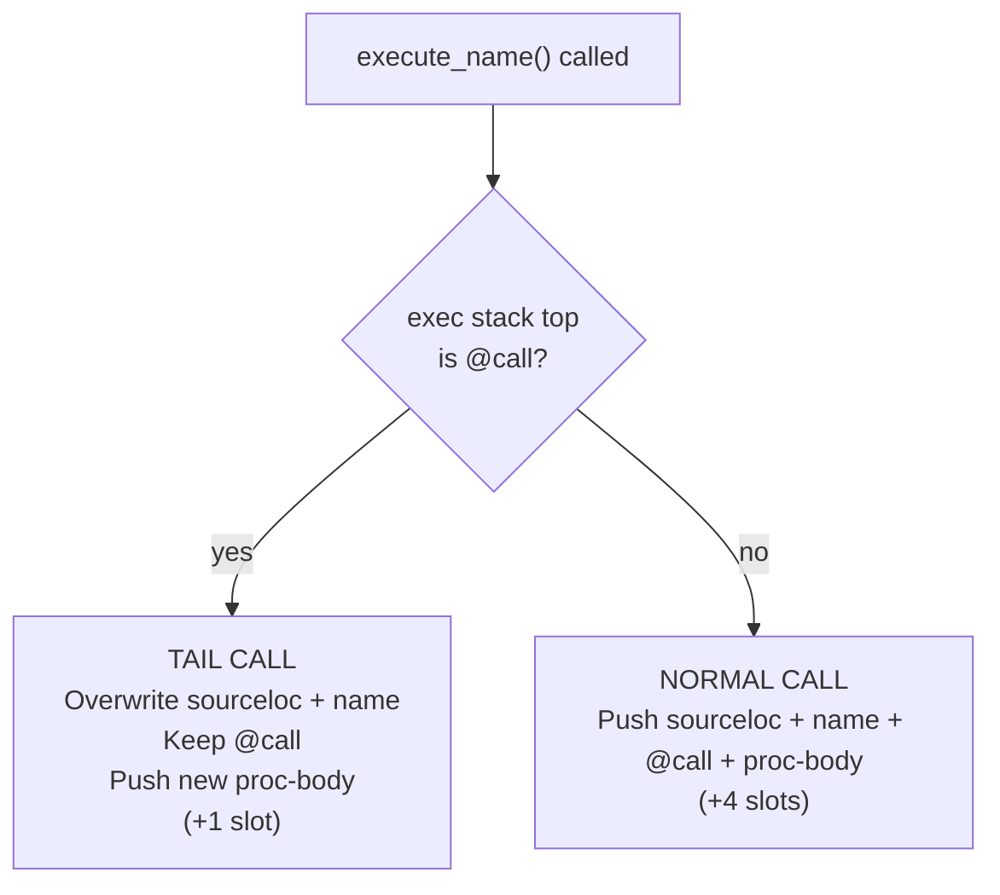

<!--
   ______    _
  /_  __/___(_)_  __
   / / / __/ /\ \/ /       Stack-Based Interpreter & VM
  / / / / / /  > · <      C++23 · Single-Header Library
 /_/ /_/ /_/  /_/\_\     Copyright 2026 Mark Guidarelli

Licensed under the Apache License, Version 2.0 (the "License");
you may not use this file except in compliance with the License.
You may obtain a copy of the License at

    https://www.apache.org/licenses/LICENSE-2.0

Unless required by applicable law or agreed to in writing, software
distributed under the License is distributed on an "AS IS" BASIS,
WITHOUT WARRANTIES OR CONDITIONS OF ANY KIND, either express or implied.
See the License for the specific language governing permissions and
limitations under the License.
-->

# Tail Call Optimization in Trix

Trix performs automatic tail call optimization on every named tail call.
No annotations, no keywords, no compiler flags. If a function's last action
is to call another function, the call reuses the existing stack frame instead
of pushing a new one. This transforms recursive algorithms from O(n) stack
usage to O(1) -- constant space regardless of recursion depth.

On a default 2048-slot exec stack, unoptimized recursion fails at ~500
depth. With TCO, the same stack supports 100,000+ recursive calls. This is
not a theoretical capability -- Trix's test suite exercises it routinely.

---

## Table of Contents

1. [Overview](#1-overview)
2. [Quick Reference](#2-quick-reference)
3. [Why TCO Matters](#3-why-tco-matters)
4. [How Trix TCO Works](#4-how-trix-tco-works)
5. [Tutorial: Recursive Patterns](#5-tutorial-recursive-patterns)
6. [What Gets TCO'd](#6-what-gets-tcod)
7. [What Defeats TCO](#7-what-defeats-tco)
8. [TCO and Functional Programming](#8-tco-and-functional-programming)
9. [Verification](#9-verification)
10. [Design Decisions](#10-design-decisions)

---

## 1. Overview

Tail call optimization (TCO) eliminates the stack growth of recursive
function calls when the call is in *tail position* -- meaning nothing
remains to do after the call returns. Trix detects tail position
automatically at runtime and reuses the caller's stack frame.

| Property                   | Value                                                                       |
| -------------------------- | --------------------------------------------------------------------------- |
| Detection                  | Automatic (no annotation required)                                          |
| Scope                      | All named tail calls (`execute_name`)                                       |
| Stack growth per tail call | +1 slot (constant, vs +4 without TCO)                                       |
| Maximum tested depth       | 100,000+ recursive calls                                                    |
| Patterns covered           | Direct, mutual, N-way cycle, via exec, via load+exec                        |
| Cost on non-tail path      | Zero (check is a single pointer comparison)                                 |
| Backtrace impact           | Intermediate tail frames are collapsed (standard behavior)                  |
| Coroutine support          | Independent TCO per coroutine (own exec stack segment)                      |
| External barriers          | try, stopped, dip, finally, with-stream -- recursive calls still TCO'd      |
| Closure TCO                | Single-layer closures (`\|x\|`) get TCO via early @end-locals cleanup       |
| Nested closures            | Two+ layers of `\|x\| \|y\|` still block TCO (only one @end-locals handled) |

---

## 2. Quick Reference

### Gets TCO (constant stack space)

| Pattern | Example | Why |
| --- | --- | --- |
| Direct tail call | `/f { ... f } def` | `f` is last element; @call exposed |
| Tail through if-else | `/f { ... { f } { g } if-else } def` | Branch resolves to single tail call |
| Tail through if | `/f { ... { f } if } def` | Single-branch tail call |
| Mutual recursion | `/f { ... g } def /g { ... f } def` | Each call replaces caller's frame |
| N-way cycle | `/a { ... b } /b { ... c } /c { ... a }` | Frame reuse chains indefinitely |
| Via exec | `/f { ... { f } exec } def` | exec pushes proc; interpreter unrolls to tail |
| Via load+exec | `/f { ... /f load exec } def` | Same mechanism as exec |
| With save/restore | `/f { save restore ... f } def` | save/restore in body, tail call at end |
| With ExtValues | `/f { ... 1l sub f } def` | Long/Double/Address arguments preserved |
| Anonymous (dup exec) | `{ ... dup exec }` | No @call frames at all; inherently constant-space |
| Through external barriers | `{ N f } try` | Barrier below @call; recursive calls see @call |
| Single-layer closures | `/f { \|n\| ... f } def` | @end-locals cleaned up early; @call reused |
| Inside coroutines | `[ { N f } coroutine-launch` | Per-coroutine exec stack; independent TCO |

### Does NOT get TCO (stack grows per call)

| Pattern | Example | Why |
| --- | --- | --- |
| Work after call | `/f { ... f 1 pop } def` | `1 pop` remains on exec stack |
| Call not last | `/f { ... f pop 0 } def` | `pop 0` follows the call |
| Two calls | `/f { ... f f pop } def` | First `f` is not in tail position |
| Inside loop body | `{ { f } loop }` | @loop barrier between call and @call |
| Inside repeat body | `{ 10 { f } repeat }` | @repeat barrier |
| Inside for body | `{ 0 1 10 { f } for }` | @for barrier |
| Nested closures | `/f { \|x\| { \|y\| ... f } ... } def` | Two @end-locals above @call; only one handled |

**Note:** External barriers (try, stopped, dip, finally, with-stream) do NOT
block TCO for recursive calls. The barrier sits below the function's @call
frame. Only the initial call from the barrier body is non-tail; recursive
calls within the function see @call on top and get full TCO. See Section 7
for the complete analysis.

---

## 3. Why TCO Matters

### The Fundamental Problem

Functional programming replaces loops with recursion. Every recursive call
consumes stack space. Without TCO, the stack is the hard limit on recursion
depth:

```
% Without TCO: each call pushes a 4-slot frame
/countdown {
    dup 0 le { pop } { 1 sub countdown } if-else
} def

% 2048-slot exec stack / 4 slots per call = ~500 max depth
% Without TCO, { 600 countdown } try would => /execstack-overflow
% (In Trix this call IS tail-recursive, so TCO applies and it succeeds.)
```

This is why Python, Ruby, and Tcl cannot express infinite iteration as
recursion. Their stack limits are typically 1,000-10,000 frames, and every
recursive call consumes one. Algorithms that naturally express as recursion
(tree traversal, graph search, state machines, parsers) must be manually
rewritten as loops.

### What TCO Solves

TCO transforms recursive calls in tail position into jumps. The call reuses
the existing stack frame instead of pushing a new one:

```
% With TCO: the @call frame is reused each iteration
% Same function, same stack -- 100,000+ depth:
100000 countdown      % works, stack depth stays constant
```

This means:
- **Recursion is as efficient as iteration.** A tail-recursive function uses
  the same constant stack space as a `loop`.
- **No artificial depth limits.** The recursion depth is bounded only by the
  algorithm's termination, not by stack capacity.
- **Functional patterns work at scale.** map, filter, reduce, and other
  higher-order patterns can be implemented recursively without concern for
  stack overflow.

---

## 4. How Trix TCO Works

### The @call Frame

When Trix calls a named function, it pushes a 3-slot tracking frame
(sourceloc + name + @call) onto the exec stack for backtrace purposes,
plus the proc-body that runs first -- 4 slots in total:

```
Execution stack (grows upward, top = rightmost):

  ... | sourceloc | name | @call | proc-body
        ^           ^       ^       ^
        file/line   caller  cleanup runs first
        /col        name    marker
```

- **sourceloc**: Source file, line, and column of the call site
- **name**: The literal name of the called function (for backtrace)
- **@call**: A control operator that cleans up the frame on return
- **proc-body**: The executable procedure body (runs first)

When the procedure completes, the interpreter pops @call, which removes the
name and sourceloc below it. The frame is gone and execution continues.

### Tail Position Detection

When `execute_name()` is about to push a new frame, it first checks whether
the current exec stack top is @call:



This single check is the entire TCO detection. It works because:

- If the current name is the **last element** of a procedure body, all other
  elements have already been popped from the exec stack. The only thing
  remaining is the @call marker from the enclosing call.
- If any work remains (more procedure elements, loop barriers, try barriers),
  those elements sit between the current position and @call, and the check
  fails naturally.

### Frame Reuse

When a tail call is detected, instead of pushing 4 new slots, Trix
overwrites the existing frame's companions and pushes only the new procedure
body:

```
BEFORE (caller's frame):
  ... | sourceloc-old | name-old | @call |

AFTER (tail call replaces frame):
  ... | sourceloc-new | name-new | @call | new-proc-body
                                            ^
                                            only 1 new slot pushed
```

The @call marker stays in place. When the tail callee eventually returns,
@call cleans up the new companions -- exactly as it would have cleaned up
the old ones.

**Stack growth per call:**
- Without TCO: +4 slots (sourceloc + name + @call + proc)
- With TCO: +1 slot (proc only; frame is reused)

On a 2048-slot exec stack:
- Without TCO: ~500 maximum depth (2048 / 4)
- With TCO: 100,000+ depth (only the proc body consumes a slot, and each
  iteration's proc body replaces the previous one)

### Why It's Safe

Three properties make frame reuse safe:

1. **SourceLoc is a pure value.** It has no VM allocation, no ExtValue, no
   reference counting. Overwriting it has no side effects.

2. **The Name companion is a VM offset to immutable storage.** Names are
   interned and shared. Overwriting the offset does not leak or corrupt
   the Name data.

3. **@call remains in place.** It will clean up whichever companions are
   present when the tail callee eventually returns. It does not care whether
   they are the original companions or replacements.

---

## 5. Tutorial: Recursive Patterns

### 5.1 Basic Tail Recursion: Countdown

The simplest pattern -- a function whose only action in the recursive case is
to call itself:

```
/countdown {
    dup 0 le { pop } { 1 sub countdown } if-else
} def

100000 countdown        % works: stack depth stays constant
```

**Why it gets TCO:** `countdown` is the last element of the `{ 1 sub countdown }`
branch. When `if-else` pushes the chosen branch and the interpreter unrolls
it, `countdown` is the final name. All proc elements before it (`1 sub`) have
been consumed. The exec stack top is @call. TCO applies.

### 5.2 Accumulator Pattern: Factorial

Many recursive algorithms carry an accumulator parameter to avoid work after
the recursive call:

```
% Non-tail: result = n * factorial(n-1)  -- multiplication AFTER the call
/fact { dup 1 le { } { dup 1 sub fact mul } if-else } def

% Tail: accumulator carries the product; tail call is the last action
/fact-acc {
    % n acc -- result
    exch dup 1 le { pop } { dup rot mul exch 1 sub exch fact-acc } if-else
} def

10 1 fact-acc           % => 3628800 (10!)
```

The accumulator pattern transforms any single-recursion algorithm into a
tail-recursive one by passing the intermediate result as a parameter.

### 5.3 Accumulator Pattern: Fibonacci

```
/fib-acc {
    % n a b -- fib(n)
    /b exch def /a exch def /n exch def
    n 0 eq { a } { n 1 sub  b  a b add  fib-acc } if-else
} def

20 0 1 fib-acc          % => 6765
```

Without TCO, this would fail at ~500 depth. With TCO, it runs to arbitrary
depth.

### 5.4 Accumulator Pattern: Sum

```
/sum-acc {
    % n acc -- sum(1..n)
    exch dup 0 le { pop } { dup rot add exch 1 sub exch sum-acc } if-else
} def

1000 0 sum-acc          % => 500500
```

### 5.5 Mutual Tail Recursion

Two functions calling each other in tail position. Both calls get TCO'd:

```
/is-even-tco {
    dup 0 eq { pop true } { 1 sub is-odd-tco } if-else
} def

/is-odd-tco {
    dup 0 eq { pop false } { 1 sub is-even-tco } if-else
} def

10000 is-even-tco       % => true (10,000 mutual calls, constant space)
```

Each call replaces the previous caller's @call frame. The frame alternates
between `is-even-tco` and `is-odd-tco` without growing.

### 5.6 N-Way Cycle

TCO works through arbitrarily long call cycles:

```
/step-a { dup 0 le { pop (a) } { 1 sub step-b } if-else } def
/step-b { dup 0 le { pop (b) } { 1 sub step-c } if-else } def
/step-c { dup 0 le { pop (c) } { 1 sub step-a } if-else } def

3000 step-a             % => (a) (cycles a->b->c->a->... 1000 times)
3001 step-a             % => (b)
3002 step-a             % => (c)
```

### 5.7 GCD (Euclidean Algorithm)

A classic tail-recursive algorithm:

```
/gcd-tco {
    % a b -- gcd(a,b)
    dup 0 eq { pop } { exch over mod gcd-tco } if-else
} def

48 18 gcd-tco           % => 6
12345 6789 gcd-tco      % => 3
```

### 5.8 Collatz Sequence

A more complex recursive algorithm with conditional branching, both branches
in tail position:

```
/collatz-len {
    % steps n -- steps
    dup 1 le {
        pop
    } {
        dup 2 mod 0 eq { 2 div } { 3 mul 1 add } if-else
        exch 1 add exch collatz-len
    } if-else
} def

0 27 collatz-len        % => 111 (27 has a notoriously long sequence)
```

### 5.9 Tail Call via exec

`exec` pushes a procedure onto the exec stack. If the procedure contains
a single tail call, TCO applies through the `exec`:

```
/exec-countdown {
    dup 0 le { pop } { 1 sub { exec-countdown } exec } if-else
} def

10000 exec-countdown    % works: TCO through exec
```

### 5.10 Anonymous Recursion (dup exec)

The `dup exec` idiom passes the procedure to itself. No @call frames are
created at all -- the pattern is inherently constant-space:

```
% Stack: n proc
50000 {
    exch dup 0 le { pop pop } { 1 sub exch dup exec } if-else
} dup exec
% works: 50,000 iterations, zero @call frames
```

---

## 6. What Gets TCO'd

### Complete Catalog

| # | Pattern | Stack Growth | Mechanism |
| --- | --- | --- | --- |
| 1 | `/f { ... f } def` | O(1) | `f` is last element; @call exposed after proc consumed |
| 2 | `/f { ... { f } { g } if-else } def` | O(1) | Chosen branch has `f` or `g` as last element |
| 3 | `/f { ... { f } if } def` | O(1) | Single-branch if with tail call |
| 4 | `/f { ... g } def /g { ... f } def` | O(1) | Mutual tail calls; each replaces caller's frame |
| 5 | `/a { b } /b { c } /c { a }` | O(1) | N-way cycle; frame reuse chains indefinitely |
| 6 | `/f { ... { f } exec } def` | O(1) | `exec` pushes proc; interpreter unrolls; @call exposed |
| 7 | `/f { ... /f load exec } def` | O(1) | Same as exec: resolved proc unrolled to tail |
| 8 | `{ ... dup exec }` | O(1) | No @call frames at all; inherently constant-space |
| 9 | `/f { save restore ... f } def` | O(1) | save/restore in body; tail call still in tail position |
| 10 | `/f { ... 1l sub f } def` | O(1) | ExtValue (Long/Double/Address) arguments handled correctly |
| 11 | `/f { ... dup pop dup pop f } def` | O(1) | Multi-step body with tail call at end |
| 12 | Curry in tail position | O(1) | `execute_curry` dispatches tail call through reused frame |
| 13 | Through external barriers | O(1) | try/stopped/dip/finally/with-stream: barrier below @call |
| 14 | Single-layer closures | O(1) | @end-locals cleaned up early; @call frame reused |
| 15 | Inside coroutines | O(1) | Per-coroutine exec stack; TCO independent |

### Why Each Works

The key insight is that TCO fires whenever the exec stack top is @call at
the moment `execute_name()` runs. Anything that leaves @call as the top element
gets TCO'd. This includes:

- **if-else**: Pushes one branch to exec stack. That branch is a procedure whose
  last element is the tail call. When the branch is unrolled and the tail call
  is the only remaining element, @call is exposed.
- **exec**: Pushes its operand to exec stack and returns. If the operand is a
  single-element procedure containing the tail call, @call is exposed.
- **save/restore**: These execute as operators (popped from exec stack) before
  the tail call name. They do not leave barriers.
- **External barriers** (try, stopped, dip, finally, with-stream): The barrier
  is placed below the function's @call frame.  The initial call from the
  barrier body does not see @call, but recursive tail calls within the
  function see their own @call on top.
- **Single-layer closures** (`|x| ...`): @end-locals sits above @call, but
  closure-aware TCO detects this pattern, executes the @end-locals cleanup
  early (pop frame dict, clear bindings, recycle), and reuses the @call frame.
  Safe because all arguments are already on the operand stack.
- **Coroutines**: Each coroutine has its own exec stack segment.  TCO detects
  @call on the coroutine's exec stack independently.

---

## 7. What Defeats TCO

### Three Categories of Barriers

Not all barriers affect TCO the same way.  The critical factor is where
the barrier sits relative to the function's @call frame:

| Category       | Barrier position           | Effect on recursive tail calls              |
| -------------- | -------------------------- | ------------------------------------------- |
| **Structural** | N/A (not in tail position) | TCO impossible                              |
| **Loop**       | Inside loop body           | TCO blocked per iteration                   |
| **External**   | Below @call                | Initial call not TCO'd; recursive calls ARE |
| **Internal**   | Above @call                | TCO blocked completely                      |

### Structural: Not in Tail Position

These patterns fundamentally prevent TCO because the call is not the last
action:

| #   | Pattern                  | Why                                     | Refactoring                     |
| --- | ------------------------ | --------------------------------------- | ------------------------------- |
| 1   | `/f { ... f 1 pop } def` | `1 pop` remains on exec stack after `f` | Move work before the call       |
| 2   | `/f { ... f pop 0 } def` | `pop 0` follows the call                | Use accumulator pattern         |
| 3   | `/f { ... f f pop } def` | First `f` is not last element           | Restructure to single tail call |

### Loop Barriers

Loop control operators place barriers inside the loop body.  Each iteration
reestablishes the barrier, so recursive calls inside loop bodies are always
non-tail:

| #   | Pattern               | Why                            | Refactoring                        |
| --- | --------------------- | ------------------------------ | ---------------------------------- |
| 4   | `{ ... { f } loop }`  | @loop barrier sits above @call | Use tail recursion instead of loop |
| 5   | `{ N { f } repeat }`  | @repeat barrier                | Use tail recursion with counter    |
| 6   | `{ 0 1 N { f } for }` | @for barrier                   | Use tail recursion with counter    |

### Internal Barriers: Closures (Single-Layer TCO)

Closures (`|x| ...`) push an @end-locals control operator inside the function
body, **above** @call:

```
exec stack:   ... | sourceloc | name | @call | @end-locals | proc-body
                                        ^         ^
                                    function   closure cleanup
                                    frame      INSIDE frame
```

**Closure-aware TCO** detects this pattern: when the exec stack top is
@end-locals and @call is directly below it, the interpreter executes the
@end-locals cleanup early (pops the frame dict from the dict stack, clears
name bindings, recycles the dict), then reuses the @call frame.

This is safe because all tail-call arguments are already materialized on the
operand stack -- no lazy references to the frame dict remain.  The new
invocation's `begin-locals` will push a fresh frame dict + @end-locals,
restoring the expected exec stack shape.

| #   | Pattern                                | TCO? | Mechanism                           |
| --- | -------------------------------------- | ---- | ----------------------------------- |
| 7   | `/f { \|n\| ... f } def`               | Yes  | Single @end-locals cleaned up early |
| 8   | `/f { \|x\| { \|y\| ... f } ... } def` | No   | Two @end-locals; only one handled   |

**Tested:** 100,000-depth single-layer closure recursion, mutual closure
recursion at 10,000 depth, closure + accumulator patterns.

**Nested closures** (two+ layers of `|x| |y|`) push multiple @end-locals
above @call.  Closure TCO only handles one @end-locals, so nested closures
still overflow the dict stack (~60 frame dicts on the default 64-slot dict
stack, so ~30 deep for two-layer nesting).
For deeply nested closures, use explicit stack manipulation:

```
% Nested closure version (TCO blocked, max ~30 depth):
/f { |x| { |y| ... f } x exch exec } def

% Stack version (full TCO, unlimited depth):
/f { dup 0 le { pop } { 1 sub f } if-else } def
```

### External Barriers: Do NOT Block Recursive TCO

External barriers (try, stopped, dip, finally, with-stream) wrap a function
call.  Their barrier is placed **below** the function's @call frame:

```
exec stack:   ... | @try-barrier | sourceloc | name | @call | proc-body
                       ^                                 ^
                   barrier from                      function's own
                   wrapping construct                 @call frame
```

The initial call from the barrier body sees @try-barrier (not @call) on
the exec stack, so it does not get TCO.  But once inside the function,
each recursive tail call sees its own @call on top -- exactly as if no
barrier existed.

| Barrier     | Initial call | Recursive calls | Tested depth |
| ----------- | ------------ | --------------- | ------------ |
| try         | Not TCO'd    | TCO'd           | 100,000      |
| Nested try  | Not TCO'd    | TCO'd           | 100,000      |
| stopped     | Not TCO'd    | TCO'd           | 100,000      |
| dip         | Not TCO'd    | TCO'd           | 100,000      |
| finally     | Not TCO'd    | TCO'd           | 100,000      |
| with-stream | Not TCO'd    | TCO'd           | 100,000      |

**In practice, external barriers have negligible impact on TCO.**  For a
100,000-depth recursion inside try, 99,999 calls are TCO'd and only the
initial call is not.

### Coroutines

Each coroutine has its own exec stack segment.  TCO operates
independently within each coroutine, using the same @call detection
mechanism.  Tested at 10,000-depth self-recursion and 5,000-depth mutual
recursion inside coroutines (test_coroutine.trx sections 21-22).

### The General Rule

**TCO applies when the exec stack top is @call (standard TCO) or @end-locals
with @call directly below (closure TCO).** Anything else on the exec
stack between the call and @call prevents TCO -- not through special-case
logic, but because the check naturally fails.

The critical distinction is *where* the barrier sits relative to @call:
- **Below @call** (external barriers): only the initial call is affected;
  recursive calls see @call on top and get full TCO.
- **Single @end-locals above @call** (single-layer closures): closure TCO
  cleans up the frame dict early and reuses the @call frame.
- **Multiple barriers above @call** (nested closures, remaining proc
  elements): TCO does not fire.
- **Inside loop bodies**: barrier is reestablished each iteration; recursive
  calls inside loops are always non-tail.

### Refactoring Non-Tail to Tail

**Before (non-tail -- work after the call):**
```
/fact {
    dup 1 le { } { dup 1 sub fact mul } if-else
} def
% mul happens AFTER fact returns -> not tail position
```

**After (tail -- accumulator carries the work):**
```
/fact-acc {
    exch dup 1 le { pop } { dup rot mul exch 1 sub exch fact-acc } if-else
} def
% fact-acc is the LAST action -> tail position -> TCO
```

The transformation: move the post-call work into a parameter (the
accumulator) that is updated before the recursive call.

---

## 8. TCO and Functional Programming

### Recursion as the Only Loop

In pure functional programming, there are no mutable loop variables. Iteration
is expressed as recursion. TCO makes this practical:

```
% Functional map (tail-recursive with accumulator)
/map-tco {
    % proc arr result -- result
    1 index length 0 eq {
        exch pop exch pop
    } {
        1 index 0 get 3 index exec   % map arr[0] through proc
        append                       % result <- result + mapped element
        exch 1 drop exch             % arr <- arr without its first element
        map-tco
    } if-else
} def
```

Without TCO, this fails on arrays longer than ~500 elements. With TCO, it
works on arrays of any size.

### Infinite Iteration

TCO enables infinite iteration as tail recursion -- the classic
functional programming pattern:

```
% Event loop: process events forever
/event-loop {
    get-next-event
    process-event
    event-loop          % tail call: runs forever in constant space
} def
```

This is how Scheme, Erlang, and Haskell implement event loops and server
main loops. Without TCO, this would exhaust the stack in seconds.

### State Machines

State machines map directly to mutually tail-recursive functions:

<!-- doctest: skip (synopsis: get-input/process are stand-ins; states are mutually recursive) -->
```
/state-idle {
    get-input
    dup (start) eq { pop state-running } {
    dup (quit) eq  { pop state-done } {
        pop state-idle
    } if-else } if-else
} def

/state-running {
    get-input
    dup (stop) eq  { pop state-idle } {
    dup (error) eq { pop state-error } {
        process pop state-running
    } if-else } if-else
} def

/state-error {
    log-error
    state-idle          % recover to idle
} def

/state-done { } def

state-idle              % runs indefinitely in constant space
```

Each state is a function. Transitions are tail calls. The machine runs
forever without growing the stack.

### No Trampolining Needed

In languages without TCO (Python, Java, JavaScript), the standard workaround
is *trampolining* -- wrapping recursive calls in thunks and running a loop
that evaluates them:

```python
# Python: manual trampolining (because Python has no TCO)
def trampoline(f, *args):
    result = f(*args)
    while callable(result):
        result = result()
    return result
```

Trix does not need trampolining. TCO is automatic. The programmer writes
natural recursive code and the VM handles the optimization.

---

## 9. Verification

### Proving TCO is Happening

Trix provides runtime introspection operators that let you verify TCO is
active during execution:

**`query-status` with `exec-top-is-call`:**

```
/verify-tco {
    dup 0 le {
        pop /exec-top-is-call query-status
    } { 1 sub verify-tco } if-else
} def

1000 verify-tco         % => true (@call is exposed = TCO is active)
```

If TCO were not working, 1000 new frames would push @call below other entries,
and `exec-top-is-call` would return false (or the stack would overflow first).

**`query-status` with `call-depth`:**

```
/check-depth {
    dup 0 le {
        pop /call-depth query-status
    } { 1 sub check-depth } if-else
} def

10000 check-depth       % => 1 (only one @call frame, reused 10,000 times)
```

### Backtrace Evidence

`backtrace` shows the collapsed frames:

```
/inner { backtrace } def
/outer { inner } def       % tail call: TCO collapses outer's frame

outer length                % => 1 (only inner's frame; outer was TCO'd)
```

Without TCO, `outer` calling `inner` would show 2 frames. With TCO, `outer`'s
frame is replaced by `inner`'s, so only 1 frame appears.

Compare with a non-tail call that preserves both frames:

```
/inner { backtrace } def
/outer { inner 0 pop } def     % NOT tail: 0 pop after inner

outer length                % => 2 (both frames visible)
```

### Stack Overflow as Proof of Non-TCO

The complementary test: verify that non-tail patterns actually overflow,
proving the TCO check is not being applied incorrectly:

```
/non-tail { dup 0 le { } { 1 sub non-tail 1 pop } if-else } def
{ 2000 non-tail } try      % => /execstack-overflow (correctly not TCO'd)
```

---

## 10. Design Decisions

### Why Automatic (Not Annotated)?

Annotation-based TCO (Kotlin's `tailrec`, Scala's `@tailrec`) catches errors
at compile time -- if you annotate a non-tail function, the compiler warns you.
Trix chose automatic detection because:

- **Stack-based languages have no function signatures.** There is no
  declaration site where an annotation would go. A Trix "function" is just a
  name bound to a procedure.
- **Runtime detection is trivial.** The check is one pointer comparison. In
  a compiled language, the compiler must analyze control flow to determine
  tail position. In Trix, the exec stack *is* the control flow --
  if @call is on top, we're in tail position.
- **False negatives are safe.** If the check misses a tail call (which it
  does not in practice), the result is a normal call that works correctly
  but uses more stack. There is no incorrect behavior, only suboptimal
  performance.

### Why @call Frame Reuse?

Alternative TCO implementations include:

- **Trampoline loop:** Convert tail calls to thunks, run a loop. Requires
  heap allocation per thunk.
- **Goto/label:** Convert tail calls to jumps. Not applicable in an
  interpreter with a heterogeneous exec stack.
- **Stack rewriting:** Move the return continuation. Complex and fragile.

The @call frame reuse approach is the simplest possible implementation:

1. Check one pointer (`m_exec_ptr->operator_is_call()`)
2. Overwrite two values (sourceloc and name)
3. Push one value (the new procedure body)

No allocation, no thunks, no continuation manipulation. Three memory writes
and the tail call is complete.

### Why Preserve SourceLoc?

The @call frame stores a SourceLoc (file, line, column) for backtrace
purposes. TCO overwrites it with the new call's location. This means the
backtrace shows the most recent tail call's location, not intermediate
callers. This is the correct behavior -- it matches what Scheme, Lua, and
Erlang do. The alternative (discarding location data) would make debugging
harder with no space savings.

### The Backtrace Trade-Off

TCO inherently loses intermediate call history. A function that tail-calls
itself 10,000 times shows only the final frame in the backtrace, not all
10,000. This is a universal trade-off in TCO-implementing languages:

- **Scheme:** Same behavior. Specified by R7RS.
- **Lua:** Same behavior. `debug.traceback()` shows only the current tail frame.
- **Erlang:** Same behavior. Process stack shows only the current state.

The trade-off is worth it. The alternative -- keeping all 10,000 frames --
would defeat the purpose of TCO (constant stack space). For debugging,
`query-status` with `call-depth` can verify that TCO is active, and
strategic logging can capture intermediate state when needed.

### Why Not Optimize Operators?

Trix's TCO applies to named calls that resolve to procedures (executable
arrays/packed arrays/strings/streams). It does not apply to operators
(native C++ functions) because:

- **Operators are leaf functions.** They execute and return in a single
  interpreter step. There is no "frame" to reuse -- the operator runs
  inline.
- **Operators do not recurse through the interpreter.** A C++ function
  cannot be in "tail position" relative to the Trix exec stack.
- **The @call frame is for backtrace identification.** Operators are
  self-identifying via `m_last_operator_ptr` and do not need @call frames.

This is not a limitation. Any recursive algorithm can be expressed as a
named procedure, and named procedures get full TCO.

---

