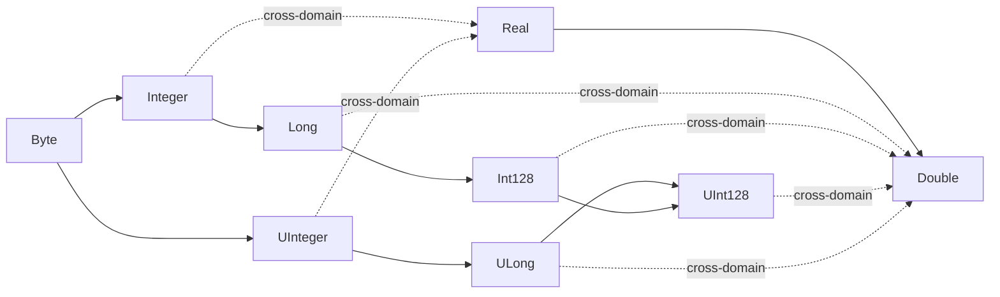

<!--
   ______    _
  /_  __/___(_)_  __
   / / / __/ /\ \/ /       Stack-Based Interpreter & VM
  / / / / / /  > · <      C++23 · Single-Header Library
 /_/ /_/ /_/  /_/\_\     Copyright 2026 Mark Guidarelli

Licensed under the Apache License, Version 2.0 (the "License");
you may not use this file except in compliance with the License.
You may obtain a copy of the License at

    https://www.apache.org/licenses/LICENSE-2.0

Unless required by applicable law or agreed to in writing, software
distributed under the License is distributed on an "AS IS" BASIS,
WITHOUT WARRANTIES OR CONDITIONS OF ANY KIND, either express or implied.
See the License for the specific language governing permissions and
limitations under the License.
-->

# Trix Language Reference

This document is the authoritative reference for writing Trix test cases.
It covers syntax, semantics, all operators with stack effects, error names,
and test-writing patterns. Consult this before writing any `.trx` test file.

> **Interactive source-level debugger.** Trix ships a terminal debugger:
> `./trix --inspect FILE` opens a TUI for single-stepping, plain/conditional/
> one-shot breakpoints, watch expressions, and live inspection of every VM
> stack, with a sandboxed `:p` prompt for evaluating Trix at the halt point.
> Its entire user-facing UI is implemented in Trix itself
> ([`lib/debugger.trx`](../lib/debugger.trx), ~1900 lines) over a thin layer
> of C++ intrinsics -- a working demonstration of the language's
> expressiveness. See [debugger.md](debugger.md) for the full guide.

---

## 1. Type System

Trix has 31 value types (5-bit type field, 31 of 32 slots used; 1
reserved), each fitting in an 8-byte Object. Types marked **ExtValue** use an 8-byte
heap extension for 64-bit values; types marked **WideValue** use a 16-byte
heap extension for 128-bit values.

Although ExtValue/WideValue storage lives in the VM heap, these types
behave as plain **value objects** from the program's point of view --
exactly like Integer or Boolean.  In particular they never raise
`/invalid-restore`: a Long or Int128 created above a `save` barrier and
still on a stack at `restore` time is transparently relocated below the
barrier with its value intact, unlike local composites (strings,
arrays, dicts), which are rejected.  The heap extension is an
implementation detail, not a sharing or lifetime semantic.  See
[save-restore.md](save-restore.md) for the relocation mechanism.

| Type         | Suffix        | Size             | Heap      | Example              |
| ------------ | ------------- | ---------------- | --------- | -------------------- |
| Null         | --            | 0                | No        | `null`               |
| Byte         | `b`           | 8-bit unsigned   | No        | `65b`, `(A)#b`       |
| Integer      | `i` (or none) | 32-bit signed    | No        | `42`, `42i`, `-7`    |
| UInteger     | `u`           | 32-bit unsigned  | No        | `42u`                |
| Long         | `l`           | 64-bit signed    | ExtValue  | `42l`, `-1l`         |
| ULong        | `ul`          | 64-bit unsigned  | ExtValue  | `42ul`               |
| Int128       | `q`           | 128-bit signed   | WideValue | `42q`, `-1q`         |
| UInt128      | `uq`          | 128-bit unsigned | WideValue | `42uq`               |
| Address      | `a`           | 64-bit unsigned  | ExtValue  | `0a`                 |
| Real         | (decimal)     | 32-bit float     | No        | `3.14`, `1e3`        |
| Double       | `d`           | 64-bit float     | ExtValue  | `3.14d`, `1.0d`      |
| Boolean      | --            | 1-bit            | No        | `true`, `false`      |
| Operator     | --            | index            | No        | `//add`              |
| Mark         | --            | 0                | No        | `mark`               |
| Name         | `/` prefix    | offset           | No        | `/foo`, `//add`      |
| Array        | `[...]`       | offset+len       | No        | `[1 2 3]`            |
| Packed       | `{...}`       | offset+len       | No        | `{ 1 add }`          |
| String       | `(...)`       | offset+len       | No        | `(hello)`            |
| Stream       | --            | offset+sid       | No        | file/memory          |
| Dict         | `<<...>>`     | offset           | No        | `<< /a 1 >>`         |
| SourceLoc    | --            | offset+sid       | No        | (internal)           |
| Curry        | --            | offset           | No        | `curry` result       |
| Thunk        | --            | offset           | No        | `thunk` result       |
| Set          | `{{...}}`     | offset           | No        | `{{ 1 /a (hi) }}`    |
| Tagged       | --            | offset           | No        | `tag` result         |
| Record       | --            | offset+len       | No        | `record-type` result |
| Coroutine    | --            | offset           | No        | `coroutine-launch`   |
| PipeBuffer   | --            | offset           | No        | `pipe` result        |
| Cell         | --            | offset           | No        | `cell` result        |
| Continuation | --            | offset           | No        | `capture` result     |
| OpaqueHandle | --            | offset+kind      | (varies)  | `make-screen` result |

### OpaqueHandle: the escape hatch for new object families

The 5-bit type field has 32 slots; once they're all spent, no new
top-level type can be added without breaking the 8-byte Object
representation.  `OpaqueHandle` is the last slot, claimed deliberately
as a **generic carrier** whose payload is discriminated by a separate
`HandleKind` byte stored in the Object's existing length slot.

This means future opaque object families -- a tilemap, an audio sample,
a mmap'd region, a database cursor -- can be added without ever
extending the type field or migrating snapshots.  The recipe (C++ side):

1. Append a value to the `HandleKind` enum (e.g. `Tilemap = 1`).
2. Add an attribute row to `sm_object_attrib` indexed at
   `TypeCount + kind`.
3. Implement the constructors and `make-*` op + the kind's accessor
   ops.  PrintFmt automatically picks up the kind via the existing
   `OpaqueHandle` dispatch.

From Trix code, every kind shares the umbrella type name:

```
80 24 make-screen  type     % /opaque-handle-type  (NOT /screen-type)
80 24 make-screen  ==       % --screen:80x24--     (kind shows in PrintFmt)
```

The `type` operator returns `/opaque-handle-type` for every kind.
Distinguish kinds via `screen?` / `handle-kind` (returns the kind
as a Name for OpaqueHandles, `null` for non-handles), via the
`==`/`%O` PrintFmt output (which prints the kind name), or via
the kind-specific accessor ops (e.g. `screen-cols` raises
`/type-check` on a non-screen handle).  See §3.17.1 for the
currently-shipped kind (Screen) and the per-kind op set.

### Numeric Literals

```
42          % Integer (default)
42i         % Integer (explicit)
42u         % UInteger
42l         % Long
42ul        % ULong
42q         % Int128 (128-bit signed, "quad")
42uq        % UInt128 (128-bit unsigned, "unsigned quad")
42b         % Byte (0-255)
0a          % Address
3.14        % Real
3.14d       % Double
1e3         % Real (scientific, = 1000.0)
1.5e2d      % Double (scientific)
.5          % Real (leading dot)
5.          % Real (trailing dot)
```

### Radix Prefix

```
16#FF#      % hex Integer (255)
16#FF#u     % hex UInteger
16#FF#l     % hex Long
16#FF#q     % hex Int128
16#FF#uq    % hex UInt128
2#1010#     % binary (10)
8#77#       % octal (63)
36#Z#       % base-36 (35)
```

### Standard Prefix (0x, 0o, 0b)

```
0xFF        % hex Integer (255)
0o77        % octal Integer (63)
0b1010      % binary Integer (10)
0xFF#b      % hex Byte (suffix requires '#' separator)
0xFF#u      % hex UInteger
0xFF#l      % hex Long
0xFF#ul     % hex ULong
0xFF#q      % hex Int128
0xFF#uq     % hex UInt128
0xFF#a      % hex Address
0XFF        % case insensitive prefix (0X, 0O, 0B)
0xFFb       % hex FFB = 4091 (b is a digit without '#')
0x1.Fp4     % hex float Real 31.0 (p exponent mandatory)
0xA.BCp0#d  % hex float Double 10.734375
0x1p8       % hex float Real 256.0 (no fractional part)
```

### Special Values

```
true false  % Boolean
null        % Null
inf  nan    % Real infinity/NaN
inf#d nan#d % Double infinity/NaN
```

---

## 2. Scanner Syntax

### Cheat Sheet — All Prefixes and Suffixes

A one-page summary of every scanner-recognized sigil.  Detailed sections
below cover each in depth.

**Memorable invariant:** `$` always means "global VM"; `$$` always means
"force-local VM"; `#` always introduces a literal-shape suffix.  The
character carries the same semantic in prefix and suffix position.

#### Prefixes — Names

| Prefix | Example  | Meaning                                                         |
| ------ | -------- | --------------------------------------------------------------- |
| `/`    | `/foo`   | Literal Name                                                    |
| `\`    | `\foo`   | Executable Name (runtime lookup)                                |
| `//`   | `//foo`  | Immediate-lookup literal (resolved at scan time)                |
| `\\`   | `\\foo`  | Immediate-lookup executable                                     |
| `$/`   | `$/foo`  | Literal Name interned in global VM                              |
| `$\`   | `$\foo`  | Executable Name interned in global VM                           |
| `$$/`  | `$$/foo` | Literal Name **force-interned in local VM**                     |
| `$$\`  | `$$\foo` | Executable Name force-interned in local VM                      |
| `.`    | `.field` | Field-access sugar — desugars to `/field get` (chains `.a.b.c`) |

#### Prefixes — Blocks, scopes, infix, strings

| Prefix | Example      | Meaning                                                                 |
| ------ | ------------ | ----------------------------------------------------------------------- |
| `${`   | `${ body }`  | Global-alloc scope (body scanned + run with `m_curr_alloc_global=true`) |
| `$${`  | `$${ body }` | Force-local scope (symmetric inverse of `${...}`)                       |
| `$[`   | `$[ a + b ]` | Promoted (auto-widening) infix                                          |
| `$(`   | `$( a + b )` | Non-promoting infix (strict type match)                                 |
| `(`    | `(text)`     | String literal (escape-aware; nests balanced `()`)                      |
| `<(`   | `<(raw)>`    | Raw string (no escapes; literal `\`; terminated by `>`)                 |
| `<`    | `<48 65 6C>` | Hex string (whitespace-tolerant)                                        |

#### Prefixes — Numbers

| Prefix      | Example  | Meaning                            |
| ----------- | -------- | ---------------------------------- |
| `0x` / `0X` | `0xFF`   | Hex integer                        |
| `0b` / `0B` | `0b1010` | Binary integer                     |
| `0o` / `0O` | `0o777`  | Octal integer                      |
| `-`         | `-42`    | Negative                           |
| `R#`        | `16#FF#` | Radix-prefixed integer (R = 2..36) |

#### Mark / bracket delimiters

| Open | Close | Meaning                      |
| ---- | ----- | ---------------------------- |
| `[`  | `]`   | Array literal (mark + close) |
| `<<` | `>>`  | Dict literal                 |
| `{{` | `}}`  | Set literal                  |
| `{`  | `}`   | Procedure literal            |

#### Comments

| Prefix | Form        | Meaning                  |
| ------ | ----------- | ------------------------ |
| `%`    | `% line`    | Line comment (to EOL)    |
| `%{`   | `%{ ... %}` | Block comment (nestable) |

#### Suffixes — Numbers

| Suffix               | Type                               |
| -------------------- | ---------------------------------- |
| *(none, int-shape)*  | `Integer` (i32)                    |
| *(none, real-shape)* | `Real` (f32)                       |
| `i` / `u`            | `Integer` (i32) / `UInteger` (u32) |
| `l` / `ul`           | `Long` (i64) / `ULong` (u64)       |
| `a`                  | `Address` (vm_offset_t)            |
| `r` / `d`            | `Real` (f32) / `Double` (f64)      |
| `b`                  | `Byte` (u8)                        |
| `q` / `uq`           | `Int128` / `UInt128`               |

#### Suffixes — Strings — `#[b]` | `#a[r|w]` | `#[=|$|$$][l|x][r|w]`

| Suffix               | Meaning                                                          |
| -------------------- | ---------------------------------------------------------------- |
| `#b`                 | Single Byte (length-1 string only)                               |
| `#a` / `#ar` / `#aw` | Byte array `[ 104b 101b … ]` (no string allocated)               |
| `#=`                 | eq-string (pre-allocated scratch)                                |
| `#$`                 | Force string bytes in **global VM**                              |
| `#$$`                | Force string bytes in **local VM** (override enclosing `${...}`) |
| `#l` / `#x`          | Literal / Executable attribute                                   |
| `#r` / `#w`          | ReadOnly / ReadWrite                                             |

#### Suffixes — Array / Dict / Set — `#[=|$|$$][r|w]`

| Suffix      | Meaning                                                 |
| ----------- | ------------------------------------------------------- |
| *(none)*    | Follow enclosing `m_curr_alloc_global` (default: local) |
| `#=`        | eq-array / eq-dict / eq-set (temporary storage)         |
| `#$`        | Force container in **global VM**                        |
| `#$$`       | Force container in **local VM**                         |
| `#r` / `#w` | ReadOnly / ReadWrite (default)                          |

#### Suffixes — Procs — `#[=|$|$$][a|p][e|l][r|w]`

| Suffix      | Meaning                                    |
| ----------- | ------------------------------------------ |
| `#=`        | eqproc (scratch storage)                   |
| `#$`        | Force proc body in **global VM**           |
| `#$$`       | Force proc body in **local VM**            |
| `#a` / `#p` | Array form / Packed form (default)         |
| `#e` / `#l` | Early binding / Late binding (default)     |
| `#r` / `#w` | ReadOnly (packed is always RO) / ReadWrite |

Combinations: `#$er` (global, packed, early-bound, read-only),
`#$$aer` (force-local array early-bound read-only), etc.

`#a` (array form) trades memory for dispatch speed: it stores the
already-decoded body so a hot loop does not re-decode it each iteration
(~15% on a dispatch-bound loop, at ~8-16x the body footprint).  See
`interpreter.md` Section 8.1.  **`#a` is ignored (and the scanner warns)
for a procedure with a `|...|` or `||` locals preamble:** the locals
transform wraps the body into a nested packed proc, so the array form would
not reach it.  Locals procedures are always packed.

`#e` (early binding) is usually the bigger lever, and costs nothing: it
resolves the body's operator names to direct operator references at scan time,
so each call skips the dictionary-stack lookup.  It beats `#a` on the same
microbenchmark (-23.9% vs -14.6%), stacks with it as `#ae` (-36.1%), and --
because the body stays packed (an operator reference encodes *smaller* than the
name) -- has no footprint cost, so unlike `#a` it keeps paying off applied
across a whole hot path: early-binding the bundled Z-machine interpreter's
44-proc hot core cut 10.7% off a real-game walkthrough.  Unlike `#a`, `#e` binds
**recursively**, reaching through a `|...|` locals body.  `#e` is safe only when
each name's scan-time meaning is its run-time meaning -- do NOT early-bind a
proc that relies on an operator being redefined later.  A `|...|` preamble
**param** that shadows an operator name *is* safe: the binder knows the
preamble names (the proc's own at every nesting depth, plus any enclosing
locals proc's) and leaves those references alone, so the param wins over the
operator just as it does under late binding.  The remaining hazard is a frame
local installed by `local-def` / `bind-locals` whose name shadows an operator:
that name is invisible at scan time, so `#e` freezes the body reference to the
operator (declare it as a preamble param instead, or do not early-bind).  The
opt-in lint `tests/check_operator_shadows.py` flags the operator-named-local
hazard.  See `interpreter.md` Section 8.2.

#### Slot-indexing of frame locals

A locals proc's references to its **own frame locals** — both parameters and
declared `/locals` — where they appear directly in the proc's top-level body, are
compiled at scan time into direct frame-slot references: the run-time resolver
indexes the proc's frame dict by position (`O(1)`, no hash, no dictionary-stack
walk) instead of looking the name up.  This is always on — no suffix — and gives
the same hot-loop speedup as `#e` for the common case of reading a frame local,
but without `#e`'s sensitivity to binding cache invalidation under recursion or
`save`.  A consequence is that an own-frame local reference is no longer a name at
all, so it is inherently immune to the `#e` operator-shadow hazard above (the
frame local always wins).

A declared `/local` is reserved a frame slot on entry but is not assigned until
`local-def` (or `store`) runs, so a slot-ref read of a still-unassigned `/local`
raises `/undefined` — it is *pinned* to the slot rather than falling through to an
enclosing binding (the local is declared for the whole frame).  Once assigned it
reads its value.  (A *dynamic* name lookup of an unassigned `/local` — e.g. a
computed name, or a reference from a nested proc — still falls through, since only
direct slot-ref reads pin.)

Scope is **depth-0 only**: a frame local referenced inside a *nested* proc keeps a
dynamic name, because Trix frame scoping is dynamic — a nested proc may be stored
and run after its enclosing frame has returned, so its outer-frame references can
only be resolved at call time.  Frame locals stay reachable by name as well
(`/p load`, reflection, and dynamic lookup all still see an assigned local), so
slot-indexing is transparent except for the speedup.

#### Parameters vs declared locals (`/`-prefix)

Inside the `|...|` preamble a **bare** name is a **parameter** — popped from the
operand stack on proc entry — while a **`/`-prefixed** name is a **declared
local**: it reserves a frame slot but is *not* popped and *not* bound, so it
reads `/undefined` until the body assigns it with `local-def` (or `store`).
Declaring locals in the preamble (rather than only via `local-def`) makes the
whole frame namespace visible at scan time, which is what lets `#e` early binding
leave an operator-named local alone (see the `#e` note above).

| Form                | Meaning                                           |
| ------------------- | ------------------------------------------------- |
| `\| a b \|`         | 2 params (popped); capacity 2                     |
| `\| a b /t /acc \|` | 2 params + 2 declared locals; capacity 4          |
| `\| /t /acc \|`     | 0 params + 2 declared locals (named-scratch form) |

Two rules (both raise `/syntax-error` at scan time): all parameters must precede
any `/local` (a bare name after a `/local` is rejected), and no name may repeat —
param/param, param/local, and local/local duplicates are all rejected. (The
param/param case, e.g. `|a a|`, was silently accepted before v0.10.x; it is now
an error.)

#### Suffixes — Locals preamble capacity

Below, `K` is the total declared-name count `P + M` (P params + M declared locals).

| Suffix            | Meaning                                                          |
| ----------------- | ---------------------------------------------------------------- |
| `\| a b c \|`     | Bare preamble — frame dict capacity = number of names (K)        |
| `\| a b c \| #N`  | Absolute capacity (N ≥ K)                                        |
| `\| a b c \| #+N` | Relative capacity (total = K + N)                                |
| `\| \| #N`        | Empty preamble + capacity N (empty frame dict for `def` scratch) |

#### Mutex constraints

  * **First slot of `#`** is one of `=` / `$` / `$$` — any pair raises
    `/syntax-error` ("mutually exclusive").
  * **`#pw`** raises `/unsupported` (packed procs are always ReadOnly).
  * **`#$$$` suffix** raises `/syntax-error` (max two `$`). A literal `$$$`
    prefix is parsed as the ordinary name `$$$` (-> `/undefined` if executed),
    not a scan-time `/syntax-error`.

---

### Comments
```
% line comment (to end of line)
%{ block comment %}
%{ outer %{ inner %} still in outer %}    % nestable: depth tracked
```

Block comments nest: each `%{` increments depth, each `%}` decrements;
the comment ends only when depth returns to zero.  An unterminated
block comment (EOF before the closing `%}`) is a scan-time syntax
error.

### Lexical suffixes are contiguous

A `#`-suffix or immediate letter-suffix must follow its host token with no
intervening whitespace **or comment**.  This applies uniformly:

<!-- doctest: skip (lexical suffix syntax illustration) -->
```
42.0d        % double literal
16#FF#       % radix integer
(hello)#r    % ReadOnly string
[1 2 3]#=    % eq-array
{ add }#p    % packed proc
<< /k 1 >>#r % ReadOnly dict
{{ 1 2 }}#r  % ReadOnly set
|locals|#N   % capacity suffix on proc preamble (absolute)
|locals|#+N  % capacity suffix on proc preamble (relative: K+N)
```

Comments are otherwise transparent between tokens, but they *do* break the
host-to-suffix bond the same way whitespace does.  `42 d` is two tokens; so is
`42 % note\n d`.  When you want the suffix to attach, keep it flush with the
closing delimiter.

### Numeric Literals

Numeric literal *forms* (radix prefix, hex/octal/binary prefix, scientific
notation, type suffix) are listed in §1 alongside each type's row -- this
subsection covers the cross-cutting scanner rules.

**Underscore separators.**  A `_` between two digits acts as a visual
separator and is stripped at scan time:

```
1_000                   % 1000  (Integer)
1_000_000l              % 1000000l  (Long)
0x12_34                 % 4660  (hex prefix)
0xDE_AD                 % 57005 (hex prefix, hex-letter neighbors)
0o17_77                 % 1023  (octal prefix)
0b10_10                 % 10    (binary prefix)
16#12_34#               % 4660  (radix decimal-digit pairs)
16#DE_AD#               % 57005 (radix hex-digit pairs)
0x1A.B_Cp4              % 427.75  (hex float, _ in fraction part)
0x1Fp4_2                % decimal exponent, decimal-digit neighbors
3.1_4                   % 3.14
1.5e1_0                 % 1.5e10
```

Underscores must be flanked by valid digit characters in the local
context and never lead or trail.  Per-region rules:

- **`BASE#DIGITS#` radix region** -- hex digits (0-9, A-F, a-f) on
  both sides.
- **`0x` / `0X` prefix** -- hex digits up to the exponent introducer
  `p`/`P`; decimal digits in the exponent itself.  So `0xDE_AD`,
  `0x1A.B_Cp4`, and `0x1Fp4_2` all parse; `0xFFp_4` and `0xFF_p4`
  do not (the `_` is adjacent to `p`).
- **`0o` / `0O` prefix** -- octal digits (0-7).
- **`0b` / `0B` prefix** -- binary digits (0, 1).
- **Decimal mantissa, decimal exponent, plain decimal** -- decimal
  digits (0-9).

Doubled `__`, leading `_42`, trailing `42_`, or `_` adjacent to a sign
/ `.` / `e` / `E` / `p` / `P` / `#` / type-suffix are all scan errors.

### Strings
```
(hello)                 % basic string
()                      % empty string
(nested (parens) ok)    % balanced parens work
```

**Paren balance.**  Inside a `(...)` string, parentheses must remain balanced.
The scanner counts depth: `(` increments, `)` decrements; the string ends
only when depth returns to zero.  Consequence: `(()` is an unterminated string
(scanner reports `EndOfStream encountered within a (string)`) and `())` is
two tokens (the empty string `()` followed by a stray `)` that raises a
syntax error).  To embed a single literal `(` or `)`, escape it: `(\()` and
`(\))`.

**Escape sequences** inside `(...)`:
```
\n    newline (10)          \r    carriage return (13)
\t    tab (9)               \\    backslash
\a    bell (7)              \b    backspace (8)
\e    escape (27)           \f    form feed (12)
\v    vertical tab (11)
\(    literal (             \)    literal )
\101  octal (1-3 digits)    \xHH  hex (1-2 digits)
\^A   caret control (1)     \0    null byte
\uXXXX    Unicode codepoint (4 hex digits, UTF-8 encoded)
\UXXXXXXXX  Unicode codepoint (8 hex digits, UTF-8 encoded)
\{name}  interpolation — immediate name lookup, value spliced as text
```

Any other `\X` is a syntax error (`invalid \ escape sequence encountered
within a (string)`).  In particular `\d`, `\w`, `\s` and other
regex-style metas DO NOT work inside a regular `(...)` string — pass regex
source through a raw string (`<(\d+)>`) or double the backslash (`(\\d+)`).
(`\b` is *not* a regex meta here: it is a recognized escape that produces a
backspace byte — see the escape table above.)

**Interpolation** (`\{name}`): Resolves at scan time (like `//`). Supports dict
paths: `\{:systemdict:numbers:real-type:pi}`. All types are interpolatable --
values are formatted via `PrintFmt::process_object()` (same output as `=`).

**String suffixes** (after closing paren) follow the grammar
`#[=|$|$$|b|a][l|x][r|w]` -- each `[ ]` group is optional, the
alternatives within a group are mutually exclusive, and the order is
fixed (the scanner rejects out-of-order combinations as a syntax
error).  Defaults: literal attribute, writable access, normal string
storage:

| Group | Effect when present                                                                     |
| ----- | --------------------------------------------------------------------------------------- |
| `=`   | use eq-string temporary storage (one-shot, see §2 "Temporary Containers")               |
| `$`   | allocate string bytes in global VM (survives save/restore); mutually exclusive with `=` |
| `$$`  | force string bytes into local VM; mutually exclusive with `=`                           |
| `b`   | convert 1-char string to Byte; mutually exclusive with `a`                              |
| `a`   | scan as Byte array `[ 104b 101b ... ]`; mutually exclusive with `b`                     |
| `l`   | literal attribute (default); mutually exclusive with `x`                                |
| `x`   | executable attribute; mutually exclusive with `l`                                       |
| `r`   | ReadOnly access; mutually exclusive with `w`                                            |
| `w`   | ReadWrite access (default); mutually exclusive with `r`                                 |

```
(hello)#r       % ReadOnly
(hello)#x       % Executable
(hello)#xr      % Executable + ReadOnly
(A)#b           % convert 1-char string to Byte
(hello)#=       % use eq-string temporary storage
(hello)#=r      % eq-string + ReadOnly
(hello)#$       % string bytes in global VM (survives restore)
(hello)#$r      % global VM + ReadOnly
(hello)#$$      % force-local VM (overrides enclosing ${...})
(hello)#lw      % explicit Literal + Writable (defaults)
(hello)#a       % Byte array: [ 104b 101b 108b 108b 111b ] (save/restore journaled)
(hello)#ar      % ReadOnly Byte array
```

**Hex strings:**
```
<48656C6C6F>     % "Hello"
<48 65 6C 6C 6F> % whitespace ignored
<>               % empty
<41>#b           % hex string to Byte
```

**Raw strings** (`<(...)>`): No escape processing; backslash is a literal
byte.  Balanced parentheses inside are included in the output.  Supports
the same `#` suffixes as regular strings.
```
<(hello\nworld)>       % literal backslash-n, not a newline
<(nested (parens) ok)> % balanced parens work
<(C:\Users\foo)>       % no escape processing
```

### Names
<!-- doctest: skip (name-form syntax illustration) -->
```
/foo             % Literal name (pushed as data)
\foo             % Executable name (looked up when encountered)
//foo            % Immediate literal lookup (resolved at scan time)
\\foo            % Immediate executable lookup (scan time)
//:path:to:key   % Hierarchical dict path -- literal at scan time
\\:path:to:key   % Hierarchical dict path -- executable at scan time
$/foo            % Literal name interned in GLOBAL VM (survives restore)
$\foo            % Executable name interned in GLOBAL VM (survives restore)
```

The `:`-delimited path forms walk a chain of named dicts (each segment
keyed by the dict's `/name`) starting at `systemdict` if the first
segment matches a registered root, otherwise treated as a userdict
key.  `//:` resolves the leaf and pushes it as a literal value;
`\\:` resolves and applies the executable attribute, so the result
fires immediately during execution rather than being captured.

Names beginning with `@` are **reserved for internal use** and cannot be bound
by user code.  The `@`-prefix namespace holds the interpreter's trampoline and
continuation-barrier operators (see the "`@`-prefix internal operators" note
below), which manipulate the execution stack directly; binding such a name with `def`,
`local-def`, `def-persist`, or `bind-locals` raises `/invalid-name`.

**Shadowing a built-in operator: `def` vs `override`.**  A global `def` or
`def-persist` whose key names a **built-in operator** also raises
`/invalid-name`.  Silently shadowing an operator is a foot-gun: late binding
resolves to your value, but an early-bound (`#e`) or already-cached reference
still reaches the operator -- a silent split.  To shadow one deliberately, use
`override`, which *requires* the name to be a built-in operator (otherwise
`/undefined`, pointing you back to `def`).  The two thus partition every
bindable name -- exactly one accepts any given name:

| Binding                             | Name is a built-in operator      | Name is not              |
| ----------------------------------- | -------------------------------- | ------------------------ |
| `def` / `def-persist` `/name`       | `/invalid-name` (use `override`) | binds                    |
| `override /name`                    | binds (deliberate shadow)        | `/undefined` (use `def`) |
| `local-def` / `bind-locals` `/name` | binds (frame-local, allowed)     | binds                    |

Frame-local binders (`local-def`, `bind-locals`, and locals-frame preambles)
are unaffected: operator names overlap heavily with good local-variable names
(`sum`, `count`, `max`), so a frame-local shadow is allowed.  `override` changes
only late-binding resolution -- an already-`#e`-early-bound body or an
already-cached name still reaches the operator, so `override` states intent, it
does not retroactively rebind.

### Arrays
```
[1 2 3]         % Literal array (ReadWrite, default)
[]              % Empty array
[[1] [2]]       % Nested arrays
[1 2 3]#r       % ReadOnly
[1 2 3]#w       % ReadWrite (explicit; same as default)
[1 2 3]#=       % eq-array (temporary storage)
[1 2 3]#=r      % eq-array + ReadOnly
[1 2 3]#=w      % eq-array + ReadWrite
[1 2 3]#$       % force global VM (survives save/restore; container struct only)
[1 2 3]#$r      % force global + ReadOnly
[1 2 3]#$w      % force global + ReadWrite
[1 2 3]#$$      % force local VM (overrides enclosing ${...})
[1 2 3]#$$r     % force local + ReadOnly
```

Suffix grammar: `#[=|$|$$][r|w]`.  First slot picks the storage class
(eq-temp / force-global / force-local); each is mutex with the others.
`r`/`w` mutually exclusive; default is ReadWrite.  Same grammar applies
to dict and set literals below.

### Procedures (Packed Arrays)

Proc suffixes follow the grammar `#[=|$|$$][a|p][e|l][r|w]` --
each `[ ]` group optional, alternatives within a group mutually
exclusive, fixed scan order:

| Group | Effect when present                                                       |
| ----- | ------------------------------------------------------------------------- |
| `=`   | use eq-proc temporary storage                                             |
| `a`   | scan as a regular (unpacked) Array; mutually exclusive with `p`           |
| `p`   | scan as a Packed array (default); mutually exclusive with `a`             |
| `e`   | early binding (resolve names at scan time); mutually exclusive with `l`   |
| `l`   | late binding (default; resolve at exec time); mutually exclusive with `e` |
| `r`   | ReadOnly access; mutually exclusive with `w`                              |
| `w`   | ReadWrite access; mutually exclusive with `r`                             |

**Packed procs are always ReadOnly** -- they live in the compact
binary-token format which has no in-place edit story.  Adding `#w`
to a packed proc (default or explicit `#p`) raises a scan-time error
"`packed procedure must be ReadOnly`".  Use `#a` (Array form) when
you need a writable proc body.  Default packed procs are emitted as
ReadOnly without the user writing `#r`.

```
{ 1 2 add }     % Packed procedure (default; ReadOnly)
{ 1 2 add }#a   % Array procedure (not packed; ReadWrite)
{ 1 2 add }#p   % Packed (explicit)
{ 1 2 add }#e   % Early binding
{ 1 2 add }#l   % Late binding (default)
{ 1 2 add }#ar  % Array + ReadOnly
{ 1 2 add }#aw  % Array + ReadWrite (explicit)
{ 1 2 add }#pe  % Packed + Early binding
{ 1 2 add }#er  % Early binding + ReadOnly
{ 1 2 add }#=p  % eq-packed (temporary)
{ 1 2 add }#=ae % eq-array + early binding
```

**Local variable binding** (inside procs):
```
{ |x| x 1 add }                          % single param
{ |a b| a b add }                        % multiple params
{ |x y z| x y mul z add }                % complex body
{ |a b /t /acc| /t a b mul local-def     % 2 params + 2 declared locals;
  /acc t t add local-def acc }                           %   t, acc read /undefined until assigned
{ | /t /acc| /t 1 local-def /acc 2 local-def t acc add } % named-scratch (0 params)
{ |a b|#8 /t a b mul local-def t t add }                 % absolute: 8 slots total
                                           % (2 params + up to 6 local-def'd working vars)
{ |a b|#+6 /t a b mul local-def t t add }        % relative: 2 params + 6 extras = 8 total
{ ||#4 /x 10 local-def /y 32 local-def x y add } % no-args scratch form: empty header,
                                                 % capacity N >= 1, local-def populates
{ ||#+4 /x 10 local-def /y 32 local-def x y add } % same, relative form
```
Locals create a **frame dict** (see Glossary) pushed on the dict stack on
proc entry and popped on proc exit.  The default capacity equals the
declared name count K (= P params + M declared locals); append `#N` (no
whitespace or comment between `|` and `#`; see "Lexical suffixes are
contiguous" above) to request `N >= K` so the body can `local-def` up to
`N - K` additional working variables into the same frame dict. `N` must be
in `K..65535`.  Declared locals (`/t`) and `local-def`'d working variables
share the same frame dict and capacity; the difference is only that a
declared local is named at scan time (so `#e` and tooling can see it).

**`local-def` vs `def`.**  After Wart 02 (the def-skips-frame fix),
`def` writes past `|...|` frame dicts and lands in the topmost
non-frame dict on the dict stack -- the enclosing scope, not the
current frame.  Use `local-def` to write into the frame.  This means
working-var assignments inside a `|...|`-bound proc must use
`local-def`; using `def` there is almost always a bug (the binding
escapes the frame and persists past proc exit).

**Comments inside the pipe-header.**  Line and block comments are
transparent between `{` and the opening `|`, and between names within
the pipe-header itself.  This lets you annotate the stack effect or
individual params:

```
{ % stack effect: a b -- a+b
  |a b| a b add }
{ |a   % the multiplicand
  b    % the multiplier
  | a b mul }
```

The closing `|` and the `#N` / `#+N` suffix are still bound by the
standard "lexical suffixes are contiguous" rule -- whitespace or a
comment between `|` and `#` breaks the bond and the `#N` token is
treated as a separate (and almost certainly invalid) token, typically
surfacing as a runtime `begin-locals` underflow rather than a scan
error.  Keep the suffix flush with the closing `|`.

**Relative form `#+N`.**  `|a b|#+N` requests `N` *additional* slots
beyond the named args -- total capacity is `K + N`.  This is usually
the form authors actually want: it lets you add or remove a named arg
without re-counting the suffix, and the number you write equals the
number of `local-def`s the body needs.  Existing absolute-form `#N`
keeps working unchanged; the two forms can coexist in the same file
freely.  `K + N` must still be `<= 65535`.

| Form            | Meaning                          | Capacity |
| --------------- | -------------------------------- | -------- |
| `\| a b \|`     | default: capacity = K            | 2        |
| `\| a b \| #5`  | absolute: capacity = N (N >= K)  | 5        |
| `\| a b \| #+3` | relative: capacity = K + N       | 5        |
| `\| a b \| #+0` | relative: same as default        | 2        |
| `\| \| #4`      | empty header, absolute, N >= 1   | 4        |
| `\| \| #+4`     | empty header, relative, K+N >= 1 | 4        |

The empty-header form `||#N` / `||#+N` (K=0) declares a scratch frame
dict with no stack-popped bindings -- use it when a proc takes no
arguments but still wants frame-dict semantics (allocator pooling,
save/restore transparency) for its `/foo def` locals.  A bare `||` with
no suffix, `||#0`, or `||#+0` is a syntax error.

**save / restore interaction:** frame dicts are transparent to
`save` / `restore`.  A frame dict created after `save` and still on
the dict stack at `restore` time is compacted out in place (its
storage is about to be reclaimed by the VM rollback); the dict stack
is left with its non-frame shape otherwise unchanged.  User-facing
transaction layers (BEGIN/ROLLBACK mapped onto save/restore) may
iterate across frame boundaries with `|locals|` at the dispatcher
level without special handling.  Non-frame dicts pushed via `begin`
above the save barrier still trip `/invalid-restore` "dict past
save barrier" as before -- only frame dicts are excluded.

### Dicts

Suffix grammar `#[=|$|$$][r|w]` (same as Arrays).

```
<< /a 1 /b 2 >>         % ReadWrite fixed dict (default)
<< >>                   % Empty dict (capacity 4, ReadWrite)
<< /a 1 >>#r            % ReadOnly
<< /a 1 >>#w            % Explicit ReadWrite
<< /a 1 >>#=            % eq-dict (temporary storage)
<< /a 1 >>#=r           % eq-dict + ReadOnly
<< /a 1 >>#=w           % eq-dict + ReadWrite
<< /a 1 >>#$            % force global VM (survives save/restore)
<< /a 1 >>#$r           % force global + ReadOnly
<< /a 1 >>#$$           % force local VM (overrides enclosing ${...})
```

### Sets

Suffix grammar `#[=|$|$$][r|w]` (same as Arrays).

```
{{ 1 2 3 }}             % Integer set (ReadWrite)
{{ /a /b /c }}          % Name set (ReadWrite)
{{ 1 /a (hello) true }} % Mixed-type set (heterogeneous)
{{ }}                   % Empty set (capacity 4, ReadWrite)
{{ 1 2 3 }}#r           % ReadOnly
{{ 1 2 3 }}#w           % Explicit ReadWrite
{{ 1 2 3 }}#=           % eq-set (temporary storage)
{{ 1 2 3 }}#=r          % eq-set + ReadOnly
{{ 1 2 3 }}#=w          % eq-set + ReadWrite
{{ 1 2 3 }}#$           % force global VM (survives save/restore)
{{ 1 2 3 }}#$r          % force global + ReadOnly
{{ 1 2 3 }}#$$          % force local VM (overrides enclosing ${...})
```
Sets are unordered collections of unique keys. They share Dict's VM hash table
infrastructure but use compact 12-byte entries (key Object only, no value)
versus Dict's 20-byte entries. Keys may be any hashable type (same as dict
keys: all types except Null), and a single set may contain keys of different
types (heterogeneous). Duplicate keys in the literal are silently deduplicated.

### Temporary Containers (`#=` suffix)

`(...)#=`, `[...]#=`, `{...}#=`, `<<...>>#=`, and `{{...}}#=` all reuse a
shared per-kind buffer to avoid VM-heap fragmentation for short-lived values.
Each kind (eqstring, eqarray, eqproc, eqdict, eqset) is validated by a
generation counter:

- **One-shot semantics.**  Creating a second `#=` value of the same kind
  bumps the counter and invalidates any outstanding ref of that kind.
  Accessing a stale ref raises `Unsupported`:

  ```
  Trix unsupported '<op>': stale )#= reference: storage reused by a subsequent )#=
  ```

  This is an error, not silent corruption.  Use `#=` refs immediately, or
  materialize a fresh standalone copy before stashing -- there is no
  single-value clone op, so rebuild the value (e.g. `() (...)#= concat` for a
  string, or rebuild it inside a `${...}` global-VM block).

- **Survive packing, with staleness preserved.**  An eqref *can* be stored
  in a packed array (`{...}`, the `packed` op, or any other path that calls
  `make_packed_data`) -- it is encoded via the `PackedExt` mechanism using
  a per-kind subcode plus the original generation counter.  Reading the
  eqref out of the packed container resolves through the same generation
  check, so staleness propagates correctly:

  ```
  { (first)#= 1 packed (second)#= pop 0 get 0 get }#a try /unsupported eq
  % The packed slot still references the eqstring; the second )#= bumped
  % the counter and invalidated it, so reading raises Unsupported.
  ```

  Cost: each packed eqref takes ~5-8 bytes (header + subcode + length +
  generation) vs 8 bytes for a regular Object.  To include a *non-stale*
  reference inside a packed proc, materialize a fresh standalone value first
  (there is no single-value clone op -- rebuild the value, e.g. via `concat`
  or inside a `${...}` global-VM block, before packing it).

- **Monotonic counters.**  The generation counter is not rolled back on
  `restore`, so a ref that became stale inside a `save` block stays stale
  after `restore`.  On exhaustion (2³² creations), further `#=` raises
  `LimitCheck` rather than wrapping.

See `docs/vm-internals.md` § 13 for implementation details.

### Global VM Allocation (`${...}`, `$/`, `$\`, `#$`)

Global VM is a journal-skipped region above the local VM heap; values
allocated there survive any number of `save`/`restore` cycles.  Three
scanner-aware surfaces opt allocations into global (plus three symmetric
inverses that force-local back out of an enclosing global scope), plus
two runtime ops for direct flag control.

```
${ body }         % scope block: scans body with the global-alloc flag set,
                  % then runs body with the runtime flag set; flag is
                  % saved/restored on entry/exit (incl. on error unwind).
$/foo             % literal name interned in global VM (per-name)
$\foo             % executable name interned in global VM (per-name)
(str)#$           % string bytes in global VM
[arr]#$           % array storage in global VM
<<dict>>#$        % dict struct in global VM
{{set}}#$         % set struct in global VM
{proc}#$          % proc storage (packed bytes or Array) in global VM

% Force-local inverses (useful inside ${...} when one element should stay local):
$${ body }        % scope block: force-local scan + runtime; saves/restores
                  % the flag just like ${...}.
$$/foo            % literal name force-interned in local VM
$$\foo            % executable name force-interned in local VM
(str)#$$          % string bytes force-allocated in local VM
[arr]#$$          % array storage force-allocated in local VM
<<dict>>#$$       % dict struct force-allocated in local VM
{{set}}#$$        % set struct force-allocated in local VM
{proc}#$$         % proc storage force-allocated in local VM
```

**Scope vs. per-literal.**  `${...}` propagates *through* its body --
every literal Name interned during scan and every flag-honoring
allocation during runtime lands in global until the matching `}`.
`$/foo`, `$\foo`, and `<lit>#$` are *per-form* directives that don't
affect surrounding scan.  Pick whichever fits:

<!-- doctest: skip (illustrates per-name vs scope prefixes; g is a placeholder dict) -->
```
% one-off: per-name prefix
g $/persist-key 42 put

% scope: many names + structures
${
    /populate {
        g /alpha 1 put
        g /beta  2 put
        g /gamma 3 put
    } def
}
```

**Container `#$` is container-only.**  `<</a 1>>#$` puts the dict
struct in global; the literal name `/a` is interned wherever it would
have been (local by default).  For a fully-global dict, write
`${ <</a 1>> }` -- the `${...}` block makes both the Name and the
struct global.

**`#=`, `#$`, and `#$$` are mutually exclusive** (different storage
classes); any pair (`#=$`, `#=$$`, `#$=`, `#$$=`, etc.) raises
`/syntax-error` with a clear "mutually exclusive" message.

**Pre-interning hot names at startup.**  Trix interns a Name on its
first reference and at that moment the enclosing
`m_curr_alloc_global` decides where the Name struct lands.  This is
lazy and convenient, but it means the *first* use of a Name pays an
interning cost the rest don't, and the *first* use inside a `${...}`
block determines whether the Name ends up local or global for the
rest of the program.

For programs where this matters -- microbenchmarks that mistake
first-use cost for steady-state cost, libraries that want their
canonical Names placed deterministically, hot loops that should
never trigger an intern -- write a one-time pre-intern preamble at
the top of the file (or in an `init` proc that runs before any
measured code):

```trix
% Hot names that should live in local VM at sl=0:
/iter pop /done pop /st-mode pop /st-expr pop

% Hot names that should live in global VM (survive save/restore):
$/persist-key pop $/cache-tag pop $/audit-log pop
```

`pop` discards the literal Name Object the scanner pushed; the
side-effect that matters -- the Name's entry in the global Name
table -- persists.  Names interned at save level 0 are stable
forever; subsequent references resolve through the existing entry
without re-interning.  This pattern is one line per Name, works
today with no new ops, and replaces three subtle bugs at once:
first-use timing surprises, accidental local interning inside an
early `${...}`, and Name-identity drift across `save`/`restore`
cycles.

**Direct flag control.**  When `${...}` blocks aren't a fit -- e.g.,
the flag needs to span a proc call, or be driven by a Boolean
computed at runtime:
```
true set-global             % opt subsequent allocs into global
\(allocations here\)
false set-global            % flip back

current-global              % -- bool : peek the flag
```

Concrete cases for `set-global`:

<!-- doctest: skip (illustrative procs calling undefined helper names) -->
```trix
% (1) Long initialisation sequence split across procs.  `init-app`
% enforces global-allocation policy in one place; helpers stay agnostic.
/init-app {
    true set-global
    load-config-from-disk
    build-name-index
    register-handlers
    false set-global
} def

% (2) Caller-driven persistence flag; can't be a literal scope.
/load-feed {
    % path bool -- result-dict
    set-global
    parse-feed-file              % uses dict / array / string internally
    false set-global             % always restore default
} def

(catalog.json) true  load-feed /catalog exch def       % persistent
(query.json)   false load-feed /one-shot exch def      % local
```

For everything else -- literals, single-proc scoped scans -- prefer
`${...}`, `$/foo`, or `<lit>#$`.  `set-global` is the escape hatch.

**Runtime allocator ops honor the flag.**  `array`, `dict`,
`dynamic-dict`, `set`, and `string` (the `int -- container` ops)
consult `m_curr_alloc_global` and route to global VM when set.  So
`${ 100 dict }` produces a global dict, `${ 256 string }` a global
string buffer, etc.  This makes `${...}` and `set-global`/
`current-global` the single uniform mechanism -- no separate
`make-global-XXX` family is needed.

**Restore semantics.**  Names interned in global survive `restore`;
names interned in local (the default) at `save_level > 0` are
unlinked when their save level rolls back.  A Dict allocated globally
keeps its Name-keyed entries valid only if the Names themselves are
also global.  See §7.7.1 "The Persist Family" for the contrast with
the older `-persist` family.

**Introspection: `vm-global-info`.**  Every global allocation
carries a **16-byte `GvmBlock` header** tagged with a `ChunkKind`.
The full schema (23 kinds) covers the entire Trix heap-backed
Object-type taxonomy.  As of the VM-Redux Phase 3 rollout the active
set is:

  * **Composite, allocated today** (every byte has a `gvm_alloc`
    caller): `name`, `dict`, `set`, `array`, `string`, `packed`,
    `curry`, `thunk`, `tagged`, `record`, `coroutine-context`,
    `coroutine-stacks`, `mailbox`, `monitor`, `pipebuffer`,
    `binding-bucket`, `binding-entry`, `supervisor`, `other`,
    `gc-scratch`.
  * **Leaf, allocated today**: `long`, `ulong`, `address`, `double`,
    `int128`, `uint128`.
  * **Reserved-for-future** (report count = 0 until migrated):
    `stream`, `cell`, `continuation`, `screen`.

Tagging the schema exhaustively up-front makes future migration
cheap (no enum-byte churn, no consumer breakage) and gives users a
stable per-kind introspection surface today.  See
[`gvm-heap-gc.md`](gvm-heap-gc.md) § Adding a new ChunkKind for the
maintainer procedure.

The `vm-global-info` op walks the header chain and returns a
per-kind histogram:

```
vm-global-info  -- dict
```

Result shape:
```
<<
  /total-blocks  int      % all global blocks across all kinds
  /total-bytes   int      % including headers + padding
  /payload-bytes int      % payloads only, excluding headers + padding
  /header-bytes  int      % total - payload (also includes any pad)
  /by-kind       <<
    /other        <</count int /total-bytes int /payload-bytes int>>
    /name         <<...>>
    /dict         <<...>>
    /set          <<...>>
    /array        <<...>>
    /string       <<...>>
    /long         <<...>>
    /ulong        <<...>>
    /address      <<...>>
    /double       <<...>>
    /int128       <<...>>
    /uint128      <<...>>
    /packed       <<...>>
    /stream       <<...>>
    /curry        <<...>>
    /thunk        <<...>>
    /tagged       <<...>>
    /record       <<...>>
    /coroutine    <<...>>
    /pipebuffer   <<...>>
    /cell         <<...>>
    /continuation <<...>>
    /screen       <<...>>
  >>
>>
```

Use cases: monitor global growth in long-running processes, verify
that `#$` / `$/foo` / `${...}` allocations land in the expected
bucket, drive ad-hoc retention diagnostics.  Sub-dicts are populated
for every `ChunkKind` even when count = 0, so consumers can iterate
`/by-kind` against a stable schema.

For a flat byte total without the per-kind breakdown, use
`//:status:vm-global-used` or `/vm-global-used query-status` --
both return the same number as `vm-global-info /total-bytes get`.

### Infix Expressions
```
$( expr )           % Strict infix (no implicit type coercion)
$[ expr ]           % Auto-promote infix (inserts promote before each binary op)
```

Scanner-level desugar: the scanner parses infix math expressions with standard
operator precedence and emits equivalent postfix tokens. Zero runtime cost.

**Operators** (highest precedence first):
```
Unary:    +expr  -expr  !expr  ~expr  (identity, neg, not, not)
Power:    **                         (pow, right-associative)
Mult:     *  /  %                    (mul, div, mod)
Add:      +  -                       (add, sub)
Shift:    <<  >>                     (shift-left, shift-right)
Compare:  <  <=  >  >=              (lt, le, gt, ge)
Equal:    ==  !=                     (eq, ne)
BitAnd:   &  &&                      (and)
BitXor:   ^                          (xor)
BitOr:    |  ||                      (or)
Ternary:  ? :                        (rot select, right-associative)
```

`&&`/`||` are synonyms for `&`/`|` (same precedence, same emission).

**Ternary**: `$( cond ? true_expr : false_expr )` evaluates both branches
and selects based on the condition (non-short-circuit). Uses the `select`
operator. Right-associative: `a ? b : c ? d : e` = `a ? b : (c ? d : e)`.

**Function call syntax**: any operator can be called as a function:
```
$( sqrt(9.0) )              % emits: 9.0 sqrt
$( max(3, 7) + min(1, 2) )  % emits: 3 7 max 1 2 min add
$( abs(min(3, -5)) )        % emits: 3 -5 min abs (nested)
$( clock() )                % emits: clock (nullary)
```

**Name resolution**: bare identifiers are emitted as executable names:
```
/x 10 def
$( x + 5 )                  % emits: x 5 add
```

**Auto-promote**: `$[ ]` emits `promote` before each binary operator:
```
$[ 3 + 4.0 ]                % emits: 3 4.0 promote add → 7.0
```

Number literals retain their type suffixes, radix prefixes (`16#FF#`, `0xFF`,
`0o77`, `0b1010`), underscore separators (`1_000`), and scientific notation
(`1.5e-3`). Hyphenated names are supported (`kahan-sum`). Parentheses inside
`$( )` are grouping only (not string literals).

### Field-Access Sugar
<!-- doctest: skip (field-access desugar syntax illustration) -->
```
receiver.field              % -> receiver /field get
a.b.c                       % -> a /b get /c get  (chain)
```

Scanner-level desugar: `.name` after any value-producing token emits a literal
name `/name` followed by the `get` operator. Polymorphic via `get`, so the
sugar works on **records** (primary motivation), **dicts with name keys**,
and anything else `get` handles. Chains rewrite left-to-right in a single
scanner pass.

**Point-free accessors** inside procs:
```
/get-name { .name } def
<< /name (Alice) >> get-name        % -> Alice
```

**Coexists with number-interior dots**: `3.14`, `1.5e10`, `0x1.Fp4`, and `.5`
all parse as numeric literals as before. A digit-led token absorbs `.` into
itself (so `3.foo` is the name `"3.foo"`, not `[3, /foo get]`); to apply the
sugar to a numeric value, push the number first and then use `.field` on a
later token. Field names follow the regular name rules (letters, digits,
underscore, hyphen, etc., but **no dot** -- `.` is now a delimiter).

**Syntax errors**: a lone `.` not followed by a digit or name character
produces a scan-time `SyntaxError`. A `.` followed by a digit enters the
number scanner (producing `.5` = `0.5`).

---

## 3. Operators Reference

Stack effect notation: `before -- after` (top of stack is rightmost).
Types: `num`=any numeric, `int`=any signed integer (Integer/Long/Int128),
`uint`=any unsigned integer (Byte/UInteger/ULong/UInt128), `byte`=Byte,
`any`=any type, `arr`=Array, `pk`=Packed, `str`=String, `proc`=executable
Array or Packed, `dict`=Dict, `set`=Set, `bool`=Boolean, `name`=Name,
`stream`=Stream, `tagged`=Tagged, `record`=Record,
`cell`=Cell, `coroutine`=Coroutine, `pipe`=PipeBuffer, `lazy`=lazy-seq
(`null` or `[head, tail-thunk]`), `coll`=any iterable collection
(arr/pk/str/dict/set/lazy), `xf`=transducer (Tagged step or array of
Tagged steps), `server`=Coroutine running a GenServer loop, `pred`=proc
with signature `any -- bool`, `tag-name`=type-name Name (`/integer-type`
etc.).

**`@`-prefix internal operators.**  158 operator names in `systemdict`
begin with `@` (e.g. `@array-map`, `@try-barrier`, `@coroutine-complete`).
These are interpreter trampolines and continuation barriers used internally
by user-facing control-flow operators; they are pushed on the exec stack by
the runtime and are never meant to be invoked from user code.  They are
deliberately omitted from this reference.  If you see one in a backtrace it
is naming the runtime frame that is currently active, not user code.
Correspondingly, the `@` prefix is reserved: binding a name that begins with
`@` via `def`, `local-def`, `def-persist`, or `bind-locals` raises
`/invalid-name`.

### Operator categories at a glance

For a one-page printable table of the everyday subset (~312 ops with
stack effects), see [`operator-cheatsheet.md`](operator-cheatsheet.md).
The table below indexes the comprehensive `### 3.x` sections that
follow.

| § | Category | Representative ops | What it's for |
| --- | --- | --- | --- |
| 3.1 | Stack manipulation | `pop dup exch roll index count clear mark` | Reorder, duplicate, drop, count operand-stack items |
| 3.2 | Arithmetic | `add sub mul div mod neg abs` | Integer / Real / 128-bit arithmetic |
| 3.3 | Comparison | `eq ne lt le gt ge` | Equality and ordering (cross-type aware) |
| 3.4 | Logical and bitwise | `and or xor not shift-left shift-right` | Boolean ops + bit-twiddling on integer types |
| 3.5 | Math functions | `sqrt sin cos exp log floor ceil trunc` | Transcendentals, rounding, IEEE-754 helpers |
| 3.6 | Classification / type? | `is-integer is-string is-packed executable? is-mark is-null` | Predicate forms; PostScript `xcheck`-style queries |
| 3.7 | Type conversion | `to-number to-string to-name` | Explicit coercion between strings and scalars |
| 3.8 | String operations | `length get put concat get-interval split trim` | Slice, search, mutate, compare strings |
| 3.9 | Binary pack + compress | `pack unpack crc32 adler32 deflate inflate` | Endian-aware binary serialization + zlib RFC 1951/1950 |
| 3.10 | Array / collection | `length get put for-all map filter reduce sort` | Array, packed, lazy-seq, dict-as-array view |
| 3.11 | Dict | `dict put get known? undef begin end def store` | Dict construction, lookup, dict-stack frames |
| 3.12 | Set | `set set-member? set-union set-intersection set-difference` | Hashable-element set operations |
| 3.13 | Tagged values | `tag tag-name tag-match tag-value` | Sum types / discriminated unions / pattern matching tags |
| 3.14 | Records | `record-schema record-zip record-to-dict .field` | Field-indexed homogeneous structures + field-access sugar |
| 3.15 | Control flow | `if if-else loop repeat while exit for for-all` | Loops, conditionals, early exit |
| 3.16 | Error handling | `try try-catch try-result error stop stopped` | Error scopes, error-name catching, propagation |
| 3.17 | I/O and streams | `print read-line write write-string stream is-stream` | File, memory, and process I/O via the Stream abstraction |
| 3.17.1 | Screen surface | `screen-render screen-blit screen-put-utf8-string` | Terminal screen-buffer ops (OpaqueHandle-backed) |
| 3.18 | Modules | `module use import require-module` | Module-scoped name binding + load-time linkage |
| 3.19 | Formatting | `sprint-fmt print-fmt sscan-fmt` | Printf-style format strings + parse-back |
| 3.20 | VM and memory | `save restore vm-global-info set-global vm-global-gc` | Save/restore transactions, global VM control, GC trigger |
| 3.21 | Random numbers | `rand-uinteger rand-seed rand-real` | PRNG access |
| 3.22 | System | `exit now clock getenv hostname` | Process-level introspection |
| 3.23 | Higher-order | `bind curry compose` | First-class proc composition helpers |
| 3.24 | Interrupt system | `enable-interrupts disable-interrupts l0-interrupt` | Cooperative async-signal-style interrupts |
| 3.25 | Floating-point env | `fe-get-round fe-set-round fe-test-except` | IEEE-754 rounding mode + exception flags |
| 3.26 | Lazy sequences | `lazy-iterate take drop force lazy-cons` | Cons-cell-style streams + thunks |
| 3.27 | Miscellaneous | `bind make-literal make-executable` | Attribute manipulation, PostScript-legacy ops |
| 3.28 | Pipeline | `pipe-buffer pipe-put pipe-get pipe-close` | Producer/consumer staged dataflow |
| 3.29 | Actors | `actor-spawn actor-send actor-recv actor-self actor-status` | Erlang-style isolated-state message-passing |
| 3.30 | Supervision | `supervisor supervisor-restart-child supervisor-which-children` | OTP-style child-process supervision trees |
| 3.31 | Logic / backtracking | `unify choice find-all aggregate naf once` | Prolog-style relational programming + cut |
| 3.32 | Reactive cells | `cell cell-set cell-watchers` | FRP-style reactive variables with dependency tracking |
| 3.33 | Coroutines | `coroutine-launch coroutine-resume coroutine-status` | Stackful coroutines (foundation for actors) |
| 3.34 | Protocols | `def-protocol extend-protocol protocol-satisfies?` | Open dispatch on type — Clojure-style protocols |
| 3.35 | Pattern matching | `match unify-match` | Destructuring matcher with binding capture |
| 3.36 | Transducers | `xf-map xf-filter xf-take xf-reduce` | Composable collection transformations |
| 3.37 | GenServer | `gen-call gen-cast gen-server` | OTP-style synchronous-message servers on top of actors |
| 3.38 | Closures | `closure-capture closure-env` | First-class lexically-scoped functions |
| 3.39 | Contracts | `precondition postcondition` | Design-by-contract assertions |
| 3.40 | Delimited continuations | `delimit capture abort-exec` | First-class continuations with scoped extent |
| 3.41 | Algebraic effects | `handle-effect perform` | Effect handlers (algebraic-effects-style) |
| 3.42 | Chrono | `epoch-time instant-year make-date date-add-days` | Date/time arithmetic + ISO-8601 / strptime parsing |
| 3.43 | Debugger / introspection | `breakpoint debug-step proc-disasm op-stack-snapshot vm-gc-stress vm-global-gc-probe` | Interactive debugger + VM introspection + GC fault injection (mostly `TRIX_DEBUGGER`-only) |
| 3.44 | Operator error reference | *(generated)* | Per-operator table of the errors each operator may raise |
| 3.45 | Host introspection (DWARF) | `dwarf-open peek-bytes leb128-decode module-load-bias module-load-bias-for dwarf-read-die dwarf-line-lookup dwarf-munmap` | Parse the host's own ELF/DWARF + read its live memory by name -- Layer 1 of the `lib/dwarf.trx` reader; see [DWARF Host Introspection](dwarf.md) |

Total user-facing ops: 839.  See the corresponding subsection
below for exact stack effects, error conditions, and worked examples.

### 3.1 Stack Manipulation

```
pop             any --
pop-n           anyN ... any1 N --
dup             any -- any any
dup-n           anyN ... any1 N -- anyN ... any1 anyN ... any1
exch            a b -- b a
over            a b -- a b a
nip             a b -- b
tuck            a b -- b a b
rot             a b c -- b c a
rev-rot         a b c -- c a b
roll            anyN ... any0 N J --         % roll J positions in N elements
index           anyN ... any0 N -- anyN ... any0 anyN
copy            src dst -- dst               % copies elements of src into dst
count           -- int                       % number of items on operand stack
clear           anyN ... any1 --
mark            -- mark
count-to-mark   mark ... -- mark ... int
clear-to-mark   mark ... --
dip             any proc -- any    % exec proc with 'any' hidden
bi              x p q -- p(x) q(x) % apply two procs to same value
keep            any proc -- any    % exec proc, restore 'any' on top
```

### 3.2 Arithmetic

```
add             num1 num2 -- sum
sub             num1 num2 -- difference      % num1 - num2
mul             num1 num2 -- product
div             num1 num2 -- quotient        % num1 / num2
mod             int1 int2 -- remainder       % int1 % int2
neg             num -- negated
abs             num -- absolute
sign            num -- int                   % -1, 0, or 1
min             num1 num2 -- min
max             num1 num2 -- max
clamp           val lo hi -- clamped         % clamp val to [lo, hi]
between?        val lo hi -- bool            % true if lo <= val <= hi
gcd             int1 int2 -- gcd
lcm             int1 int2 -- lcm
factorial       int -- int                   % N! (max: 12 for int, 20 for long)
nCr             n r -- int                   % binomial coefficient (n choose r)
prime?          int -- bool                  % deterministic Miller-Rabin primality test
pow-mod         base exp mod -- int          % modular exponentiation: base^exp mod m
isqrt           int -- int                   % integer square root (floor)
quot-rem        int1 int2 -- quotient remainder
rem-quo         float1 float2 -- remainder quot-int % IEEE remainder; FLOAT-only (ints raise /type-check)
lerp            a b t -- result                     % linear interpolation a+(b-a)*t
midpoint        num1 num2 -- mid
```

### 3.3 Comparison

```
eq              any1 any2 -- bool
ne              any1 any2 -- bool
lt              num1 num2 -- bool
le              num1 num2 -- bool
gt              num1 num2 -- bool
ge              num1 num2 -- bool
deep-eq         any1 any2 -- bool            % recursive structural equality
deep-ne         any1 any2 -- bool
```

**IEEE 754 comparisons (floating-point aware):**
```
greater?          num num -- bool
greater-equal?    num num -- bool
less?             num num -- bool
less-equal?       num num -- bool
less-greater?     num num -- bool    % != and both non-NaN
unordered?        num num -- bool    % either is NaN
total-order?         num num -- bool % IEEE 754 totalOrder
total-order-mag?     num num -- bool % totalOrder on abs values
```

### 3.4 Logical and Bitwise

For booleans, `and`/`or`/`xor`/`not` do logical operations.
For integers/unsigned, they do bitwise operations.

```
and             a b -- result
or              a b -- result
xor             a b -- result
not             a -- result
and?            bool proc -- bool            % short-circuit: skip proc if bool false
or?             bool proc -- bool            % short-circuit: skip proc if bool true
shift-left      uint count -- uint           % logical shift left
shift-right     uint count -- uint           % logical shift right
rotate-left     uint count -- uint
rotate-right    uint count -- uint
bit-width       uint -- int   % minimum bits needed
bit-ceil        uint -- uint  % next power of 2
bit-floor       uint -- uint  % prev power of 2
single-bit?  uint -- bool     % is power of 2
pop-count       uint -- int   % number of 1-bits
countl-zero     uint -- int   % leading zeros
countl-one      uint -- int   % leading ones
countr-zero     uint -- int   % trailing zeros
countr-one      uint -- int   % trailing ones
byte-swap       num -- num    % reverse byte order
bit?            int n -- bool % test if bit n is set
bit-set         int n -- int  % set bit n (preserves type)
bit-clear       int n -- int  % clear bit n (preserves type)
bit-toggle      int n -- int  % toggle bit n (preserves type)
```

**Short-circuit `and?` / `or?`:** The bitwise `and` / `or` above evaluate
both operands eagerly, which is a trap for guard patterns like bounded
array access (`i len lt src i get 10b ne and` tries `src[len]` even
when the bounds check fails).  `and?` / `or?` take a proc on the right
and short-circuit:

- `bool proc and?`: if `bool` is false, leave false on the stack and
  drop `proc` unevaluated; otherwise drop the bool, execute `proc`,
  and let its boolean result take the slot.
- `bool proc or?`: mirror — if `bool` is true, leave true and drop
  `proc`; otherwise execute `proc`.

Proc output is trusted (no post-call bool check), matching `if-else`.
An error raised inside `proc` propagates normally.

<!-- doctest: skip (short-circuit idiom with placeholder names i/len/src) -->
```
% Bounded access idiom
i len lt { src i get 10b ne } and?
% vs. the eager-evaluation workaround it replaces:
% i len lt { src i get 10b ne } { false } if-else
```

Chains left-to-right: `a { b } and? { c } and?` evaluates `b` only if
`a`, `c` only if both hold.

### 3.5 Math Functions

**Trigonometric:**
```
sin cos tan asin acos atan      num -- num
atan2                           y x -- num
sinh cosh tanh asinh acosh atanh  num -- num
degrees-to-radians              num -- num
radians-to-degrees              num -- num
```

**Exponential/Logarithmic:**
```
exp exp2 expm1                  num -- num
log log2 log10 log1p logb       num -- num
ilogb                           num -- int
pow                             base exp -- num     % FLOAT-only (see note)
sqrt cbrt                       num -- num
hypot                           x y -- num
```

`pow` (and the `**` infix Power operator, §2) is **float-only**: both
operands must be Real or Double.  Integer operands raise `/type-check`,
and the auto-promoting `$[ ... ]` infix form does **not** coerce them
(`$[ 2 ** 3 ]` still raises `/type-check`).  Use float literals:

```trix
2.0 3.0 pow 8.0 eq (2.0 ** 3.0 = 8.0) exch assert
$[ 2.0 ** 3.0 ] 8.0 eq (infix power, float operands) exch assert
```

**Rounding:**
```
ceil floor trunc round          num -- num
round-even rint nearby-int      num -- num
```

**Decomposition:**
```
modf                            num -- fractional integral
frexp                           num -- significand exponent-int
ldexp                           num int -- num
scalbn                          num int -- num
```

**Special:**
```
fma                             x y z -- x*y+z
fdim                            x y -- max(x-y, 0)
fmin fmax                       num num -- num       % NaN-propagating
fmin-mag fmax-mag               num num -- num       % by magnitude
fmod                            x y -- remainder
remainder                       x y -- IEEE-remainder
copy-sign                       mag sign -- num
next-after                      from to -- num
next-toward                     from to -- num
```

**Error/Gamma/Special Functions:**
```
erf erfc                        num -- num
tgamma lgamma                   num -- num
riemann-zeta                    num -- num
beta                            a b -- num
expint                          num -- num
```

**Orthogonal Polynomials:**
```
hermite                         n x -- num
laguerre                        n x -- num
legendre                        n x -- num
assoc-laguerre                  n m x -- num
assoc-legendre                  n m x -- num
sph-legendre                    l m theta -- num
```

**Bessel Functions:**
```
sph-bessel sph-neumann          n x -- num
cyl-bessel-i cyl-bessel-j       nu x -- num
cyl-bessel-k cyl-neumann        nu x -- num
```

**Elliptic Integrals:**
```
comp-ellint-1               k -- num            % complete, 1st kind
comp-ellint-2               k -- num            % complete, 2nd kind
comp-ellint-3               k nu -- num         % complete, 3rd kind
ellint-1                    k phi -- num        % incomplete, 1st kind
ellint-2                    k phi -- num        % incomplete, 2nd kind
ellint-3                    k nu phi -- num     % incomplete, 3rd kind
```

**ULP (Unit in Last Place):**
```
ulp                             num -- num
ulp-equal?                       num1 num2 max-ulps -- bool
nan-payload                     nan -- uint|ulong   % extract NaN payload bits
nan-with-payload                uint|ulong -- nan   % create quiet NaN with payload
```

### 3.6 Classification and Type Checking

```
type                any -- name              % /integer-type, /long-type, etc.
fp-classify         num -- name              % /fp-normal, /fp-zero, etc.
```

**Type predicates** (all: `any -- bool`):
<!-- doctest: skip (predicate name reference; not a runnable program) -->
```
is-number is-signed is-unsigned is-float
is-byte is-integer is-uinteger is-long is-ulong is-int128 is-uint128
is-real is-double is-address is-boolean
is-name is-operator is-array is-packed is-string
is-dict is-set is-stream is-mark is-null is-curry is-thunk is-record
is-tagged is-cell is-coroutine is-pipebuffer is-actor is-continuation
```

**Float predicates** (all: `num -- bool`):
```
finite? inf? nan? normal? sign-bit
```

**Access predicates** (all: `any -- bool`):
```
executable? writable? readable?
```

**Homogeneity check:**
```
homogeneous?      arr -- false | /type-name true
```

**OpaqueHandle and `type`.**  Every `OpaqueHandle` -- a Screen today, a
Tilemap or Sample tomorrow -- reports `/opaque-handle-type` from `type`.
For kind-level discrimination prefer the dedicated predicates:

- **`screen?  obj -- bool`** -- type-test for the Screen kind specifically.
- **`handle-kind  obj -- name | null`** -- returns the kind as a Name
  (`/screen` for a Screen) or `null` for non-handle objects.  Suitable
  for `case`-style dispatch when more kinds ship.
- **`==` / `%O` PrintFmt output.**  Each kind's PrintFmt emits a
  recognizable shape (`--screen:80x24--`).  Suitable for debugging
  and assertions, less so for runtime dispatch (slow + opaque).
- **Kind-specific accessor under `try`.**  `{ scr screen-cols pop } try
  /no-error eq` -- the legacy idiom from before `screen?` shipped.
  Still works but `screen?` is faster and clearer.

See §3.17.1 for Screen specifics and §1 for the OpaqueHandle
escape-hatch design.

### 3.7 Type Conversion

```
cast                num /type-name -- num    % convert value to target type
coerce              arr /type-name -- arr'   % widen all elements to target type
coerce              dict /type-name -- dict' % widen all values to target type
reinterpret         num /type-name -- num    % reinterpret bits as target type
promote             num1 num2 -- num1' num2' % widen both to common type
promote             arr -- arr'              % promote all elements to common type
to-name             str -- name
to-number           str -- num               % parse string as number
to-string           any buf -- str           % format `any` into RW string `buf`; result is `buf` truncated to actual length
make-literal        any -- any               % set literal attribute (rejects Operator, Curry, Address)
make-executable     any -- any               % set executable attribute (rejects Tagged, Record, Coroutine, Address, OpaqueHandle)
make-readonly       any -- any               % set read-only attribute
clear-object        any -- any               % reset to null-like cleared state
```

**Type names accepted by `cast` and `coerce`:**
`/byte-type`, `/integer-type`, `/uinteger-type`, `/long-type`, `/ulong-type`,
`/int128-type`, `/uint128-type`, `/real-type`, `/double-type`, `/boolean-type`

**Type names accepted by `reinterpret`:** all of the above plus `/address-type`.
`reinterpret` is restricted to type pairs that share the same in-memory width
(8-bit Byte<->Boolean; 32-bit Integer<->UInteger<->Real; 64-bit Long<->ULong<->Address<->Double;
128-bit Int128<->UInt128); cross-width reinterpret raises `/type-check`.

### 3.8 String Operations

```
string              int -- str               % create string of length N (zero-filled)
concat              str1 str2 -- str3        % concatenate
length              str -- int               % string length
get                 str index -- byte        % get byte at index
put                 str index byte --        % set byte at index
get-interval        str index count -- substr
search              str seek -- post match pre true | str false
split               str delim -- arr         % split into array of strings
join                arr delim -- str         % join array with delimiter
chars               str -- arr               % explode into array of bytes
string-from-bytes   arr -- str               % build string from an array of bytes (inverse of chars)
starts-with?         str prefix -- bool
ends-with?           str suffix -- bool
contains?            str substr -- bool
string-index-of     str substr -- int        % -1 if not found
remove-prefix       str prefix -- str
remove-suffix       str suffix -- str
replace             str old new -- str       % replace all occurrences
repeat-string       str count -- str
pad-left            str width byte -- str
pad-right           str width byte -- str
trim                str -- str               % trim whitespace both ends
trim-left           str -- str
trim-right          str -- str
uppercase           str -- str
lowercase           str -- str
capitalize          str -- str               % uppercase first byte only
count-substring     str sub -- int           % count non-overlapping occurrences
reverse             str -- str
```

> **Aliasing view:** `get-interval` and `trim`/`trim-left`/`trim-right` on
> strings likewise return a view that shares the source's backing store
> rather than a fresh copy — a `put` through the substring writes through to
> the original.  See `docs/string-processing.md` for details and how to
> detach.

**Byte arrays as journaled strings.**  `string-from-bytes` is the runtime
inverse of `chars` (and of the `(...)#a` literal): it rebuilds a string from an
array whose elements are all bytes, raising `type-check` on the first non-byte
element.  Its purpose is `save`/`restore` journaling: an array of `Byte` is
fully journaled, so element writes roll back on `restore`, whereas string byte
writes persist by design (see `docs/save-restore.md`).  An array of bytes is
therefore the representation of choice for undoable text.  To make that text
easy to emit, the output sinks `print`, `write-string`, `screen-put-string`,
and `screen-put-utf8-string` accept a byte array directly in place of a string
(internally coercing it, leaving the array on the stack unchanged); every other
string operator requires an explicit `string-from-bytes` first.

**Regex:**
```
regex-match         str pattern -- bool
regex-search        str pattern -- [matches] true | false
regex-find-all      str pattern -- arr-of-match-arrays
regex-replace       str pattern replacement -- str
regex-split         str pattern -- arr
```

**Character predicates** (accept Byte or String; String: true iff non-empty and all bytes match):
```
digit?              byte|str -- bool     % 0-9
alpha?              byte|str -- bool     % a-z A-Z
alnum?              byte|str -- bool     % a-z A-Z 0-9
hex-digit?          byte|str -- bool     % 0-9 A-F a-f
lower?              byte|str -- bool     % a-z
upper?              byte|str -- bool     % A-Z
space?              byte|str -- bool     % HT LF VT FF CR SP
printable?          byte|str -- bool     % 0x20..0x7E (POSIX isprint)
```

### 3.9 Binary Pack/Unpack, Checksums, and Compression

```
pack            mark v1 ... vN fmt-str -- str     % pack values into binary string
unpack          str fmt-str -- v1 ... vN count    % unpack binary string into values
pack-size       fmt-str -- int                    % byte count for format
crc32                 str -- uint32               % CRC-32, reflected polynomial 0xEDB88320 (Ethernet/zlib/PNG)
fletcher32            str -- uint32               % Fletcher-32, Wikipedia byte-stream form
adler32               str -- uint32               % Adler-32, RFC 1950 (zlib trailer)
crc32-stream          in-stream -- uint32         % streaming CRC-32 (drains stream to EOF)
fletcher32-stream     in-stream -- uint32         % streaming Fletcher-32 (drains stream to EOF)
adler32-stream        in-stream -- uint32         % streaming Adler-32 (drains stream to EOF)
deflate               str -- str                  % RFC 1951 raw DEFLATE, default level 6
deflate-level         str int -- str              % RFC 1951 raw DEFLATE, level in 0..9
inflate               str -- str                  % RFC 1951 raw INFLATE
deflate-stream        in-stream out-stream --     % streaming DEFLATE, level 6
deflate-stream-level  in-stream out-stream int -- % streaming DEFLATE, level 0..9
inflate-stream        in-stream out-stream --     % streaming INFLATE
make-memory-stream    str -- in-stream            % wrap a Trix string as a read-only stream (borrows VM-heap bytes)
```

The six `deflate` / `inflate` operators require zlib.  In a `TRIX_NO_ZLIB`
build (`build.sh --no-zlib`) they stay registered but raise `/unsupported`;
`crc32` / `adler32` / `fletcher32` (and their `-stream` variants) are
hand-rolled and always available.

**Checksum vectors** (for self-tests):
```
()          crc32      -> 0
(a)         crc32      -> 0xE8B7BE43
(123456789) crc32      -> 0xCBF43926          % canonical zlib
()          fletcher32 -> 0
(abcde)     fletcher32 -> 0xF04FC729          % Wikipedia
(abcdef)    fletcher32 -> 0x56502D2A
(abcdefgh)  fletcher32 -> 0xEBE19591
()          adler32    -> 0x00000001          % RFC 1950 initial value
(a)         adler32    -> 0x00620062
(abc)       adler32    -> 0x024D0127
(Wikipedia) adler32    -> 0x11E60398
```

**Format specifiers:** `b`/`B` (int8/uint8, 1 byte), `h`/`H` (int16/uint16, 2 bytes),
`i`/`I` (int32/uint32, 4 bytes), `l`/`L` (int64/uint64, 8 bytes), `q`/`Q` (int128/uint128,
16 bytes), `f` (float, 4 bytes), `d` (double, 8 bytes), `x` (padding, 1 byte),
`Ns` (N-byte string).

`q`/`Q` accept any integer type (Byte through Int128/UInt128) and widen as needed.
`q` rejects UInt128 values that exceed `INT128_MAX`; `Q` rejects negative signed values.

**Endianness prefixes:** `>` big-endian, `<` little-endian, `=` native (default). Sticky.

**Repeat counts:** `4B` = four uint8 values. `3x` = 3 padding bytes.

```
mark 16#CAFE#u 42 7 3.14d (>HIBd) pack % pack BE: uint16 + uint32 + uint8 + double
dup (>HIBd) unpack                     % unpack: pushes 4 values + count
```

**Compression notes.** `deflate` / `deflate-level` produce a *raw* RFC 1951
bitstream -- no zlib (RFC 1950) or gzip (RFC 1952) header/trailer.  Callers
that need either format compose the wrapping bytes themselves with `pack`
plus the existing `crc32` / `adler32` ops:

<!-- doctest: skip (RFC 1950 framing recipe; data is a placeholder payload) -->
```
% zlib (RFC 1950) wrapper:  2-byte header  +  raw deflate  +  adler32 trailer
%   header:   0x78 0x9C  (deflate / 32-KiB window / default level)
%   trailer:  big-endian uint32 of adler32(payload)
data deflate /payload exch def
mark data adler32 (>I) pack /a32-be exch def
(\x78\x9C) payload concat a32-be concat /zlib-blob exch def

% gzip (RFC 1952) wrapper:  10-byte header + raw deflate + crc32 + size32
%   header:   0x1F 0x8B 0x08 0x00 0x00 0x00 0x00 0x00 0x00 0xFF
%   trailer:  little-endian crc32(payload)  +  little-endian uint32(length mod 2^32)
```

Compression level `0` produces a *stored* (uncompressed) block stream; the
output is slightly *larger* than the input because each ≤ 65 535-byte chunk
carries a 5-byte block header.  Level `9` (best) compresses the most but
runs the slowest; default is `6` (zlib's `Z_DEFAULT_COMPRESSION`).

`inflate` accepts only the raw bitstream produced by `deflate`-style sources
(or by stripping the wrapper bytes from a zlib / gzip blob, as above).
Output size is bounded by the available VM scratch region (effectively
`--vm-size`); a "zip bomb" input that tries to expand past that raises
`vm-full`.

| op | error | trigger |
| --- | --- | --- |
| `deflate-level`, `deflate-stream-level` | `range-check` | level not in 0..9 |
| `deflate-level`, `deflate-stream-level` | `range-check` | level negative (caught by VerifyNotNegative pre-check) |
| `inflate`, `inflate-stream` | `range-check` | malformed deflate stream / truncated input / empty input |
| `inflate` | `vm-full` | output exceeds available VM scratch space |
| `inflate-stream` | `io-write-error` | output stream cannot absorb more bytes (e.g. string-stream full) |
| any string variant | `type-check` | string operand is non-string |
| any stream variant | `type-check` | stream operand is non-stream |
| any stream variant | `invalid-stream-access` | input not readable / output not writable |
| any | `opstack-underflow` | not enough operands on the stack |

**String vs stream variants.** Pick the string variants when the entire
input or output fits in a Trix string (≤ MaxStringLength = 65 535 bytes).
For larger payloads — gzipping a multi-megabyte file, inflating a long
HTTP body, deflating a frame buffer that doesn't fit in one string — use
the streaming variants and back the source / destination with file
streams (or stdio).  The streaming ops use zlib's incremental
`Z_NO_FLUSH` / `Z_FINISH` state machine internally, so the in-memory
working set never exceeds two ~4 KiB scratch buffers regardless of the
total payload size.

**`make-memory-stream` for in-process streaming.** The streaming ops
take Stream operands, but tests / examples often have an in-memory Trix
string they'd like to feed to one without round-tripping through a temp
file.  `make-memory-stream` wraps a string as a read-only Stream by
borrowing the string's VM-heap bytes — no host-side allocation, no
copy.  The borrow is tracked via the Stream's `IsBorrowed` status flag
so the close-time `std::free` (which the snapshot / invoke memory-stream
paths rely on) is suppressed.  The source string and the returned
Stream are both at the current save level, so a `restore` past that
level invalidates them together; the borrowed pointer never outlives
its backing storage.

```
% in-process round-trip with no temp files
/payload (...some bytes...) def
/in payload make-memory-stream def
/comp 65000 make-string-stream def
in comp deflate-stream
in close-stream
/comp-bytes comp get-string-stream def
comp close-stream
% comp-bytes is now a Trix string holding the raw deflate output
```

**Streaming checksum companions.** `crc32-stream`, `fletcher32-stream`,
and `adler32-stream` compute the same checksums as their string
counterparts on identical input — useful for building a zlib (RFC 1950)
or gzip (RFC 1952) wrapper around a streaming `deflate-stream` payload
that doesn't fit in one Trix string.  All three are byte-for-byte
equivalent to the one-shot ops (the adler32 streaming version preserves
the NMAX=5552 mod-deferral; the fletcher32 streaming version stashes a
trailing odd byte across chunk boundaries to match the zero-pad rule).

### 3.10 Array and Collection Operations

**Creation:**
```
array               int -- arr               % create array of length N (null-filled)
range               stop -- arr              % [0, 1, ..., stop-1]  (strict 1-arg)
range-from          start stop -- arr        % [start, start+1, ..., stop-1]
step-range          start stop step -- arr
packed              anyN ... any1 N -- pk    % create packed array from N items
```

`range` is strictly one-argument; the form `start stop range` was an
arity overload that silently grabbed an integer below top-of-stack
whenever one happened to be there (e.g. a loop counter), producing
wrong-shape arrays.  Split into two named ops in commit 9a... on
2026-04-28 (Wart W01).  Use `range-from` for explicit bounds.

**Access:**
```
length              arr -- int
get                 arr index -- any
put                 arr index any --
put-persist         arr index any --         % non-journaled put (-persist family)
get-interval        arr index count -- sub-arr
put-interval        dst index src --
take                arr count -- arr'        % first N elements
drop                arr count -- arr'        % remove first N elements
append              arr any -- arr'          % append element
swap-at             arr i j -- arr           % swap elements at indices i and j
index-of            arr any -- int           % -1 if not found
```

> **Aliasing view:** `get-interval`, `take`, and `drop` on arrays and
> packed arrays return a view that **shares the source's backing store**
> (the result reuses the source spine with an adjusted offset/length — no
> element copy), so a `put` through the sub-array writes through to the
> original.  Detach with `[ <view> array-load pop ]` or copy into a fresh
> array.

**Loading/Storing:**
```
array-load          arr -- any0 ... anyN arr % push all elements, then array
array-store         any0 ... anyN arr -- arr % store N elements into array
array-store-persist any0 ... anyN arr -- arr % non-journaled array-store (-persist family)
```

**Sorting:**
```
sort                arr -- arr               % sort by natural order
sort-by             arr proc -- arr          % sort by key function
```

**Higher-order (callback) operators:**
```
map                 arr proc -- arr'              % proc: elem -- new-elem
map-indexed         arr proc -- arr'              % proc: elem index -- new-elem
flat-map            arr proc -- arr'              % proc: elem -- arr; results concatenated
filter              arr proc -- arr'              % proc: elem -- bool
reduce              arr init proc -- result       % proc: acc elem -- acc'
scan                arr init proc -- arr'         % like reduce but keeps intermediates; length = input+1
for-all             container proc --             % proc: elem -- (body must consume iter value(s); see W07 below)
find                arr proc -- any true | false  % proc: elem -- bool
any                 arr proc -- bool              % proc: elem -- bool
all                 arr proc -- bool              % proc: elem -- bool
count-if            arr proc -- int               % proc: elem -- bool
take-while          arr proc -- arr'              % proc: elem -- bool
drop-while          arr proc -- arr'              % proc: elem -- bool
partition           arr proc -- pass-arr fail-arr % proc: elem -- bool
                    % NOTE: fail is on TOP, pass below
group-by            arr proc -- dict         % proc: elem -- key
min-by              arr proc -- any          % proc: elem -- comparable
max-by              arr proc -- any          % proc: elem -- comparable
```

**Aggregation:**
```
sum                 arr -- num               % sum of numeric elements
product             arr -- num               % product of numeric elements
min-of              arr -- any               % minimum element
max-of              arr -- any               % maximum element
kahan-sum           arr -- double            % Kahan compensated summation
dot-product         arr1 arr2 -- double
frequencies         arr -- dict              % element -> count
```

**Transformation:**
```
reverse             arr -- arr               % reverse order
unique              arr -- arr               % remove duplicates (preserves order)
dedupe              arr -- arr'              % remove consecutive duplicate elements
flatten             arr -- arr               % flatten nested arrays (depth limit 64)
enumerate           arr -- arr               % [[0 elem0] [1 elem1] ...]
chunk               arr N -- arr-of-arrs     % split into chunks of size N
sliding-window      arr N -- arr-of-arrs     % overlapping windows of size N
interpose           arr val -- arr'          % insert val between elements
zip                 arr1 arr2 -- arr         % [[a0 b0] [a1 b1] ...] (shorter length)
zip-longest         arr1 arr2 fill -- arr    % pad shorter with fill value
```

**Set operations:**
```
intersect           arr1 arr2 -- arr         % elements in both
union               arr1 arr2 -- arr         % elements in either (no dups)
difference          arr1 arr2 -- arr         % elements in arr1 but not arr2
```

**Mark-based collection:**
```
array-from-mark             mark any0 ... anyN -- arr
readonly-array-from-mark    mark any0 ... anyN -- arr       % read-only result
=array-from-mark            mark any0 ... anyN -- arr       % eq-array (temp storage)
readonly-=array-from-mark   mark any0 ... anyN -- arr       % read-only eq-array
dict-from-mark              mark k1 v1 ... -- dict
readonly-dict-from-mark     mark k1 v1 ... -- dict          % read-only result
=dict-from-mark             mark k1 v1 ... -- dict          % eq-dict (temp storage)
readonly-=dict-from-mark    mark k1 v1 ... -- dict          % read-only eq-dict
set-from-mark               mark elem0 ... elemN -- set
readonly-set-from-mark      mark elem0 ... elemN -- set     % read-only result
=set-from-mark              mark elem0 ... elemN -- set     % eq-set (temp storage)
readonly-=set-from-mark     mark elem0 ... elemN -- set     % read-only eq-set
```

**Packed-specific:**
Note: packed arrays (`{ }`) work with most collection operators.
When a callback operator receives a packed proc as input (instead of `[...]`),
it materializes the elements first. The result is always a regular array.

### 3.11 Dict Operations

```
dict                int -- dict                  % create fixed dict with capacity N
dynamic-dict        int -- dict                  % create growable dict with initial capacity N
begin               dict --                      % push dict on dict stack
end                 --                           % pop dict from dict stack
def                 /name any --                 % define in current dict (skips |...| frames; use local-def for frame writes)
def-persist         /name any --                 % non-journaled def (-persist family)
override            /name any --                 % like def, but deliberately shadows a built-in operator (name must BE one, else /undefined)
local-def           /name any --                 % define in current |...| frame (errors if no frame on top)
bind-into-dict      v1 ... vN keys-array dict -- % atomic batch bind into dict; any non-Null keys
undef               dict /name --                % remove key from dict
undef-persist       dict /name --                % non-journaled undef (-persist family)
load                /name -- any                 % look up name in dict stack (incl. frames)
store               /name any --                 % store in first dict containing name (fallback skips frames)
update              dict key proc --             % look up key, run proc on value, store result; proc: value -- new-value
update-persist      dict key proc --             % non-journaled update (-persist family)
current-dict        -- dict                      % first non-frame dict from top of dict stack
dictstack           arr -- arr                   % fill array with dict stack
known?               dict /name -- bool
known-get           dict /name -- any true | false
get-default         dict key default -- value  % return value if key found, else default
where               /name -- dict true | false % which dict contains name
max-length          dict -- int                % capacity
keys                dict -- arr
values              dict -- arr
merge               dict1 dict2 -- dict3     % combine (dict2 wins conflicts)
map-dict            dict proc -- dict'       % proc: key value -- key' value'
filter-dict         dict proc -- dict'       % proc: key value -- bool; keep if true
count-dictstack     -- int
clear-dictstack     --
```

**Locals (parameter binding):**
```
begin-locals        val1 ... valP p1 ... pP loc1 ... locM P M N proc --
                    % binds the P param values to the P param names in a frame
                    % dict of capacity N (N >= P+M); the M declared-local names
                    % are discarded (declared, not bound -> /undefined until
                    % assigned), then executes proc
local-def           /name any --             % bind in the current frame (top of dict stack)
bind-locals         v1 ... vN names-array -- % atomic batch bind into the current frame; strict-Name keys
```
Shorthand syntax in procs: `{ |a b c| body }` compiles to begin-locals call.

`def` walks past any `|...|` frames on the dict stack and writes to the
first non-frame dict (typically userdict at module scope).  This means
`/x 5 def` inside a `|...|` proc binds /x at module scope, NOT in the
proc's frame -- the binding survives the proc returning.  Same rule for
`store` (when its key is not already on the dict stack), `current-dict`,
and `import`.

Reads (`load`, name-lookup, `where`) still walk the full dict stack
including frames, so locals shadowing of module bindings works as
expected.

`local-def` is the way to bind into the current frame.  It requires a
`|...|` frame on top of the dict stack and writes the binding there.
At top level, or inside a no-`|...|` proc, it raises `unsupported`.
Use `local-def` for scratch state and loop variables that genuinely
belong to the current frame.

`bind-locals` is the batch counterpart to `local-def`.  Given N values
on the operand stack and an N-element names-array on top, it pre-
validates the entire batch (frame on top, all elements are Names, no
duplicates, capacity holds the net-new keys, opstack has N values
below the names-array) before mutating the frame.  Any failure leaves
the frame unchanged.  The leftmost array name receives the bottommost
stack value.  Names already in the frame are updated in place (no
capacity growth); only net-new bindings count toward the capacity
check, so re-binding the same names in a loop body works.  The names-
array may be a literal Array or an eqarray reference (`[...]#=`); a
stale eqarray raises `unsupported`.  Save journaling: N per-binding
entries, so save/restore rolls the whole batch back atomically.

`bind-into-dict` extends the same pattern to an arbitrary dict.  The
dict on top, a keys-array below it, then N values below that; keys may
be any non-Null type (matching `def`/`put`).  Pre-validation, atomic
write, eqarray-staleness, and N-entry journaling work the same way as
`bind-locals`.  For fixed-capacity dicts only the net-new keys count
against the limit; dynamic dicts grow inside `put` if needed.

`end` raises `unsupported` if the top of the dict stack is a frame --
frames are popped automatically when the `|...|` proc returns; user
code must not pop them.

### 3.12 Set Operations

```
set                 int -- set              % create dynamic set with initial capacity N
set-add             set key -- set          % add key to set (no-op if present)
set-add-persist     set key -- set          % non-journaled set-add (-persist family)
set-remove          set key -- set          % remove key from set (error if absent)
set-remove-persist  set key -- set          % non-journaled set-remove (-persist family)
set-member?         set key -- bool         % test membership
set-union           set1 set2 -- set3       % elements in either set
set-intersection    set1 set2 -- set3       % elements in both sets
set-difference      set1 set2 -- set3       % elements in set1 but not set2
symmetric-difference set1 set2 -- set3      % elements in either but not both
subset?             set1 set2 -- bool       % true if every element of set1 is in set2
disjoint?           set1 set2 -- bool       % true if no elements in common
set-filter          set proc -- set'        % keep elements where proc returns true
members             set -- arr              % all elements as array
set-from-array      arr -- set              % create set from array
is-set              any -- bool             % type predicate
```

Keys may be any hashable type (same as dict keys: all types except Null).
A single set may contain keys of different types (heterogeneous):
`{{ 1 /a (hello) true 3.14 }}` is a valid 5-element set. Duplicate keys
are silently deduplicated.

**Polymorphic operators that work with Set:**
```
length              set -- int              % number of elements
for-all             set proc --             % proc: elem --; iterate all elements
copy                set1 set2 -- set2       % copy elements from set1 into set2
eq                  set set -- bool         % identity equality (same VM object)
deep-eq             set set -- bool         % structural equality (same elements)
```

**PrintFmt:**
- Default (`%s`): `set`
- Object form (`%O`): `{{1i 2i 3i}}` (recursive contents)
- Alt flag (`%#s`): `SET`

### 3.13 Tagged Values

Tagged values are discriminated pairs: a Name tag and an arbitrary payload.
They enable algebraic data types, Result/Option patterns, and dispatch.
Tagged values are always Literal (never executable). They store 2 Objects
in VM: `[tag-name, payload]`.

```
tag                 value name -- tagged         % create tagged value
untag               tagged -- value name         % decompose into payload and tag
tag-name            tagged -- name               % extract tag name
tag-value           tagged -- value              % extract payload
tag?                tagged name -- bool          % test if tag matches name
is-tagged           any -- bool                  % type predicate
tag-match           tagged dict -- ...           % dispatch on tag name
tag-update          tagged proc -- tagged'       % apply proc to payload, keep tag
tag-value-or        tagged name default -- value % payload if tag matches, else default
tag-bind            tagged name proc -- tagged   % if tag matches, unwrap + exec proc; else pass through
```

**tag-match** looks up the tag name in the dict:
- **Found**: pushes the payload, executes the associated proc.
- **Not found**: looks for `/default` key. If present, pushes the full
  tagged value and executes the default proc.
- **Neither**: throws `undefined` error.

**Attribute restrictions:**
- `make-literal` on Operator or Curry raises `type-check` (must remain executable).
- `make-executable` on Tagged, Record, Coroutine, Address, or OpaqueHandle raises `type-check` (must remain literal).
- `make-literal` and `make-executable` on Address raise `type-check` (Address uses X and F bits for address state caching).

**Packed encoding:** Tagged shares `PackedType::Curry`. The X (executable) bit
in the packed header discriminates them: Curry is X=1, Tagged is X=0.

**PrintFmt:**
- Default (`%s`): `tagged`
- Object form (`%O`): `/tag payload` (recursive, e.g., `/ok 42i`, `/some [1i 2i]`)
- Logic variables: `--lvar:unbound--` or `--lvar:42--` (unchanged)
- Alt flag (`%#s`): `TAGGED`

**Examples:**
```
% Option type
42 /some tag                       % create Some(42)
null /none tag                     % create None
dup /some tag? { tag-value } if    % unwrap if Some

% Result type with tag-match
21 /ok tag
<< /ok { 2 mul } /err { length } >> tag-match
% => 42

% Default handler
42 /unknown tag
<< /ok { pop 0 } /default { tag-name } >> tag-match
% => /unknown

% tag-update: functional update
42 /ok tag { 1 add } tag-update         % => /ok 43

% tag-value-or: unwrap with default
42 /some tag /some 0 tag-value-or       % => 42
null /none tag /some 0 tag-value-or     % => 0

% try-result: exception to Result bridge
{ 6 7 mul } try-result                  % => /ok 42
{ 1 0 div } try-result                  % => /err /div-by-zero

% tag-bind: monadic chain (railway-oriented programming)
{ 10 } try-result
/ok { { 2 mul } try-result } tag-bind   % => /ok 20
/ok { { 1 add } try-result } tag-bind   % => /ok 21
```

### 3.14 Records

Records are immutable, named-field composite values. A record schema defines
the field names; instances hold values for those fields. Records are always
Literal and ReadOnly.

**Schema and construction:**
```
record-type         name_array -- proc       % define a record constructor
record         v0..vN-1 name_array -- record % construct anonymous record
```

**Accessors:**
```
get                 record name -- value         % field access by name (error on missing)
length              record -- int                % number of fields
record-schema       record -- name_array         % copy of field names
record-fields       record -- v0..vN-1           % destructure: push all values in field order
record-update       record name value -- record' % new record with one field replaced
record-values       record -- array              % field values as array (in field order)
record-known        record name -- bool          % test if field exists in schema
is-record           any -- bool                  % type predicate
```

**Transforms and pipelines:**
```
record-map-field    record name proc -- record'  % apply proc to one field
record-map          record proc -- record'       % apply proc to all fields
record-merge        record1 record2 -- record'   % merge (record2 overrides)
record-select       record name_array -- record' % project to field subset
```

**Dict interop:**
```
record-to-dict      record -- dict               % convert to read-write dict
record-from-dict    dict name_array -- record    % extract fields from dict
```

**Batch operations:**
```
record-zip          value_array name_array -- record_array % columnar to row
record-group-by     record_array name -- dict              % group by field value
```

**Polymorphic operators that work with Record:**
```
for-all             record proc --           % proc: name value -- (per field, in order)
length              record -- int            % number of fields
get                 record name -- value     % field access by name
deep-eq             record record -- bool    % structural equality (same schema + values)
```

**Attribute restrictions:**
- `make-executable` on Record raises `type-check` (Records must remain literal).
- `make-literal` on Record is a no-op (already literal).

**Packed encoding:** Record uses `PackedType::Record`. The X bit in the packed
header selects field count width (X=0: 1 byte, X=1: 2 bytes). SS encodes the
vm_offset_t byte count. Layout: `[header] [field_count: 1-2 bytes] [offset: SS+1 bytes]`.

**PrintFmt:**
- Default (`%s`): `record`
- Object form (`%O`): `--record {/x: 1i /y: 2i}--` (recursive with field names)
- Alt flag (`%#s`): `RECORD`

**Examples:**
```
% Define a record type and construct instances
/point [ /x /y ] record-type def
3 4 point                             % => record{ x: 3, y: 4 }

% Field access
dup /x get =                          % => 3

% Destructure back to stack
record-fields                         % => 3 4

% Anonymous record
100 200 [ /width /height ] record

% Functional update (returns new record, original unchanged)
3 4 point /x 10 record-update         % => record{ x: 10, y: 4 }

% Iterate fields
3 4 point { def } for-all             % defines /x 3 and /y 4

% Curry a constructor
/make-point-at-y10 10 //point curry def
5 make-point-at-y10                   % => record{ x: 5, y: 10 }

% Combine with Tagged for algebraic data types
/circle [ /center /radius ] record-type def
0 0 point 5.0 circle /:shape tag      % => tagged shape with circle record
```

### 3.15 Control Flow

```
if                  bool proc --             % execute proc if true
if-else             bool proc1 proc2 --      % proc1 if true, proc2 if false
select              true false bool -- val   % true if bool, false otherwise
exec                any --                   % execute any object
exec-n              anyN ... any1 N --       % execute N objects in order
loop                proc --                  % infinite loop (use exit to break)
repeat              int proc --              % execute proc N times
for                 init incr limit proc --  % numeric loop
                    % pushes counter on each iteration
while               cond-proc body-proc --   % cond returns bool; loop while true
do-while            body-proc --             % execute body; loop while top is true
stopped             proc -- bool             % true if proc called stop
exit                --                       % exit innermost loop/for/repeat
stop                --                       % non-local exit from stopped
case                dict key -- any          % look up key in dict; error if missing
type-case           any dict -- result       % dispatch by type of value
```

**Scan-time stack-effect checking.** A procedure that declares its stack effect via
the `|params -- outputs|` preamble form (see
[scanner-syntax.md § 8.6](scanner-syntax.md)) is checked at scan time: the body must
leave exactly the declared number of outputs and consume no more than its declared
inputs, or scanning raises `/stack-effect` (exit 60).  The checker abstractly
interprets straight-line bodies plus `if`, `if-else`, and `repeat` — whose branches
must be stack-neutral (`if`/`repeat`) or agree on their net effect (`if-else`) —
tracks `local-def` / `store` frame locals, and is inter-procedural: a call to a
procedure already defined at scan time has that procedure's own (inferred or declared)
stack effect applied in place, so a checked proc is verified through the procs it
calls.  It is best-effort: it bails (accepts silently) on variadic operators, dynamic
name lookup, calls to a procedure that is unanalyzable or not yet defined (e.g.
recursion), and other combinators (`loop`, `while`, `for`, `do-while`, `when`, `case`,
`type-case`, `exec`).  Effects are read from the bindings live at scan time, so a later
`override`/redefinition can only mask a real violation, never manufacture a false one.
A bare `|...|` with no `--` is unchecked; `--no-stack-check` disables it process-wide.

The check is **sound for first-order code** — code whose parameters and frame locals
hold data values.  In Trix a bare reference to a frame binding that holds a procedure
*auto-executes* it; the checker models a frame reference as a single pushed value, so a
higher-order procedure that bare-references a proc-valued **parameter** can be misjudged
(a proc-valued **local** the checker sees being bound is handled correctly — its
reference bails).  This is the one case where a checked procedure can be wrongly
rejected; the next note shows how to avoid it.

**Best practices.** The checker is opt-in and rewards a few habits:

- **Annotate the procedures you want verified.** Add a `-- outputs` tail to the
  `|...|` preamble; a bare `|...|` (or no preamble) is never checked.
- **Declare or `local-def` your locals.** Declared locals (`|a /acc -- r|`) and
  `local-def` / `store` bindings — including undeclared ones in a capacity-reserved
  frame (`|a -- r|#+2`) — are tracked, so references to them are checked, not skipped.
- **Keep checked procedures first-order.** Do not put a `-- outputs` tail on a
  higher-order procedure that bare-references a proc-valued *parameter*; omit the tail
  (leaving it unchecked) or call the parameter explicitly.

A well-formed checked procedure — params and a tracked value local:

```trix
/scale { |v factor /scaled -- r|     % ( 2 -- 1 )
    /scaled v factor mul local-def   % tracked value local
    scaled
} def
6 7 scale =                          % => 42
```

A higher-order procedure to leave un-annotated — `f` is a proc parameter, so a
`-- r` tail would be misjudged (the checker counts each bare `f` as one value):

```trix ignore
/apply-twice { |x f| x f f } def     % no `-- outputs`: not checked
0 { 1 add } apply-twice              % => 2
```

### 3.16 Error Handling

```
try                 proc -- /error-name         % execute proc; push error name (or /no-error)
try-catch           handler-dict proc --        % execute proc; dispatch error to handler
try-result          proc -- tagged              % /ok value or /err error-name
finally             cleanup-proc body-proc --   % body runs; cleanup always runs after
throw               /error-name --              % raise named error
throw-with          /error-name data --         % raise error with attached data
rethrow             --                          % re-raise current error (inside handler)
assert              str bool --                 % if false, raise assert-failed with message
last-error          -- /name                    % most recent error name
last-error-data     -- any                      % data from throw-with
last-error-message  -- str                      % error message string
default-handler     arr arr arr str op /name -- % dstack estack ostack msg operator name (name on top); fallback uncaught-error handler (see below)
```

`default-handler` is the fallback handler the runtime invokes when an error
escapes every user `try-catch` frame; `handlersdict` (reachable as
`errordict /handlersdict get`) maps every error name to it at startup.
Stack on entry (top -> bottom): last error name, last operator, error message
string, operand-stack snapshot array, exec-stack snapshot array, dict-stack
snapshot array.  The default implementation prints `Trix <error> '<op>': <msg>`
to stderr and exits the interpreter.  Programs that want different uncaught-
error behavior install a proc with the same six-operand contract into
`handlersdict` under the error name(s) to intercept:

```trix
errordict /handlersdict get
/div-by-zero { (caught: ) print = pop pop pop pop pop } put
```

(Defining `/default-handler` in `userdict` does NOT intercept: the
`handlersdict` entries hold the operator object directly, so dict-stack
shadowing never sees the lookup.)  A handler that returns normally ends
the run cleanly -- the runtime prints the backtrace before invoking the
handler, and the process exit code is `0` (see *Process exit codes*
below).  A handler that wants the abnormal exit code instead re-raises
or executes `//default-handler`.

**`try` operand-stack rollback (W04, 2026-04-28).**  On the error path,
`try` rolls the operand stack back to the depth it had when the call
was made (just after the proc literal was popped).  Any values the
proc body pushed before the failure -- "residue" -- are freed
(extvalues released) and discarded; the `/error-name` lands directly
above whatever was on the stack BEFORE the `try` call.  Pre-`try`
values are preserved.  On the success path the proc's results are
preserved with `/no-error` pushed above them; no rollback occurs.

```
1 2 { 3 4 add } try     % stack -> 1 2 7 /no-error  (success: proc result + /no-error)
1 2 { 3 4 1 0 div } try % stack -> 1 2 /div-by-zero  (error: residue 3 4 freed, error name on top)
```

The same rollback is NOT applied to `try-catch` (which dispatches to a
handler dict; the handler typically wants the residue or has its own
contract) or to `try-result` (which already wraps the result in `/ok`
or `/err` and rolls back independently).  Use `try` when you want a
clean stack on error; use `try-catch` when you want full control over
the failure context.

**Error names** (for try result / throw / handler dicts):
```
/no-error  /assert-failed  /dict-full  /dictstack-overflow  /dictstack-underflow
/div-by-zero  /errstack-overflow  /execstack-overflow  /file-open-error
/filename-exists  /filename-not-found  /io-read-error  /io-seek-error
/io-write-error  /index-check  /internal-error  /invalid-access  /invalid-exit
/invalid-format-string  /invalid-name  /invalid-restore  /invalid-stop  /invalid-stream
/invalid-stream-access  /invalid-throw  /limit-check  /numerical-inf
/numerical-nan  /numerical-overflow  /opstack-overflow  /opstack-underflow
/range-check  /read-only  /syntax-error  /type-check  /undefined
/undefined-case  /undefined-result  /unmatched-mark  /unsupported
/set-file-position-required  /invalid-image-file  /snap-shot-error  /fail
/vm-full
/scan-duplicate-arg-id  /scan-input-fail  /scan-match-fail
/scan-type-fail  /scan-type-mismatch
/require  /ensure  /execution-limit  /unhandled-capture
/effect-not-handled  /protocol  /match  /above-barrier  /user-error
/time-limit  /stack-effect
```

**User-defined error names:** any Name may be passed to `throw` or `throw-with`
(the one exception is `/no-error`, which is reserved as the "success" sentinel
and raises `/invalid-throw` if thrown).  Unknown Names are raised through the
internal `user-error` category; application code sees only the Name it threw
(`last-error` and handler dicts match the exact Name).  If a user-defined
error escapes all `try-catch` frames, the global handler prints a diagnostic
via the `/user-error` slot in `handlersdict` and exits.

**Process exit codes.**  When the `trix` (or `tetrix`) executable terminates,
its process exit status reflects how the run ended:

| Exit code | Meaning |
| --- | --- |
| `0` | Clean exit -- script ran to completion, or `quit` was invoked |
| `1`..`60` | Uncaught error reached `default-handler`; the value is the underlying `Error` enum (see below) |
| `11` (`/io-read-error`) | `EndOfStream` exception escaped initialization or the interpreter loop |
| `125` | Uncaught C++ host exception (`std::exception` or unknown) |
| `128+N` | Killed by signal `N` (standard Unix shell convention; not set by Trix) |

All non-zero exit codes fall in the safe `1..124` range so they don't collide
with the shell conventions above.  The runtime enforces this with a
`static_assert(ErrorCount <= 125)` in `src/types.inl` (right after the `Error`
enum) -- if a future `Error` name pushes the count past 124, the build fails
loud rather than silently overflowing into the shell-reserved codes.

The numeric value is the position of the error in the `Error` enum in
`src/types.inl` (declaration order, not the doc list above).  Common ones:
`/assert-failed` = 1, `/div-by-zero` = 5, `/io-read-error` = 11, `/type-check`
= 40, `/undefined` = 41, `/user-error` = 58, `/time-limit` = 59,
`/stack-effect` = 60, `/invalid-name`
= 19.  User-defined
names thrown via `throw-with` map to `/user-error` (58) regardless of the name.

Programs that want a custom mapping install their own proc into
`handlersdict` (see *default-handler* above); a custom handler that
returns normally exits the process with code `0` (treat as clean exit),
while one that executes `//default-handler` keeps the abnormal code.
Conversely, scripts that want to force a non-zero exit on an internal
failure can `error` with the appropriate Error name.

### 3.17 I/O and Streams

```
stream              str mode-byte -- stream  % open file
                    % modes: (r)#b read, (w)#b write, (a)#b append
                    %         (R)#b read+write, (W)#b write+read, (E)#b exclusive
make-string-stream  N -- stream                 % writable in-memory stream of N bytes
get-string-stream   stream -- str               % copy of bytes written so far
clear-string-stream stream --                   % rewind write ptr; buffer reused
set-stdout          stream -- stream            % swap trx->m_stdout, return prev
read                stream -- byte true | false % Byte, like read-key-byte / string get / unpack 'B'; EOF is the false branch
write               stream int --               % byte value 0..255 (Byte or any integer type)
write-string        stream str --               % str may be a byte array
read-all            stream -- str
read-string         stream str -- str bool
read-hex-string     stream str -- str bool
read-line           stream str -- str bool
print               str --                   % print to stdout; str may be a byte array
nl                  --                       % print newline
flush               --                       % flush stdout
flush-stream        stream --
close-stream        stream --
reset-stream        stream --                % discard buffer
stream-position     stream -- long
set-stream-position stream long --
status              stream -- bool               % true if open
interactive?        stream -- bool               % true if connected to a tty
bytes-available     stream -- int                % -1 if unfilled buffer
current-stream      -- stream                    % current input stream
token               str -- post any true | false % tokenize one value from string
run                 str --                       % execute file
require             str --                       % idempotent file load (run once per canonical path)
with-stream         str mode-byte proc --        % open, exec proc, auto-close
raw-mode            --                           % switch stdin tty to raw mode
cooked-mode         --                           % restore cooked (canonical) tty mode
raw-mode?           -- bool                      % true if currently in raw mode
read-key-byte       -- byte true | false         % blocking single-byte stdin read
read-key-byte-timeout ms -- byte true | false    % same with ms-millisecond deadline
key-ready?          -- bool                      % non-blocking poll: stdin has byte?
terminal-size       -- cols rows                 % query controlling terminal size
make-screen         cols rows -- screen          % allocate virtual cell buffer
screen-cols         screen -- cols
screen-rows         screen -- rows
screen-clear        screen -- screen         % reset all cells to default (space, fg=7, bg=0)
screen-resize       screen new-cols new-rows -- screen
screen-put-cell     screen col row codepoint fg bg attrs -- screen
screen-put-string   screen col row str fg bg attrs -- screen       % truncates at right edge; str may be a byte array
screen-fill-rect    screen x y w h codepoint fg bg attrs -- screen % clipped silently
screen-render       screen -- screen                               % diff-render to stdout (sandbox-gated, flushes m_stdout first)
screen-render-to    screen stream -- screen                        % diff-render to writable stream
screen-get-cell     screen col row -- ch fg bg attrs               % read one cell
screen-put-utf8-string  screen col row str fg bg attrs -- screen   % UTF-8 (one cell per codepoint); str may be a byte array
screen-blit         src sx sy w h dst dx dy -- dst                 % rect copy with clipping; same-screen safe
screen-park-cursor  col row --                                     % park terminal cursor (0-indexed, sandbox-gated)
screen?             any -- bool                                    % type test (true iff Screen handle)
handle-kind         any -- name | null                             % /screen for Screen, null for non-handles
```

**Terminal modes:** `raw-mode` puts the controlling tty into raw mode --
canonical line buffering (`ICANON`) and local echo (`ECHO`) disabled, with
`VMIN=1 VTIME=0` so a single byte read returns as soon as one byte is
available.  Used to take single-keypress input without waiting for Enter,
and to suppress echo so the program controls all output to the screen.

`raw-mode` is **idempotent** -- a second call while already raw is a no-op.
The first call snapshots the prior termios settings; `cooked-mode` writes
that snapshot back.  `cooked-mode` is also idempotent (no-op when not raw).

**Crash-safe restore:** On the first `raw-mode` call, Trix installs handlers
for `SIGINT`, `SIGTERM`, `SIGHUP`, and `SIGQUIT` that restore cooked mode
synchronously before re-raising the signal with the original disposition.
An `atexit(3)` hook covers paths that bypass the signal handler (`assert()`,
`abort()`, normal `exit()`).  `kill -9` cannot be intercepted; a `SIGKILL`
during raw mode will leave the user's terminal in raw state.

**Errors:** `raw-mode` raises `/io-read-error` if stdin is not a tty (no
`tcgetattr` available, e.g. when stdin is a pipe or file).  Both `raw-mode`
and `cooked-mode` raise `/unsupported` in `--sandbox` mode.  `raw-mode?` is
allowed in sandbox mode (read-only state, no host effect).

**Single-byte input:** `read-key-byte` reads one byte from stdin without
waiting for newline.  When stdin has no data, the running coroutine blocks
(yields to the scheduler) until a byte arrives or the stream closes.  On
EOF it pushes a single `false`; on success it pushes `byte true`.

**Single-reader discipline:** only one coroutine may be in `read-key-byte`
or `read-key-byte-timeout` at a time, mirroring the SPSC pattern of pipes.
A second concurrent reader raises `/invalid-access`.  This avoids ambiguity
about which coroutine receives any given byte.

**Timed reads:** `read-key-byte-timeout ms` blocks at most `ms` milliseconds.
On success returns `byte true`.  On timeout (no data within `ms`) returns
just `false`, matching the EOF return -- callers that need to distinguish
the two should follow with `key-ready?` or compare to a sentinel byte
known to be invalid for their input.  `ms = 0` polls without blocking;
`ms < 0` blocks indefinitely (equivalent to `read-key-byte`).

**Non-blocking probe:** `key-ready?` calls `poll(2)` with timeout 0 and
returns `true` if stdin currently has at least one byte ready (or is at
EOF -- both cases mean the next `read-key-byte` will return immediately).
Independent of raw mode -- useful for "drain pending input" patterns.

**Scheduler integration:** when a coroutine blocks in `read-key-byte`,
the scheduler's idle-fallback uses `poll(2)` on stdin alongside the
timer wheel, so timer-based wakes (`coroutine-sleep`, `gen-call-timeout`,
mailbox `recv-timeout`) and stdin-driven wakes co-exist without starving
either.  The blocking reader does not consume CPU while waiting.

**Sandbox:** `read-key-byte`, `read-key-byte-timeout`, `key-ready?`, and
`terminal-size` all raise `/unsupported` in `--sandbox` mode.

**TUI authoring:** see [`docs/terminal-io.md`](terminal-io.md) for a
how-to that covers the `with-raw-mode` wrapper, the `decode-key` library
in `lib/keys.trx`, ANSI/CSI output cookbook, and resize
handling.

**Terminal size:** `terminal-size` queries the controlling terminal via
`ioctl(STDIN_FILENO, TIOCGWINSZ, ...)` and pushes column count then row
count.  Raises `/io-read-error` if stdin is not a tty (the typical case
for piped or redirected input -- check `interactive?` first if your
program needs to fall back to a default canvas size).  Phase 1 has no
SIGWINCH listener, so call `terminal-size` once per frame to observe
window resizes lazily.

**In-memory string streams:** `make-string-stream N` allocates a writable
stream backed by a fresh `N`-byte VM-heap buffer.  Standard write operators
(`write`, `write-string`, `fprint-fmt`, etc.) accumulate bytes into the
buffer until it is full, at which point further writes raise
`/io-write-error`.  `get-string-stream` returns a fresh Trix string copy
of the bytes written so far -- the stream remains open and writable, so
callers may peek mid-stream and continue appending.  Useful for tests
that want to assert on emitted byte sequences without touching a real
file or terminal, and for any output-emitting library that needs to
redirect its sink (rebind the library's output-stream variable to a
string-stream, run, then extract).

`make-string-stream` raises `/range-check` for capacities of zero or
below, and `/limit-check` for capacities exceeding `length_t` max
(65535).  No host effect, so allowed under `--sandbox`.
`get-string-stream` raises `/invalid-stream-access` if its argument is
not a string-stream (i.e., not created by `make-string-stream`).

`clear-string-stream` resets a writable string-stream's write pointer to
the start of its buffer so subsequent writes overwrite earlier bytes.
The buffer is reused; any string previously returned by
`get-string-stream` remains valid (it's a fresh copy).  Raises
`/invalid-stream-access` for file or fd-backed streams.

`set-stdout` swaps `trx->m_stdout` to a new stream and returns the
previous one.  The new stream must be writable (`VerifyRWStream`
rejects read-only with `/read-only`).  No flush is performed on the
previous stdout -- callers wanting to drain pending bytes must flush
themselves before the swap.  The systemdict `/stdout` binding is NOT
updated; reading `stdout` always resolves to the original real stream
object, which makes restoration trivial:

    /cap 65535 make-string-stream def
    /prev cap set-stdout def        % m_stdout = cap; prev = real stdout
    ... user code prints into cap ...
    prev set-stdout pop             % m_stdout = real; discard prev
    cap get-string-stream           % captured bytes

Used by `lib/debugger.trx` to capture user-script stdout while paused
without corrupting the alt-screen UI.

**Stdout/stderr auto-flush:** On interpreter shutdown the runtime flushes
any pending stdout and stderr buffers.  A script that uses only `print`
(no `print-fmt`, no explicit `flush`) still produces its output when the
program exits normally or via an uncaught error.  Explicit `flush` is
still required mid-run when you need bytes visible before the next
operation.

**`require` vs `run`:** `run` executes the file every time it is called.
`require` uses `realpath()` to canonicalize the filename and tracks loaded
files in an internal dict -- the file is executed on the first call and
silently skipped on subsequent calls for the same canonical path.  This
prevents double-loading when multiple files depend on the same library.
The tracking dict participates in save/restore: entries added after a save
are rolled back on restore, allowing the file to be re-required.  Circular
requires are safe (the entry is recorded before execution begins).

### 3.17.1 Screen Surface (OpaqueHandle kind)

`Screen` is the first concrete `OpaqueHandle` kind (see §1).
`make-screen cols rows` allocates a virtual terminal cell buffer
(curses-equivalent) and returns the handle; `type` reports
`/opaque-handle-type` and `==` prints `--screen:COLSxROWS--`.

**Cells.**  Each cell is 8 bytes: a UCS-4 codepoint + 8-bit fg + 8-bit
bg + 8-bit attribute bitfield (bit 0 bold, 1 dim, 2 italic, 3
underline, 4 blink, 5 reverse, 6 strike).  Cells default to space +
light-gray fg + black bg + no attributes.

**Mutators.**  `screen-put-cell` writes one cell.  `screen-put-string`
writes successive bytes of a string as cells on one row, truncated
silently at the right edge.  `screen-fill-rect` paints a clipped
rectangle.  `screen-clear` resets all cells to the default.
`screen-resize` reallocates with the intersection preserved at the
top-left and forces a full repaint on the next render.  Out-of-bounds
`screen-put-cell` coordinates raise `/range-check`; non-positive
`make-screen` dimensions raise `/range-check`.

**Save/restore.**  `screen-resize` must be called at the same save
level the screen was created at: a resize at a higher save level
would allocate new cell buffers above the barrier while the screen
state struct survives restore, leaving the state's buffer offsets
dangling.  Trix raises `/above-barrier` rather than ship that silent
footgun.  Cell writes (`screen-put-cell`, `screen-clear`,
`screen-fill-rect`) are non-journaling by design -- display output is
committed at write time, not unrolled at restore time (see §7.7.1
"Deliberate omissions" on why no `-persist` variants exist).

**Buffer orphan semantics on resize.**  When `screen-resize` allocates
new cells/prev buffers, the old buffers are detached from the screen
state and left in the heap.  If the resize happened above an active
save barrier (`sl > 0`), restoring back through that barrier reclaims
both the new buffers AND the orphaned old ones -- net no leak.  At
`sl == 0` (no active barrier) the orphans linger until the next
save/restore pair surrounds a future resize.  The resize no-op
short-circuit (below) avoids the orphan path entirely when callers
proactively re-assert dimensions.

**Rendering.**  `screen-render` walks the cell grid, diffs against the
previous render's snapshot, and emits CSI cursor-position moves +
minimal SGR sequences + UTF-8-encoded codepoint bytes -- only for
cells that changed since the previous render.  Output goes directly
to `STDOUT_FILENO` via a 4 KiB stack buffer (no Stream involvement),
bypassing `flush`/`stdout`-buffer contention.  Sandbox-gated
(`/unsupported` under `--sandbox`).

`screen-render-to stream` performs the same diff but writes through
a writable stream, intended for byte-level testing via
`make-string-stream` capture and for redirecting screen output to a
file or pipe.  After every render, `cells -> prev` is copied so the
next render diffs against what was just emitted.  The very first
render of a freshly-allocated screen emits every cell (the prev
buffer is initialized to a sentinel that compares unequal to any
valid cell content).

**SGR cache discipline.**  `screen-render` keeps a per-screen cache
of the last-emitted fg/bg/attrs across renders so successive renders
only emit SGR sequences when an attribute actually changed.  This
assumes `screen-render` owns the terminal's SGR state between
renders -- if user code emits raw SGR via `print` (or via
`ansi.trx`'s helpers) between two `screen-render` calls, the cache
will skip the SGR re-emit on the next dirty cell and the cell will
inherit whatever attributes the user code left set.  Either confine
SGR output to `screen-*` ops, or call `screen-clear` (which forces
a full repaint on the next render) after manual SGR emission.

**Stdout buffering and `screen-render`.**  `screen-render` writes
directly to `STDOUT_FILENO` via a 4 KiB stack buffer; it does NOT
go through the `m_stdout` Stream object.  Without intervention, prior
`print` / `=` bytes still in `m_stdout`'s userspace buffer would arrive
at the terminal AFTER the render bytes (visible interleaving).
`screen-render` and `screen-park-cursor` therefore call `flush` on
`m_stdout` first; mixing `print` with these ops gives source-order
output without explicit user flushes.  `screen-render-to stream` does
NOT have this concern (the caller owns the destination).

**Type discrimination.**  `screen?` returns true iff the operand is an
OpaqueHandle of kind Screen.  `handle-kind` returns the kind name as
a Name (`/screen` for a Screen handle) or `null` for non-handle
objects, suitable for `case`-style dispatch when more kinds ship.
The kind-specific accessor ops (`screen-cols`, `screen-put-cell`,
etc.) still raise `/type-check` on the wrong kind -- prefer `screen?`
in user code that needs the test up front rather than relying on the
exception path.

**Cell readback.**  `screen-get-cell screen col row` returns four
Integers (codepoint, fg, bg, attrs) -- the inverse of `screen-put-cell`.
Out-of-bounds coordinates raise `/range-check`.  Pairs with `screen-blit`
and is the natural building block for cell-level testing or
save-region overlays in user code.

**UTF-8 strings.**  `screen-put-utf8-string` writes one cell per
decoded codepoint; `screen-put-string` (Latin-1) writes one cell per
byte.  Use the UTF-8 variant for any input that may contain multi-byte
sequences (accented characters, box-drawing glyphs, emoji).  Ill-formed
UTF-8 bytes degrade to U+FFFD REPLACEMENT CHARACTER and consume one
input byte each, so the rest of the string still parses.

**Region copy / blit.**  `screen-blit src sx sy w h dst dx dy` copies
a w x h rectangle from `src` at (sx, sy) to `dst` at (dx, dy).  All
coordinates clip silently to the intersection of both screens; out-of-
bounds regions are dropped without error.  `src` and `dst` may be the
same screen; the same-screen path picks copy direction so overlapping
regions don't overwrite their own input.  Cell content (codepoint,
fg, bg, attrs) is copied verbatim -- attribute bits and palette
indices survive across screens.  `screen-blit` is the typical
primitive for compositing (popups, status bars, scrolling).

**Cursor parking.**  After `screen-render`, the terminal cursor sits
wherever the last dirty cell's byte landed -- not "home", not hidden.
TUI code can call `screen-park-cursor col row` to position the cursor
at a known location (0-indexed in screen cells) so subsequent `print`
output goes there and so the visible cursor doesn't blink at random
positions between frames.  Sandbox-gated like `screen-render` and
flushes `m_stdout` for the same reason (direct `::write` requires
the prior stream buffer to drain first).  For redirected/captured
output via `screen-render-to`, embed the CSI cursor-position sequence
yourself with `fprint-fmt` -- the `ansi.trx` library's `move-to` is
the convenience helper.

**Reserved attribute bit.**  Cell attrs are 0..127 (bits 0..6 used).
Bit 7 is reserved -- `screen-put-cell`/`screen-put-string`/
`screen-fill-rect` raise `/range-check` if the user passes a value
that sets it.  This keeps bit 7 free for the renderer's internal
"differs from any valid cell" sentinel (used by the resize prev-
buffer initializer).

**Resize no-op.**  `screen-resize` with the same dims as the current
screen short-circuits without reallocating buffers, avoiding the
buffer-orphan path in cases where callers proactively re-assert
dimensions (e.g. after a SIGWINCH probe that turned out to be a no-op).

**Convenience dict.**  `/screen` (§10) exposes the screen ops with
the `screen-` prefix stripped, plus `is` for `screen?`.  Bare-named
entries: `cols`, `rows`, `clear`, `resize`, `put-cell`, `put-string`,
`put-utf8-string`, `fill-rect`, `blit`, `render`, `render-to`,
`park-cursor`, `get-cell`, `is`.

### 3.18 Modules

```
module          name proc --            % define named module from proc body
module-dict     name -- dict            % look up module's ReadOnly dict
module?         name -- bool            % true if module name is registered
use             name --                 % push module dict onto dict stack (pair with end)
import          name n1...nN N --       % copy N named entries from module to current dict
require-module  str name --             % require file, verify module was defined
```

A **module** is a ReadOnly dict registered in the modules registry.  The `module`
operator executes `proc` in a fresh dict scope; all `def`s go into that dict.
When the proc completes, the dict is made ReadOnly and registered under `name`.

**Three consumption patterns:**

<!-- doctest: skip (continues the module example above; my-lib defined earlier) -->
```
% 1. Dict path access (no import needed):
//:modules:my-lib:square              % resolves to the value

% 2. Scope import (push module dict, pair with end):
/my-lib use
  5 square                            % in scope
end                                   % out of scope

% 3. Selective import into current dict:
/my-lib /square /cube 2 import
5 square                              % permanently in current dict
```

**Privacy:** By convention, underscore-prefixed names (`_helper`) are private.
All entries are technically accessible but `_` signals internal use.

**`require-module`:** Combines `require` (idempotent file load) with module
verification.  After the file executes, checks that the named module was
registered.  Raises `undefined` if the file did not define the expected module.

**Save/restore:** The modules registry participates in save/restore.  Modules
defined after a save point are unregistered on restore.

**Snap-shot/thaw:** The modules registry is serialized in the snap-shot image
and restored on thaw.  All registered modules survive the round-trip.

### 3.19 Formatting

```
=                   any --                   % pop and print with newline
==                  any --                   % pop and print (recursive detailed form) with newline
stack               --                       % print stack (no newline, no pop)
print-stack         --                       % print stack (with newlines)
```

**PrintFmt operators** (mark-based args, `{0}` = first arg above mark):
```
print-fmt           fmt-str mark arg1 ... argN -- count true | count false
fprint-fmt          stream fmt-str mark arg1 ... argN -- count true | count false
sprint-fmt          dst-str fmt-str mark arg1 ... argN -- str true | count false
```

**PrintFmt operators** (array args, `{0}` = element 0):
```
aprint-fmt          fmt-str arr -- count true | count false
afprint-fmt         stream fmt-str arr -- count true | count false
asprint-fmt         dst-str fmt-str arr -- str true | count false
```

**ScanFmt operators:**
```
sscan-fmt           src-str fmt-str mark arg1 ... argN -- arg1 ... argN count
fscan-fmt           stream  fmt-str mark arg1 ... argN -- arg1 ... argN count
```

`fscan-fmt` reads from a readable stream using the same grammar and
type-safety rules as `sscan-fmt`.  Raises `invalid-stream-access` if the
stream is not readable.  Blocks on interactive streams.  A read-only
stream auto-closes when `fill_file` reaches EOF.  `close-stream` on
an already-closed stream is a no-op: the `open / read / close` idiom
works uniformly regardless of whether a reader hit EOF first.

#### PrintFmt Format-String Specification

Format strings contain literal text and replacement fields `{[arg-id][:format-spec]}`.
Use `{{` and `}}` for literal braces.

**Grammar:**
```
replacement-field ::= "{" [arg-id] [":" format-spec] "}"
format-spec       ::= [[fill] align] [sign] ["#"] ["0"] [width] ["." precision] [type]
fill              ::= <any character except "{" or "}">
align             ::= "<" (left) | ">" (right) | "^" (center)
sign              ::= "+" (always) | "-" (negative only, default) | " " (space for positive)
width             ::= integer | "{" [arg-id] "}"    % dynamic width from arg
precision         ::= integer | "{" [arg-id] "}"    % dynamic precision from arg
```

**Type specifiers:**

| Type | Description | Applies to |
| --- | --- | --- |
| `d` | Decimal integer, or radix `N#digits` if precision given | Byte, Integer, UInteger, Long, ULong, Int128, UInt128, Address, Boolean |
| `x` | Bare lowercase hex digits (base-16 form for String) | Byte, Integer, UInteger, Long, ULong, Int128, UInt128, Address, String |
| `X` | Bare uppercase hex digits | Byte, Integer, UInteger, Long, ULong, Int128, UInt128, Address |
| `b` | Bare binary digits | Byte, Integer, UInteger, Long, ULong, Int128, UInt128, Address |
| `o` | Bare octal digits | Byte, Integer, UInteger, Long, ULong, Int128, UInt128, Address |
| `e`/`E` | Scientific notation | Real, Double |
| `f`/`F` | Fixed-point decimal | Real, Double |
| `g`/`G` | General (shorter of `e`/`f`) | Real, Double |
| `s` | Default string form (label for non-string types) | most types |
| `c` | Single byte codepoint | Byte, Integer, Boolean |
| `T` | Type name (e.g., `--integer--`) | Any |
| `O` | Object form (recursive for composites, with type suffix) | Any |
| `?` | Escape-printable form (`\t`, `\x58`) | Byte, String |

Default type (omitted): auto-detect based on operand type.

**`#` flag** (alternate form):
- Integer `:x`/`:X`/`:b`/`:o` — prepend `0x`/`0X`/`0b`/`0o` prefix (round-trips through the scanner).
- Integer `:d`/`:O` with radix precision — uppercase hex digits and suffix.
- Integer `:O` — append type suffix (`i`, `ul`, `a`, `b`, etc.).
- Float `:` (default) — append `.0` if value is exact integer.
- Float `:O` — append type suffix (`r`, `d`).
- Boolean `:s` — `TRUE`/`FALSE` instead of `true`/`false`.
- String `:x`/`:O` — uppercase encoded form and suffix letters.
- Composite `:s` — `ARRAY`/`DICT`/`SET` etc. uppercase label.

**`0` flag:** zero-pad numeric fields.  Only takes effect if no explicit
alignment was specified; any explicit `<`/`>`/`^` disables zero-fill.

**Precision:**

| Context             | Meaning                        | Range   |
| ------------------- | ------------------------------ | ------- |
| Integer `:d`/`:O`   | Radix base for `N#digits` form | 2..36   |
| Float               | Number of digits after decimal | 0..34   |
| String / `:s` label | Maximum characters to output   | 0..1024 |

Precision is ignored for `:x`/`:X`/`:b`/`:o`/`:c`; these always produce
base-determined bare digits with no Trix type suffix.

Max width: 1024.  Max string precision: 1024.

**Negative radix output:** Signed integers printed with `:.Nd` or
`:.NO` emit sign after the `N#` prefix (`16#-5`, not `-16#5`) so the
result round-trips through the scanner.  Same for prefix forms: `{:#x}`
on -5 → `0x-5`.

**Examples.**  The format string comes FIRST; `sprint-fmt` also takes a
destination string below the format string (size it large enough to hold
the result -- a too-small buffer makes `sprint-fmt` return `count false`):
```
(The answer is {0}) mark 42 print-fmt            % prints "The answer is 42"; leaves 16 true
32 string ({0:.2f}) mark 3.14 sprint-fmt         % "3.14"        true
32 string ({0:x}) mark 255 sprint-fmt            % "ff"          true
32 string ({0:#x}) mark 255 sprint-fmt           % "0xff"        true
32 string ({0:#010X}) mark 255 sprint-fmt        % "0X000000FF"  true
32 string ({0:#x}) mark -5 sprint-fmt            % "0x-5"        true  (scanner-compatible)
32 string ({0:.16d}) mark 255 sprint-fmt         % "16#ff"       true  (radix form)
32 string ({0:.16O}) mark 255 sprint-fmt         % "16#ff#i"     true  (radix + suffix, round-trippable)
32 string ({0:b}) mark 10 sprint-fmt             % "1010"        true
32 string ({0:c}) mark 72 sprint-fmt             % "H"           true
32 string ({0:>10s}) mark (hello) sprint-fmt     % "     hello"  true
32 string ({0:T}) mark 42 sprint-fmt             % "--integer--" true
```

PrintFmt is also used internally by `=`, `==`, `stack`, `print-stack`,
and string interpolation (`\{name}` inside string literals).

**Recursive `==` output:** The `O` format type (used by `==` and `print-stack`)
recursively prints composite contents: arrays as `[1i 2i 3i]`, dicts as
`<</a 1i>>`, sets as `{{1i 2i}}`, tagged as `/ok 42i`, records as
`--record {/x: 1i}--`, curry as `--curry arg {proc}--` (argument first,
matching the `value callable curry` construction order).  Depth limit is 16
(prints `...` beyond).  Cycle detection emits `--cycle--` for self-referencing
containers.  The `=` operator and `s` format type are unchanged (simple form).

#### ScanFmt Format-String Specification

Parses structured input by matching a format pattern and extracting typed
values.  The inverse of PrintFmt.

**Grammar:**
```
replacement-field ::= "{" [arg-id] [":" format-spec] "}"
format-spec       ::= [[fill] align] [width] ["." precision] [type]
fill              ::= <any character except "{" or "}">
align             ::= "<" (left) | ">" (right) | "^" (center)
width             ::= integer              % minimum chars to consume
precision         ::= integer              % maximum chars to consume
```

Literal characters in the format string must match the input exactly.
Whitespace in the format string matches zero or more whitespace characters
in the input.  `{{` and `}}` escape literal braces.

**Type specifiers:**

| Type | Description |
| --- | --- |
| `d` | Decimal integer |
| `x` | Hexadecimal integer (optional `0x`/`0X` prefix) |
| `f` | Floating-point number |
| `s` | String (up to width or next whitespace) |
| `c` | Single character (as Byte) |
| `?` | Escape-aware string/byte reader (the inverse of PrintFmt `:?`; reads `\\`, `\ ` (space), `\n`, `\t`, etc. until whitespace) — targets Byte or String, **not** Boolean |

> **Booleans** are scanned via the default spec (no type char) or `:s` into a
> Boolean target, which accepts the literals `true`/`false`.  ScanFmt's `?`
> is *not* a boolean parser — a Boolean target with `:?` raises `/type-check`.

**Type safety.** ScanFmt is strict: the parsed numeric literal's natural
type must match the target slot's declared type.  The target type acts as
an implicit suffix when the input carries none (e.g. input `65` into a
Byte slot parses as `65b`; input `3.14` into a Double slot parses as
`3.14d`), but ScanFmt never performs a lossy implicit conversion.

Rejected as `scan-type-fail`:
- Fractional literal into an integer target: `(42.5) ({:d}) mark 0` fails.
- Scientific notation into an integer target: `(1e3) ({:d}) mark 0` fails.
- Suffix-mismatched literal: `(42u) ({:d}) mark 0i` fails.
- Explicit `d` suffix into a Real target: `(3.14d) ({:f}) mark 0.` fails.

For callers that genuinely want coercion, use the explicit `coerce` operator
or cast the value after scanning into a compatible target.

**Null target.** A `null` slot auto-detects the parsed type (no strict
check), e.g. `(42) ({:d}) mark null sscan-fmt` yields Integer 42.

**Alignment and fill.** If no alignment is specified: `:c` defaults to
left alignment (no leading-fill consumed), everything else defaults to
right alignment (leading whitespace consumed but not counted against
width/precision).

**Example.**  The input and format strings come FIRST, then the mark, then
one target per slot.  A target's type governs the strict check (use `null`
for auto-detect); a `:s` slot needs a writable String target, and must be
followed by whitespace (or end before a literal) since it reads up to the
next whitespace:
```
(42 hello ) ({0:d} {1:s}) mark 0 16 string sscan-fmt % => 42 (hello) 2
(0xFF)      ({:x})        mark 0 sscan-fmt           % => 255 1
(***42)     ({:*>d})      mark 0 sscan-fmt           % => 42 1
```

### 3.20 VM and Memory

```
save                -- int     % create save point; pushes a packed save token (Integer)
restore             int --     % rollback: positive = absolute token (gen-validated), negative = relative pop -N levels
save-level?         int -- int % decode save level from token's low 8 bits (no gen check)
recover-save        int -- int % rebuild a save token for an active level (1..curr-save-level)
```

**Save tokens.**  `save` returns an inline `Integer` whose low 8 bits
encode the save level and whose next 23 bits hold `gen ^
barrier_low23` -- a generation counter XOR'd with the low bits of the
slot's barrier offset.  Stale tokens (a slot recycled by a subsequent
save+restore cycle) are rejected on `restore` with `/invalid-restore`
because the encoded XOR no longer matches the current slot.  The
XOR-with-barrier means even a wrap of the 23-bit gen field stays
safe: a false positive would need both the gen and barrier to
coincide simultaneously, two uncorrelated events in real workloads.

**`-N restore` (relative pop).**  A negative integer passed to
`restore` pops `|N|` save levels off the stack without referring to
any specific token.  This is the convenient idiom for code that
saved earlier and just wants to unwind without threading the token
through:

```trix
save  do-lots-of-stuff  clear  -1 restore % drop the dirty intermediate state
save save save                            % three nested levels...
-3 restore                                % ...unwound in one call
```

`-N` where `N` exceeds the active level count, or `restore 0`, raise
`/invalid-restore`.

**`recover-save`.**  Given an active level (1..curr-save-level),
returns a token that's interchangeable with the one originally
returned by `save` at that level.  Useful for reconstructing tokens
when the original was not preserved (e.g. dropped by `clear`).  Out-
of-range levels raise `/range-check`.

```
vm-size             any -- int               % VM bytes used by object
query-status        name -- any              % runtime status query
stack-probe         name int -- any          % probe stack element by index
snap-shot           str --                   % serialize VM to file
thaw                str --                   % deserialize VM from file
alloc               int -- addr              % allocate N bytes, return address
free                addr --                  % free allocated memory
peek                addr /type-name -- num   % read typed value at address
poke                num addr --              % write value at address
address-state?      addr -- addr name        % probe address: /addr-invalid /addr-null /addr-read-only /addr-read-write
to-binary-token     any -- str               % serialize object to binary token bytes
=string             -- str                   % push temporary eq-string (cleared)
=array              -- arr                   % push temporary eq-array (cleared)
=dict               -- dict                  % push temporary eq-dict (cleared)
set-global          bool --                  % set global-allocation flag (true = next allocs go to global VM)
current-global      -- bool                  % read the global-allocation flag
vm-global-info      -- dict                  % per-ChunkKind histogram of the global VM region (see § Global VM Allocation)
vm-global-gc        -- int                   % trigger one mark-sweep GC pass on the global VM region (returns bytes reclaimed)
scratch-push        val --                   % push val into running coroutine's scratch arena
scratch-collect     -- array                 % drain scratch into a fresh array, reset arena
scratch-clear       --                       % reset scratch arena (free ExtValue contents, no result)
```

**Per-coroutine scratch arena.**  Every coroutine owns a private bump-
and-collect arena carved from the back of its stack block.  Sized by
the `--scratch-depth=N` CLI flag (default 128 Objects).  Push order
is preserved by `scratch-collect` (oldest first), in contrast to the
FILO ordering of operand-stack temporaries.  `scratch-clear` resets
without producing a result -- useful when an exceptional path needs
to drop accumulated state.  Each coroutine's arena is independent:
yielding mid-fill and resuming continues from where the coroutine
left off, with no cross-coroutine leakage.  Allocated to global VM
(BASE-immune across save/restore) on the back of the same block as
the operand / exec / error / dict stacks.

**Heap allocation tracking.** Two layers, both with scanner-line granularity.
Available only in development builds (those compiled with
`TRIX_HEAP_TRACKING` defined; this is the default for `./build.sh`).
Optimized builds (`./build.sh --optimized`, i.e. `./trix.opt`) and release
builds (`./build.sh --release`) both gate every op, status key, and
side-table out, so probes via `where` return false there; only the default
debug `./build.sh` enables them. The runtime cost is paid only when
tracking is enabled.

| Layer       | Aggregation                          | Use case                                |
| Phase 1     | per-(file,line) running totals       | "where are my hotspots?"                |
| Phase 2     | per-block side-table + cursor diffs  | "what got allocated between two marks?" |

```
alloc-stats         -- arr                   % per-line counters (Phase 1)
clear-alloc-stats   --                       % reset both layers and bump heap-track generation
vm-heap-snapshot    -- ulong                 % capture heap-track cursor (Phase 2)
vm-heap-diff        a b -- arr               % aggregate allocs between two snapshots
```

`alloc-stats` returns a read-only array of read-only dicts, one per
distinct `(stream, line)` site that has triggered a VM allocation
since the last `clear-alloc-stats` (or since startup):

```
<< /file (path/to/source.trx)  /line 1398  /count 1000  /bytes 1800000 >>
```

`vm-heap-snapshot` is the load-bearing leak-detector primitive. It
captures the side-table cursor + a generation counter as a single
ulong (cheap — no array copy). Pass two snapshots to `vm-heap-diff`
to aggregate the allocations made between them, returned in the same
shape as `alloc-stats`. Argument order does not matter (the op
normalizes a < b).

Both snapshots' generation must match the current generation, otherwise
`vm-heap-diff` throws `/unsupported`. Generation bumps when:
- `clear-alloc-stats` is called, or
- save/restore prunes side-table entries (i.e. allocations made above
  the save barrier are unwound)

Sort and slice on the Trix side:

<!-- doctest: skip (TRIX_HEAP_TRACKING-only ops; placeholder helpers) -->
```trix
clear-alloc-stats
/before vm-heap-snapshot def
1 1 1000 { pop board cur nxt best-placement-peek pop pop } for
/after vm-heap-snapshot def
/diff before after vm-heap-diff def
% sort desc by /bytes, print everything:
/by-bytes diff { /bytes get neg } sort-by def
by-bytes { == } for-all
```

Status keys for at-a-glance probing:

```
//:status:alloc-sites          -- int   % Phase 1: distinct (sid,line) sites tracked
//:status:alloc-tracking       -- bool  % true unless explicitly paused (op-internal)
//:status:alloc-saturated      -- bool  % true if the Phase 1 hash table ever filled
//:status:heap-track-count     -- int   % Phase 2: live side-table entries
//:status:heap-track-capacity  -- int   % Phase 2: side-table size (default 16384)
//:status:heap-track-saturated -- bool  % true if the side-table ever filled
//:status:heap-track-generation -- int  % bumps on clear-alloc-stats or restore-prune
//:status:vm-peak-used         -- int   % high-water mark of m_vm_ptr since clear-alloc-stats
//:status:vm-peak-temp-used    -- int   % high-water mark of temp-region usage
```

`vm-peak-used` and `vm-peak-temp-used` track the maximum observed
`vm-used` and `vm-temp-used` respectively, regardless of whether
later allocations were freed by save/restore.  This is what catches
transient spikes that the periodic `vm-used` reading misses — a
peek inside a function that allocates 500 KB and then has its
save/restore reclaim it will leave `vm-used` unchanged but
`vm-peak-used` shows the spike.  Reset by `clear-alloc-stats`.

**Granularity** is scanner-line, not C-callsite: the tracker reads
the current scanner source location, so all allocations triggered
while executing a given Trix line attribute to that line. There is
an inherent off-by-one at scan-time (allocations during a token's
own scan attribute to the previously-completed token's line) — fine
for hotspot identification, not for sub-line precision. Allocations
during runtime initialization (before the user's source begins
scanning) attribute to `<unknown>` and a typical leak-hunt workflow
calls `clear-alloc-stats` at the start of measurement.

Tracking is always on at startup. Per-op pauses (transparent to
callers) ensure the tracking ops themselves don't measure their own
result-array allocations. Side-table state is not preserved across
`snap-shot`/`thaw`; clear and remeasure after thaw.

### 3.21 Random Numbers

```
rand-seed               ulong --
rand-uinteger           -- uint
rand-bounded-uinteger   uint -- uint         % [0, bound)
rand-ulong              -- ulong
rand-bounded-ulong      ulong -- ulong       % [0, bound)
rand-int128             -- int128            % full int128 range
rand-uint128            -- uint128
rand-bounded-uint128    uint128 -- uint128   % [0, bound)
rand-real               -- real              % [0.0, 1.0)
rand-double             -- double            % [0.0, 1.0)
```

### 3.22 System

```
clock               -- ulong                 % monotonic microseconds since (unspecified) steady epoch
now                 -- ulong                 % monotonic milliseconds since (unspecified) steady epoch
time                proc -- ulong            % execute proc, return elapsed microseconds
epoch-time          -- ulong                 % wall-clock milliseconds since Unix epoch
coroutine-sleep     int --                   % sleep N milliseconds (yields if coroutines active)
getenv              str -- str true | false
setenv              str str --               % key value
command-line-args   -- arr                   % strings passed after the script filename on the command line
executable-path     -- str                   % full resolved path of the running Trix binary ("" if unresolved)
getcwd              -- str
chdir               str --                   % change working directory
getpid              -- int
hostname            -- str                   % machine hostname
system              str -- int               % run shell command, return exit code
shell               str -- str int           % run command, capture stdout + exit code
mkdir               str --
rmdir               str --                   % remove empty directory
file-exists?        str -- bool
file-size           str -- long
file-stat           str -- dict              % /size /mtime /mode /type /nlink
chmod               str int --               % change file permissions
delete-file         str --                   % delete file
rename-file         old new --               % rename file
backtrace           -- arr                   % current call stack
breakpoint          --                       % [debug builds only] enter interactive debugger; in optimized/release builds the op is absent (where -> false) and invoking it raises /undefined
quit                --                       % exit interpreter
```

**Time ops.**  `clock` and `now` both read the same `std::chrono::steady_clock`
-- a monotonic clock that never moves backward and is unaffected by
wall-clock jumps -- and differ only in unit (microseconds vs
milliseconds).  Their epoch is implementation-defined, so a single
reading is meaningless on its own; only differences are portable.
Use `now` for second-scale timeouts and animation cadence; use `clock`
when you need microsecond resolution; use `time { proc }` when you
want the elapsed micros of a specific proc.  Use `epoch-time` only
when you need to print or compare against a wall-clock source --
remember it can jump backward across NTP corrections, leap seconds,
or manual clock adjustment.

`command-line-args` returns the script-side argv tail: every token on the
command line *after* the script filename.  The trix CLI stops parsing its own
options at the first non-option argument, so `trix script.trx --foo bar`
leaves `[(--foo) (bar)]` for the script to consume; `trix --debug script.trx
--foo` puts `--debug` in trix's hands and `--foo` in the script's.  The array
is empty when no extra tokens were supplied.  Strings live in the VM heap and
survive snap-shot of materialized values, but the underlying `argc`/`argv`
pointers are process-scope and are NOT in the snapshot -- a thawed image
inherits the *new* run's argv on the next `command-line-args` call.

`executable-path` returns the full resolved filesystem path of the running Trix
binary (the `realpath` of `argv[0]`, captured at startup), or an empty string if
it could not be resolved.  It lets a script that snap-shots and re-execs itself
launch the SAME build to thaw the image: a hard-coded `./trix` would otherwise
thaw an optimized image with a debug binary (or vice versa), a build mismatch the
image's operator-table signature rejects.  The returned string lives in the VM
heap.  Allowed under `--sandbox` (it exposes only the path already used as the
binary-relative module-search root).

### 3.23 Higher-Order / Functional

```
bind                proc -- proc             % early-bind all names in proc
curry               value callable -- curry  % partial application
uncurry             curry -- value callable
compose             f g -- curry             % compose: exec runs f then g
thunk               proc -- thunk            % lazy evaluation: wrap proc
force               any -- value             % force thunk (pass-through for non-thunks)
thunk-evaluated?    thunk -- bool            % has thunk been forced?
thunk-reset         thunk -- thunk           % reset evaluated thunk to unevaluated
```

### 3.24 Interrupt System

```
disable-interrupts      --
enable-interrupts       --
clear-interrupts        --
interrupts-enabled?      -- bool
interrupts-pending      -- int
l0-interrupt            --              % default Level-0 interrupt handler (no-op; redefine in userdict)
l1-interrupt            --              % default Level-1 interrupt handler (no-op; redefine in userdict)
l2-interrupt            --              % default Level-2 interrupt handler (no-op; redefine in userdict)
```

`l0-interrupt`, `l1-interrupt`, `l2-interrupt` are looked up by name when the
corresponding user-level IRQ fires.  The defaults installed in `systemdict`
do nothing; programs that need interrupt handling redefine them in `userdict`
with `override` (a plain `def` of an operator name raises `/invalid-name` --
see "Shadowing a built-in operator" above).

### 3.25 Floating-Point Environment

```
fe-clear-except     uint -- bool
fe-raise-except     uint -- bool
fe-test-except      uint -- uint
fe-set-round        /name -- bool            % fe-downward, fe-to-nearest, etc.
fe-get-round        -- /name
fe-get-env          -- ulong
fe-set-env          ulong --
fe-hold-except      -- ulong
fe-update-env       ulong --
```

### 3.26 Lazy Sequences

A lazy-seq is `null` (empty) or a 2-element array `[head, tail-thunk]` where
the tail thunk, when forced, yields the next lazy-seq or `null`.

#### Predicates and Accessors
```
lazy-seq?        any -- bool             % true if null or [head, thunk]
lazy-empty?      lazy -- bool            % true if null
lazy-head        lazy -- val             % first element; error if empty
lazy-tail        lazy -- lazy            % force tail thunk; error if empty
```

#### Construction
```
lazy-nil         -- null                 % empty lazy-seq
lazy-cons        val tail -- lazy        % build node; tail may be null/lazy/thunk
lazy-seq         array -- lazy           % convert array to lazy-seq
lazy-from        n -- lazy               % infinite: n, n+1, n+2, ...
lazy-range       start stop step -- lazy % finite: [start, stop) with step
lazy-repeat      val -- lazy             % infinite repetition
lazy-repeat-n    val n -- lazy           % finite: n copies
lazy-iterate     seed proc -- lazy       % seed, f(seed), f(f(seed)), ...
lazy-cycle       array -- lazy           % infinite cycling through array
lazy-unfold      seed proc -- lazy       % proc: seed -> [val, seed'] or null
```

#### Transformation
```
lazy-map         lazy proc -- lazy       % apply proc to each element
lazy-filter      lazy pred -- lazy       % keep elements where pred is true
lazy-filter-not  lazy pred -- lazy       % keep elements where pred is false
lazy-filter-map  lazy proc -- lazy       % map+filter: null=skip, value=keep
lazy-map-indexed lazy proc -- lazy       % proc receives (element index)
lazy-take        lazy n -- lazy          % first n elements
lazy-drop        lazy n -- lazy          % skip first n
lazy-take-while  lazy pred -- lazy       % take while pred is true
lazy-drop-while  lazy pred -- lazy       % drop while pred is true
lazy-dedupe      lazy -- lazy            % remove consecutive duplicates
lazy-intersperse lazy val -- lazy        % insert val between elements
lazy-step-by     lazy n -- lazy          % every nth element
lazy-scan        lazy init proc -- lazy  % running fold (emit each acc)
lazy-flat-map    lazy proc -- lazy       % map to lazy-seqs, concatenate
lazy-flatten     lazy -- lazy            % flatten lazy-seq of lazy-seqs
```

#### Combining
```
lazy-zip         lazy1 lazy2 -- lazy      % pairs: [a, b]; stops at shorter
lazy-zip-with    lazy1 lazy2 proc -- lazy % apply proc to pairs
lazy-chain       lazy1 lazy2 -- lazy      % concatenate
lazy-interleave  lazy1 lazy2 -- lazy      % alternate: a1, b1, a2, b2, ...
lazy-enumerate   lazy -- lazy             % pairs: [index, element]
```

#### Partitioning
```
lazy-chunked     lazy n -- lazy          % groups of n elements (as arrays)
lazy-windowed    lazy n -- lazy          % sliding windows of size n (includes partial trailing windows)
lazy-pairwise    lazy -- lazy            % consecutive pairs (= lazy-windowed with n=2)
```

**Note:** `lazy-windowed` and `lazy-pairwise` include trailing partial windows
(shorter than n) at the end of the sequence.  To get only full-size windows,
filter: `lazy-pairwise { length 2 eq } lazy-filter`.

#### Terminal (Consuming)
```
lazy-to-array    lazy -- array            % materialize (must be finite!)
lazy-fold        lazy init proc -- result % left fold
lazy-for-each    lazy proc --             % execute proc on each (side effects)
lazy-any         lazy pred -- bool        % short-circuit: true if any match
lazy-all         lazy pred -- bool        % short-circuit: true if all match
lazy-find        lazy pred -- val         % first match; error if not found
lazy-find-index  lazy pred -- int         % index of first match
lazy-nth         lazy n -- val            % element at index n
lazy-count       lazy -- int              % count (must be finite!)
lazy-sum         lazy -- num              % sum (must be finite!)
```

### 3.27 Miscellaneous

```
no-op               --                       % does nothing
opstack             -- arr                   % copy of operand stack as array
filename-for-all    pattern proc --          % glob files, exec proc for each
```

**Backtrace-only operator markers.**  Two reserved operator values --
`scanner` and `interpreter` -- are inherited from the PostScript object model
and are *not* bound in `systemdict`.  Looking them up by name raises
`/undefined`.  The runtime stamps them into the "last-operator" backtrace
field while the scanner or main interpreter loop is executing user code, so
that an error raised during scan time or during a top-level dispatch step
shows `'scanner'` or `'interpreter'` rather than the previous user operator.
You will see these in `/error` reports and never invoke them directly.

### 3.28 Pipeline Operations

Concurrent pipeline library built on coroutines and bounded buffers.
Construct a pipeline descriptor chain with construction operators, then
execute with a terminal operator.  See `docs/pipeline.md` for details.

**PrintFmt:**
- Default (`%s`): `pipebuffer`
- Object form (`%O`): `--pipe:3/8--`, `--pipe:closed--`

#### Type Predicate
```
is-pipebuffer       any -- bool
```

#### Buffer Primitives
```
pipe-buffer         int -- buf              % allocate bounded buffer (capacity >= 1)
pipe-put            val buf --              % write to buffer; blocks if full (coroutine)
pipe-get            buf -- val true | false % read from buffer; blocks if empty; false = EOS
pipe-close          buf --                  % close buffer (idempotent)
pipe-error-close    int buf --              % close with error code; propagates to consumers
pipe-status         buf -- dict             % introspection dict (read-only)
```

`pipe-status` returns a read-only dict with keys: `/count` (int),
`/capacity` (int), `/closed` (bool), `/error` (name or null),
`/has-producer` (bool), `/has-consumer` (bool).

#### Pipeline Construction
```
pipe-map            source proc -- desc     % 1:1 transform
pipe-filter         source pred -- desc     % 1:0-or-1 predicate filter
pipe-flat-map       source proc -- desc     % 1:N (proc returns array/packed)
pipe-batch          source n -- desc        % N:1 collect n items into array
pipe-take           source n -- desc        % first N items, then close
pipe-drop           source n -- desc        % skip first N items, pass rest
pipe-tap            source proc -- desc     % 1:1 passthrough with side effect; proc: item -- any
                                            %   (proc sees a copy and must leave exactly one value,
                                            %    which is discarded; the original item passes through)
pipe-scan           source init proc -- desc % running fold; emit each intermediate acc
pipe-distinct       source -- desc           % deduplicate items via seen-set
pipe-window         source n -- desc         % sliding window of size n
pipe-merge          [sources] -- desc        % interleave items round-robin from N sources
pipe-zip            [sources] -- desc        % pairwise combination: N items per cycle as array
```

`pipe-merge` reads from sources in round-robin order, skipping closed ones.
All items from all sources appear in the output.

`pipe-zip` reads one item from each source per cycle, emitting an N-element
array.  Stops when any source is exhausted (shortest-first semantics).
Both accept arrays of 2+ sources (arrays, lazy-seqs, or pipeline descriptors).

#### Pipeline Execution (Terminal)
```
pipe-run            source cap proc --          % execute pipeline; call proc on each item
pipe-collect        source cap -- arr           % execute pipeline; collect items into array
pipe-reduce         source cap init proc -- val % execute pipeline; fold with proc(acc, item)
```

`source` is an array, packed, lazy-seq, or pipeline descriptor.
`cap` is the bounded buffer capacity (positive integer) for all inter-stage buffers.

### 3.29 Actor Operations

Actor framework built on coroutines and per-actor mailboxes.  An actor
is a coroutine with a bounded message queue.  Messages are any Trix
Object.  See `docs/actors.md` for the full technical reference.

#### Lifecycle
```
actor-spawn          mark obj* proc -- coroutine     % launch actor with default mailbox (capacity 64)
actor-spawn-capacity mark obj* proc int -- coroutine % launch with specified capacity
is-actor             any -- bool                     % true if coroutine with mailbox
actor-self           -- coroutine                    % own coroutine handle (works in any coroutine)
```

#### Message Passing
```
actor-send           message coroutine --          % send message; blocks if full; silent drop if dead
actor-try-send       message coroutine -- bool     % non-blocking send; false if full or dead
actor-broadcast      message array --              % clone message to each actor (best-effort)
actor-recv           -- message                    % receive oldest message; blocks if empty
actor-recv-timeout   int -- message bool           % receive with timeout (ms); null false on timeout
actor-recv-match     pred -- message               % receive first message matching predicate
actor-recv-match-timeout  pred ms -- message bool  % selective receive with timeout
actor-flush          -- int                        % drain own mailbox, return count
```

`actor-send` to a dead actor silently drops the message (no error).
`actor-send` to a non-actor coroutine raises `invalid-access`.
Multiple senders can block on a full mailbox simultaneously; they are
queued in FIFO order and woken one at a time as the receiver drains
messages.  When the target actor dies, all blocked senders are woken
and their messages are silently dropped.
`actor-try-send` never blocks: returns false if the target is dead or
the mailbox is full.  `actor-broadcast` sends cloned copies to each actor
in the array (skips dead actors and full mailboxes silently).
`actor-flush` drains all messages from the caller's mailbox, frees any
ExtValues, wakes all blocked senders, and returns the number of messages discarded.

**Sending from inside a save scope:** the message payload must
reference below-barrier storage, otherwise the sender's `restore`
strands the recipient's mailbox slot.  Use the buffer-reuse pattern
in §7.7.1 ("Pattern: cross-actor messages and save/restore") --
pre-allocate fixed-shape buffers in the actor's state dict at sl=0
and mutate them via the persist family.

#### Mailbox Inspection
```
actor-mailbox-count    coroutine -- int               % number of messages in mailbox
actor-mailbox-capacity coroutine -- int               % maximum mailbox capacity
actor-mailbox-empty?   coroutine -- bool              % true if mailbox has no messages
actor-set-name         name coroutine --              % set debug name (actors only)
actor-name             coroutine -- name true | false % get debug name (false if unnamed)
actor-status           coroutine -- dict              % comprehensive status dict (read-only)
```

`actor-status` returns a read-only dict with keys: `/status` (name),
`/mailbox-count` (int), `/mailbox-capacity` (int), `/has-joiner` (bool),
`/trap-exit` (bool), `/monitor-count` (int), `/name` (name or null).

Named actors show their name in `==` output: `--actor:myname:ready:0/8--` vs `--actor:ready:0/8--`.
`actor-set-name` raises `type-check` if the coroutine has no mailbox (not an actor).

### 3.30 Supervision Operations

Erlang/OTP-style process monitoring, death notification, bidirectional
linking, and automatic restart policies.  Builds on the actor framework.

#### Monitoring
```
monitor           coroutine -- int                % register for /down on death; returns ref-id
demonitor         int --                          % cancel monitor by ref-id (no-op if already fired)
spawn-monitor     mark obj* proc -- coroutine int % atomic actor-spawn + monitor
```

When the monitored actor dies, a `/down` tagged message is delivered to
the caller's mailbox:
<!-- doctest: skip (/down message-shape illustration with placeholder fields) -->
```
/down << /ref ref-id /actor handle /reason reason >> tag
```

`monitor` on a dead actor immediately delivers the `/down` message.

#### Linking
```
link              coroutine --                % bidirectional death link (idempotent)
unlink            coroutine --                % remove bidirectional link
spawn-link        mark obj* proc -- coroutine % atomic actor-spawn + link
```

When a linked partner dies abnormally, the exit propagates.  Normal exits
(`/normal`) do NOT propagate through links.  If `actor-trap-exit` is true,
exit signals are converted to `/exit` tagged messages instead of killing.

<!-- doctest: skip (/exit message-shape illustration with placeholder fields) -->
```
/exit << /actor handle /reason reason >> tag
```

`link` to an already-dead actor immediately signals (if abnormal).

#### Actor Exit
```
actor-exit        any --                 % kill self with specified reason
actor-trap-exit   bool --                % enable/disable exit trapping
```

`actor-exit` with `/normal` is equivalent to `coroutine-die`.  Any other
reason is an abnormal exit that propagates through links.

#### Supervisor
```
supervisor              dict -- coroutine                        % launch supervisor actor from spec
supervisor-which-children coroutine -- array                     % list active children
supervisor-count-children coroutine -- int                       % number of active children
supervisor-get-child    coroutine name -- coroutine true | false % lookup by id
supervisor-start-child  coroutine dict --                        % add and start a new child (async)
supervisor-terminate-child coroutine name --                     % stop a child by id (async)
supervisor-restart-child coroutine name --                       % restart a terminated child (async)
supervisor-stop         coroutine --                             % graceful shutdown (async)
supervisor-spec         coroutine -- dict                        % introspect config (read-only dict)
is-supervisor           any -- bool                              % true if live supervisor actor
```

`supervisor-spec` returns a read-only dict with keys: `/strategy` (name),
`/intensity` (int), `/period` (int), `/child-count` (int),
`/active-count` (int), `/max-children` (int), `/restart-count` (int).

`supervisor` validates the spec dict, spawns an actor that monitors
children and restarts them according to policy.  Child spawning is
synchronous: all children are spawned and registered before `supervisor`
returns, so `supervisor-get-child` and `supervisor-which-children` work
immediately.  Matches Erlang OTP's `supervisor:start_link` contract.
Spec format:
<!-- doctest: skip (grammar/spec format with | alternation, not runnable code) -->
```
<<
    /strategy   /one-for-one | /one-for-all | /rest-for-one
    /intensity  int            % max restarts in sliding window
    /period     int            % window size in milliseconds
    /children   [
        << /id /name  /start { proc }  /restart /permanent | /temporary | /transient >>
        << /id /name  /start { proc }  /restart /permanent  /capacity 32 >>
    ]
>>
```

Restart policies: `/permanent` (always), `/temporary` (never),
`/transient` (only on abnormal exit).

Strategies: `/one-for-one` (restart only failed child),
`/one-for-all` (restart all children), `/rest-for-one` (restart failed
child and all children started after it).

If restart intensity is exceeded, the supervisor dies with `/shutdown`.

`supervisor-which-children` returns an array of dicts, one per active
child: `<< /id name /actor handle /restart policy >>`.

`supervisor-start-child` sends a `/start-child` tagged control message to
the supervisor.  The child-spec dict has the same format as entries in the
`/children` array: `/id`, `/start`, `/restart`, optional `/capacity`.
`supervisor-terminate-child` sends a `/terminate-child` tagged message to
stop a child by its `/id` name (no restart).  `supervisor-stop` sends a
`/stop` tagged message to kill all children in reverse order and exit the
supervisor with `/shutdown`.  All three are asynchronous (fire-and-forget).

### 3.31 Logic / Backtracking Operations

Prolog-style logic programming using save/restore for backtracking.

#### Logic Variables
```
logic-var      -- lvar                   % create unbound logic variable
named-var      name -- lvar              % create unbound lvar with debug name
is-logic-var   any -- bool               % true if tagged with /lvar
bound?         lvar -- bool              % true if lvar is bound (type-checks input)
deref          term -- value             % walk binding chain; unbound returns self
lvar-name      lvar -- name true | false % get debug name (false if unnamed)
```

A logic variable is `/lvar [null] tag`.  `named-var` creates `/lvar [null, name] tag`
with a 2-element inner array storing the debug name.  Binding = journaled array
`put` on element 0 (automatically undone by restore).
Named lvars show their name in `==` output: `--lvar:x:unbound--` vs `--lvar:unbound--`.

#### Unification
```
unify          a b -- bool       % structural unification; binds unbound lvars
```

Unify matches: identical values, unbound lvar (binds it), arrays (pairwise),
records (same schema, pairwise), tagged values (same tag, payloads).  Returns
false on mismatch.  Recursion depth limit: 64.

#### Backtracking
```
fail           --                            % trigger backtracking (raises /fail)
guard          bool --                       % if false, calls fail
choice         array -- ?                    % try alternatives with automatic backtracking
once           proc -- ?                     % single-attempt choice (no array needed)
cut            --                            % commit to current choice (discard alternatives)
naf            proc -- bool                  % negation-as-failure (true if proc fails)
copy-term      term -- term'                 % deep copy with fresh logic variables
find-all       [procs] -- arr                % collect results from all succeeding alternatives
find-n         n [procs] -- arr              % collect first n results (short-circuits)
unify-match    value [[pat body]...] -- ?    % unification-based pattern dispatch
choice-count   [procs] -- int                % count succeeding alternatives without collecting
for-each-solution  body [alts] --            % execute body for each succeeding alternative
aggregate      init reducer [alts] -- result % fold solutions with reducer
```

`choice` tries each proc in the array.  On success, returns whatever the
proc left on the stack.  On failure (all exhausted), raises `/fail`.
Non-fail errors propagate through choice (not caught).

`cut` commits to the current branch of the nearest enclosing `choice`,
discarding all remaining alternatives.  A subsequent `fail` will not
backtrack to the cut choice point -- it propagates to the enclosing one.
Raises `/invalid-exit` if there is no enclosing choice point.

Example:
```
/x logic-var def
[
    { x 1 unify guard  x deref 10 gt guard }
    { x 42 unify guard  x deref 10 gt guard }
] choice
x deref =     % -> 42

% cut example: commit to first matching alternative
[ { 42 cut } { 99 } ] choice  % -> 42 (second alt never tried)
```

`find-all` tries every alternative, collecting results from those that succeed.
Alternatives that `fail` are silently skipped.  Non-fail errors propagate.
Results are accumulated in a persistent scratch region that survives the
per-alternative save/restore cycles.  Nesting `find-all` or `find-n` inside
another `find-all`/`find-n` raises `/limit-check`.

**Constraint:** each result must survive the per-alternative `restore`.  A
scalar or ExtValue/WideValue type -- one whose 8-byte Object is self-contained
or re-allocatable from raw bits (Null, Byte, Integer, UInteger, Real, Boolean,
Name, Long, ULong, Int128, UInt128, Double, Address) -- always qualifies.  A
heap-referencing composite (Array, String, Dict, Tagged, Record, etc.) qualifies
**when it is built in global VM** -- wrap its construction in `${...}`, which
`restore` does not roll back.  A composite built in *local* VM raises `/type-check`
(use `deref` to extract a scalar instead, or move the construction into `${...}`).
The same rule applies to `find-n` and `aggregate`.

```
/x logic-var def
[
    { x 1 unify guard  x deref }
    { x 2 unify guard  x deref 10 gt guard }
    { x 3 unify guard  x deref }
] find-all    % -> [1, 3]  (x=2 fails the >10 guard)

% structured results: build each in ${...} so it survives restore
[ { ${ [ 1 2 ] } } { ${ [ 3 4 ] } } ] find-all   % -> [[1 2] [3 4]]
```

`unify-match` tries each `[pattern body]` pair in order.  For each pair,
it attempts `unify(value, pattern)`.  On first success, the body executes
with logic variable bindings intact.  First match wins -- no backtracking
through the body.  If no pattern matches, raises `/fail`.

```
/x logic-var def
42 /ok tag [
    [ x /ok tag     { x deref } ]
    [ x /error tag  { x deref } ]
] unify-match   % -> 42 (x bound to 42 via unification)

% multiple variables, nested structures
/a logic-var def  /b logic-var def
[1 2 3] [
    [ [a 2 b]  { a deref b deref add } ]
] unify-match   % -> 4 (a=1, b=3)
```

`choice-count` tries all alternatives and returns the number that succeed,
without collecting results.  More efficient than `find-all length` for
counting-only use cases.  Failed alternatives are silently skipped.
Non-fail errors propagate.

```
[
    { 1 2 mod 0 eq guard } % fails (odd)
    { 2 2 mod 0 eq guard } % succeeds
    { 3 2 mod 0 eq guard } % fails
    { 4 2 mod 0 eq guard } % succeeds
] choice-count             % -> 2
```

`for-each-solution` executes `body` for each alternative that succeeds.
Bindings and heap allocations are rolled back after each body execution
(same save/restore cycle as `find-all`).  Failed alternatives are skipped.
Non-fail errors propagate.

**Constraint:** array/dict mutations inside the body are journaled and
rolled back.  Only effects that escape the save scope persist: I/O
(`print`/`=`), actor messages (`send`), stream writes, and unjournaled
string byte writes (`put`).

```
3 string /marker exch def
{ marker exch 1b put }
[
    { 0 }
    { 1 }
    { 2 }
] for-each-solution
marker 0 get   % -> 1b (body wrote to each position)
```

`aggregate` folds solutions on-the-fly with a reducer proc.  For each
alternative that succeeds, calls the reducer with `(accumulator result)` on
the operand stack; the reducer must produce a new accumulator.  Unlike
`find-all`, the alternative's result can be **any type** (arrays, strings,
dicts) since it is consumed by the reducer before save/restore.  Only the
accumulator must be persistable (inline scalars, ExtValue types, Names).
If all alternatives fail, returns the initial accumulator unchanged.

```trix
% sum of 1, 2, 3
0 { add } [{ 1 } { 2 } { 3 }] aggregate  % -> 6

% sum of 1..100 (composing with range-from)
0 { add } 1 101 range-from aggregate  % -> 5050

% count solutions
0 { pop 1 add } [{ 1 } { fail } { 3 }] aggregate  % -> 2

% empty alternatives returns init
42 { add } [] aggregate  % -> 42
```

The `logic` convenience dict provides short names for the logic operators:
`var` (logic-var), `is-var` (is-logic-var), `choose` (choice), plus
same-name aliases `bound?`, `deref`, `unify`, `unify-match`, `guard`,
`fail`, `cut`, `naf`, `once`, `find-all`, `find-n`, `choice-count`,
`for-each-solution`, `aggregate`.

### 3.32 Reactive Cell Operations

Incremental computation with automatic dependency tracking and invalidation.

**PrintFmt:**
- Default (`%s`): `cell`
- Object form (`%O`): `--cell:42--`, `--cell:dirty--`, `--cell:disposed--`

#### Cell Creation
```
cell            value -- cell       % create base cell with initial value
cell-computed   proc -- cell        % create computed cell (lazy re-evaluation)
cell-validated  value proc -- cell  % create base cell with validator proc
```
Computed cells start dirty; first `cell-get` triggers evaluation.
`proc` is re-evaluated whenever dependencies are invalidated.

`cell-validated` creates a base cell whose value is checked by `proc` on creation
and on every `cell-set` / `cell-update`.  The validator receives the proposed value
and must return a boolean.  If false, `require` is raised and the cell is unchanged.

#### Reading and Writing
```
cell-get        cell -- value         % read value; records dependency if inside computed eval
cell-value      cell -- value         % read cached value without recording dependency
cell-set        value cell --         % update base cell; invalidate dependents; fire watchers
cell-update     proc cell --          % atomic read-modify-write: reads value, applies proc, sets result
cell-map        cell proc -- cell'    % computed cell: applies proc to source cell's value
cell-transduce  cell xf -- cell'      % computed cell: applies transducer to source cell's array value
cell-combine    [cells] proc -- cell' % computed cell: applies proc to all source cell values
```
`cell-set` and `cell-update` on a computed cell raise `undefined-result`.
On a validated cell, `cell-set` and `cell-update` raise `require` if the validator rejects the value.
`cell-combine` with an empty array raises `range-check`.

#### Predicates
```
is-cell         any -- bool               % true if operand is a Cell
cell-dirty?     cell -- bool              % true if invalidated, not yet recomputed
cell-dispose    cell --                   % disconnect from graph, clear watchers, free value
cell-deps       cell -- array             % forward dependencies (cells this reads)
cell-rdeps      cell -- array             % reverse dependencies (cells that read this)
cell-watchers   cell -- array             % watcher procs attached to this cell
cell-set-name   name cell --              % set debug name for diagnostic display
cell-name       cell -- name true | false % get debug name (false if unnamed)
```

Named cells show their name in `==` output: `--cell:myname:42--` vs `--cell:42--`.

#### Watchers
```
watch           cell proc --        % register change callback (receives old new on stack)
unwatch         cell proc --        % remove callback (idempotent)
```

#### Batching
```
batch           proc --             % defer watcher firing until proc completes
```

#### Dependency Model

- `cell-get` inside a `cell-computed` proc records a dependency edge
- `cell-set` marks all transitive dependents dirty (eager DFS)
- Dirty computed cells re-evaluate on next `cell-get`
- Watchers fire after invalidation completes (not during)
- `batch` defers watcher firing until the batch proc completes, then fires once per cell with net change
- `cell-value` reads without recording a dependency

#### Save/Restore

`cell-set` values are journaled via `save_object`; `restore` reverts them.
Dirty flags on dependent cells are not journaled (spurious dirty is
harmless -- re-evaluation produces the correct restored value).

`cell-dispose` is irreversible across `restore`: it clears watchers, frees
the value, and disconnects graph edges in place, none of which are
journaled, so a disposed cell stays disposed after a `restore`.  Only
`cell-set` values are journaled.

### 3.33 Coroutine Operations

Cooperative multitasking with stackful coroutines.  All scheduling is
cooperative and single-threaded; there is no preemptive multitasking.

**PrintFmt:**
- Default (`%s`): `coroutine`
- Object form (`%O`): `--coroutine:ready--`, `--actor:alive:3/16--`
- Actors (coroutines with mailboxes) show status and mailbox usage

#### Lifecycle
```
coroutine-launch    mark obj* proc -- coroutine  % launch coroutine with args
coroutine-die       --                           % kill current coroutine
coroutine-kill      coroutine --                 % kill another coroutine
coroutine-release   coroutine --                 % free dead coroutine's resources
```
`coroutine-launch` pops arguments above the mark and passes them as the
initial operand stack for the new coroutine.  The coroutine begins executing
`proc` immediately on the next scheduler tick.

`coroutine-kill` on a dead coroutine is a no-op.
`coroutine-release` on a live coroutine raises `invalid-exit`.

If the parent will subsequently enter a `save`/`restore` scope, every
spawned child must already have reached its first blocking op before
the `save` fires; otherwise the child's first activation lands above
the barrier and `restore` raises `/invalid-restore`.  See §7.12
("Bootstrap child coroutines before a save scope").

#### Scheduling
```
coroutine-sleep     int --                       % sleep N milliseconds (0 = yield)
```
`0 coroutine-sleep` yields to the scheduler without delay.
There is no `coroutine-yield` operator; use `0 coroutine-sleep`.

#### Synchronization
```
coroutine-await        coroutine -- value           % block; rethrow on abnormal exit (recommended)
coroutine-join         coroutine -- value bool      % block; null+false on abnormal exit (observe only)
coroutine-last-error   -- /name                     % exit reason of most recently joined coroutine, or /no-error
coroutine-wait-all     --                           % wait until all other coroutines complete
```

`coroutine-await` is the recommended primitive for "wait for this
coroutine and inherit its outcome" (the dual of Erlang `link`).  It
blocks until the target dies, then either pushes the return value
(on normal exit) or rethrows the same error name in the awaiter's
context (on abnormal exit).  A wrapping `try` / `try-catch` catches
the rethrown error as if it had originated locally; handler-dict
dispatch by name works for both system errors (`/div-by-zero`) and
user-thrown names (`/my-error`).  `throw-with` data is **not**
preserved across the rethrow.

Pattern:
```
mark { ...risky body... } coroutine-launch
{ coroutine-await } try /no-error eq not {
    (child failed: ) print
    last-error =
} if
```

`coroutine-join` is the lower-level "observe without inheriting"
primitive (the dual of Erlang `monitor`).  Returns the coroutine's
return value and `true` on normal exit, or `null false` on abnormal
exit.  The error name and any `throw-with` data are dropped from the
join result -- on abnormal exit, follow up with `coroutine-last-error`
to recover the diagnostic.

Mapping for `coroutine-await` on a dead target:

| target state                    | result                              |
| ------------------------------- | ----------------------------------- |
| normal exit, return value       | push the return value               |
| `coroutine-die` (no value)      | push `null`                         |
| `coroutine-kill` from peer      | rethrow as `/killed`                |
| supervisor terminate            | rethrow as `/shutdown`              |
| uncaught error (e.g. `1 0 div`) | rethrow with original error name    |
| `throw /name` / `throw-with`    | rethrow with the user-supplied name |

`coroutine-last-error` is a side-channel diagnostic accessor.  It
returns the exit reason of the most recently joined / awaited /
released coroutine in the calling context, with `/normal` mapped to
`/no-error` so a clean outcome reads as a single sentinel.  Returns
`/no-error` when no coroutine has yet been observed in the calling
context.  Read-only and non-blocking; does not consume or modify any
coroutine.

Mapping from the observed coroutine's exit reason:

| observed       | returned      | when                                      |
| -------------- | ------------- | ----------------------------------------- |
| `/normal`      | `/no-error`   | proc returned cleanly                     |
| `/killed`      | `/killed`     | peer called `coroutine-kill`              |
| `/shutdown`    | `/shutdown`   | supervisor terminated the child           |
| any other Name | the same Name | uncaught error name (e.g. `/div-by-zero`) |

Typical pattern:
<!-- doctest: skip (typical-pattern illustration; game-actor is a placeholder handle) -->
```
game-actor coroutine-join not {
    coroutine-last-error
    (game-actor died with: ) print = flush
} if
```

The cache is per-coroutine: each coroutine has its own
`coroutine-last-error` slot, written by that coroutine's joins.  A
child's slot does not leak into the parent's, and vice versa.  The
slot is overwritten by every subsequent join / await / release, so
read it before observing the next coroutine.

#### Suspend/Resume
```
coroutine-suspend   coroutine --                 % remove from scheduling; no-op if already suspended
coroutine-resume    coroutine --                 % re-enter scheduling; no-op if not suspended
```

Suspend removes a coroutine from the ready queue or timer list. The
coroutine's base state (Ready, Sleeping) and flags (Blocked) are
preserved so that resume can restore it correctly:

- **Ready** -> suspended; resume pushes to ready queue.
- **Sleeping (timed)** -> suspended; remaining timer delta is preserved.
  Resume reinserts into timer list with adjusted wake time.
- **Sleeping (blocked on producer)** -> suspended; if the producer
  delivers data while suspended, the coroutine transitions to Ready
  internally. Resume pushes to ready queue.

Errors: `/invalid-access` on dead coroutine; `/invalid-exit` on self
or main. Killing a suspended coroutine works normally.

#### Time Quantum
```
coroutine-quantum   int --                       % set running coroutine's quantum (ops per slice; 0 = unlimited)
coroutine-kill-all  --                           % kill all non-main coroutines
```

The time quantum controls cooperative-but-bounded scheduling. When a coroutine's
quantum expires (operation counter reaches 0), it auto-yields to the ready queue
tail, giving other coroutines a chance to run. This prevents starvation by
compute-bound coroutines.

- **0** (default): unlimited -- no auto-yield, current cooperative behavior.
- **Non-zero N**: auto-yield after N interpreter operations.

The default quantum for new coroutines is 0 (unlimited). Use `--quantum N` on the
command line to set a global default, or `coroutine-quantum` inside a coroutine
to set its individual quantum. Main coroutine always has quantum 0.

#### Priority Levels
```
coroutine-priority  coroutine int --             % set priority: 0 = normal, 1 = high
```

Two-tier ready queue scheduling. High-priority coroutines are always scheduled
before normal-priority ones. When both queues have ready coroutines, the scheduler
drains the high-priority queue first.

- **0** (default): normal priority.
- **1**: high priority -- runs before any normal-priority coroutine.

If the target coroutine is currently in the ready queue, changing its priority
moves it to the correct queue immediately. Priority is preserved across
suspend/resume cycles.

Errors: `/range-check` if priority is not 0 or 1; `/invalid-access` if the
coroutine is dead; `/type-check` if the priority argument is not an integer.

#### Inspection
```
coroutine-status    coroutine -- name            % /running, /ready, /sleeping, /dead, /suspended
coroutine-self      -- coroutine                 % push handle of currently running coroutine
coroutine-id        coroutine -- int             % sequential ID (main = 0, never reused)
coroutine-by-id     int -- coroutine             % lookup by ID; /undefined if dead/missing
is-coroutine        any -- bool                  % type predicate
```

#### Scheduler Observability

State count keys (via `query-status`):
```
/coroutine-ready query-status       -- int   % ready coroutines (excluding running)
/coroutine-sleeping query-status    -- int   % timed-sleeping coroutines (not blocked)
/coroutine-blocked query-status     -- int   % blocked on producer (pipe/actor/join)
/coroutine-suspended query-status   -- int   % explicitly suspended coroutines
```

Queue depth keys:
```
/ready-queue-depth query-status     -- int   % current normal-priority ready queue length
/ready-high-queue-depth query-status -- int  % current high-priority ready queue length
/timer-list-depth query-status      -- int   % current timer list length
```

Scheduler event counters (monotonically increasing, Long):
```
/sched-count query-status           -- long  % total coroutine_schedule() calls
/sched-ready-pops query-status      -- long  % times a coroutine was popped from ready queue
/sched-timer-wakes query-status     -- long  % times timer expiry moved coroutines to ready
/sched-real-sleeps query-status     -- long  % times real thread slept for timers
```

Starvation detection:
```
/coroutine-starved query-status     -- int   % coroutines not run within starvation threshold
/starvation-threshold query-status  -- int   % current threshold in milliseconds (default 1000)
```

A coroutine is considered starved if it is alive (not Dead, not Running), has
been scheduled at least once (`m_last_run_time_ns > 0`), and has not run for
longer than the starvation threshold.  The default threshold is 1 second.

### 3.34 Protocol Operations

Protocols define named method interfaces that types opt into. Methods are
globally unique names; each is bound in protocoldict to a dispatch proc.

```
def-protocol       method-names protocol-name --
                    % Create protocol, register dispatch stubs in protocoldict.
                    % method-names: array of literal Names.
                    % Errors if any method name is already claimed.

def-method          proc method-name type-name --
                    % Register implementation for a type on a method.

def-default-method  proc method-name --
                    % Register default (fallback) implementation.

extend-protocol     impl-dict type-name protocol-name --
                    % Batch-register: impl-dict maps method-name -> proc.

protocol-satisfies? value protocol-name -- bool
                    % True if value's type implements all methods.

protocol-methods    protocol-name -- name-array
                    % List method names defined by the protocol.
```

Type names use canonical `-type` suffix: `/integer-type`, `/string-type`, etc.

```trix
% Define a protocol, register a per-type method, dispatch on it.
[ /area ] /shape def-protocol
{ pop 42 } /area /integer-type def-method
5 area 42 eq (integer area is 42) exch assert
```

### 3.35 Pattern Matching Operations

```
let             val* name-array --          % Bind N stack values to names
                % Creates new dict scope; close with `end`.

destructure     value name-array --         % Extract fields/elements
                % Array: by index. Record: by field. Dict: by key.
                % Creates new dict scope; close with `end`.

match           value pairs-array -- result
                % Multi-arm dispatch: [{test}{body} ...].
                % Test procs MUST consume dup'd value, push bool.
                % First true test wins; body receives value on stack.
                % No match: raises /match.

when            value test body -- result
                % Single-arm match. If test true: body runs with value.
                % If false: value remains unchanged.

cond            pairs-array -- result
                % General conditional (no value argument).
                % Test procs operate on current stack, push bool.

match-all       value pairs-array -- result-array
                % Gather form of match: runs EVERY test in pair order;
                % for each true test the body runs with a fresh copy of
                % value, and everything the bodies push is collected
                % (in arm order) into result-array -- a body may
                % contribute zero, one, or several values.  Zero
                % matching arms raises /match.  Tests follow the match
                % contract (consume the dup'd value, push bool); a test
                % that leaks extra values adds them to the results.
                % `exit` cannot cross a match-all in progress
                % (/invalid-exit) -- use throw + try for early exit.
                % Bodies must keep mark balance: results accumulate
                % above an internal mark, so an unbalanced mark shifts
                % the collection boundary.
```

```trix
% when: single-arm guard; let: bind stack values to names in a new scope.
5 { dup 3 gt } { (big) } when (5 is big) exch (big) eq assert
1 2 3 [/a /b /c] let a b c add add end 6 eq (a + b + c = 6) exch assert
```

### 3.36 Transducer Operations

Composable transformations applied to any sequence type. Each step is a
Tagged value; composed transducers are arrays of steps.

**Step constructors:**
```
xf-map          proc -- xf      % mapping step
xf-filter       proc -- xf      % filtering step
xf-take         n -- xf         % take first N elements
xf-drop         n -- xf         % drop first N elements
xf-scan         init proc -- xf % running accumulation
xf-flatten      -- xf           % flatten one level
xf-distinct     -- xf           % remove consecutive duplicates
xf-compose      xf1 xf2 -- xf   % compose two transducers
```

**Application:**
```
into            array xf -- array'        % apply to eager array
lazy-into       lazy xf -- lazy'          % apply to lazy sequence
pipe-into       pipe xf -- pipe'          % apply a transducer to a pipe-buffer
xf-reduce       coll init xf rf -- result % transduce with custom reducer
```

`pipe-into`'s `pipe` operand is a **pipe-buffer** (created by
`pipe-buffer`, §3.28), not a pipeline *descriptor* (the Tagged values
returned by `pipe-map`/`pipe-filter`).  Passing a descriptor raises
`/type-check`.  The result is a pipeline stage that applies `xf` to each
item read from the buffer.  Not every transducer is valid for a pipe;
`xf-take`/`xf-scan` raise `/unsupported` here.  (The full unsupported-for-pipe
set is `xf-take`, `xf-drop`, `xf-scan`, `xf-flatten`, `xf-distinct`; only
`xf-map` and `xf-filter` are valid pipeline transducer steps.)

```trix
% into: apply a transducer chain to an eager array.
[1 2 3 4 5] { dup mul } xf-map into 0 { add } reduce
55 eq (sum of squares 1..5 = 55) exch assert
```

```trix
% pipe-into: feed a pipe-buffer, apply a mapping stage, collect.
mark {
  4 pipe-buffer /buf exch def
  mark { buf 1 pipe-put buf 2 pipe-put buf 3 pipe-put buf pipe-close } actor-spawn pop
  buf { dup mul } xf-map pipe-into /staged exch def   % stage: square each item
  staged 4 pipe-collect
  [1 4 9] deep-eq (pipe-into squares each item) exch assert
} actor-spawn coroutine-join pop clear
```

### 3.37 GenServer Operations

Standardized actor patterns (Erlang gen_server style). A GenServer is an
actor running a receive loop that dispatches to user-defined handlers.

```
gen-server      spec-dict -- coroutine      % spawn GenServer actor
gen-call        server message -- reply     % synchronous call (blocks)
gen-call-timeout server message ms -- reply % synchronous call with timeout (raises /limit-check)
gen-cast        server message --           % asynchronous cast (fire and forget)
gen-stop        server reason --            % request graceful shutdown
gen-reply       from-token reply --         % deferred reply (after /noreply)
```

There is deliberately no `gen-state` operator: state queries belong in
the handler, not the runtime -- add a `/query` arm to `/handle-call`
that returns the current state unchanged.

**Spec-dict keys:** `/init` (required: `-- state`),
`/handle-call` (`msg from state -- state' reply /reply` or `state' /noreply`;
`from` is an opaque `[ref, coroutine]` token for use with `gen-reply`),
`/handle-cast` (`msg state -- state'`),
`/handle-info` (`msg state -- state'`),
`/terminate` (`reason state --`).

`gen-call` needs a mailbox on the caller, so the client interaction must
run inside an actor (`actor-spawn`), not on the bare main coroutine.

```trix
% A counter GenServer: each /inc call adds 1 and replies the new total.
/counter <<
  /init { 0 }
  /handle-call { [/msg /from /state] let state 1 add dup /reply end }
>> def
mark {
  counter gen-server /srv exch def
  srv /inc gen-call 1 eq (first inc = 1) exch assert
  srv /inc gen-call 2 eq (second inc = 2) exch assert
  srv /done gen-stop
  clear
} actor-spawn coroutine-join pop clear
```

### 3.38 Closure Operations

```
closure-capture     proc name-array -- closure
                    % Look up names in dict stack, build ReadOnly dict,
                    % wrap as Curry. Captured values are frozen.

closure-with-dict   dict proc --
                    % Push dict on dict stack, execute proc, pop dict.

closure-env         closure -- dict
                    % Extract captured bindings dict from closure.
```

```trix
% Capture `base` from the dict stack; the closure carries a frozen copy.
/base 10 def
{ base add } [/base] closure-capture /add-base exch def
5 add-base exec 15 eq (closure adds captured base) exch assert
```

### 3.39 Contract Operations

```
precondition        bool --             % raises /require if false
postcondition       check body -- result
                    % Execute body, dup result, run check (must return bool).
                    % Raises /ensure if check returns false.
                    % Body result remains on stack on success.
postcondition-verify bool --            % raises /ensure if false
```

```trix
% precondition guards an entry condition; postcondition checks the result.
1 1 eq precondition
{ dup 0 gt } { 5 } postcondition 5 eq (postcondition passes, result 5) exch assert
```

### 3.40 Delimited Continuations

A Continuation is a first-class callable that captures a segment of the
exec stack.  Created by `capture` inside a `delimit` body.  When
resumed (via `exec` or `abort-exec`), it restores the captured segment
and uses the top of the operand stack as the resume value.  One-shot:
a continuation can only be invoked once.

Two resume semantics, caller picks per site:

- `exec K` -- **splice.**  Captured segment runs on top of the
  resumer's pending frames.  When the segment finishes, control
  returns to those frames.  Right for delimited-control idioms
  (shift/reset, generators, coroutine-as-iterator).
- `abort-exec K` -- **abort.**  Resumer's pending frames between
  the handler-push point and the `abort-exec` call are discarded
  first (cleanup runs for any barriers, streams, locals-dicts in
  the range).  Then the captured segment splices onto the trimmed
  stack.  Right for Scheme-style `call/cc` where `(k v)` is a
  one-way exit.

```
delimit             body -- result
                    % Establish a delimiter boundary, execute body.
                    % Body's result is the result of delimit.
                    % If capture is called inside body, the handler's
                    % result becomes the result of delimit instead.

capture             handler-proc -- (yields to handler)
                    % Inside a delimit body: capture the exec stack
                    % segment between here and the nearest delimiter as
                    % a Continuation K.  Remove the delimiter.  Install
                    % a @handler-scope barrier identifying K.  Push K
                    % onto the operand stack.  Execute handler-proc.
                    % handler-proc sees K on a clean op stack and can
                    % invoke (via exec or abort-exec), store, or discard
                    % it.
                    % Raises /unhandled-capture if no enclosing delimit.
                    % Crossing |locals| boundaries is supported: the
                    % matching frame dicts are saved inside K and
                    % restored on resume.  The ambient op-slice between
                    % delimit entry and capture is saved too, so the
                    % captured body sees its original op layout on resume.

abort-exec          resume-value K --  (does not return)
                    % Resume K with abort semantics.  Scans exec for
                    % the @handler-scope matching K's identity; trims
                    % exec/err/dict/op down to that scope (running
                    % cleanup for any barriers, streams, locals in the
                    % range); splices K's captured segment above with
                    % resume-value on top.
                    % Raises /invalid-access with "handler scope no
                    % longer active" if K's @handler-scope has already
                    % been popped (handler returned normally -- K was
                    % stored and invoked later).  Use plain `exec` for
                    % post-scope invocation (splice doesn't require
                    % the scope).
                    % Raises /invalid-access "continuation is spent"
                    % on a K already resumed (one-shot).

is-continuation     any -- bool
```

**Invoking a continuation** (all equivalent for splice):
<!-- doctest: skip (invocation-form syntax illustration; value/K are placeholders) -->
```
value K exec        % via exec operator
value K             % via executable name invocation (K bound to a name)
value /K load exec  % via load + exec
```

`abort-exec` must be called explicitly -- there is no implicit-invoke
form.  Executable-name dispatch always uses splice semantics.

**One-shot enforcement:**  Invoking a spent continuation (via either
`exec` or `abort-exec`) raises `/invalid-access`.  `dup` copies the
Object but both copies share the same context -- the second
invocation still fails.

**Example -- early return (splice):**
```
{ { 42 exch exec } capture 10 add } delimit   % handler resumes K with value
% equivalent to: push 42, skip "10 add", return 52
% result: handler runs { 42 exch exec } -> K resumes with 42 -> 42 + 10 = 52
```

**Example -- handler ignores K (abort via drop):**
```
{ { pop 99 } capture 10 add } delimit
% handler drops K, returns 99.  "10 add" never runs.  Result: 99
```

**Example -- classic Scheme call/cc abort pattern:**
```
10 { { 99 exch abort-exec } capture 5 add } delimit add
% handler invokes abort-exec with resume=99.  Captured body `5 add`
% splices above the trimmed (handler-cleared) stack with 99 on top.
% captured runs: 99 + 5 = 104.  Outer: 10 + 104 = 114.
```

### 3.41 Algebraic Effects

Algebraic effects provide named, composable effect handlers built on
delimited continuations.  `handle-effect` establishes a handler scope
mapping effect names to handler procs.  `perform` looks up the effect
in the handler chain, captures a continuation K, and invokes the handler.
Deep handler semantics: when K is resumed, the handler scope is
automatically reinstated so subsequent performs find the same handler.

```
handle-effect       handler-dict body -- result
                    % Establish an effect handler scope, execute body.
                    % handler-dict maps effect names to handler procs.
                    % If body completes normally, its result is the result.
                    % If body calls perform, the matching handler is invoked
                    % with K and any args on the operand stack.
                    % handler-dict must be a Dict, body must be callable.

perform             ...args effect-name -- result
                    % Inside a handle-effect body: look up effect-name in
                    % the nearest matching handler-dict.  If not found,
                    % continue searching outer handle-effect scopes.
                    % Capture a Continuation K from here to the matched
                    % handler's barrier.  Push K, execute handler proc.
                    % Raises /effect-not-handled if no handler found.
                    % Crossing |locals| boundaries is supported: the
                    % matching frame dicts are saved inside K and
                    % restored on resume.  Operand stack is not captured.
                    % effect-name must be a Name.
```

**Handler procs** receive K on the operand stack (with any args below):
```
value K exec        % resume body with value (one-shot)
pop 42              % abort body, return 42 from handle-effect
```

**Deep handlers** -- handler is reinstated on resume.  When `perform`
captures K, the handler scope (@effect-barrier + handler-dict) is
included in the captured segment.  Resuming K restores the scope, so
subsequent performs in the resumed body find the same handler without
re-installation.  This enables recursive effects (a handler that resumes
can be triggered again by the resumed body) and multiple effects from
the same handler-dict:
```
<< /inc { 1 exch exec } /dec { -1 exch exec } >>
{ /inc perform /dec perform add } handle-effect
% first perform: handler resumes with 1
% second perform: handler found again (deep), resumes with -1
% body: add -> 1 + (-1) = 0
```

**Nested handlers** -- inner delegates unknown effects to outer:
```
<< /log { pop (logged) } >>
{
    << /ask { pop (answered) } >>
    { /log perform } handle-effect      % /log not in inner, delegates to outer
} handle-effect
% result: (logged)
```

**Error:** `/effect-not-handled` raised when no handler-dict in the
chain contains the effect name.

### 3.42 Chrono Operations

Calendar component access and formatting over `epoch-time` instants.
A Trix instant is a ULong holding milliseconds since the Unix epoch
(1970-01-01 00:00:00 UTC).  All accessor ops come in two variants:
the bare name interprets the instant in UTC, the `-local` suffix
interprets it through the system's local time zone.

The local-zone variants share a single per-process zone lookup cached
via `chrono::current_zone()`.  If the system has no usable zone
database (e.g. no `/etc/localtime`) the lookup fails and every
`-local` op raises `/unsupported`; the UTC variants stay available so
the caller's handler can fall back to them.

#### Clock Access
```
epoch-time           -- ulong       % current ms since 1970 UTC
```

#### Component Accessors -- UTC
```
instant-year         ulong -- int   % calendar year (e.g. 2026)
instant-month        ulong -- int   % 1..12
instant-day          ulong -- int   % 1..31
instant-hour         ulong -- int   % 0..23
instant-minute       ulong -- int   % 0..59
instant-second       ulong -- int   % 0..59
instant-millisecond  ulong -- int   % 0..999  (zone-independent)
instant-weekday      ulong -- name  % /sunday .. /saturday
```

#### Component Accessors -- Local Zone
```
instant-year-local      ulong -- int
instant-month-local     ulong -- int
instant-day-local       ulong -- int
instant-hour-local      ulong -- int
instant-minute-local    ulong -- int
instant-second-local    ulong -- int
instant-weekday-local   ulong -- name
```
No `instant-millisecond-local`: the millisecond field is identical
to UTC (zone offsets are whole-second).

Local-zone variants raise `/unsupported` if the zone lookup fails.
Pre-1970 instants are not supported (ULong can't represent negative
ms); supplying one is a logic error -- the accessors treat the bit
pattern as a large positive year and produce nonsense.

#### Format and Parse via `:I`

PrintFmt and ScanFmt support the `:I` format-spec letter for chrono
instants.  The remainder of the format-spec body (after `:I` and an
optional `l` for local zone) is a strftime-style template:

```
{0:I%Y-%m-%d %H:%M:%S}    % UTC formatting
{0:Il%Y-%m-%d %H:%M:%S}   % local-zone formatting
```

The format-spec takes the standard width/align/fill prefix, applied
to the formatted result:
```
=string ({0:>20I%Y-%m-%d}) mark 1700000000000ul sprint-fmt pop
% "          2023-11-14"
```

`sscan-fmt` is symmetric:
```
(2023-11-14 22:13:20) ({0:I%Y-%m-%d %H:%M:%S}) mark 0ul sscan-fmt
% leaves: 1 1700000000000ul
```

Format/parse uses whole-second precision -- sub-second ms are dropped
on output and recovered as zero on input.

`fscan-fmt` with `:I` parses against the stream's currently-buffered
window.  Records that fit in one fill cycle (the default 4 KB stream
buffer holds many short timestamps) work transparently; a record that
straddles a buffer-fill boundary will surface as `/scan-type-fail`,
and the caller should fall back to `read-string` + `sscan-fmt` for
that field.

Limits:
- strftime template body capped at **64 chars** (over-cap raises
  `/limit-check` at format-spec scan time, before any input is read).
- scan-side input is processed against the first **256 bytes** of the
  remaining input.  Records longer than that surface as
  `/scan-type-fail`; for streams use `read-string` + `sscan-fmt`.
- Whole-second precision: fractional-second specifiers (`%f`) are not
  supported on scan; on print, ms are dropped.
- Scan templates must yield a valid calendar date.  glibc's strptime
  populates month/day when given `%m %d`, `%F`, `%D`, or `%Y %j` (the
  latter back-fills month/day from day-of-year + year).  Templates
  with no date info (e.g. time-only `%H:%M:%S`) or year-only (`%Y`)
  surface as `/scan-type-fail` because the resulting tm has zero
  month/day.

Errors:
- `/invalid-format-string` -- empty strftime template, or template
  contains the unsupported `%f` (fractional seconds) specifier
- `/limit-check` -- strftime template body exceeds 64 chars, or print
  output exceeds 256 bytes (e.g. a `%c`-heavy template that expands
  past the buffer)
- `/scan-type-fail` -- parse failed to match input (or stream record
  straddles a buffer boundary, or input exceeds the 256-byte cap)
- `/unsupported` -- `:Il` requested but local zone unavailable

#### Convenience Dict `/chrono`

`/chrono` is a ReadOnly subsystem dict mirroring the `/pipeline` and
`/actors` patterns: keys drop the `instant-` (or `date-`) prefix where
the bare name does not collide with another entry.

```
% Clock
chrono:epoch-time      -> epoch-time

% Instant accessors (UTC)
chrono:year            -> instant-year
chrono:month           -> instant-month
chrono:day             -> instant-day
chrono:hour            -> instant-hour
chrono:minute          -> instant-minute
chrono:second          -> instant-second
chrono:millisecond     -> instant-millisecond
chrono:weekday         -> instant-weekday

% Instant accessors (local zone)
chrono:year-local      -> instant-year-local
chrono:month-local     -> instant-month-local
chrono:day-local       -> instant-day-local
chrono:hour-local      -> instant-hour-local
chrono:minute-local    -> instant-minute-local
chrono:second-local    -> instant-second-local
chrono:weekday-local   -> instant-weekday-local

% Date construction + accessors (date- prefix kept where the bare
% name would collide with an instant accessor)
chrono:make-date           -> make-date
chrono:date-year           -> date-year
chrono:date-month          -> date-month
chrono:date-day            -> date-day
chrono:date-weekday        -> date-weekday
chrono:day-of-year         -> day-of-year

% Calendar arithmetic (drop date- prefix; no collision)
chrono:add-days            -> date-add-days
chrono:add-months          -> date-add-months
chrono:add-years           -> date-add-years
chrono:diff-days           -> date-diff-days

% Predicates
chrono:leap-year?          -> leap-year?
chrono:days-in-month       -> days-in-month

% Instant <-> date
chrono:to-date             -> instant-to-date
chrono:to-date-local       -> instant-to-date-local
chrono:make-instant        -> make-instant
chrono:make-instant-local  -> make-instant-local
```

Path access:
```
1700000000000ul //:chrono:weekday exec    % /tuesday
```

Or via `begin`/`end` for unprefixed access:
```
//:systemdict:chrono begin
    epoch-time
    year                                    % bare 'year' resolves to instant-year
    2026 4 30 make-date 1 add-days date-day % bare 'add-days' resolves to date-add-days
end
```

#### udate: packed UInteger date encoding

`make-date` produces a **udate**: a packed UInteger holding `year`,
`month`, and `day` with no clock or zone semantics.  A udate is the
abstract calendar date; an instant is a clock reading.  Year 0..16383
fits in 14 bits, so any historical or near-future date works -- pre-1970
dates work for udate even though they cannot round-trip through ULong
instants.

```
                                              MSB --------------- LSB
udate (UInteger, 32 bits):     [   reserved (9)  ][ year (14) ][month (4)][day (5)]
```

Chronological ordering is free: `eq`/`lt`/`gt` on UInteger gives
calendar order because the year sits in the high bits.

```
2024 1 1 make-date  2024 2 1 make-date  lt              % true: Jan < Feb
```

`make-date` validates: out-of-range fields and impossible calendar
dates (Feb 30, year > 16383, etc.) raise `/range-check`.  The
date-* accessors and arithmetic ops also raise `/range-check` if
asked to operate on a UInteger whose top 9 bits are non-zero (i.e.
not produced by `make-date`).

#### Calendar arithmetic semantics

`date-add-months` and `date-add-years` clamp the day to the last valid
day of the target month:

```
2026 1 31 make-date 1 date-add-months   % -> 2026-02-28
2024 1 31 make-date 1 date-add-months   % -> 2024-02-29 (leap year)
2024 2 29 make-date 1 date-add-years    % -> 2025-02-28 (clamp Feb 29)
2024 2 29 make-date 4 date-add-years    % -> 2028-02-29 (next leap year)
```

`date-diff-days` returns signed days (right minus left):

```
2024 1 1 make-date  2024 12 31 make-date  date-diff-days   % 365 (leap)
2026 4 30 make-date 2026 4 29 make-date   date-diff-days   % -1
```

#### Format and parse via `:D`

PrintFmt and ScanFmt support the `:D` format-spec letter for udates,
following the `:I` template body convention (strftime up to the
closing `}`).  No `l` suffix -- udate is zone-independent.

```
{0:D%Y-%m-%d}    % "2026-04-30"
{0:D%a %b %d}    % "Thu Apr 30"
{0:D%j}          % "120"  (day of year)
```

Round-trip parse:
```
(2026-04-30) ({0:D%Y-%m-%d}) mark 0u sscan-fmt
% leaves: 1 (count) + udate-for-2026-04-30
```

ScanFmt `:D` follows the same stream model and limits as `:I`:
template body capped at 64 chars (over-cap raises `/limit-check`),
scan-side input processed against the first 256 bytes of the remaining
input (longer surfaces as `/scan-type-fail`), buffer-straddle records
also `/scan-type-fail`.  No fractional-second specifier on scan.

#### Conversion between instants and dates

```
1700000000000ul instant-to-date          % UTC date: 2023-11-14 udate
1700017200000ul instant-to-date-local    % local-zone date (raises /unsupported on tz failure)

2026 4 30 make-date 12 30 0 0 make-instant       % UTC instant for that local time
2026 4 30 make-date 12 30 0 0 make-instant-local % local-zone interpretation
```

`make-instant`/`make-instant-local` take five args:
`udate hour minute second ms -- ulong`.  Each component is
range-checked; a udate that would produce a pre-1970 ULong (e.g.
year < 1970) raises `/range-check`.

Errors specific to Tier 2:
- `/range-check` -- udate field out of range, invalid calendar date,
  reserved bits set, time-of-day out of range, pre-1970 ULong target
- `/scan-type-fail` -- `:D` parse failed or year out of udate range
- `/limit-check` -- `:D` strftime template body exceeds 64 chars, or
  print output exceeds 256 bytes
- `/invalid-format-string` -- empty `:D` template, or `%f` specifier

### 3.43 Interactive Debugger and VM Introspection

These 25 operators expose the runtime to scripts: an interactive
single-step debugger, stack/frame introspection, proc disassembly, and
the GC fault-injection harness the project uses to make GC-rooting bugs
deterministic.

**Build gating.**  Two thirds of this family exists only in
`TRIX_DEBUGGER` builds (the debug `./trix`).  In a release build
(`./trix.opt`, where the debugger substrate is compiled out) the gated
ops are not registered and resolve to `/undefined` if invoked:

| Op group | Source | Release build (`-DTRIX_DEBUGGER` off)? |
| --- | --- | --- |
| Family A -- the 14 `debug-*` / `breakpoint` ops | `ops_debugger.inl` (`#ifdef TRIX_DEBUGGER`) | **No** -- `/undefined` |
| Family B -- the 8 introspection / disasm ops | `ops_debugger.inl` (`#ifdef TRIX_DEBUGGER`) | **No** -- `/undefined` |
| Family C -- `vm-gc-stress`, `vm-gc-poison` | `gc.inl` (`#ifdef TRIX_DEBUGGER`) | **No** -- `/undefined` |
| Family C -- `vm-global-gc-probe` | `gc.inl` (not gated) | **Yes** -- present in all builds |

Test files that use these ops must run under the debug binary (or guard
the call with `{ ... } try /undefined eq` for portability).  Only
`vm-global-gc-probe` is safe to call unconditionally.

#### Family A -- Interactive debugger (14 ops)

The debugger is a hybrid: a C++ state machine (`DebugState::Mode`) plus a
Trix UI (`lib/debugger.trx`).  At each op boundary, when the debugger is
*active*, a hook fires a user-installed callback (`debug-on-event`) or, if
none is installed, prints a terse `[debug:...]` trace line to stderr and
resumes.  Stepping coalesces by source line; `breakpoint`-name hits fire
regardless of mode.

```
breakpoint          --                  % in-source halt point
debug-step          --                  % step into: halt on next differing line
debug-step-over     --                  % step over: halt at same exec-depth, next line
debug-step-out      --                  % step out: halt when exec-depth drops below here
debug-continue      --                  % resume; only breakpoints can re-halt
debug-break         /name --            % add a name-resolution breakpoint
debug-unbreak       /name --            % clear a name-resolution breakpoint
debug-break-on-error bool --            % toggle entry-on-error mode
debug-on-event      proc | null --      % install (or clear) the per-event callback
debug-breakpoints   -- array            % Names of currently-active breakpoints
debug-bp-hits       /name -- int        % hit count for a breakpoint (0 if unset)
debug-call-depth    -- int              % current exec-stack depth
debug-pc            -- name | null      % name of the executing @call frame, or null
debug-pc-source     -- int int int      % (sid, line, col) of the current position
```

- **`breakpoint`** -- when the debugger is active, fires a `/breakpoint`
  event; when inactive, prints `[breakpoint] sid=... line=...
  (debugger not active; continuing)` to stderr and continues.  Safe to
  leave in user code.  Raises `/unsupported` in sandbox mode.
- **`debug-step` / `debug-step-over` / `debug-step-out`** set the step
  mode and activate the dispatch hook.  Step-over/out snapshot the
  current exec-stack depth as the boundary.  They raise nothing.
- **`debug-continue`** resumes; the hook is left live only if breakpoints
  are registered (so they can still halt).  Raises nothing.
- **`debug-break /name`** registers a breakpoint that fires whenever the
  Name resolves during execution; the halt lands at the first steppable
  dispatch INSIDE the resolved body (so the call's frames and `|locals|`
  are live, and a recursive proc halts once per level).  The hit count
  starts at 0, counts every dispatch, and survives re-registration.
  **`debug-unbreak /name`** removes it.  Both raise
  `/opstack-underflow`, `/type-check`.
- **`debug-break-on-error bool`** arms entry into the debugger when an
  error is about to go UNCAUGHT (`try`-caught errors never halt).  The
  halt runs on the erroring coroutine's intact at-raise stacks; after
  the session, the error completes unchanged -- handler dispatch on
  main, kill + reschedule for a dying coroutine, diagnostic and
  Error-enum exit code preserved.  Raises `/opstack-underflow`,
  `/type-check`.
- **`debug-on-event`** installs a callback proc that the hook invokes on
  every halt with an event Tagged value; pass `null` to revert to the
  stderr fallback.  Raises `/opstack-underflow`, `/type-check` (callback
  must be callable or null).
- **`debug-breakpoints`** returns the active breakpoint Names as an Array
  (empty if none set).  **`debug-bp-hits /name`** returns that
  breakpoint's hit count (0 when unregistered).
- **`debug-call-depth`**, **`debug-pc`**, **`debug-pc-source`** report the
  current execution position; `debug-pc` is `null` at top level (no
  enclosing `@call` frame).

The step/continue/event ops only produce visible halts under an
interactive session (`./trix --inspect`, which drives `lib/debugger.trx`)
or when a callback is installed.  Without a TUI or callback they merely
set state and return, so the management ops below are runnable as
no-op state changes.

<!-- doctest: skip (debug-build-only ops; absent from the optimized binary) -->
```trix
% Runnable: breakpoint is a no-op when the debugger is inactive.
1 2 breakpoint add 3 eq (bp inactive is a no-op) exch assert
```

<!-- doctest: skip (debug-build-only ops; absent from the optimized binary) -->
```trix
% Runnable: register/inspect/clear breakpoints (debug build).
/foo debug-break
debug-breakpoints length 1 eq (one bp registered) exch assert
/foo debug-bp-hits 0 eq (foo hit count starts at 0) exch assert
/foo debug-unbreak
debug-breakpoints length 0 eq (bp cleared) exch assert
```

```trix
% Runnable: position introspection. debug-pc is null at top level.
debug-pc null eq (no @call frame at top level) exch assert
debug-call-depth /top exch def
{ debug-call-depth top gt (deeper inside a proc) exch assert } exec
```

The full step/halt loop is interactive and only meaningful under
`./trix --inspect`.  The following is **non-runnable** (shown output is
from an `--inspect` session):

```
% NON-RUNNABLE -- interactive --inspect session only.
{ /e exch def
  e tag-value 1 get (halt at line ) print =   % e payload: [sid line col name]
} debug-on-event
debug-step
% ... execution halts at the next source line; the callback prints it ...
```

#### Family B -- Stack/frame introspection and disassembly (8 ops)

```
op-stack-snapshot   -- array          % copy of the operand stack, top last
exec-stack-snapshot -- array          % copy of the exec stack, top last
dict-stack-snapshot -- array          % copy of the dict-frame refs, top last
err-stack-snapshot  -- array          % copy of the error stack, top last
frame-source-locs   -- array          % [sid line col name] per @call frame, top first
proc-disasm         proc -- array     % disassemble a proc body into rows
format-object       obj n -- str      % pretty-print obj to at most n chars
stream-name         sid -- str | null % source filename for a stream id
```

- The four **`*-stack-snapshot`** ops copy the named stack into a freshly
  allocated local-VM Array, top of stack last.  Internal `SourceLoc`
  slots are substituted with `null` so the Array is fully iterable.  The
  snapshot captures the stack *before* the result Array is pushed.  Raise
  `/opstack-overflow`, `/vm-full`.
- **`frame-source-locs`** walks the exec stack and emits one
  `[sid line col name]` row per `@call` frame, deepest frame first;
  empty Array at top level.  While the debugger is HALTED the walk
  starts at the halt point, so the inspector's own frames are excluded
  and the rows describe the halted program.  Raises
  `/opstack-overflow`, `/vm-full`.
- **`proc-disasm proc`** disassembles a packed or array proc body into
  rows `[sid line col name preview]` (one row per body element); `|locals|`
  procs auto-unwrap to their inner user body.  `line` is populated from
  the scanner's per-op line table when the proc was scanned under a
  `TRIX_DEBUGGER` build; `sid`/`col` are 0 in v1.  Raises
  `/opstack-underflow`, `/type-check`, `/vm-full`.
- **`format-object obj n`** renders any Object to a String of at most `n`
  characters (with a `...` truncation marker), using the buffer-based
  formatter so oversize composites truncate instead of raising.  `n` must
  be >= 1.  Raises `/opstack-underflow`, `/range-check`, `/type-check`,
  `/vm-full`.
- **`stream-name sid`** looks up the source filename for a stream id.  It
  first scans open streams, then a persistent sid->path cache populated at
  file-open time, so file procs scanned via `require` and then closed are
  still resolvable.  Returns `null` for non-file-backed streams (stdio,
  in-memory) or an unknown sid.  Stream ids are surfaced by
  `debug-pc-source`, `frame-source-locs`, and the disasm rows.  Raises
  `/opstack-underflow`, `/range-check`, `/type-check`.

<!-- doctest: skip (debug-build-only ops; absent from the optimized binary) -->
```trix
% Runnable: op-stack-snapshot captures the stack below it, top last.
1 2 3 op-stack-snapshot          % -- 1 2 3 [1 2 3]
dup length 3 eq (snapshot has the 3 operands) exch assert
2 get 3 eq (last element is the top of stack) exch assert
clear
```

<!-- doctest: skip (debug-build-only ops; absent from the optimized binary) -->
```trix
% Runnable: proc-disasm yields one [sid line col name preview] row per op.
{ 1 add } proc-disasm
dup length 2 eq (two body elements: 1 and add) exch assert
0 get 3 get is-string (each row's name column is a String) exch assert
clear
```

<!-- doctest: skip (debug-build-only ops; absent from the optimized binary) -->
```trix
% Runnable: format-object pretty-prints to a capped-width String.
[1 2 3] 40 format-object ([1i 2i 3i]) eq (format-object renders) exch assert
% Runnable: stream-name on a non-file stream id (stdin) is null.
0 stream-name null eq (stdin sid has no filename) exch assert
```

#### Family C -- GC test-harness / fault injection (3 ops)

These ops make global-VM GC-rooting bugs deterministic; they are the
project's own GC-bug-detection idiom (see §6.7).  `vm-gc-stress` and
`vm-gc-poison` exist only in `TRIX_DEBUGGER` builds; `vm-global-gc-probe`
is present in all builds.

```
vm-gc-stress        bool --             % (debug-only) GC before every global alloc
vm-gc-poison        bool --             % (debug-only) scribble freed blocks with poison
vm-global-gc-probe  -- dict             % mark-only reachability census (no sweep)
```

- **`vm-gc-stress true`** makes `gvm_alloc` run a full `vm-global-gc`
  before every global allocation, so a root held only in a C local across
  an allocation is swept at the very next alloc -- surfacing the bug as an
  ASan use-after-free at the exact site instead of a timing-dependent
  latent fault.  O(live-heap) per alloc; never for production.  Raises
  `/opstack-underflow`, `/type-check`.
- **`vm-gc-poison true`** makes `gvm_free` overwrite a freed block's
  payload with a poison byte pattern, so a stray use-after-free *read*
  returns an obviously-wrong value deterministically rather than
  stale-but-valid bits.  Pairs with `vm-gc-stress` (which fires the GCs
  that free blocks).  Raises `/opstack-underflow`, `/type-check`.
- **`vm-global-gc-probe`** runs the mark phase without the sweep and
  returns a Dict with `/live`, `/dead`, `/live-bytes`, `/dead-bytes`
  (all Integer) -- a side-effect-free census of reachable vs unreachable
  global blocks.  Use it before/after a workload to detect leaks, or to
  estimate what a real GC would reclaim.  It visits the heap three times
  (clear, mark, tabulate), so it is *slower* than a real `vm-global-gc`,
  not faster.

```trix
% Runnable (all builds): probe global-VM reachability, no sweep.
vm-global-gc-probe
dup /live known? (probe reports a live count) exch assert
/dead get is-integer (dead count is an Integer) exch assert
```

<!-- doctest: skip (debug-build-only ops; absent from the optimized binary) -->
```trix
% Runnable (debug build): toggle the stress/poison harness, round-trip.
true vm-gc-stress  true vm-gc-poison
${ [1 2 3] } /a exch def                 % a global composite, allocated under stress
a length 3 eq (survives a GC on every alloc) exch assert
false vm-gc-poison false vm-gc-stress
```

---

<!-- BEGIN GENERATED: operator-throws -->
### 3.44 Operator Error Reference

For each shipping operator, the errors it may raise (the `/error` names
a `try` / `try-catch` sees).  This table is generated from the
`// throws:` annotations in `src/` and kept in sync by
`tests/check_operator_throws.py` (regenerate with `--write`).  Two
pseudo-tokens appear: `<...>` means the operator re-raises a contextual
error not known statically (e.g. whatever a pipeline stage threw), and
`exit` means it terminates the process (control flow, not a catchable
error).  `(none)` means the operator raises no error.

| Operator | May raise |
| --- | --- |
| `=` | `io-write-error`, `opstack-underflow`, `unsupported`, `vm-full` |
| `==` | `io-write-error`, `opstack-underflow`, `unsupported`, `vm-full` |
| `=array` | `limit-check`, `opstack-overflow` |
| `=array-from-mark` | `limit-check`, `unmatched-mark` |
| `=dict` | `limit-check`, `opstack-overflow` |
| `=dict-from-mark` | `dict-full`, `range-check`, `type-check`, `unmatched-mark`, `vm-full` |
| `=set-from-mark` | `limit-check`, `unmatched-mark` |
| `=string` | `limit-check`, `opstack-overflow` |
| `abort-exec` | `invalid-access`, `opstack-underflow`, `type-check` |
| `abs` | `numerical-overflow`, `opstack-underflow`, `type-check` |
| `acos` | `opstack-underflow`, `type-check` |
| `acosh` | `opstack-underflow`, `range-check`, `type-check` |
| `actor-broadcast` | `invalid-access`, `opstack-underflow`, `type-check` |
| `actor-exit` | `invalid-exit`, `opstack-underflow` |
| `actor-flush` | `invalid-access` |
| `actor-mailbox-capacity` | `invalid-access`, `opstack-underflow`, `type-check` |
| `actor-mailbox-count` | `invalid-access`, `opstack-underflow`, `type-check` |
| `actor-mailbox-empty?` | `invalid-access`, `opstack-underflow`, `type-check` |
| `actor-name` | `opstack-underflow`, `type-check` |
| `actor-recv` | `execstack-overflow`, `invalid-access`, `opstack-overflow` |
| `actor-recv-match` | `execstack-overflow`, `invalid-access`, `opstack-overflow`, `opstack-underflow`, `type-check`, `vm-full` |
| `actor-recv-match-timeout` | `execstack-overflow`, `invalid-access`, `opstack-overflow`, `opstack-underflow`, `range-check`, `type-check`, `vm-full` |
| `actor-recv-timeout` | `execstack-overflow`, `invalid-access`, `opstack-overflow`, `opstack-underflow`, `range-check`, `type-check`, `vm-full` |
| `actor-self` | `opstack-overflow` |
| `actor-send` | `execstack-overflow`, `invalid-access`, `opstack-underflow`, `type-check` |
| `actor-set-name` | `opstack-underflow`, `type-check` |
| `actor-spawn` | `internal-error`, `opstack-overflow`, `opstack-underflow`, `type-check`, `unmatched-mark`, `vm-full` |
| `actor-spawn-capacity` | `internal-error`, `opstack-overflow`, `opstack-underflow`, `range-check`, `type-check`, `unmatched-mark`, `vm-full` |
| `actor-status` | `invalid-access`, `opstack-underflow`, `type-check` |
| `actor-trap-exit` | `invalid-access`, `opstack-underflow`, `type-check` |
| `actor-try-send` | `invalid-access`, `opstack-underflow`, `type-check` |
| `add` | `numerical-inf`, `numerical-nan`, `numerical-overflow`, `opstack-underflow`, `type-check` |
| `address-state?` | `opstack-overflow`, `opstack-underflow`, `type-check` |
| `adler32` | `opstack-underflow`, `type-check` |
| `adler32-stream` | `invalid-stream`, `invalid-stream-access`, `io-read-error`, `opstack-underflow`, `type-check` |
| `afprint-fmt` | `invalid-format-string`, `invalid-stream-access`, `io-write-error`, `limit-check`, `opstack-underflow`, `range-check`, `type-check`, `vm-full` |
| `aggregate` | `limit-check`, `opstack-underflow`, `type-check` |
| `all` | `execstack-overflow`, `opstack-underflow`, `type-check`, `vm-full` |
| `alloc` | `limit-check`, `opstack-underflow`, `range-check`, `type-check`, `unsupported`, `vm-full` |
| `alnum?` | `opstack-underflow`, `type-check` |
| `alpha?` | `opstack-underflow`, `type-check` |
| `and` | `opstack-underflow`, `type-check` |
| `and?` | `execstack-overflow`, `opstack-underflow`, `type-check` |
| `any` | `execstack-overflow`, `opstack-underflow`, `type-check`, `vm-full` |
| `append` | `opstack-underflow`, `type-check`, `vm-full` |
| `aprint-fmt` | `invalid-format-string`, `io-write-error`, `limit-check`, `opstack-underflow`, `range-check`, `type-check`, `unsupported`, `vm-full` |
| `array` | `limit-check`, `opstack-underflow`, `type-check` |
| `array-from-mark` | `unmatched-mark`, `vm-full` |
| `array-load` | `opstack-overflow`, `opstack-underflow`, `type-check`, `vm-full` |
| `array-store` | `opstack-underflow`, `type-check` |
| `array-store-persist` | `above-barrier`, `opstack-underflow`, `type-check` |
| `asin` | `opstack-underflow`, `type-check` |
| `asinh` | `opstack-underflow`, `type-check` |
| `asprint-fmt` | `invalid-format-string`, `limit-check`, `opstack-underflow`, `range-check`, `type-check`, `vm-full` |
| `assert` | `assert-failed`, `opstack-underflow`, `type-check` |
| `assoc-laguerre` | `opstack-underflow`, `range-check`, `type-check` |
| `assoc-legendre` | `opstack-underflow`, `range-check`, `type-check` |
| `atan` | `opstack-underflow`, `type-check` |
| `atan2` | `opstack-underflow`, `type-check` |
| `atanh` | `opstack-underflow`, `range-check`, `type-check` |
| `backtrace` | `opstack-overflow`, `vm-full` |
| `batch` | `opstack-underflow`, `type-check` |
| `begin` | `dictstack-overflow`, `opstack-underflow`, `type-check` |
| `begin-locals` | `dict-full`, `dictstack-overflow`, `execstack-overflow`, `opstack-underflow`, `range-check`, `vm-full` |
| `beta` | `opstack-underflow`, `type-check` |
| `between?` | `opstack-underflow`, `type-check` |
| `bi` | `execstack-overflow`, `opstack-underflow`, `type-check`, `vm-full` |
| `bind` | `opstack-underflow`, `type-check`, `vm-full` |
| `bind-into-dict` | `limit-check`, `range-check`, `read-only`, `type-check`, `unsupported` |
| `bind-locals` | `invalid-name`, `limit-check`, `range-check`, `read-only`, `type-check`, `unsupported` |
| `bit-ceil` | `numerical-overflow`, `opstack-underflow`, `type-check` |
| `bit-clear` | `opstack-underflow`, `range-check`, `type-check` |
| `bit-floor` | `opstack-underflow`, `type-check` |
| `bit-set` | `opstack-underflow`, `range-check`, `type-check` |
| `bit-toggle` | `opstack-underflow`, `range-check`, `type-check` |
| `bit-width` | `opstack-underflow`, `type-check` |
| `bit?` | `opstack-underflow`, `range-check`, `type-check` |
| `bound?` | `opstack-underflow`, `type-check` |
| `byte-swap` | `opstack-underflow`, `type-check` |
| `bytes-available` | `invalid-stream-access`, `opstack-underflow`, `type-check` |
| `capitalize` | `opstack-underflow`, `type-check`, `vm-full` |
| `capture` | `opstack-underflow`, `type-check`, `unhandled-capture` |
| `case` | `execstack-overflow`, `opstack-underflow`, `type-check`, `undefined-case` |
| `cast` | `opstack-underflow`, `type-check`, `vm-full` |
| `cbrt` | `opstack-underflow`, `type-check` |
| `ceil` | `opstack-underflow`, `type-check` |
| `cell` | `opstack-underflow`, `vm-full` |
| `cell-combine` | `opstack-underflow`, `type-check`, `vm-full` |
| `cell-computed` | `opstack-underflow`, `type-check`, `vm-full` |
| `cell-deps` | `opstack-underflow`, `type-check`, `vm-full` |
| `cell-dirty?` | `opstack-underflow`, `type-check` |
| `cell-dispose` | `opstack-underflow`, `type-check` |
| `cell-get` | `opstack-underflow`, `type-check` |
| `cell-map` | `opstack-underflow`, `type-check`, `vm-full` |
| `cell-name` | `opstack-underflow`, `type-check` |
| `cell-rdeps` | `opstack-underflow`, `type-check`, `vm-full` |
| `cell-set` | `opstack-underflow`, `require`, `type-check`, `undefined-result` |
| `cell-set-name` | `opstack-underflow`, `type-check` |
| `cell-transduce` | `opstack-underflow`, `type-check`, `vm-full` |
| `cell-update` | `opstack-underflow`, `type-check`, `undefined-result` |
| `cell-validated` | `opstack-underflow`, `require`, `type-check` |
| `cell-value` | `opstack-underflow`, `type-check` |
| `cell-watchers` | `opstack-underflow`, `type-check`, `vm-full` |
| `chars` | `opstack-underflow`, `type-check`, `vm-full` |
| `chdir` | `filename-not-found`, `opstack-underflow`, `type-check`, `unsupported` |
| `chmod` | `filename-not-found`, `opstack-underflow`, `type-check`, `unsupported` |
| `choice` | `fail`, `opstack-underflow`, `type-check` |
| `choice-count` | `opstack-underflow`, `type-check` |
| `chunk` | `opstack-underflow`, `range-check`, `type-check`, `vm-full` |
| `clamp` | `opstack-underflow`, `type-check` |
| `clear` | (none) |
| `clear-dictstack` | (none) |
| `clear-interrupts` | (none) |
| `clear-object` | `opstack-underflow`, `type-check` |
| `clear-string-stream` | `invalid-stream-access`, `opstack-underflow`, `type-check` |
| `clear-to-mark` | `unmatched-mark` |
| `clock` | `opstack-overflow`, `vm-full` |
| `close-stream` | `opstack-underflow`, `type-check` |
| `closure-capture` | `opstack-underflow`, `range-check`, `type-check`, `undefined`, `vm-full` |
| `closure-env` | `opstack-underflow`, `type-check` |
| `closure-with-dict` | `dictstack-overflow`, `execstack-overflow`, `opstack-underflow`, `type-check` |
| `coerce` | `opstack-underflow`, `type-check`, `vm-full` |
| `command-line-args` | `opstack-overflow`, `vm-full` |
| `comp-ellint-1` | `opstack-underflow`, `type-check` |
| `comp-ellint-2` | `opstack-underflow`, `type-check` |
| `comp-ellint-3` | `opstack-underflow`, `type-check` |
| `compose` | `opstack-underflow`, `vm-full` |
| `concat` | `opstack-underflow`, `type-check`, `vm-full` |
| `cond` | `execstack-overflow`, `opstack-underflow`, `range-check`, `type-check`, `vm-full` |
| `contains?` | `opstack-underflow`, `type-check` |
| `cooked-mode` | `unsupported` |
| `copy` | `dict-full`, `opstack-underflow`, `range-check`, `type-check`, `vm-full` |
| `copy-sign` | `opstack-underflow`, `type-check` |
| `copy-term` | `limit-check`, `opstack-underflow`, `vm-full` |
| `coroutine-await` | `<target error>`, `invalid-access`, `invalid-exit`, `opstack-underflow`, `type-check` |
| `coroutine-by-id` | `opstack-underflow`, `type-check`, `undefined` |
| `coroutine-die` | `invalid-exit` |
| `coroutine-id` | `opstack-underflow`, `type-check` |
| `coroutine-join` | `invalid-exit`, `opstack-underflow`, `type-check` |
| `coroutine-kill` | `invalid-exit`, `opstack-underflow`, `type-check` |
| `coroutine-kill-all` | (none) |
| `coroutine-last-error` | `opstack-overflow` |
| `coroutine-launch` | `execstack-overflow`, `opstack-underflow`, `type-check`, `unmatched-mark`, `vm-full` |
| `coroutine-priority` | `opstack-underflow`, `range-check`, `type-check` |
| `coroutine-quantum` | `opstack-underflow`, `range-check`, `type-check` |
| `coroutine-release` | `invalid-exit`, `opstack-underflow`, `type-check` |
| `coroutine-resume` | `invalid-access`, `opstack-underflow`, `type-check` |
| `coroutine-self` | `opstack-overflow` |
| `coroutine-sleep` | `opstack-underflow`, `range-check`, `type-check` |
| `coroutine-status` | `opstack-underflow`, `type-check` |
| `coroutine-suspend` | `invalid-access`, `invalid-exit`, `opstack-underflow`, `type-check` |
| `coroutine-wait-all` | (none) |
| `cos` | `opstack-underflow`, `type-check` |
| `cosh` | `opstack-underflow`, `type-check` |
| `count` | `opstack-overflow` |
| `count-dictstack` | `opstack-overflow` |
| `count-if` | `execstack-overflow`, `opstack-underflow`, `type-check` |
| `count-substring` | `opstack-underflow`, `type-check` |
| `count-to-mark` | `opstack-overflow`, `unmatched-mark` |
| `countl-one` | `opstack-underflow`, `type-check` |
| `countl-zero` | `opstack-underflow`, `type-check` |
| `countr-one` | `opstack-underflow`, `type-check` |
| `countr-zero` | `opstack-underflow`, `type-check` |
| `crc32` | `opstack-underflow`, `type-check` |
| `crc32-stream` | `invalid-stream`, `invalid-stream-access`, `io-read-error`, `opstack-underflow`, `type-check` |
| `current-dict` | `opstack-overflow` |
| `current-global` | `opstack-overflow` |
| `current-stream` | `opstack-overflow` |
| `curry` | `opstack-underflow`, `vm-full` |
| `cut` | `invalid-exit` |
| `cyl-bessel-i` | `opstack-underflow`, `type-check` |
| `cyl-bessel-j` | `opstack-underflow`, `type-check` |
| `cyl-bessel-k` | `opstack-underflow`, `type-check` |
| `cyl-neumann` | `opstack-underflow`, `type-check` |
| `date-add-days` | `opstack-underflow`, `range-check`, `type-check` |
| `date-add-months` | `opstack-underflow`, `range-check`, `type-check` |
| `date-add-years` | `opstack-underflow`, `range-check`, `type-check` |
| `date-day` | `opstack-underflow`, `range-check`, `type-check` |
| `date-diff-days` | `opstack-underflow`, `range-check`, `type-check` |
| `date-month` | `opstack-underflow`, `range-check`, `type-check` |
| `date-weekday` | `opstack-underflow`, `range-check`, `type-check`, `vm-full` |
| `date-year` | `opstack-underflow`, `range-check`, `type-check` |
| `day-of-year` | `opstack-underflow`, `range-check`, `type-check` |
| `days-in-month` | `opstack-underflow`, `range-check`, `type-check` |
| `dedupe` | `opstack-underflow`, `type-check`, `vm-full` |
| `deep-eq` | `limit-check`, `opstack-underflow` |
| `deep-ne` | `limit-check`, `opstack-underflow` |
| `def` | `dict-full`, `invalid-name`, `opstack-underflow`, `read-only`, `type-check`, `vm-full` |
| `def-default-method` | `dict-full`, `opstack-underflow`, `protocol`, `type-check`, `vm-full` |
| `def-method` | `dict-full`, `opstack-underflow`, `protocol`, `type-check`, `vm-full` |
| `def-persist` | `above-barrier`, `dict-full`, `invalid-name`, `opstack-underflow`, `read-only`, `type-check`, `vm-full` |
| `def-protocol` | `dict-full`, `opstack-underflow`, `protocol`, `range-check`, `type-check`, `vm-full` |
| `default-handler` | `opstack-underflow`, `type-check` |
| `deflate` | `internal-error`, `opstack-underflow`, `type-check`, `vm-full` |
| `deflate-level` | `internal-error`, `opstack-underflow`, `range-check`, `type-check`, `vm-full` |
| `deflate-stream` | `internal-error`, `invalid-stream`, `invalid-stream-access`, `io-read-error`, `io-write-error`, `opstack-underflow`, `type-check` |
| `deflate-stream-level` | `internal-error`, `invalid-stream`, `invalid-stream-access`, `io-read-error`, `io-write-error`, `opstack-underflow`, `range-check`, `type-check` |
| `degrees-to-radians` | `opstack-underflow`, `type-check` |
| `delete-file` | `filename-not-found`, `opstack-underflow`, `type-check`, `unsupported` |
| `delimit` | `errstack-overflow`, `execstack-overflow`, `opstack-underflow`, `type-check` |
| `demonitor` | `opstack-underflow`, `type-check` |
| `deref` | `opstack-underflow` |
| `destructure` | `dict-full`, `dictstack-overflow`, `opstack-underflow`, `range-check`, `type-check`, `undefined`, `vm-full` |
| `dict` | `vm-full` |
| `dict-from-mark` | `dict-full`, `range-check`, `type-check`, `unmatched-mark`, `vm-full` |
| `dictstack` | `opstack-underflow`, `range-check`, `type-check` |
| `difference` | `opstack-underflow`, `type-check`, `vm-full` |
| `digit?` | `opstack-underflow`, `type-check` |
| `dip` | `execstack-overflow`, `opstack-underflow`, `type-check` |
| `disable-interrupts` | (none) |
| `disjoint?` | `opstack-underflow`, `type-check` |
| `div` | `numerical-inf`, `numerical-nan`, `numerical-overflow`, `opstack-underflow`, `type-check` |
| `do-while` | `execstack-overflow`, `opstack-underflow`, `type-check` |
| `dot-product` | `opstack-underflow`, `range-check`, `type-check` |
| `drop` | `index-check`, `limit-check`, `opstack-underflow`, `type-check` |
| `drop-while` | `opstack-underflow`, `type-check`, `vm-full` |
| `dup` | `opstack-overflow`, `opstack-underflow`, `vm-full` |
| `dup-n` | `opstack-overflow`, `opstack-underflow`, `range-check`, `type-check`, `vm-full` |
| `dwarf-line-lookup` | `opstack-underflow`, `type-check`, `unsupported` |
| `dwarf-munmap` | `file-open-error`, `opstack-underflow`, `type-check`, `unsupported` |
| `dwarf-open` | `file-open-error`, `limit-check`, `opstack-underflow`, `type-check`, `unsupported` |
| `dwarf-read-die` | `invalid-image-file`, `opstack-underflow`, `range-check`, `type-check`, `unsupported` |
| `dynamic-dict` | `vm-full` |
| `ellint-1` | `opstack-underflow`, `type-check` |
| `ellint-2` | `opstack-underflow`, `type-check` |
| `ellint-3` | `opstack-underflow`, `type-check` |
| `enable-interrupts` | (none) |
| `end` | `dictstack-underflow`, `unsupported` |
| `ends-with?` | `opstack-underflow`, `type-check` |
| `enumerate` | `opstack-underflow`, `type-check`, `vm-full` |
| `epoch-time` | `opstack-overflow`, `vm-full` |
| `eq` | `opstack-underflow` |
| `erf` | `opstack-underflow`, `type-check` |
| `erfc` | `opstack-underflow`, `type-check` |
| `exch` | `opstack-underflow` |
| `exec` | `execstack-overflow`, `opstack-underflow` |
| `exec-n` | `execstack-overflow`, `opstack-underflow`, `range-check`, `type-check` |
| `executable-path` | `opstack-overflow`, `vm-full` |
| `executable?` | `opstack-underflow` |
| `exit` | `invalid-exit` |
| `exp` | `opstack-underflow`, `type-check` |
| `exp2` | `opstack-underflow`, `type-check` |
| `expint` | `opstack-underflow`, `type-check` |
| `expm1` | `opstack-underflow`, `type-check` |
| `extend-protocol` | `dict-full`, `opstack-underflow`, `protocol`, `type-check`, `vm-full` |
| `factorial` | `numerical-overflow`, `opstack-underflow`, `range-check`, `type-check` |
| `fail` | `fail` |
| `fdim` | `opstack-underflow`, `type-check` |
| `fe-clear-except` | `opstack-underflow`, `range-check`, `type-check` |
| `fe-get-env` | `opstack-overflow` |
| `fe-get-round` | `opstack-overflow` |
| `fe-hold-except` | `opstack-overflow` |
| `fe-raise-except` | `opstack-underflow`, `range-check`, `type-check` |
| `fe-set-env` | `opstack-underflow`, `range-check`, `type-check` |
| `fe-set-round` | `opstack-underflow`, `range-check`, `type-check` |
| `fe-test-except` | `opstack-underflow`, `range-check`, `type-check` |
| `fe-update-env` | `opstack-underflow`, `range-check`, `type-check` |
| `file-exists?` | `opstack-underflow`, `type-check` |
| `file-size` | `filename-not-found`, `opstack-underflow`, `type-check`, `vm-full` |
| `file-stat` | `filename-not-found`, `opstack-underflow`, `type-check`, `unsupported`, `vm-full` |
| `filename-for-all` | `execstack-overflow`, `opstack-underflow`, `type-check`, `vm-full` |
| `filter` | `execstack-overflow`, `opstack-underflow`, `type-check`, `vm-full` |
| `filter-dict` | `execstack-overflow`, `opstack-underflow`, `type-check`, `vm-full` |
| `finally` | `errstack-overflow`, `execstack-overflow`, `opstack-underflow`, `type-check` |
| `find` | `execstack-overflow`, `opstack-underflow`, `type-check`, `vm-full` |
| `find-all` | `limit-check`, `opstack-underflow`, `type-check`, `vm-full` |
| `find-n` | `execstack-overflow`, `limit-check`, `opstack-overflow`, `opstack-underflow`, `range-check`, `type-check`, `vm-full` |
| `finite?` | `opstack-underflow`, `type-check` |
| `flat-map` | `execstack-overflow`, `limit-check`, `opstack-underflow`, `type-check`, `vm-full` |
| `flatten` | `limit-check`, `opstack-underflow`, `type-check`, `vm-full` |
| `fletcher32` | `opstack-underflow`, `type-check` |
| `fletcher32-stream` | `invalid-stream`, `invalid-stream-access`, `io-read-error`, `opstack-underflow`, `type-check` |
| `floor` | `opstack-underflow`, `type-check` |
| `flush` | `io-write-error`, `unsupported` |
| `flush-stream` | `invalid-stream`, `io-read-error`, `io-write-error`, `opstack-underflow`, `set-file-position-required`, `syntax-error`, `type-check` |
| `fma` | `opstack-underflow`, `type-check` |
| `fmax` | `opstack-underflow`, `type-check` |
| `fmax-mag` | `opstack-underflow`, `type-check` |
| `fmin` | `opstack-underflow`, `type-check` |
| `fmin-mag` | `opstack-underflow`, `type-check` |
| `fmod` | `div-by-zero`, `opstack-underflow`, `type-check`, `undefined-result` |
| `for` | `execstack-overflow`, `opstack-underflow`, `type-check` |
| `for-all` | `execstack-overflow`, `opstack-underflow`, `type-check` |
| `for-each-solution` | `opstack-underflow`, `type-check` |
| `force` | `opstack-underflow`, `undefined-result`, `vm-full` |
| `fp-classify` | `opstack-underflow`, `type-check` |
| `fprint-fmt` | `invalid-format-string`, `invalid-stream-access`, `io-write-error`, `limit-check`, `opstack-underflow`, `range-check`, `type-check`, `unmatched-mark`, `vm-full` |
| `free` | `opstack-underflow`, `type-check`, `unsupported` |
| `frequencies` | `opstack-underflow`, `type-check`, `vm-full` |
| `frexp` | `opstack-overflow`, `opstack-underflow`, `type-check` |
| `fscan-fmt` | `invalid-format-string`, `invalid-stream-access`, `limit-check`, `opstack-underflow`, `range-check`, `scan-duplicate-arg-id`, `scan-input-fail`, `scan-match-fail`, `scan-type-fail`, `scan-type-mismatch`, `type-check`, `unmatched-mark` |
| `gcd` | `numerical-overflow`, `opstack-underflow`, `type-check` |
| `ge` | `opstack-underflow`, `type-check` |
| `gen-call` | `execstack-overflow`, `limit-check`, `opstack-overflow`, `opstack-underflow`, `type-check`, `vm-full` |
| `gen-call-timeout` | `execstack-overflow`, `limit-check`, `opstack-overflow`, `opstack-underflow`, `range-check`, `type-check`, `vm-full` |
| `gen-cast` | `execstack-overflow`, `limit-check`, `opstack-overflow`, `opstack-underflow`, `type-check`, `vm-full` |
| `gen-reply` | `execstack-overflow`, `limit-check`, `opstack-overflow`, `opstack-underflow`, `type-check`, `vm-full` |
| `gen-server` | `opstack-overflow`, `opstack-underflow`, `type-check`, `undefined`, `vm-full` |
| `gen-stop` | `execstack-overflow`, `limit-check`, `opstack-overflow`, `opstack-underflow`, `type-check`, `vm-full` |
| `get` | `index-check`, `limit-check`, `opstack-underflow`, `type-check`, `undefined`, `vm-full` |
| `get-default` | `opstack-underflow`, `type-check` |
| `get-interval` | `index-check`, `limit-check`, `opstack-underflow`, `type-check` |
| `get-string-stream` | `invalid-stream-access`, `opstack-underflow`, `type-check`, `vm-full` |
| `getcwd` | `opstack-overflow`, `vm-full` |
| `getenv` | `opstack-overflow`, `opstack-underflow`, `type-check`, `vm-full` |
| `getpid` | `opstack-overflow` |
| `greater-equal?` | `opstack-underflow`, `type-check` |
| `greater?` | `opstack-underflow`, `type-check` |
| `group-by` | `execstack-overflow`, `opstack-underflow`, `type-check`, `vm-full` |
| `gt` | `opstack-underflow`, `type-check` |
| `guard` | `fail`, `opstack-underflow`, `type-check` |
| `handle-effect` | `errstack-overflow`, `execstack-overflow`, `opstack-underflow`, `type-check` |
| `handle-kind` | `opstack-underflow` |
| `hermite` | `opstack-underflow`, `range-check`, `type-check` |
| `hex-digit?` | `opstack-underflow`, `type-check` |
| `homogeneous?` | `opstack-underflow`, `type-check` |
| `hostname` | `io-read-error`, `opstack-overflow`, `unsupported`, `vm-full` |
| `hypot` | `opstack-underflow`, `type-check` |
| `if` | `execstack-overflow`, `opstack-underflow`, `type-check` |
| `if-else` | `execstack-overflow`, `opstack-underflow`, `type-check` |
| `ilogb` | `opstack-underflow`, `type-check` |
| `import` | `dict-full`, `opstack-underflow`, `range-check`, `read-only`, `type-check`, `undefined`, `vm-full` |
| `index` | `index-check`, `opstack-underflow`, `type-check`, `vm-full` |
| `index-of` | `opstack-underflow`, `type-check` |
| `inf?` | `opstack-underflow`, `type-check` |
| `inflate` | `internal-error`, `opstack-underflow`, `range-check`, `type-check`, `vm-full` |
| `inflate-stream` | `internal-error`, `invalid-stream`, `invalid-stream-access`, `io-read-error`, `io-write-error`, `opstack-underflow`, `range-check`, `type-check` |
| `instant-day` | `opstack-underflow`, `type-check` |
| `instant-day-local` | `opstack-underflow`, `type-check`, `unsupported` |
| `instant-hour` | `opstack-underflow`, `type-check` |
| `instant-hour-local` | `opstack-underflow`, `type-check`, `unsupported` |
| `instant-millisecond` | `opstack-underflow`, `type-check` |
| `instant-minute` | `opstack-underflow`, `type-check` |
| `instant-minute-local` | `opstack-underflow`, `type-check`, `unsupported` |
| `instant-month` | `opstack-underflow`, `type-check` |
| `instant-month-local` | `opstack-underflow`, `type-check`, `unsupported` |
| `instant-second` | `opstack-underflow`, `type-check` |
| `instant-second-local` | `opstack-underflow`, `type-check`, `unsupported` |
| `instant-to-date` | `opstack-underflow`, `range-check`, `type-check` |
| `instant-to-date-local` | `opstack-underflow`, `range-check`, `type-check`, `unsupported` |
| `instant-weekday` | `opstack-underflow`, `type-check`, `vm-full` |
| `instant-weekday-local` | `opstack-underflow`, `type-check`, `unsupported`, `vm-full` |
| `instant-year` | `opstack-underflow`, `type-check` |
| `instant-year-local` | `opstack-underflow`, `type-check`, `unsupported` |
| `interactive?` | `opstack-underflow`, `type-check` |
| `interpose` | `opstack-underflow`, `type-check`, `vm-full` |
| `interpreter` | (none) |
| `interrupts-enabled?` | `opstack-overflow` |
| `interrupts-pending` | `opstack-overflow` |
| `intersect` | `opstack-underflow`, `type-check`, `vm-full` |
| `into` | `execstack-overflow`, `opstack-underflow`, `type-check`, `unsupported`, `vm-full` |
| `is-actor` | `opstack-underflow` |
| `is-address` | `opstack-underflow` |
| `is-array` | `opstack-underflow` |
| `is-boolean` | `opstack-underflow` |
| `is-byte` | `opstack-underflow` |
| `is-cell` | `opstack-underflow` |
| `is-continuation` | `opstack-underflow` |
| `is-coroutine` | `opstack-underflow` |
| `is-curry` | `opstack-underflow` |
| `is-dict` | `opstack-underflow` |
| `is-double` | `opstack-underflow` |
| `is-float` | `opstack-underflow` |
| `is-int128` | `opstack-underflow` |
| `is-integer` | `opstack-underflow` |
| `is-logic-var` | `opstack-underflow` |
| `is-long` | `opstack-underflow` |
| `is-mark` | `opstack-underflow` |
| `is-name` | `opstack-underflow` |
| `is-null` | `opstack-underflow` |
| `is-number` | `opstack-underflow` |
| `is-operator` | `opstack-underflow` |
| `is-packed` | `opstack-underflow` |
| `is-pipebuffer` | `opstack-underflow` |
| `is-real` | `opstack-underflow` |
| `is-record` | `opstack-underflow` |
| `is-set` | `opstack-underflow` |
| `is-signed` | `opstack-underflow` |
| `is-stream` | `opstack-underflow` |
| `is-string` | `opstack-underflow` |
| `is-supervisor` | `opstack-underflow` |
| `is-tagged` | `opstack-underflow` |
| `is-thunk` | `opstack-underflow` |
| `is-uint128` | `opstack-underflow` |
| `is-uinteger` | `opstack-underflow` |
| `is-ulong` | `opstack-underflow` |
| `is-unsigned` | `opstack-underflow` |
| `isqrt` | `opstack-underflow`, `range-check`, `type-check` |
| `join` | `opstack-underflow`, `type-check`, `vm-full` |
| `kahan-sum` | `opstack-underflow`, `type-check` |
| `keep` | `execstack-overflow`, `opstack-underflow`, `type-check`, `vm-full` |
| `key-ready?` | `opstack-overflow`, `unsupported` |
| `keys` | `opstack-underflow`, `type-check`, `vm-full` |
| `known-get` | `opstack-underflow`, `type-check`, `vm-full` |
| `known?` | `opstack-underflow`, `type-check` |
| `l0-interrupt` | (none) |
| `l1-interrupt` | (none) |
| `l2-interrupt` | (none) |
| `laguerre` | `opstack-underflow`, `range-check`, `type-check` |
| `last-error` | `opstack-overflow` |
| `last-error-data` | `opstack-overflow` |
| `last-error-message` | `opstack-overflow` |
| `lazy-all` | `execstack-overflow`, `opstack-underflow`, `type-check`, `vm-full` |
| `lazy-any` | `execstack-overflow`, `opstack-underflow`, `type-check`, `vm-full` |
| `lazy-chain` | `limit-check`, `opstack-underflow`, `type-check`, `vm-full` |
| `lazy-chunked` | `execstack-overflow`, `limit-check`, `opstack-underflow`, `range-check`, `type-check`, `undefined-result`, `vm-full` |
| `lazy-cons` | `opstack-underflow`, `type-check`, `vm-full` |
| `lazy-count` | `execstack-overflow`, `opstack-overflow`, `opstack-underflow`, `type-check`, `undefined-result`, `vm-full` |
| `lazy-cycle` | `limit-check`, `opstack-underflow`, `type-check`, `vm-full` |
| `lazy-dedupe` | `limit-check`, `opstack-underflow`, `type-check`, `vm-full` |
| `lazy-drop` | `execstack-overflow`, `opstack-underflow`, `type-check`, `undefined-result`, `vm-full` |
| `lazy-drop-while` | `execstack-overflow`, `limit-check`, `opstack-underflow`, `type-check`, `vm-full` |
| `lazy-empty?` | `opstack-underflow`, `type-check` |
| `lazy-enumerate` | `limit-check`, `opstack-overflow`, `opstack-underflow`, `type-check`, `vm-full` |
| `lazy-filter` | `execstack-overflow`, `limit-check`, `opstack-underflow`, `type-check`, `vm-full` |
| `lazy-filter-map` | `execstack-overflow`, `opstack-underflow`, `type-check`, `vm-full` |
| `lazy-filter-not` | `execstack-overflow`, `limit-check`, `opstack-underflow`, `type-check`, `vm-full` |
| `lazy-find` | `execstack-overflow`, `limit-check`, `opstack-underflow`, `range-check`, `type-check`, `vm-full` |
| `lazy-find-index` | `execstack-overflow`, `opstack-underflow`, `range-check`, `type-check`, `vm-full` |
| `lazy-flat-map` | `execstack-overflow`, `opstack-underflow`, `type-check`, `vm-full` |
| `lazy-flatten` | `execstack-overflow`, `opstack-overflow`, `opstack-underflow`, `type-check`, `vm-full` |
| `lazy-fold` | `execstack-overflow`, `limit-check`, `opstack-underflow`, `type-check`, `vm-full` |
| `lazy-for-each` | `execstack-overflow`, `limit-check`, `opstack-underflow`, `type-check`, `vm-full` |
| `lazy-from` | `limit-check`, `opstack-underflow`, `type-check`, `vm-full` |
| `lazy-head` | `opstack-underflow`, `range-check`, `type-check`, `vm-full` |
| `lazy-interleave` | `limit-check`, `opstack-underflow`, `type-check`, `vm-full` |
| `lazy-intersperse` | `execstack-overflow`, `limit-check`, `opstack-overflow`, `opstack-underflow`, `type-check`, `undefined-result`, `vm-full` |
| `lazy-into` | `execstack-overflow`, `opstack-underflow`, `type-check`, `unsupported`, `vm-full` |
| `lazy-iterate` | `limit-check`, `opstack-underflow`, `type-check`, `vm-full` |
| `lazy-map` | `execstack-overflow`, `limit-check`, `opstack-underflow`, `type-check`, `vm-full` |
| `lazy-map-indexed` | `execstack-overflow`, `limit-check`, `opstack-overflow`, `opstack-underflow`, `type-check`, `vm-full` |
| `lazy-nil` | `opstack-overflow` |
| `lazy-nth` | `execstack-overflow`, `opstack-underflow`, `range-check`, `type-check`, `undefined-result`, `vm-full` |
| `lazy-pairwise` | `execstack-overflow`, `limit-check`, `opstack-overflow`, `opstack-underflow`, `type-check`, `vm-full` |
| `lazy-range` | `limit-check`, `opstack-underflow`, `range-check`, `type-check`, `vm-full` |
| `lazy-repeat` | `limit-check`, `opstack-underflow`, `vm-full` |
| `lazy-repeat-n` | `limit-check`, `opstack-underflow`, `type-check`, `vm-full` |
| `lazy-scan` | `limit-check`, `opstack-underflow`, `type-check`, `vm-full` |
| `lazy-seq` | `limit-check`, `opstack-underflow`, `type-check`, `vm-full` |
| `lazy-seq?` | `opstack-underflow` |
| `lazy-step-by` | `limit-check`, `opstack-underflow`, `range-check`, `type-check`, `vm-full` |
| `lazy-sum` | `execstack-overflow`, `limit-check`, `opstack-overflow`, `opstack-underflow`, `type-check`, `vm-full` |
| `lazy-tail` | `execstack-overflow`, `opstack-underflow`, `range-check`, `type-check`, `undefined-result`, `vm-full` |
| `lazy-take` | `limit-check`, `opstack-underflow`, `type-check`, `vm-full` |
| `lazy-take-while` | `execstack-overflow`, `limit-check`, `opstack-underflow`, `type-check`, `vm-full` |
| `lazy-to-array` | `execstack-overflow`, `limit-check`, `opstack-overflow`, `opstack-underflow`, `type-check`, `undefined-result`, `vm-full` |
| `lazy-unfold` | `execstack-overflow`, `opstack-underflow`, `type-check`, `vm-full` |
| `lazy-windowed` | `execstack-overflow`, `limit-check`, `opstack-underflow`, `range-check`, `type-check`, `vm-full` |
| `lazy-zip` | `limit-check`, `opstack-underflow`, `type-check`, `vm-full` |
| `lazy-zip-with` | `execstack-overflow`, `limit-check`, `opstack-underflow`, `type-check`, `vm-full` |
| `lcm` | `numerical-overflow`, `opstack-underflow`, `type-check` |
| `ldexp` | `opstack-underflow`, `type-check` |
| `le` | `opstack-underflow`, `type-check` |
| `leap-year?` | `opstack-underflow`, `type-check` |
| `leb128-decode` | `opstack-underflow`, `range-check`, `type-check`, `unsupported` |
| `legendre` | `opstack-underflow`, `range-check`, `type-check` |
| `length` | `opstack-underflow`, `type-check` |
| `lerp` | `opstack-underflow`, `type-check` |
| `less-equal?` | `opstack-underflow`, `type-check` |
| `less-greater?` | `opstack-underflow`, `type-check` |
| `less?` | `opstack-underflow`, `type-check` |
| `let` | `dict-full`, `dictstack-overflow`, `opstack-underflow`, `range-check`, `type-check`, `vm-full` |
| `lgamma` | `opstack-underflow`, `range-check`, `type-check` |
| `link` | `invalid-access`, `opstack-underflow`, `type-check`, `vm-full` |
| `load` | `opstack-underflow`, `type-check`, `undefined`, `vm-full` |
| `local-def` | `dict-full`, `invalid-name`, `opstack-underflow`, `read-only`, `type-check`, `unsupported`, `vm-full` |
| `log` | `opstack-underflow`, `type-check` |
| `log10` | `opstack-underflow`, `type-check` |
| `log1p` | `opstack-underflow`, `range-check`, `type-check` |
| `log2` | `opstack-underflow`, `type-check` |
| `logb` | `opstack-underflow`, `type-check` |
| `logic-var` | `opstack-overflow`, `vm-full` |
| `loop` | `execstack-overflow`, `opstack-underflow`, `type-check` |
| `lower?` | `opstack-underflow`, `type-check` |
| `lowercase` | `opstack-underflow`, `type-check`, `vm-full` |
| `lt` | `opstack-underflow`, `type-check` |
| `lvar-name` | `opstack-underflow`, `type-check` |
| `make-date` | `opstack-underflow`, `range-check`, `type-check` |
| `make-executable` | `opstack-underflow`, `type-check` |
| `make-instant` | `opstack-underflow`, `range-check`, `type-check` |
| `make-instant-local` | `opstack-underflow`, `range-check`, `type-check`, `unsupported` |
| `make-literal` | `opstack-underflow`, `type-check` |
| `make-memory-stream` | `limit-check`, `opstack-underflow`, `type-check` |
| `make-readonly` | `opstack-underflow`, `type-check` |
| `make-screen` | `limit-check`, `opstack-underflow`, `range-check`, `type-check`, `vm-full` |
| `make-string-stream` | `limit-check`, `opstack-underflow`, `range-check`, `type-check`, `vm-full` |
| `map` | `execstack-overflow`, `opstack-underflow`, `type-check`, `vm-full` |
| `map-dict` | `execstack-overflow`, `opstack-underflow`, `type-check`, `vm-full` |
| `map-indexed` | `execstack-overflow`, `opstack-underflow`, `type-check`, `vm-full` |
| `mark` | `opstack-overflow` |
| `match` | `execstack-overflow`, `opstack-overflow`, `opstack-underflow`, `range-check`, `type-check`, `vm-full` |
| `match-all` | `execstack-overflow`, `opstack-underflow`, `range-check`, `type-check`, `vm-full` |
| `max` | `opstack-underflow`, `type-check` |
| `max-by` | `execstack-overflow`, `opstack-underflow`, `range-check`, `type-check` |
| `max-length` | `opstack-underflow`, `type-check` |
| `max-of` | `execstack-overflow`, `opstack-underflow`, `range-check`, `type-check` |
| `members` | `opstack-underflow`, `type-check`, `vm-full` |
| `merge` | `opstack-underflow`, `type-check`, `vm-full` |
| `midpoint` | `opstack-underflow`, `type-check` |
| `min` | `opstack-underflow`, `type-check` |
| `min-by` | `execstack-overflow`, `opstack-underflow`, `range-check`, `type-check` |
| `min-of` | `execstack-overflow`, `opstack-underflow`, `range-check`, `type-check` |
| `mkdir` | `filename-not-found`, `opstack-underflow`, `type-check` |
| `mod` | `numerical-overflow`, `opstack-underflow`, `type-check`, `undefined-result` |
| `modf` | `opstack-overflow`, `opstack-underflow`, `type-check`, `vm-full` |
| `module` | `dictstack-overflow`, `execstack-overflow`, `opstack-underflow`, `type-check`, `undefined`, `vm-full` |
| `module-dict` | `opstack-underflow`, `type-check`, `undefined` |
| `module-load-bias` | `unsupported` |
| `module-load-bias-for` | `opstack-underflow`, `type-check`, `unsupported` |
| `module?` | `opstack-underflow`, `type-check` |
| `monitor` | `invalid-access`, `opstack-underflow`, `type-check`, `vm-full` |
| `mul` | `numerical-inf`, `numerical-nan`, `numerical-overflow`, `opstack-underflow`, `type-check` |
| `nCr` | `numerical-overflow`, `opstack-underflow`, `range-check`, `type-check` |
| `naf` | `execstack-overflow`, `limit-check`, `opstack-overflow`, `opstack-underflow`, `type-check`, `vm-full` |
| `named-var` | `opstack-underflow`, `type-check`, `vm-full` |
| `nan-payload` | `opstack-underflow`, `type-check`, `undefined-result` |
| `nan-with-payload` | `opstack-underflow`, `range-check`, `type-check` |
| `nan?` | `opstack-underflow`, `type-check` |
| `ne` | `opstack-underflow` |
| `nearby-int` | `opstack-underflow`, `type-check` |
| `neg` | `numerical-overflow`, `opstack-underflow`, `type-check` |
| `next-after` | `opstack-underflow`, `type-check` |
| `next-toward` | `opstack-underflow`, `type-check` |
| `nip` | `opstack-underflow` |
| `nl` | `unsupported` |
| `no-op` | (none) |
| `normal?` | `opstack-underflow`, `type-check` |
| `not` | `opstack-underflow`, `type-check` |
| `now` | `opstack-overflow`, `vm-full` |
| `once` | `execstack-overflow`, `limit-check`, `opstack-overflow`, `opstack-underflow`, `type-check`, `vm-full` |
| `opstack` | `vm-full` |
| `or` | `opstack-underflow`, `type-check` |
| `or?` | `execstack-overflow`, `opstack-underflow`, `type-check` |
| `over` | `opstack-overflow`, `opstack-underflow`, `vm-full` |
| `override` | `dict-full`, `invalid-name`, `opstack-underflow`, `read-only`, `type-check`, `undefined`, `vm-full` |
| `pack` | `invalid-format-string`, `opstack-underflow`, `range-check`, `type-check`, `unmatched-mark`, `vm-full` |
| `pack-size` | `invalid-format-string`, `opstack-underflow`, `type-check` |
| `packed` | `limit-check`, `opstack-underflow`, `type-check`, `vm-full` |
| `pad-left` | `opstack-underflow`, `range-check`, `type-check`, `vm-full` |
| `pad-right` | `opstack-underflow`, `range-check`, `type-check`, `vm-full` |
| `partition` | `execstack-overflow`, `opstack-underflow`, `type-check`, `vm-full` |
| `peek` | `opstack-underflow`, `type-check`, `unsupported` |
| `peek-bytes` | `limit-check`, `opstack-underflow`, `range-check`, `type-check`, `unsupported` |
| `perform` | `effect-not-handled`, `invalid-access`, `opstack-underflow`, `type-check` |
| `pipe-batch` | `opstack-underflow`, `range-check`, `type-check` |
| `pipe-buffer` | `opstack-underflow`, `range-check`, `type-check`, `vm-full` |
| `pipe-close` | `opstack-underflow`, `type-check` |
| `pipe-collect` | `<any stage error>`, `execstack-overflow`, `opstack-underflow`, `type-check` |
| `pipe-distinct` | `opstack-underflow`, `type-check` |
| `pipe-drop` | `opstack-underflow`, `range-check`, `type-check` |
| `pipe-error-close` | `opstack-underflow`, `range-check`, `type-check` |
| `pipe-filter` | `opstack-underflow`, `type-check` |
| `pipe-flat-map` | `opstack-underflow`, `type-check` |
| `pipe-get` | `<stored error>`, `invalid-access`, `opstack-underflow`, `type-check` |
| `pipe-into` | `execstack-overflow`, `opstack-underflow`, `type-check`, `unsupported`, `vm-full` |
| `pipe-map` | `opstack-underflow`, `type-check` |
| `pipe-merge` | `opstack-underflow`, `range-check`, `type-check` |
| `pipe-put` | `invalid-access`, `opstack-underflow`, `type-check` |
| `pipe-reduce` | `<any stage error>`, `execstack-overflow`, `opstack-underflow`, `type-check` |
| `pipe-run` | `<any stage error>`, `execstack-overflow`, `opstack-underflow`, `type-check` |
| `pipe-scan` | `opstack-underflow`, `type-check` |
| `pipe-status` | `opstack-underflow`, `type-check` |
| `pipe-take` | `opstack-underflow`, `range-check`, `type-check` |
| `pipe-tap` | `opstack-underflow`, `type-check` |
| `pipe-window` | `opstack-underflow`, `range-check`, `type-check` |
| `pipe-zip` | `opstack-underflow`, `range-check`, `type-check` |
| `poke` | `opstack-underflow`, `range-check`, `read-only`, `type-check` |
| `pop` | `opstack-underflow` |
| `pop-count` | `opstack-underflow`, `type-check` |
| `pop-n` | `opstack-underflow`, `range-check`, `type-check` |
| `postcondition` | `execstack-overflow`, `opstack-underflow`, `type-check` |
| `postcondition-verify` | `ensure`, `opstack-underflow`, `type-check` |
| `pow` | `opstack-underflow`, `range-check`, `type-check` |
| `pow-mod` | `opstack-underflow`, `range-check`, `type-check` |
| `precondition` | `opstack-underflow`, `require`, `type-check` |
| `prime?` | `opstack-underflow`, `range-check`, `type-check` |
| `print` | `io-write-error`, `opstack-underflow`, `type-check`, `unsupported` |
| `print-fmt` | `invalid-format-string`, `io-write-error`, `limit-check`, `opstack-underflow`, `range-check`, `type-check`, `unmatched-mark`, `unsupported`, `vm-full` |
| `print-stack` | `io-write-error`, `unsupported`, `vm-full` |
| `printable?` | `opstack-underflow`, `type-check` |
| `product` | `numerical-overflow`, `opstack-underflow`, `type-check` |
| `promote` | `opstack-underflow`, `type-check`, `vm-full` |
| `protocol-methods` | `opstack-underflow`, `protocol`, `type-check`, `vm-full` |
| `protocol-satisfies?` | `opstack-underflow`, `protocol`, `type-check` |
| `put` | `dict-full`, `index-check`, `limit-check`, `opstack-underflow`, `type-check`, `vm-full` |
| `put-interval` | `index-check`, `opstack-underflow`, `type-check`, `vm-full` |
| `put-persist` | `above-barrier`, `dict-full`, `index-check`, `limit-check`, `opstack-underflow`, `type-check`, `vm-full` |
| `query-status` | `opstack-underflow`, `type-check`, `undefined` |
| `quit` | `exit` |
| `quot-rem` | `numerical-overflow`, `opstack-underflow`, `type-check`, `undefined-result` |
| `radians-to-degrees` | `opstack-underflow`, `type-check` |
| `rand-bounded-uint128` | `opstack-underflow`, `range-check`, `type-check` |
| `rand-bounded-uinteger` | `opstack-underflow`, `range-check`, `type-check` |
| `rand-bounded-ulong` | `opstack-underflow`, `range-check`, `type-check` |
| `rand-double` | `opstack-overflow`, `vm-full` |
| `rand-int128` | `opstack-overflow`, `vm-full` |
| `rand-real` | `opstack-overflow` |
| `rand-seed` | `opstack-underflow`, `type-check` |
| `rand-uint128` | `opstack-overflow`, `vm-full` |
| `rand-uinteger` | `opstack-overflow` |
| `rand-ulong` | `opstack-overflow`, `vm-full` |
| `range` | `opstack-underflow`, `type-check`, `vm-full` |
| `range-from` | `opstack-underflow`, `type-check`, `vm-full` |
| `raw-mode` | `io-read-error`, `unsupported` |
| `raw-mode?` | `opstack-overflow` |
| `read` | `invalid-stream-access`, `io-read-error`, `opstack-overflow`, `opstack-underflow`, `set-file-position-required`, `syntax-error`, `type-check` |
| `read-all` | `invalid-stream-access`, `io-read-error`, `limit-check`, `opstack-underflow`, `set-file-position-required`, `type-check`, `vm-full` |
| `read-hex-string` | `invalid-stream-access`, `io-read-error`, `opstack-underflow`, `set-file-position-required`, `type-check` |
| `read-key-byte` | `invalid-access`, `io-read-error`, `opstack-overflow`, `unsupported` |
| `read-key-byte-timeout` | `invalid-access`, `io-read-error`, `opstack-overflow`, `type-check`, `unsupported` |
| `read-line` | `invalid-stream-access`, `io-read-error`, `opstack-underflow`, `range-check`, `set-file-position-required`, `type-check` |
| `read-string` | `invalid-stream-access`, `io-read-error`, `opstack-underflow`, `set-file-position-required`, `type-check` |
| `readable?` | `opstack-underflow` |
| `readonly-=array-from-mark` | `limit-check`, `unmatched-mark` |
| `readonly-=dict-from-mark` | `dict-full`, `range-check`, `type-check`, `unmatched-mark`, `vm-full` |
| `readonly-=set-from-mark` | `limit-check`, `unmatched-mark` |
| `readonly-array-from-mark` | `unmatched-mark`, `vm-full` |
| `readonly-dict-from-mark` | `dict-full`, `range-check`, `type-check`, `unmatched-mark`, `vm-full` |
| `readonly-set-from-mark` | `unmatched-mark`, `vm-full` |
| `record` | `limit-check`, `opstack-underflow`, `range-check`, `type-check`, `vm-full` |
| `record-fields` | `opstack-underflow`, `type-check` |
| `record-from-dict` | `opstack-underflow`, `type-check`, `undefined`, `vm-full` |
| `record-group-by` | `opstack-underflow`, `type-check`, `undefined`, `vm-full` |
| `record-known` | `opstack-underflow`, `type-check` |
| `record-map` | `opstack-underflow`, `type-check`, `vm-full` |
| `record-map-field` | `opstack-underflow`, `type-check`, `undefined`, `vm-full` |
| `record-merge` | `limit-check`, `opstack-underflow`, `type-check`, `vm-full` |
| `record-schema` | `opstack-underflow`, `type-check`, `vm-full` |
| `record-select` | `opstack-underflow`, `range-check`, `type-check`, `undefined`, `vm-full` |
| `record-to-dict` | `opstack-underflow`, `type-check`, `vm-full` |
| `record-type` | `limit-check`, `opstack-underflow`, `range-check`, `type-check`, `vm-full` |
| `record-update` | `opstack-underflow`, `type-check`, `undefined`, `vm-full` |
| `record-values` | `opstack-underflow`, `type-check`, `vm-full` |
| `record-zip` | `opstack-underflow`, `range-check`, `type-check`, `vm-full` |
| `recover-save` | `opstack-underflow`, `range-check`, `type-check` |
| `reduce` | `execstack-overflow`, `opstack-underflow`, `type-check` |
| `regex-find-all` | `opstack-underflow`, `syntax-error`, `type-check` |
| `regex-match` | `opstack-underflow`, `syntax-error`, `type-check` |
| `regex-replace` | `opstack-underflow`, `syntax-error`, `type-check` |
| `regex-search` | `opstack-underflow`, `syntax-error`, `type-check` |
| `regex-split` | `opstack-underflow`, `syntax-error`, `type-check` |
| `reinterpret` | `opstack-underflow`, `type-check` |
| `rem-quo` | `opstack-underflow`, `type-check` |
| `remainder` | `div-by-zero`, `opstack-underflow`, `type-check`, `undefined-result` |
| `remove-prefix` | `opstack-underflow`, `type-check` |
| `remove-suffix` | `opstack-underflow`, `type-check` |
| `rename-file` | `filename-not-found`, `opstack-underflow`, `type-check`, `unsupported` |
| `repeat` | `execstack-overflow`, `opstack-underflow`, `type-check`, `vm-full` |
| `repeat-string` | `opstack-underflow`, `range-check`, `type-check`, `vm-full` |
| `replace` | `opstack-underflow`, `type-check`, `vm-full` |
| `require` | `execstack-overflow`, `file-open-error`, `filename-exists`, `filename-not-found`, `io-seek-error`, `limit-check`, `opstack-underflow`, `type-check` |
| `require-module` | `execstack-overflow`, `file-open-error`, `opstack-underflow`, `type-check`, `undefined` |
| `reset-stream` | `invalid-stream`, `opstack-underflow`, `type-check` |
| `restore` | `internal-error`, `invalid-restore`, `opstack-underflow`, `type-check`, `vm-full` |
| `rethrow` | (none) |
| `rev-rot` | `opstack-underflow` |
| `reverse` | `opstack-underflow`, `type-check`, `vm-full` |
| `riemann-zeta` | `opstack-underflow`, `type-check` |
| `rint` | `opstack-underflow`, `type-check` |
| `rmdir` | `filename-not-found`, `opstack-underflow`, `type-check`, `unsupported` |
| `roll` | `opstack-underflow`, `range-check`, `type-check` |
| `rot` | `opstack-underflow` |
| `rotate-left` | `opstack-underflow`, `type-check` |
| `rotate-right` | `opstack-underflow`, `type-check` |
| `round` | `opstack-underflow`, `type-check` |
| `round-even` | `opstack-underflow`, `type-check` |
| `run` | `execstack-overflow`, `file-open-error`, `filename-exists`, `filename-not-found`, `io-seek-error`, `limit-check`, `opstack-underflow`, `type-check` |
| `save` | `limit-check`, `opstack-overflow`, `vm-full` |
| `save-level?` | `opstack-underflow`, `type-check` |
| `scalbn` | `opstack-underflow`, `type-check` |
| `scan` | `execstack-overflow`, `opstack-underflow`, `type-check`, `vm-full` |
| `scanner` | (none) |
| `scratch-clear` | (none) |
| `scratch-collect` | `opstack-overflow`, `vm-full` |
| `scratch-push` | `opstack-underflow`, `vm-full` |
| `screen-blit` | `opstack-underflow`, `range-check`, `type-check` |
| `screen-clear` | `opstack-underflow`, `type-check` |
| `screen-cols` | `opstack-underflow`, `type-check` |
| `screen-fill-rect` | `opstack-underflow`, `range-check`, `type-check` |
| `screen-get-cell` | `opstack-underflow`, `range-check`, `type-check` |
| `screen-park-cursor` | `io-write-error`, `opstack-underflow`, `range-check`, `type-check`, `unsupported` |
| `screen-put-cell` | `opstack-underflow`, `range-check`, `type-check` |
| `screen-put-string` | `opstack-underflow`, `range-check`, `type-check` |
| `screen-put-utf8-string` | `opstack-underflow`, `range-check`, `type-check` |
| `screen-render` | `io-write-error`, `opstack-underflow`, `type-check`, `unsupported` |
| `screen-render-to` | `invalid-stream`, `io-write-error`, `opstack-underflow`, `type-check` |
| `screen-resize` | `above-barrier`, `limit-check`, `opstack-underflow`, `range-check`, `type-check`, `vm-full` |
| `screen-rows` | `opstack-underflow`, `type-check` |
| `screen?` | `opstack-underflow` |
| `search` | `opstack-overflow`, `opstack-underflow`, `type-check` |
| `select` | `opstack-underflow`, `type-check` |
| `set` | `opstack-underflow`, `range-check`, `type-check`, `vm-full` |
| `set-add` | `dict-full`, `opstack-underflow`, `read-only`, `type-check`, `vm-full` |
| `set-add-persist` | `above-barrier`, `opstack-underflow`, `read-only`, `type-check`, `vm-full` |
| `set-difference` | `opstack-underflow`, `type-check`, `vm-full` |
| `set-filter` | `execstack-overflow`, `opstack-underflow`, `type-check`, `vm-full` |
| `set-from-array` | `opstack-underflow`, `type-check`, `vm-full` |
| `set-from-mark` | `unmatched-mark`, `vm-full` |
| `set-global` | `opstack-underflow`, `type-check` |
| `set-intersection` | `opstack-underflow`, `type-check`, `vm-full` |
| `set-member?` | `opstack-underflow`, `type-check` |
| `set-remove` | `opstack-underflow`, `read-only`, `type-check`, `undefined` |
| `set-remove-persist` | `opstack-underflow`, `read-only`, `type-check`, `undefined` |
| `set-stdout` | `invalid-stream-access`, `opstack-underflow`, `type-check` |
| `set-stream-position` | `io-seek-error`, `opstack-underflow`, `range-check`, `type-check` |
| `set-union` | `opstack-underflow`, `type-check`, `vm-full` |
| `setenv` | `opstack-underflow`, `type-check` |
| `shell` | `io-read-error`, `opstack-overflow`, `opstack-underflow`, `type-check`, `unsupported`, `vm-full` |
| `shift-left` | `opstack-underflow`, `type-check` |
| `shift-right` | `opstack-underflow`, `type-check` |
| `sign` | `opstack-underflow`, `type-check` |
| `sign-bit` | `opstack-underflow`, `type-check` |
| `sin` | `opstack-underflow`, `type-check` |
| `single-bit?` | `opstack-underflow`, `type-check` |
| `sinh` | `opstack-underflow`, `type-check` |
| `sliding-window` | `opstack-underflow`, `range-check`, `type-check`, `vm-full` |
| `snap-shot` | `file-open-error`, `io-seek-error`, `io-write-error`, `opstack-underflow`, `type-check`, `vm-full` |
| `sort` | `opstack-underflow`, `type-check`, `vm-full` |
| `sort-by` | `execstack-overflow`, `opstack-underflow`, `type-check`, `vm-full` |
| `space?` | `opstack-underflow`, `type-check` |
| `spawn-link` | `invalid-access`, `opstack-overflow`, `opstack-underflow`, `type-check`, `unmatched-mark`, `vm-full` |
| `spawn-monitor` | `invalid-access`, `opstack-overflow`, `opstack-underflow`, `type-check`, `unmatched-mark`, `vm-full` |
| `sph-bessel` | `opstack-underflow`, `range-check`, `type-check` |
| `sph-legendre` | `opstack-underflow`, `range-check`, `type-check` |
| `sph-neumann` | `opstack-underflow`, `range-check`, `type-check` |
| `split` | `opstack-underflow`, `type-check`, `vm-full` |
| `sprint-fmt` | `invalid-format-string`, `limit-check`, `opstack-underflow`, `range-check`, `type-check`, `unmatched-mark`, `vm-full` |
| `sqrt` | `opstack-underflow`, `type-check` |
| `sscan-fmt` | `invalid-format-string`, `limit-check`, `opstack-underflow`, `range-check`, `scan-duplicate-arg-id`, `scan-input-fail`, `scan-match-fail`, `scan-type-fail`, `scan-type-mismatch`, `type-check`, `unmatched-mark` |
| `stack` | `io-write-error`, `unsupported`, `vm-full` |
| `stack-probe` | `opstack-underflow`, `range-check`, `type-check`, `undefined` |
| `starts-with?` | `opstack-underflow`, `type-check` |
| `status` | `opstack-underflow`, `type-check` |
| `step-range` | `opstack-underflow`, `range-check`, `type-check`, `vm-full` |
| `stop` | `invalid-stop`, `opstack-overflow` |
| `stopped` | `execstack-overflow`, `opstack-underflow` |
| `store` | `opstack-underflow`, `type-check` |
| `stream` | `execstack-overflow`, `file-open-error`, `filename-exists`, `filename-not-found`, `invalid-stream-access`, `io-seek-error`, `limit-check`, `opstack-underflow`, `type-check` |
| `stream-position` | `io-seek-error`, `opstack-underflow`, `type-check`, `vm-full` |
| `string` | `limit-check`, `opstack-underflow`, `type-check` |
| `string-from-bytes` | `opstack-underflow`, `type-check`, `vm-full` |
| `string-index-of` | `opstack-underflow`, `type-check` |
| `sub` | `numerical-inf`, `numerical-nan`, `numerical-overflow`, `opstack-underflow`, `type-check` |
| `subset?` | `opstack-underflow`, `type-check` |
| `sum` | `numerical-overflow`, `opstack-underflow`, `type-check` |
| `supervisor` | `limit-check`, `opstack-overflow`, `opstack-underflow`, `range-check`, `type-check`, `vm-full` |
| `supervisor-count-children` | `invalid-access`, `opstack-underflow`, `type-check` |
| `supervisor-get-child` | `invalid-access`, `opstack-underflow`, `type-check` |
| `supervisor-restart-child` | `opstack-underflow`, `type-check` |
| `supervisor-spec` | `invalid-access`, `opstack-underflow`, `type-check` |
| `supervisor-start-child` | `opstack-underflow`, `type-check` |
| `supervisor-stop` | `opstack-underflow`, `type-check` |
| `supervisor-terminate-child` | `opstack-underflow`, `type-check` |
| `supervisor-which-children` | `invalid-access`, `opstack-overflow`, `opstack-underflow`, `type-check`, `vm-full` |
| `swap-at` | `index-check`, `opstack-underflow`, `type-check` |
| `symmetric-difference` | `opstack-underflow`, `type-check`, `vm-full` |
| `system` | `opstack-underflow`, `type-check`, `unsupported` |
| `tag` | `opstack-underflow`, `type-check`, `vm-full` |
| `tag-bind` | `opstack-underflow`, `type-check` |
| `tag-match` | `opstack-underflow`, `type-check`, `undefined` |
| `tag-name` | `opstack-underflow`, `type-check` |
| `tag-update` | `opstack-underflow`, `type-check`, `vm-full` |
| `tag-value` | `opstack-underflow`, `type-check` |
| `tag-value-or` | `opstack-underflow`, `type-check` |
| `tag?` | `opstack-underflow`, `type-check` |
| `take` | `index-check`, `limit-check`, `opstack-underflow`, `type-check` |
| `take-while` | `opstack-underflow`, `type-check`, `vm-full` |
| `tan` | `opstack-underflow`, `type-check` |
| `tanh` | `opstack-underflow`, `type-check` |
| `terminal-size` | `io-read-error`, `opstack-overflow`, `unsupported` |
| `tgamma` | `opstack-underflow`, `range-check`, `type-check` |
| `thaw` | `file-open-error`, `invalid-image-file`, `io-write-error`, `opstack-underflow`, `type-check`, `vm-full` |
| `throw` | `invalid-throw`, `opstack-underflow`, `type-check` |
| `throw-with` | `invalid-throw`, `opstack-underflow`, `type-check` |
| `thunk` | `opstack-underflow`, `type-check`, `vm-full` |
| `thunk-evaluated?` | `opstack-underflow`, `type-check` |
| `thunk-reset` | `opstack-underflow`, `type-check`, `undefined-result` |
| `time` | `execstack-overflow`, `opstack-underflow`, `type-check`, `vm-full` |
| `to-binary-token` | `opstack-underflow`, `type-check` |
| `to-name` | `limit-check`, `opstack-underflow`, `range-check`, `type-check`, `vm-full` |
| `to-number` | `opstack-underflow`, `type-check` |
| `to-string` | `opstack-underflow`, `range-check`, `type-check` |
| `token` | `io-read-error`, `opstack-overflow`, `opstack-underflow`, `set-file-position-required`, `syntax-error`, `type-check`, `vm-full` |
| `total-order-mag?` | `opstack-underflow`, `type-check` |
| `total-order?` | `opstack-underflow`, `type-check` |
| `trim` | `opstack-underflow`, `type-check` |
| `trim-left` | `opstack-underflow`, `type-check` |
| `trim-right` | `opstack-underflow`, `type-check` |
| `trunc` | `opstack-underflow`, `type-check` |
| `try` | `execstack-overflow`, `opstack-underflow`, `type-check`, `vm-full` |
| `try-catch` | `execstack-overflow`, `opstack-underflow`, `type-check` |
| `try-result` | `execstack-overflow`, `opstack-underflow`, `type-check`, `vm-full` |
| `tuck` | `opstack-overflow`, `opstack-underflow`, `vm-full` |
| `type` | `opstack-underflow` |
| `type-case` | `opstack-underflow`, `type-check`, `undefined` |
| `ulp` | `opstack-underflow`, `type-check` |
| `ulp-equal?` | `opstack-underflow`, `type-check` |
| `uncurry` | `opstack-underflow`, `type-check` |
| `undef` | `opstack-underflow`, `type-check` |
| `undef-persist` | `opstack-underflow`, `type-check` |
| `unify` | `limit-check`, `opstack-underflow`, `vm-full` |
| `unify-match` | `execstack-overflow`, `fail`, `limit-check`, `opstack-overflow`, `opstack-underflow`, `range-check`, `type-check`, `vm-full` |
| `union` | `opstack-underflow`, `type-check`, `vm-full` |
| `unique` | `opstack-underflow`, `type-check`, `vm-full` |
| `unlink` | `opstack-underflow`, `type-check` |
| `unordered?` | `opstack-underflow`, `type-check` |
| `unpack` | `invalid-format-string`, `opstack-underflow`, `range-check`, `type-check` |
| `untag` | `opstack-underflow`, `type-check` |
| `unwatch` | `opstack-underflow`, `type-check` |
| `update` | `opstack-underflow`, `read-only`, `type-check`, `undefined` |
| `update-persist` | `above-barrier`, `opstack-underflow`, `read-only`, `type-check`, `undefined` |
| `upper?` | `opstack-underflow`, `type-check` |
| `uppercase` | `opstack-underflow`, `type-check`, `vm-full` |
| `use` | `dictstack-overflow`, `opstack-underflow`, `type-check`, `undefined` |
| `values` | `opstack-underflow`, `type-check`, `vm-full` |
| `vm-global-gc` | `opstack-overflow` |
| `vm-global-gc-probe` | `opstack-overflow`, `vm-full` |
| `vm-global-info` | `opstack-overflow` |
| `vm-size` | `opstack-underflow` |
| `watch` | `invalid-access`, `opstack-underflow`, `type-check`, `vm-full` |
| `when` | `execstack-overflow`, `opstack-overflow`, `opstack-underflow`, `type-check`, `vm-full` |
| `where` | `opstack-overflow`, `opstack-underflow`, `type-check` |
| `while` | `execstack-overflow`, `opstack-underflow`, `type-check` |
| `with-stream` | `errstack-overflow`, `execstack-overflow`, `file-open-error`, `filename-exists`, `filename-not-found`, `invalid-stream-access`, `io-seek-error`, `limit-check`, `opstack-overflow`, `opstack-underflow`, `type-check` |
| `writable?` | `opstack-underflow` |
| `write` | `invalid-stream-access`, `io-write-error`, `opstack-underflow`, `type-check` |
| `write-string` | `invalid-stream-access`, `io-write-error`, `opstack-underflow`, `type-check` |
| `xf-compose` | `limit-check`, `opstack-underflow`, `type-check`, `unsupported`, `vm-full` |
| `xf-distinct` | `opstack-overflow`, `vm-full` |
| `xf-drop` | `opstack-underflow`, `type-check`, `vm-full` |
| `xf-filter` | `opstack-underflow`, `type-check`, `vm-full` |
| `xf-flatten` | `opstack-overflow`, `vm-full` |
| `xf-map` | `opstack-underflow`, `type-check`, `vm-full` |
| `xf-reduce` | `execstack-overflow`, `opstack-underflow`, `type-check`, `unsupported`, `vm-full` |
| `xf-scan` | `opstack-underflow`, `type-check`, `vm-full` |
| `xf-take` | `opstack-underflow`, `type-check`, `vm-full` |
| `xor` | `opstack-underflow`, `type-check` |
| `zip` | `opstack-underflow`, `type-check`, `vm-full` |
| `zip-longest` | `opstack-underflow`, `type-check`, `vm-full` |
<!-- END GENERATED: operator-throws -->

### 3.45 Host Introspection (DWARF)

Eight POSIX-only primitives (`src/ops_dwarf.inl`) that let a Trix program
parse the host executable's own ELF/DWARF and read its live memory by name.
They are **Layer 1** of the DWARF reader: the ELF/DWARF parsing, type
layout, and the public `dwarf-load` / `dwarf-lookup` / `dwarf-peek` API are a
Trix library (`lib/dwarf.trx`).  See the
[**DWARF Host Introspection**](dwarf.md) manual for the full library API, a
cookbook, and a reader's primer on the DWARF format.

| Operator | Stack effect | What it does |
| --- | --- | --- |
| `dwarf-open` | `path -- base size` | `mmap` a file read-only; push its base Address + byte size |
| `dwarf-munmap` | `base size --` | release a `dwarf-open` mapping (the Trix `dwarf-close` wraps it) |
| `peek-bytes` | `addr n -- str` | copy `n` (`<= MaxStringLength`) bytes of host memory into a fresh VM string, for `unpack` |
| `leb128-decode` | `addr signed? -- value next-addr` | decode one ULEB128 (`signed? false`) / SLEB128 varint; push the value + the address one past it |
| `module-load-bias` | `-- bias` | the value added to a link-time address to get the main executable's runtime address (0 non-PIE, the ASLR slide for a PIE) |
| `module-load-bias-for` | `path -- bias found?` | the same bias, but for the loaded module whose basename matches `path` (the exe or a `.so`); `found?` is false when no such module is mapped |
| `dwarf-read-die` | `scope off -- die-dict next-off has-children` | parse one DIE at section offset `off` using a per-CU scope array (a fused per-DIE parse loop) |
| `dwarf-line-lookup` | `params addr -- row-or-null` | run one CU's `.debug_line` program (a fused state machine) and return the source row covering `addr`, else null |

**Build gating.**  Like `peek` / `poke` / `alloc` these are raw-memory ops:
sandbox-gated at run time (they raise `/unsupported` under `--sandbox`) and
compile-gated by `-DTRIX_NO_DWARF`, which drops the bodies (and
`<sys/mman.h>` / `<link.h>`) and leaves registered stubs that raise
`/unsupported` -- the same opt-out posture as `TRIX_NO_ZLIB`.  Linux / ELF64
only.  `peek-bytes` and `leb128-decode` are generally useful beyond DWARF (a
windowed memory read and a varint decoder).

## 4. Built-in Variables and Constants

Accessed via `//:systemdict:name` or `//name` (if unambiguous).

### Boolean/Null
```
true false null
```

### Floating-Point Special Values
```
inf nan     % Real
inf#d nan#d % Double
```

### Standard Streams
```
stdin stdout stderr stdedit
```

### Numeric Limits -- Integral Types (3 entries each)

Access via `//:systemdict:numbers:<type>:<key>`, e.g.
`//:systemdict:numbers:long-type:max`.

Available types:
```
byte-type   integer-type  uinteger-type
long-type   ulong-type    int128-type   uint128-type
```

Keys (same for every integral type):
```
is-signed   min   max
```

### Numeric Limits -- Float Types (33 entries each)

Available types:
```
real-type   double-type
```

Keys (same for real-type and double-type):
```
is-signed is-iec559 tinyness-before
digits digits10 max-digits10 radix
min-exponent min-exponent10 max-exponent max-exponent10
min max lowest epsilon infinity round-error quiet-NaN signaling-NaN denorm-min
pi e log2e log10e ln2 ln10 sqrt2 sqrt3
inv-pi inv-sqrt-pi inv-sqrt-3 egamma phi
```

### FP Classification Names
```
fp-normal fp-subnormal fp-zero fp-infinite fp-nan fp-other
```

### FP Exception Flags
```
fe-div-by-zero fe-inexact fe-invalid fe-overflow fe-underflow fe-all-except
```

### FP Rounding Mode Names
```
fe-downward fe-to-nearest fe-toward-zero fe-upward fe-other fe-default
```

### Address State Names
```
addr-invalid addr-null addr-read-only addr-read-write
```

### Dicts

Top-level dicts (reachable via `//:systemdict:name` or `//name` if unambiguous):
```
systemdict protocoldict userdict errordict numbers
```
Nested dicts (reachable only via their parent path):
```
classification environment   % under numbers: //:systemdict:numbers:classification
handlersdict                 % under errordict: //:systemdict:errordict:handlersdict
```
`//handlersdict`, `//:systemdict:classification`, and
`//:systemdict:environment` all raise `/undefined` — these are not top-level.

---

## 5. `//:status:` Introspection Keys

Used as immediate lookups: `//:status:key-name` pushes the value at scan time.
Or at runtime: `/key-name query-status` (takes a name, not a string).

### Memory
```
vm-used          vm-temp-used       vm-free          vm-total
vm-alloc-since-save                vm-alloc-active
vm-global-used   vm-global-num-alloc                vm-global-num-free
```

`vm-global-used` reports bytes occupied in the global VM region (the
journal-skipped area populated by `${...}`, `$/foo`, `$\foo`,
`<lit>#$`, and the runtime ops `array`/`dict`/`set`/`string` when
`m_curr_alloc_global` is set).  The region is now managed by a
dlmalloc-style allocator with mark-sweep GC, so the counter **does**
shrink as `vm-global-gc` (or auto-GC on `VMFull`) reclaims unreachable
blocks.  For a per-`ChunkKind` breakdown use `vm-global-info`; for a
flat byte total use this key.  See [`gvm-heap-gc.md`](gvm-heap-gc.md)
for the allocator and GC design.

The nine heap-tracking keys (`alloc-sites`, `alloc-tracking`,
`alloc-saturated`, `heap-track-count`, `heap-track-capacity`,
`heap-track-saturated`, `heap-track-generation`, `vm-peak-used`,
`vm-peak-temp-used`) are documented with the heap-track ops in §3.20
above; they exist only in `TRIX_HEAP_TRACKING` builds (the `./build.sh`
default) and are not repeated here.

### Garbage Collection
```
gc-runs          gc-last-reclaimed  gc-in-progress   gc-current-gen
```

- `gc-runs` -- Long. Total GC passes since boot.
- `gc-last-reclaimed` -- Integer. Bytes reclaimed by the most recent
  pass.
- `gc-in-progress` -- Boolean. True while a pass is running.
- `gc-current-gen` -- Integer. Current mark-generation bit (0 or 1);
  flips on every GC pass.  Its parity tracks pass count, but to assert
  "GC ran exactly N times in this scope" use `gc-runs` (a monotonic
  counter) snapshotted before / after.

### Stack Depths
```
op-depth         exec-depth         dict-depth       error-depth
```

### Stack Element Probing: `stack-probe`
```
stack-probe      name int -- any     % probe stack element by index
```
Probes an individual stack element, 0-indexed from the top.
The name selects the stack: `/op-stack`, `/exec-stack`, `/dict-stack`, `/error-stack`.
Returns the Object at depth N (0 = top of stack).
Raises `range-check` if N >= stack depth.
Raises `undefined` for unrecognized stack names.

Example: `/op-stack 0 stack-probe` returns the top of the operand stack.
Enables for-loop iteration: `N 1 sub 0 exch 1 { /op-stack exch stack-probe } for`.

### Stack Limits
```
max-op-depth     max-exec-depth     max-dict-depth   max-error-depth
```

### High-Water Marks
```
op-high-water    exec-high-water    dict-high-water  error-high-water
```

### Save System
```
save-level       max-save-depth     save-journal-entries
save-journal-bytes                 save-journal-validate
save-vm-barrier  save-name-barrier  frame-dict-pool-evictions
```

`save-journal-entries` and `save-journal-bytes` both report state at the
*current* save level only.  Entries is the count of journal records;
bytes is the sum of their VM-allocated sizes (each `Save::Entry` is
12 bytes header plus 0–32 bytes inline data).  Bytes is the more
useful diagnostic when investigating "why is my VM filling up under a
save scope?" -- entries can be 100s while bytes are only KBs, or vice
versa, and the byte count is what matters for vm-full pressure.

`save-journal-validate` returns a boolean: true if all journal chains for all
active save levels are structurally sound (valid entry offsets, valid restore
targets, valid flavor enum values, bounded chain lengths).

`frame-dict-pool-evictions` is a monotonic `ulong` counter of frame-dict
pool entries that `restore` had to drop because their VM offset sat above
the rollback barrier (those dicts were about to vanish with the VM
rewind).  Each eviction means the next `|locals|#N` request of that
capacity will allocate fresh instead of reusing.  Useful for diagnosing
pool churn caused by cross-actor save/restore dynamics: if this number
grows linearly with workload, pooled frame dicts are being repeatedly
recycled-then-evicted instead of staying live.  Always-on (not
dev-build-gated).

### ExtValue Pool
```
extvalue-free    extvalue-active    extvalue-validate
```
`extvalue-validate` returns a boolean: true if all per-save-level free lists
are structurally sound (valid offsets, dead sentinels, no cycles, non-negative
active count). Use at test boundaries to detect free-list corruption.

### WideValue Pool
```
widevalue-free    widevalue-active    widevalue-validate
```
WideValues back the 16-byte cells used by Int128 / UInt128 (and any other
type that needs 128-bit storage).  `widevalue-free` walks every per-save-level
free list and returns the total reusable cell count; `widevalue-active`
returns the current allocation count; `widevalue-validate` returns a boolean
health check on the per-save-level free lists (valid offsets, dead sentinels,
no cycles, non-negative active count).

### VM Heap Validation
```
vm-validate
```
`vm-validate` returns a boolean: true if the entire VM heap is consistent.
Checks: heap/temp region non-overlap, all VM-referencing Objects on all three
stacks have valid offsets, all ExtValue-backed Objects point to live (not freed)
ExtValues, all name bucket chains are valid, and ExtValue free-lists are sound.
Use at test boundaries as a comprehensive corruption detector.

### Counters
```
op-count         tco-count
```

### Error State
```
last-error       error-depth
```

### Stream Pool
```
stream-inuse     stream-free        stream-count
stream-buffer-size
```

### Name Table
```
name-count       name-vm-used       name-avg-chain
name-max-chain   name-bucket-count
```

### Exec Stack Inspection
```
exec-top-type    exec-top-is-call   exec-top-is-barrier
call-depth       exec-validate
```
`exec-validate` returns a boolean: true if all exec stack frames are structurally
sound. Checks: every `@call` has `[SourceLoc][Name]` companions below it, every
control operator has enough companion slots, all operator indices are in range.

### Dict Pool
```
locals-pool-count    locals-overflow-count
userdict-length      userdict-maxlength
```
`locals-pool-count` counts recycled `|locals|#N` dicts in the indexed pool
(maxlength 1..16).  `locals-overflow-count` counts those in the overflow
chain (maxlength > 16) -- procs declaring oversized frame dicts park here
on `end-locals` and reuse on the next `begin-locals` of matching size.

### Interrupt State
```
interrupt-level  interrupt-mask
```

### Coroutines
<!-- doctest: skip (introspection key-name listing, not a program) -->
```
coroutine-count      coroutine-total
coroutine-stack-free coroutine-ctx-free
coroutine-is-main    coroutine-running
```
`coroutine-count` is the number of live non-main coroutines.
`coroutine-total` is the total entries in the scheduler list (live + dead).
`coroutine-stack-free` and `coroutine-ctx-free` count reusable free-list entries.
`coroutine-is-main` is true when the running coroutine is main (coroutine #0).
`coroutine-running` is the VM offset of the currently running CoroutineContext.

### Scheduler

Scheduler/coroutine-state observability keys (also documented in §3.33
"Scheduler Observability", where they are reached via the
`/key-name query-status` form).  The nine coroutine-state / queue-depth
keys are Integer; the four `sched-*` event counters are Long.
<!-- doctest: skip (query-status key-name listing, not a program) -->
```
coroutine-ready      coroutine-sleeping  coroutine-blocked
coroutine-suspended  coroutine-starved
ready-queue-depth    ready-high-queue-depth  timer-list-depth
sched-count          sched-ready-pops    sched-timer-wakes
sched-real-sleeps    starvation-threshold
```

- `coroutine-ready` / `-sleeping` / `-blocked` / `-suspended` / `-starved`
  -- Integer.  Number of coroutines in each scheduler state.
- `ready-queue-depth` / `ready-high-queue-depth` -- Integer.  Depth of the
  normal and high-priority ready queues.
- `timer-list-depth` -- Integer.  Pending sleep/timer entries.
- `sched-count` / `sched-ready-pops` / `sched-timer-wakes` /
  `sched-real-sleeps` -- Long.  Monotonic scheduler event counters
  (total schedules, ready-queue pops, timer wakes, real sleeps).
- `starvation-threshold` -- Integer.  Schedule count after which a starved
  coroutine is force-promoted (default 1000).

### Scanner State
```
last-scan-line   last-scan-col      last-scan-sid
```

### Eq-Storage Diagnostics
```
eqstring-length      eqarray-length      eqproc-length
eqstring-generation  eqarray-generation  eqproc-generation
eqdict-generation    eqset-generation
```
Per-kind introspection on the shared `#=` temp pools (see § 1, "Temporary
Containers").

`eq{string,array,proc}-length` returns the byte (or Object) count of the
most recently created `#=` value of that kind.  No length keys for `eqdict`
and `eqset` — dict and set bodies carry their length internally, so these
kinds reuse the dict-length plumbing.

`eq*-generation` returns the monotonic counter that backs the staleness
check.  Each new `#=` of a given kind bumps that kind's counter; reading
through any older eqref of the same kind raises `Unsupported`.  Useful at
test boundaries to confirm a chain of eqref operations did not implicitly
invalidate an earlier value, and to bound counter exhaustion (the counter
saturates at 2³² and further `#=` raises `LimitCheck`).

### Composability Subsystem
```
protocol-count         protocol-method-count
gen-ref-counter
```
`protocol-count` is the number of defined protocols.
`protocol-method-count` is the total number of method names across all protocols.
`gen-ref-counter` is the monotonic GenServer call reference counter (ulong).

---

## 6. Test-Writing Patterns

### 6.1 The rt-ok Helper

Every test file should define this at the top:
```
/rt-ok { exch { = } { (FAILED: ) print = } if-else } def
```

Usage pattern:
```
ACTUAL EXPECTED eq (test: description) rt-ok clear
```

The `clear` after `rt-ok` wipes the operand stack to prevent leakage between tests.

### 6.2 Save/Restore for Isolation

Wrap tests in `save ... restore clear` to prevent VM leaks:
```
/rt-ok { exch { = } { (FAILED: ) print = } if-else } def
save
  /x 42l def
  x 42l eq (test: long def) rt-ok
restore clear
```

### 6.3 VM Leak Detection

```
/rt-ok { exch { = } { (FAILED: ) print = } if-else } def
save
//:status:vm-used
save [1 1 100 { /long-type cast } for] pop restore
//:status:vm-used
exch sub 0 eq
(test: save/restore reclaims with zero net growth) rt-ok
restore clear
```

### 6.4 Error Testing with try

```
/rt-ok { exch { = } { (FAILED: ) print = } if-else } def
{ 1 0 div } try /div-by-zero eq (test: div by zero) rt-ok clear
```

`try` rolls the operand stack back to its pre-call depth on the error
path, so any values the proc pushed before failing are gone and the
`/error-name` lands above whatever was on the stack before `try`
itself was invoked.  Authoring tip: don't add `pop`s to clean up
"residue" -- there isn't any.  See §3.16 for the full rollback story.

### 6.5 Error Testing with try-catch

```
/rt-ok { exch { = } { (FAILED: ) print = } if-else } def
save
<< /type-check { pop (caught type-check) } >>
{ (hello) 1 add } try-catch
(caught type-check) eq (test: type-check caught) rt-ok
pop pop                 % try-catch does not roll back: drop the failing proc's residue
restore clear
```

### 6.6 Testing Callback Operators

**Map:**
```
save
[1 2 3] { 10 mul } map
dup 0 get 10 eq (test: map first) rt-ok
dup 2 get 30 eq (test: map last) rt-ok
pop
restore clear
```

**Filter:**
```
save
[1 2 3 4 5] { 3 gt } filter
dup length 2 eq (test: filter length) rt-ok
dup 0 get 4 eq (test: filter first) rt-ok
pop
restore clear
```

**Reduce:**
```
save
[1 2 3 4 5] 0 { add } reduce
15 eq (test: reduce sum) rt-ok
restore clear
```

### 6.7 Testing with ExtValue Types

Always test with Long/Double to exercise ExtValue code paths:
```
save
[100l 200l 300l] { 1l add } map
dup 0 get 101l eq (test: map Long first) rt-ok
pop
restore clear
```

To surface global-VM GC-rooting bugs deterministically, run the same
ExtValue/WideValue workload under the GC fault-injection harness:
`true vm-gc-stress true vm-gc-poison` makes a forgotten GC root collapse
into a use-after-free at the exact allocation site (a held-only-in-a-C-local
heap value is swept on the next alloc and poison-scribbled on free) rather
than a timing-dependent latent fault.  Wrap a `${...}`-built composite with
Long/Int128 payloads, assert an exact-sum/canary, then toggle the harness
back off.  See §3.43 (Family C) for `vm-gc-stress` / `vm-gc-poison` /
`vm-global-gc-probe` and their build gating.

### 6.8 Source-Array Integrity Check

After callback operators, verify the source array is unchanged:
```
/rt-ok { exch { = } { (FAILED: ) print = } if-else } def
save
[1l 2l 3l] /src exch def
src { 2l mul } map pop
src 0 get 1l eq (test: source intact after map) rt-ok
restore clear
```

### 6.9 VM-Used Delta for Leak Detection

Warm up the operator first (free-list priming), then measure:
```
save
[1l 2l 3l] { 1l add } map pop       % warmup
//:status:vm-used
[1l 2l 3l] { 1l add } map pop       % measured
//:status:vm-used
exch sub
exch restore
dup 0 gt exch 200 lt and
(test: map Long delta bounded) rt-ok
```

### 6.10 Testing Under test_all.trx

When tests run via `test_all.trx`, they execute inside a `save`/`restore` wrapper
at save-level 1+. Use **relative** assertions, not absolute:
- Capture baselines: `/base //:status:save-level def`
- Compare deltas: `current base sub 1 eq`
- High-water marks are monotonic and may already be at maximum

### 6.11 Packed Input Testing

Callback operators accept packed procs as input (instead of arrays):
```
save
{ 100l 200l 300l } { 150l gt } filter
dup length 2 eq (test: packed Long filter length) rt-ok
pop
//:status:vm-temp-used 0 eq (test: vm-temp-used 0 after) rt-ok
restore clear
```

### 6.12 Testing for/repeat/while/do-while

```
/rt-ok { exch { = } { (FAILED: ) print = } if-else } def
save
/acc 0 def
1 1 100 { acc add /acc exch def } for
acc 5050 eq (test: for 1..100 sum) rt-ok
restore clear

save
/cnt 0 def
5 { /cnt cnt 1 add def } repeat
count 5 eq (test: repeat 5 times) rt-ok
restore clear

save
0 { dup 10 lt } { 1 add } while
10 eq (test: while to 10) rt-ok
restore clear
```

### 6.13 Dict Testing

```
/rt-ok { exch { = } { (FAILED: ) print = } if-else } def
save
3 dict dup begin
  /a 1 def /b 2 def /c 3 def
end
dup /a get 1 eq (test: dict a) rt-ok
pop
restore clear
```

### 6.14 Local Variables Testing

```
save
{ |x y| x y add } 3 5 3 2 roll exec
8 eq (test: locals add) rt-ok
restore clear
```

Note: `{ |x y| body }` expects values on the stack in order: x on top, y below.
Actually: the N values are consumed from the stack with the last name getting
the top of stack. `10 20 { |a b| a b sub } exec` => a=10, b=20, result = -10.

### 6.15 Finally Testing

```
/rt-ok { exch { = } { (FAILED: ) print = } if-else } def
save
/ran false def
{ /ran true def } { 42 } finally
42 eq (test: finally body result) rt-ok
ran (test: finally cleanup ran) rt-ok
restore clear
```

### 6.16 Curry Testing

```
/rt-ok { exch { = } { (FAILED: ) print = } if-else } def
save
5 /add load curry /add5 exch def
3 add5 exec
8 eq (test: curry add5) rt-ok
restore clear
```

### 6.17 Compose Testing

```
/rt-ok { exch { = } { (FAILED: ) print = } if-else } def
save
{ 2 mul } { 1 add } compose /double-then-inc exch def
5 double-then-inc exec
11 eq (test: compose 5*2+1) rt-ok
restore clear
```

---

## 7. Important Gotchas

### 7.1 `//name` Inside `{ }`

`//name` is resolved at **scan time**. Inside a proc body, it resolves to the
value at definition time, not call time. If the value is an Operator, it will
be **executed** when the proc runs (it's baked in as an operator object).

```
% //add inside { } resolves to the add operator at scan time
% When the proc executes, it runs the add operator directly.
{ //add }           % contains the add operator
```

### 7.2 Partition Result Order

`partition` pushes **pass-array below, fail-array on top**:
```
[1 2 3 4] { 2 gt } partition
% stack: [3 4]  [1 2]
%        pass   fail (top)
```

### 7.3 Reduce Requires Initial Value

`reduce` takes THREE arguments: `array initial proc`:
```
[1 2 3] 0 { add } reduce    % correct: 6
% NOT: [1 2 3] { add } reduce  -- this is WRONG
```

### 7.4 for Loop Pushes Counter

The `for` loop pushes the current counter onto the operand stack each iteration:
```
1 1 3 { } for     % stack: 1 2 3
```

### 7.5 for-all body must consume iter values; pushing residue is a /range-check

**W07 (2026-04-28):** `for-all`'s body has a documented stack effect of
"`<iter-values>` -- " (consume all iter values; push nothing).  After
each iteration, the runtime verifies the operand stack returned to
the depth it had before the iter values were pushed; mismatch raises
`/range-check` from the relevant `@*-forall` control op.

This catches three families of bugs that previously corrupted the
stack silently:

- **Empty body / early skip.**  `[1 2 3] { } for-all` and
  `[1 2 3] { dup 0 gt { } { pop } if-else } for-all` (which skips
  consuming on the truthy branch) leave the iter value on the
  stack each pass; depth grows by 1 per iter and previously caused
  opstack-overflow downstream.
- **Body produces a value.**  `[1 2 3] { type /int eq } for-all`
  pushes one Boolean per element.  Use `all` (predicate fold) or
  `map` (collect results) instead.
- **Body over-consumes.**  `0 [1 2 3] { pop pop } for-all` consumes
  the iter value plus the accumulator below; depth shrinks per iter.

**Idioms that respect the contract:**

```
% fold (accumulator preserved on stack throughout)
0 [1 2 3] { add } for-all       % -- 6

% side-effect (def updates global, body's stack delta = -1)
/total 0 def
[10 20 30] { total add /total exch def } for-all
total                           % -- 60

% collect (use map, not for-all + leak)
[1 2 3] { 10 mul } map          % -- [10 20 30]

% predicate fold (use all/any, not for-all + leak)
[1 2 3] { 0 gt } all            % -- true

% splat into operand stack (use array-load pop, not { } for-all)
[1 2 3] array-load pop          % -- 1 2 3
```

For sets, `all` / `any` accept arrays only -- materialize via
`members` first: `myset members { ... } all`.

### 7.6 Dict for-all Pushes Key and Value

```
<< /a 1 /b 2 >> { pop pop } for-all   % pushes key then value each iteration
```

### 7.7 String put Is Not Journaled

String byte writes via `put` persist across `restore`. This is by design:
```
save
(hello) dup 0 72b put   % changes 'h' to 'H' (byte literal 72b, not Integer 72)
restore
% string still says "Hello" -- put is not reverted
```

### 7.7.1 The Persist Family

#### Why it exists

`save`/`restore` is **transactional rollback**, not garbage collection.
Every heap allocation made between `save` and the matching `restore` is
reclaimed in bulk, and every journaled mutation is reverted.  That is
the right semantics for error recovery and Prolog-style backtracking,
but it is the *wrong* semantics for a long-running stateful actor:

<!-- doctest: skip (illustrative actor loop; placeholder helpers and an infinite loop) -->
```
% naive actor loop -- THIS LEAKS BY CONSTRUCTION
{ save
    /msg recv def
    /state load /step state-step put       % mutation journaled
    state-render
  restore                                  % mutation reverted!
} loop
```

The mutation to `state` is journaled; `restore` puts it back to the
pre-iteration value, defeating the actor's whole purpose.  Removing
the `save`/`restore` wrapper "fixes" the rollback, but then every
allocation made during message handling (transient strings, scratch
arrays, error-recovery state) accumulates at `sl=0` forever, and the
heap grows monotonically.

The persist family is the answer: mutate without journaling, so the
write survives `restore` while everything *else* the iteration
allocated still gets reclaimed.

<!-- doctest: skip (illustrative actor loop; placeholder helpers and an infinite loop) -->
```
% actor loop with persist -- bounded heap, persistent state
{ save
    /msg recv def
    /state load /step state state-step put-persist     % survives restore
    state-render                                       % transient -- reclaimed
  restore
} loop
```

#### The seven ops

| op                    | base          | shape                                                       |
| --------------------- | ------------- | ----------------------------------------------------------- |
| `put-persist`         | `put`         | `container key any --` (polymorphic: dict / array / string) |
| `def-persist`         | `def`         | `/name any --` (writes to first non-frame dict)             |
| `update-persist`      | `update`      | `dict key proc --` (proc: `value -- new-value`)             |
| `undef-persist`       | `undef`       | `dict /name --`                                             |
| `array-store-persist` | `array-store` | `any0 ... anyN arr -- arr` (bulk)                           |
| `set-add-persist`     | `set-add`     | `set key -- set`                                            |
| `set-remove-persist`  | `set-remove`  | `set key -- set`                                            |

Each `-persist` op has the same stack effect as its base op.  The
difference is only the journal: the base ops record the old value so
`restore` can put it back; the `-persist` ops do not.

#### At `sl=0`: silent degrade

Outside any `save`/`restore` block (current save level == 0), there is
no journal to skip and no barrier to check, so every `-persist` op
silently degrades to its base op.  This means actor code can be
written using `-persist` ops uniformly without caring whether the
actor is currently inside a save scope -- it just works.

#### At `sl > 0`: the `/above-barrier` ref-check

When a `save` is active, `-persist` ops enforce a **write-time**
ref-check.  Any value that would leave a dangling reference after the
next `restore` is rejected with `/above-barrier`:

- **Above-barrier value or key.**  A value whose vm-offset sits at or
  above the current save barrier (or an `ExtValue` cell allocated at
  the current save level) would be reclaimed by `restore`.  Storing
  such a value into a below-barrier container leaves a dangling
  reference -- rejected.  The check looks at the value's *backing
  storage*, not the 8-byte Object slot, so pure value types
  (Integer, Boolean, Byte, Real, Mark) and below-barrier
  composites are always fine.

- **Missing key in dict / set / dict-via-def.**  As of VM Redux Phase 8,
  `def-persist`, `put-persist` (dict path), and `set-add-persist` CREATE
  the missing entry by allocating it in the global VM (journal-
  skipped, restore-immune).  The new binding survives restore.  The
  KEY itself still has to be below the barrier (or a `$/foo` global
  Name); see the Names note below.  `update-persist` is the exception:
  missing key still raises `/undefined` (matching `update`) since
  `update`'s contract was always "key must exist".

- **Capacity expansion.**  A dynamic-dict / dynamic-set whose
  capacity is exceeded would allocate new entry storage above the
  barrier -- rejected.  Phase 8 does NOT route capacity expansion
  through global VM (only single-entry insertion via the `-persist`
  family).  If you anticipate capacity exhaustion under save scope,
  use `make-global-dict` (`${ N dict }`) for the container itself.

- **Removal: no allocation, no value-check.**  `undef-persist` and
  `set-remove-persist` only reorganize existing entry slots
  (unlink from bucket chain, push back onto the free list).  No
  above-barrier hazard, so no ref-check is needed.  Missing key
  follows the base op: `undef-persist` is silent, `set-remove-persist`
  raises `/undefined`.

As of Phase 8 the actor pre-population step is no longer required for
new keys -- `def-persist`, `put-persist`, and `set-add-persist` will
create the entry on first write.  The recommended pattern is still to
introduce keys explicitly (either by pre-interning the Name at BASE or
by using `$/foo` global Names; see below) so the value's above-barrier
check has well-defined inputs and the failure mode for genuinely-bad
values stays a write-time error.

For state that is permanent by design (registries, configuration,
long-running statistics), prefer `make-global-dict` (`${ N dict }`)
over `-persist`: a global dict's storage and entries are upfront in
global VM, with no per-mutation overhead and no need to think about
the value's region.  `-persist` remains the right tool for ad-hoc
per-mutation persistence on local objects.

#### Names: pre-intern at base save level OR use $/foo

A `Name` first interned inside a save block has its `Name` struct
allocated in local VM at the current save level.  Even with Phase 8
auto-creating missing entries, the KEY ref-check still applies -- a
Name above the barrier is rejected because storing its offset would
leave the new entry pointing at reclaimed Name storage after restore:

```
4 dict /st exch def
save
st /winner 99 put-persist      % /winner first seen here -- raises /above-barrier
restore
```

Two patterns avoid this:

- **Pre-intern at BASE**: mention each Name once at the base save level
  (`/winner pop` once at startup) so its storage is below every
  subsequent barrier.

- **Use `$/foo` global Names**: the `$/foo` syntax (Phase 2) interns
  the Name directly in global VM regardless of the current save level
  or `set-global` flag.  Always safe inside a save scope:

  ```
  4 dict /st exch def
  save
  st $/winner 99 put-persist    % /winner is global -- works
  restore
  ```

In practice, pre-interning happens naturally during actor construction
when `def`-style declarations populate the state container with every
key the actor ever touches.

#### Deliberate omissions

The family closes at 7 ops.  These mutators look like they could be
in the family but deliberately are not:

- **`local-def`** -- locals live in `|...|` frame dicts that are
  reclaimed when the frame ends.  The frame dict itself does not
  survive `restore`, so a `-persist` variant has nowhere to live.

- **Screen ops (`screen-put-cell`, `screen-clear`, `screen-fill-rect`,
  ...).**  Screen cell writes are direct C++ assignments with no
  `save_object` calls -- already non-journaling by design.  Display
  output is committed at write time, not at restore time, which is
  what users want from a render surface (you do not want a UI to
  un-paint itself when error recovery rolls back).  No `-persist`
  variants are needed; the omission is a design property, not an
  oversight.  See the `src/ops_screen.inl` header comment.

  Note: `screen-resize` *does* check the save barrier -- not because
  it journals, but because the resize allocates new cell buffers
  that would dangle if the screen state struct lives below the
  barrier (see the `screen-resize` prose under §3.17 I/O and
  Streams).

- **Reactive cells (`cell-set`, `cell-update`, `watch`, `unwatch`,
  ...).**  Reactive cells fire watchers as a side-effect of mutation.
  Watchers do journaled puts into ordinary dicts, so a `-persist`
  cell-set would create an inconsistency: the cell's value would
  persist across `restore` but every watcher's downstream effect would
  revert.  Use `put-persist` on a plain dict for persistent state in
  reactive contexts; do not mix the two systems.  See the
  `src/ops_reactive.inl` header comment.

- **`poke` and byte-level memory writes.**  These are unsafe by
  construction (the user is responsible for the address); persist
  semantics would not change anything since `poke` does not journal
  in the first place.  Using `poke` inside a save block at all is a
  user responsibility.

- **`pipe-put`, `pipe-close`.**  External I/O, not heap mutation.
  The user is observing the effect synchronously; rollback is not
  applicable.

- **`batch`.**  Defers watcher firing for reactive cells.  Not a
  direct heap mutation.

#### Pattern: cross-actor messages and save/restore

The persist family's write-time ref-check rejects above-barrier *values*
going into below-barrier *containers*.  It does not, however, walk the
contents of every other actor's mailbox.  An actor that wraps its
per-iteration body in `save`/`restore` must therefore not enqueue
freshly-allocated payload to a peer's mailbox: when the sender's
`restore` reclaims the iteration's heap, the recipient is left holding
a mailbox slot that points into reclaimed/reused memory.

The fix is **buffer reuse**: pre-allocate the message's storage in
your actor's state dict at `sl=0`, then mutate the contents per
iteration via the persist family.  Because the buffer Object lives
below the barrier permanently, every `actor-send` of that buffer
references stable storage and the sender's `restore` is safe.

```
% At sl=0 in make-state / load-state:
st /req-buf 7 array def-persist          % fixed-shape request
st /reply-buf 2 array def-persist        % fixed-shape reply
st /field-snapshot make-field def-persist
st /keys-buf 16 array def-persist
st /keys-len 0 def-persist

% Inside save scope, per iteration:
{ save
    field  st /field-snapshot get  field-copy-fast
    st /req-buf get  0  piece    array-store-persist
    st /req-buf get  1  next     array-store-persist
    st /req-buf get  2  st /field-snapshot get  array-store-persist
    ...
    st /req-buf get  ai-actor  actor-send       % buffer is below barrier
  restore
} loop
```

The recipient reads the same buffer Object on every message; it
should also pre-allocate any reply payload in its own state dict and
write back via persist mutations.  Treat the message buffer as a
shared protocol slot, not as a fresh allocation per send.

This pattern requires that the message's shape is statically
bounded (a fixed array length, a fixed field-snapshot size, a
bounded keys array).  If the protocol genuinely needs unbounded /
variable-shape payloads, allocate them at `sl=0` (outside any save
scope) before sending; do not allocate inside the save scope and
send.  Tetrix's AI request/reply protocol is the worked example.

### 7.8 eq vs deep-eq

`eq` compares by value for scalars and by **identity** (same VM offset) for
composites. `deep-eq` recursively compares composite contents:
```
[1 2 3] [1 2 3] eq        % false (different arrays)
[1 2 3] [1 2 3] deep-eq   % true (same contents)
```

Deeply compared types: Array/Packed (element-wise), Dict (same keys, deep
values), Set (order-independent), Curry, Tagged, Thunk, Record (schema + fields).
Stream uses identity only (streams are stateful; structural comparison is
not meaningful).

### 7.9 ExtValue Independence After dup

`dup` (and the other stack-duplication operators -- `dup-n`, `over`, `tuck`,
`index`, `copy`, `keep`) duplicate via `make_clone`, which is **type-aware**:

- **Composites** (Array, Packed, String, Dict, Set, ...) are copied
  **shallowly**: both Objects hold the same VM offset and therefore share the
  same backing storage. This is why `eq` reports two `dup`'d arrays as
  identical (see §7.8) and why mutating one is visible through the other.
- **ExtValue / WideValue scalars** (Long, ULong, Double, Address, Int128,
  UInt128) are **deep-cloned**: `make_clone` allocates a fresh ExtValue /
  WideValue cell and copies the value into it. The two Objects get
  *independent* offsets, so arithmetic on -- or freeing of -- one never
  touches the other.

The caveat is for **operator implementors** in C++: a raw struct copy of an
`Object` (`make_copy`, or a plain `*this`) copies only the offset, creating a
shared ExtValue reference. Operators that duplicate a value must call
`make_clone` to get an independent cell -- and `maybe_free_extvalue` on any
discarded value -- to preserve ExtValue ownership invariants. That is exactly
what the built-in stack operators above already do.

### 7.10 save Token Must Be on Stack for restore

```
save /sv exch def    % stash the save token
% ... work ...
sv restore           % push the token, then restore
```
Or simply:
```
save
% ... work ...
restore              % save token is still on the stack from save
```

### 7.11 Parentheses in `$( )` Are Grouping, Not Strings

Inside `$( )`, parentheses are for grouping sub-expressions. String literals
cannot appear inside infix expressions. `%` is the modulo operator, not a
comment. These are infix-specific lexical rules:
```
$( (2 + 3) * 4 )    % grouping: 20
$( 17 % 5 )         % modulo: 2
```

### 7.12 Bootstrap child coroutines before a save scope

**Save level is global**, not per-coroutine.  When the running
coroutine enters `save` and the global save level rises from 0 to 1,
every other coroutine -- ready, sleeping, blocked -- now sees `sl=1`
the next time it is scheduled.

A `|...|#N` proc header allocates its frame dict lazily, on the
first execution of the proc body.  If a coroutine has been spawned
but has not yet run, its first activation may land at `sl=1`, which
allocates the frame dict above the barrier.  When the parent's
`restore` reclaims the iteration's heap, the child's dict stack
keeps the now-stale offset, and the next name lookup walks reclaimed
memory.

Save::restore catches this with `/invalid-restore`:

<!-- doctest: skip (error-message text, not Trix code) -->
```
Trix invalid-restore 'restore': --dict-- past 'save' barrier
present in suspended coroutine's Dictionary Stack during restore
```

The fix is to **yield once per spawned child** before the parent
saves, so each child reaches its first blocking op (`actor-recv`,
`read-key-byte`, `coroutine-sleep`, ...) at `sl=0` and its frame
dict gets allocated below the upcoming barrier:

```
[ ... ] /input-actor   { input-body }   actor-spawn def
[ ... ] /gravity-actor { gravity-body } actor-spawn def
[ ... ] /ai-actor      { ai-body }      actor-spawn def
0 coroutine-sleep      % input-actor reaches first actor-recv
0 coroutine-sleep      % gravity-actor reaches first actor-recv
0 coroutine-sleep      % ai-actor reaches first actor-recv
{ save
    ... iteration body ...
  restore
} loop                 % every child's frame dict is below the barrier
```

`N` children means `N` post-spawn yields (one yield is one scheduler
tick, and tick order is not specified -- the conservative bound is
to yield once per spawned child).  This applies to any nested save
scope, not just the outermost: if you enter a new save and child
coroutines exist whose frame dicts have not been allocated below
the *current* barrier, you will hit the same error.

The validator runs only on **suspended** coroutines whose
`m_activation_sl >= restore_level`.  A coroutine that is `Dead`
when the restore fires is skipped, which is why the recovery
pattern (`coroutine-kill` + retry `restore`) works after the error.

---

## 8. Type Safety and Explicit Promotion

Trix is 100% type-safe: binary arithmetic operators require both operands
to be the **same type**.  There is no implicit promotion.  Mismatched types
raise `/type-check`.

```
1 2 add         % ok: Integer + Integer
1 2l add        % ERROR: Integer + Long -> /type-check
1 2.0 add       % ERROR: Integer + Real -> /type-check
```

**Integer overflow detection:** All integer arithmetic (`add`, `sub`, `mul`,
`neg`, `abs`, `lcm`, `gcd`, `factorial`, `nCr`, etc.) uses hardware overflow
detection (GCC `__builtin_*_overflow` intrinsics).  Overflow raises
`/numerical-overflow` rather than wrapping silently.  Numeric literal parsing
also raises `/numerical-overflow` if a value exceeds the target type's range.

The `promote` operator explicitly widens two operands to their common type:
```
1 2l promote add     % => 1l 2l add => 3l
1 2.0 promote add    % => 1.0 2.0 add => 3.0
```

The `$[ ]` infix form automatically inserts `promote` before each binary
operator: `$[ 3 + 4.0 ]` emits `3 4.0 promote add`.

**Promotion hierarchy** (used by `promote`):



Mixed signed/unsigned operands widen to the smallest type that
represents both: `Integer + UInteger -> Long`, `Integer + ULong -> ULong`
(ULong dominates all integers), `UInt128 + Integer -> Int128`.

`promote` also works on arrays/packed: widens all numeric elements to
the common type across the collection.

---

## 9. Common Type Names

Used with `type`, `cast`, `homogeneous?`, etc.:
```
/null-type  /byte-type  /integer-type  /uinteger-type
/long-type  /ulong-type  /int128-type  /uint128-type
/address-type  /real-type  /double-type
/boolean-type  /operator-type  /mark-type  /name-type
/array-type  /packed-type  /string-type
/stream-type  /dict-type  /set-type  /curry-type  /thunk-type
/tagged-type  /record-type  /coroutine-type  /pipebuffer-type
/cell-type
/continuation-type  /opaque-handle-type
```
(`/sourceloc-type` is internal-only and never user-visible, so it is intentionally excluded.)

## 10. Convenience Dicts

Opt-in short-name dicts for domain-specific operator groups.  Each is a
ReadOnly dict entry in systemdict.  Access via `begin`/`end` for scoped
short names, or via dict path syntax `//:dictname:key` for one-off lookups.

### Usage

```
% Scoped short names (begin/end):
//:systemdict:pipeline begin
  source { dup 2 mod 0 eq } filter
  { 2 mul } map
  collect
end

% One-off path lookup:
//:records:schema exec     % same as record-schema

% Full systemdict path (always works):
//:systemdict:pipeline:map   % same as pipe-map
```

### Available Dicts

| Dict | Entries | Prefix Stripped | Notes |
| --- | --- | --- | --- |
| `/pipeline` | 22 | `pipe-` | Heavy shadowing (14 core collisions) |
| `/actors` | 19 | `actor-` | 2 collisions (`name`, `exit`) |
| `/coroutine` | 18 | `coroutine-` | Scheduling primitives: `launch`, `resume`, `suspend`, `kill`, `join`, `await`, `sleep`, etc. |
| `/lazy` | 48 | `lazy-` | Heavy shadowing (25+ array op collisions) |
| `/records` | 15 | `record-` | 5 collisions; adds `is` (`is-record`) |
| `/tagged` | 10 | `tag-` | Tagged-value ops: `tag`, `tag?`, `untag`, `name`, `value`, `value-or`, `match`, `update`, `bind`, `is` (`is-tagged`) |
| `/xf` | 9 | `xf-` | Transducer combinators: `map`, `filter`, `take`, `drop`, `scan`, `flatten`, `distinct`, `compose`, `reduce` |
| `/cells` | 21 | `cell-` | 4 collisions; adds `cell` constructor + `is` (`is-cell`); includes `watch`, `unwatch`, `batch` |
| `/genserver` | 6 | `gen-` | No shadowing |
| `/logic` | 17 | `logic-`/misc | No shadowing; full family: `var`, `is-var`, `bound?`, `unify`, `unify-match`, `deref`, `choose`, `choice-count`, `fail`, `cut`, `guard`, `naf`, `once`, `find-all`, `find-n`, `for-each-solution`, `aggregate` |
| `/supervision` | 15 | `supervisor-`/misc | No shadowing; adds the process-link primitives `monitor`, `demonitor`, `link`, `unlink`, `spawn-link`, `spawn-monitor` |
| `/screen` | 14 | `screen-` | Terminal-screen drawing + introspection + composition: `cols`, `rows`, `clear`, `resize`, `put-cell`, `put-string`, `put-utf8-string`, `fill-rect`, `blit`, `render`, `render-to`, `park-cursor`, `get-cell`, `is` (`screen?`) |
| `/regex` | 5 | `regex-` | `match`, `search`, `find-all`, `replace`, `split` |
| `/rand` | 10 | `rand-` | PCG-32 PRNG: `seed`, `uinteger`, `bounded-uinteger`, `ulong`, `bounded-ulong`, `int128`, `uint128`, `bounded-uint128`, `real`, `double` |
| `/chrono` | 32 | `instant-`/`date-` | Instants (UTC + `-local`), udate construction/accessors/arithmetic, conversions |

All convenience dicts are ReadOnly.  Attempting to `put` into one raises
`/read-only`.  Short names bind directly to operator Objects (early binding,
zero lookup overhead).

## 11. Glossary

**frame dict** -- the dict created by a proc's `|params|#N` (absolute)
or `|params|#+N` (relative) preamble.  Analogous to a C/C++ stack frame
or a Python/Lua frame: holds the formally-bound parameter values (popped
from the operand stack on proc entry) plus room for additional working
variables the body `local-def`s at runtime (`#N - K` slots in the
absolute form, or exactly `N` slots in the relative form).  A frame dict is pushed on the dict stack on proc
entry, is popped and recycled on proc exit, and is the natural target
of bare-name `def` / bare-name lookup inside the proc.  Frame dicts are
distinct from user-visible dicts (written `<< ... >>`) in role, not in
type: both are `dict-type` Objects sharing the same hash-table machinery.

Frame dicts are tagged at creation with an `IsFrame` header bit, which
routes them through a save-level-free recycle pool and makes them
transparent to `save` / `restore`.  See the "save / restore interaction"
note in section 2.
