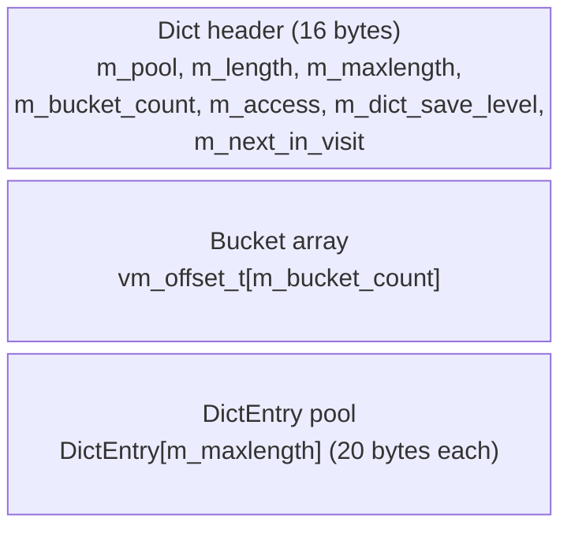
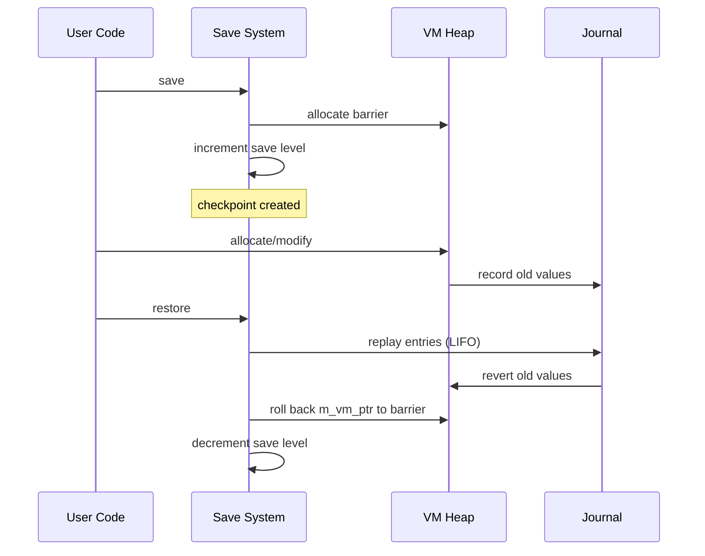
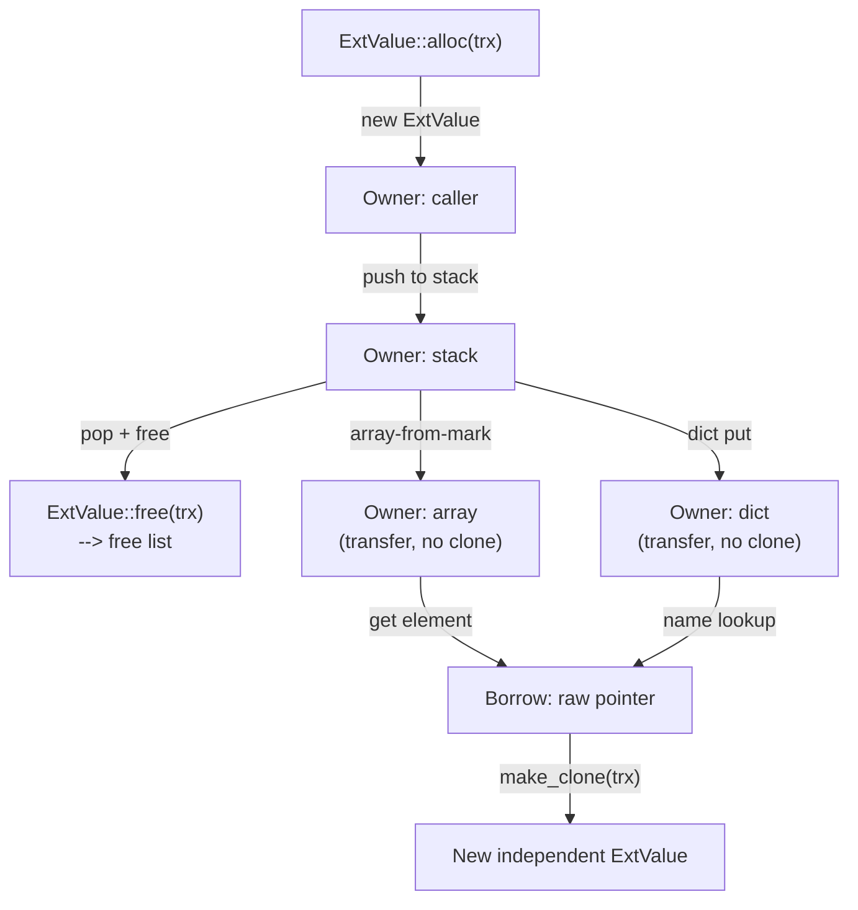

<!--
   ______    _
  /_  __/___(_)_  __
   / / / __/ /\ \/ /       Stack-Based Interpreter & VM
  / / / / / /  > · <      C++23 · Single-Header Library
 /_/ /_/ /_/  /_/\_\     Copyright 2026 Mark Guidarelli

Licensed under the Apache License, Version 2.0 (the "License");
you may not use this file except in compliance with the License.
You may obtain a copy of the License at

    https://www.apache.org/licenses/LICENSE-2.0

Unless required by applicable law or agreed to in writing, software
distributed under the License is distributed on an "AS IS" BASIS,
WITHOUT WARRANTIES OR CONDITIONS OF ANY KIND, either express or implied.
See the License for the specific language governing permissions and
limitations under the License.
-->

# Trix VM Internals

Technical reference for contributors and maintainers of the Trix VM (trix.h and src/*.inl).

---

## Table of Contents

1. [Overview](#1-overview)
2. [Heap Layout](#2-heap-layout)
3. [Bump Allocator](#3-bump-allocator)
4. [Streaming Allocator](#4-streaming-allocator)
5. [Top-End Temporary Allocator](#5-top-end-temporary-allocator)
6. [Offset Addressing](#6-offset-addressing)
7. [Object Model](#7-object-model)
8. [ExtValue System](#8-extvalue-system)
9. [Name System](#9-name-system)
10. [Dictionary System](#10-dictionary-system)
11. [Save/Restore System](#11-saverestore-system)
12. [Object Ownership Rules](#12-object-ownership-rules)
13. [Temporary Containers](#13-temporary-containers)
14. [Configuration](#14-configuration)
15. [VM Introspection](#15-vm-introspection)
16. [Invariants Summary](#16-invariants-summary)

> **The global VM region** -- a second heap above the bump arena,
> managed by a dlmalloc-style allocator with mark-sweep garbage
> collection -- has its own dedicated reference at
> [`gvm-heap-gc.md`](gvm-heap-gc.md).  This document covers the
> **local** (bump) heap and the cross-cutting machinery shared
> between the two regions.

---

## 1. Overview

The Trix VM uses a single contiguous heap shared by two allocators
working from opposite ends:

- A **local bump allocator** that grows upward from `m_vm_base` and is
  the default for every allocation.  Reclaimed in bulk by `restore`
  rollback.
- A **global allocator** (dlmalloc-derived, with mark-sweep GC) that
  grows downward from `m_vm_limit` and survives `save` / `restore`.
  Reclaimed by garbage collection.  Documented separately in
  [`gvm-heap-gc.md`](gvm-heap-gc.md).
- A **top-end temporary allocator** that carves short-lived scratch
  blocks just below the global region.
- **Free lists** for recycling ExtValues and small Dicts.
- A **save/restore journal** for transactional rollback (local side
  only -- the journal skips the global region).

The dispatch flag `m_curr_alloc_global` (per-coroutine) chooses local
vs global on every allocation.  Source: `src/vm_heap.inl`
(`vm_alloc_dispatch`).

All composite data (strings, arrays, dictionaries, names, procedures) lives in
the VM heap and is addressed by 32-bit offsets rather than raw pointers. This
makes the entire VM state serializable (`snap-shot`/`thaw`) and relocatable.

### Memory Map

```
[ m_vm_base                                                          m_vm_limit ]
[ local bump arena -->  ][ temp region <-- ][      global VM (gvm) <-- ]
                       m_vm_ptr       m_vm_temp_ptr                 m_vm_global
```

- `m_vm_base` (offset 0): heap start, also the `nulloffset` sentinel.
- `m_vm_ptr`: local bump allocator watermark; grows upward.
- `m_vm_temp_ptr`: temp allocator watermark; grows downward from
  `m_vm_global`.
- `m_vm_global`: global-region bump frontier; grows downward from
  `m_vm_limit`.  Below it lies the dlmalloc-managed region (free
  lists, fastbins, live blocks).
- `m_vm_limit`: one-past-end of heap; fixed at construction.

The local arena and the global region grow toward each other.  When
they collide (the local bump can no longer satisfy a request from its
end, or `gvm_alloc` can no longer satisfy a request from its end),
allocation fails with `VMFull`.  On the global side, the GC fires
automatically before the final `VMFull` is raised; see
[`gvm-heap-gc.md`](gvm-heap-gc.md) § Allocation algorithm.

---

## 2. Heap Layout

### Member Variables

`m_vm_base` -- `vm_t *`
    Start of heap. Fixed after construction.

`m_vm_ptr` -- `vm_t *`
    Bump allocator watermark. Raw pointer, converted to offset only during serialization. Grows upward.

`m_vm_limit` -- `vm_t *`
    One-past-end of heap. Fixed after construction.

`m_vm_temp_ptr` -- `vm_t *`
    Temporary region watermark. Grows downward from `m_vm_global`
    (not `m_vm_limit`).

`m_vm_global` -- `vm_t *`
    Global-region bump frontier.  Grows downward from `m_vm_limit`.
    The dlmalloc-managed region lies between `m_vm_global` and
    `m_vm_limit`; see [`gvm-heap-gc.md`](gvm-heap-gc.md).

`m_curr_alloc_global` -- `bool`
    Per-coroutine dispatch flag.  When `true`, allocation routes to
    `gvm_alloc` (global region); when `false`, to `vm_alloc` (local
    bump).  Saved and restored on coroutine context switches.  User
    surface: `set-global` / `current-global` ops and the `${...}`
    scanner block.

`m_vm_alloc_active` -- `vm_t *`
    Non-null during a streaming allocation; `nullptr` otherwise.

### Fundamental Types

```
vm_t        = uint8_t        -- heap is byte-addressable
vm_size_t   = uint32_t       -- allocation sizes
vm_offset_t = vm_size_t      -- 32-bit offsets into heap
nulloffset  = vm_offset_t{0} -- null sentinel (offset 0 is never a valid allocation)
```

### Heap Sizing

| Constant        | Value  | Notes                                                 |
| --------------- | ------ | ----------------------------------------------------- |
| `MinVmSize`     | 256 KB | Absolute minimum; below this the VM cannot initialize |
| `DefaultVmSize` | 1 MB   | Default for the no-argument constructor               |

The heap size is specified at construction time and cannot change. Two
constructors exist:

- **Allocating constructor** `Trix(vm_size_t vm_size, Config config)` --
  calls `std::malloc(vm_size)` and owns the memory. The destructor frees it.
- **Pre-allocated constructor** `Trix(void *mem, vm_size_t mem_size, Config config)` --
  uses caller-provided memory. The VM does not free it. This enables
  embedding Trix in a fixed memory budget with no runtime allocation.

---

## 3. Bump Allocator

The bump allocator is the **local-VM allocation path**.  It advances
`m_vm_ptr` upward, never reclaims individual allocations, and relies
on save/restore to roll back the watermark in bulk.  When
`m_curr_alloc_global` is `true` allocations bypass this path and go
through `gvm_alloc` instead (see [`gvm-heap-gc.md`](gvm-heap-gc.md)
for the global-side allocator and GC).

### Allocation Functions

All allocation functions are templates parameterized by the target type `T`,
which determines alignment.

**`vm_alloc_ptr<T>(size)` -- Fixed-size allocation (pointer only)**

```
T *vm_alloc_ptr(vm_size_t size = vm_sizeof<T>())
```

1. Asserts no streaming allocation is active.
2. Aligns `m_vm_ptr` forward to `alignof(T)`.
3. Checks `(aligned + size) <= m_vm_temp_ptr`.
4. Advances `m_vm_ptr = aligned + size`.
5. Returns pointer to the aligned base.
6. Errors with `VMFull` if insufficient space.

**`vm_alloc<T>(size)` -- Fixed-size allocation (pointer + offset)**

```
pair<T *, vm_offset_t> vm_alloc(vm_size_t size = vm_sizeof<T>())
```

Calls `vm_alloc_ptr<T>(size)`, then converts the pointer to an offset. Most
callers use this variant because they need a persistent `vm_offset_t` to store
in an Object.

**`vm_alloc_n_ptr<T>(n)` / `vm_alloc_n<T>(n)` -- Array allocation**

Allocate `n` elements of type `T`. Include overflow checks:
`n * vm_sizeof<T>()` must not exceed `vm_size_t::max()`.

**`vm_size_available<T>(size)` -- Pre-check (no allocation)**

Returns `true` if `size` bytes can be allocated without `VMFull`. Used by
operators that need to verify space before committing to a multi-step
operation (e.g., `Dict::put()` calls this before expanding).

**`vm_remaining<T>()` -- Available bytes**

Returns the number of bytes between the aligned `m_vm_ptr` and
`m_vm_temp_ptr`. Returns 0 if the regions have collided.

### The Three Functions That Modify m_vm_ptr

Three functions modify the watermark during normal allocation; in addition,
`Save::restore()` rewinds it in bulk to a save barrier (and init/thaw set it
during construction/deserialization):

| Function | Direction | When |
| --- | --- | --- |
| `vm_alloc_ptr<T>()` | Upward | Fixed-size allocation |
| `vm_end_alloc_ptr<T>(size)` | Upward (if size>0) | Committing a streaming allocation |
| `vm_trim_alloc(ptr, size)` | Downward | Reclaiming unused tail of most recent allocation |
| `Save::restore()` | Downward (in bulk) | Rewinds the bump watermark to the save barrier, reclaiming everything allocated since the matching save |

**`vm_trim_alloc(ptr, size)`** reclaims space only when `ptr == m_vm_ptr`,
meaning the allocation being trimmed is the most recent one. Otherwise it
silently does nothing. This is safe because only the topmost allocation can
be trimmed without leaving a hole.

Example -- trimming an over-allocated array:

```cpp
// Allocate for worst-case length
auto [ptr, offset] = trx->vm_alloc_n<Object>(max_length);

// Fill only part of it
length_t actual = 0;
for (...) { ptr[actual++] = ...; }

// Reclaim unused tail
auto wasted = (max_length - actual) * sizeof(Object);
trx->vm_trim_alloc(reinterpret_cast<vm_t *>(ptr) + max_length * sizeof(Object), wasted);
```

---

## 4. Streaming Allocator

The streaming allocator handles variable-length data whose final size is not
known until scanning is complete (strings, procedures, arrays). It reserves
all remaining heap space for the caller, which then fills it incrementally.

### Protocol

```
vm_start_alloc<T>()       -- begin: returns (pointer, available_bytes)
  ... write bytes ...
vm_end_alloc_ptr<T>(size) -- commit: advances m_vm_ptr by size
vm_end_alloc<T>(size)     -- commit with offset: same + returns vm_offset_t
vm_end_alloc()            -- cancel: clears active flag, no commit
```

### Exclusivity Invariant

**At most one streaming allocation may be active at a time.** This is enforced
by an assert on `m_vm_alloc_active`. The streaming allocator reserves all free
space between `m_vm_ptr` and `m_vm_temp_ptr`, so a concurrent `vm_alloc` or
`vm_temp_alloc` would corrupt the in-progress data.

While a streaming allocation is active:
- `vm_alloc_*` calls will assert-fail.
- `vm_temp_alloc` calls will error (runtime check, not assert).

### Zero-Size Commit

`vm_end_alloc_ptr<T>(0)` returns the pointer without advancing `m_vm_ptr`.
The caller can use the data transiently (e.g., to examine a scanned string
before deciding whether to keep it) but must not retain the pointer across
any subsequent allocation. The data occupies uncommitted heap space and will
be overwritten by the next allocation.

### Error Recovery

If scanning fails mid-stream, `vm_end_alloc()` (the void overload) cancels
the allocation cleanly -- it clears `m_vm_alloc_active` without touching
`m_vm_ptr`.

---

## 5. Top-End Temporary Allocator

The temporary allocator provides scratch space for operators that need working
buffers during execution but do not persist results in the temporary region.
It grows downward from `m_vm_limit`, creating a sandwich layout with the bump
allocator.

### Functions

**`vm_temp_alloc<T>(count)` -- Allocate count elements from top end**

1. Checks no streaming allocation is active (runtime error, not assert).
2. Overflow check: `count * vm_sizeof<T>()`.
3. Aligns downward from `m_vm_temp_ptr`.
4. Checks `new_temp_ptr >= m_vm_ptr` (collision detection).
5. Updates `m_vm_temp_ptr = new_temp_ptr`.
6. Returns pointer.

**`vm_temp_alloc_ptr<T>(size)` -- Allocate raw bytes from top end**

Same as above but takes explicit byte size. Used by `Dict::create_temp()`.

**`vm_temp_restore(saved)` -- Restore to saved watermark**

Resets `m_vm_temp_ptr` to a previously saved value, freeing all temporary
allocations made since that save point.

- Can only move `m_vm_temp_ptr` upward (toward `m_vm_limit`).
- Errors if `saved < m_vm_temp_ptr` (would allocate more) or `saved > m_vm_limit`.

### Usage Pattern

All temporary allocations follow a strict save/restore bracket:

```cpp
auto saved_temp = trx->m_vm_temp_ptr;    // snapshot

auto buf = trx->vm_temp_alloc<Object>(count);
// ... use buf ...

trx->vm_temp_restore(saved_temp);        // release
```

Multiple temp allocations within the bracket nest naturally (LIFO stack
discipline). No "in use" flag is needed because the pattern is always
paired in the same function scope.

### Save/Restore Interaction

Temp watermarks are snapshotted per save level in `m_vm_temp_save[]`. On
`Save::save()`, the current `m_vm_temp_ptr` is stored. On `Save::restore()`,
it is unconditionally reset, discarding any temps orphaned by error
unwinding.

**Invariant:** No temp allocations may survive to snap-shot time. The
`snapshot_op` function validates `m_vm_temp_ptr == m_vm_global` (the idle temp watermark, which equals `m_vm_limit` only when no globals exist) before
serializing.

### Which Operators Use Temp Allocation

`sort-by`, `group-by`
    Temp key/index arrays; temp Dict for counting.

`filter`, `partition`
    Temp pass/fail result arrays.

`unique`, `intersect`, `union`, `difference`
    Temp expanded arrays for indexed lookup.

Packed-input operators
    Expand packed arrays to Object arrays for random access.

---

## 6. Offset Addressing

All persistent references to VM data use `vm_offset_t` (32-bit unsigned
offset from `m_vm_base`) rather than raw pointers. This enables:

- Snap-shot/thaw serialization (offsets are position-independent)
- Compact 4-byte references (vs. 8-byte pointers on 64-bit hosts)
- Bounds validation on every dereference

### Conversion Functions

**`ptr_to_offset(ptr)` -- Pointer to offset**

Validates `m_vm_base <= ptr < m_vm_limit`, computes `ptr - m_vm_base`.
Errors on out-of-range.

**`nullptr_to_offset(ptr)` -- Nullable pointer to offset**

Returns `nulloffset` if `ptr == nullptr`. Otherwise validates and converts.

**`offset_to_ptr<T>(offset)` -- Offset to typed pointer**

Validates `offset != nulloffset` and `offset < heap_size`. Returns
`reinterpret_cast<T *>(m_vm_base + offset)`. Errors on invalid offset.

**`offset_to_nullptr<T>(offset)` -- Nullable offset to pointer**

Returns `nullptr` for `nulloffset`. Otherwise validates and returns pointer.

**`valid_offset<T>(offset)` -- Validation check**

Returns `true` if offset is non-null, within heap bounds, and properly
aligned for type `T`.

**`valid_active_offset<T>(offset)` -- Check against committed region**

Like `valid_offset`, but instead of the whole heap it requires the offset to
fall in a currently-LIVE region: either the local committed area (offset <
`m_vm_ptr`, journal-tracked/reclaimable on restore) OR the global region
(`m_vm_global` <= offset < `m_vm_limit`, journal-skipped/permanent). It is
`in_local || in_global` -- a valid global-VM offset passes even though it is not
below `m_vm_ptr`.

### Nulloffset Sentinel

`nulloffset` is defined as `vm_offset_t{0}`. Offset 0 is never a valid user
allocation because init reserves the first 4 bytes of the heap with an explicit
sentinel allocation -- the first thing init does after setting `m_vm_ptr =
m_vm_base` is `vm_alloc_ptr<uint32_t>()`, which writes the `TRIX_SENTINEL`
('TRIX') magic word at offset 0..3 (also used as a thaw integrity check). Every
later allocation therefore starts above offset 0.

---

## 7. Object Model

Every value in the VM is an 8-byte `Object`.

### Layout

```
  Byte 0        Bytes 1-3             Bytes 4-7
  +--------+   +------------------+   +--------------------+
  | aat_t  |   | header union     |   | value union        |
  +--------+   +------------------+   +--------------------+
```

**`aat_t` (attribute byte)**

```
  //  7 6 5 4 3 2 1 0
  //  | | | +---------+
  //  | | |     |
  //  | | |     +------- Type (5 bits, 31 types including 1 internal)
  //  | | +------------- F: SpecialFlag (Dict dynamic mode, packed prefix, etc.)
  //  | +--------------- W: 0 = ReadOnly, 1 = ReadWrite
  //  +----------------- X: 0 = Literal, 1 = Executable
```

**Header union (bytes 1-3):** Overloaded per type:
- `m_object_save_level` -- save level at creation (most types)
- `m_extvalue_save_level` -- save level of the associated ExtValue (Long, ULong, Double, Address) or WideValue (Int128, UInt128)
- `m_name_length` -- string length (Name)
- `m_arrays_length` / `m_string_length` -- element/byte count (Array, Packed, String)
- `m_operator_data` -- flags + pop count (Operator)

**Value union (bytes 4-7):** The payload:
- Inline values: `m_byte`, `m_integer`, `m_uinteger`, `m_real`, `m_boolean`
- VM offsets: `m_name`, `m_string`, `m_array`, `m_packed`, `m_dict`, `m_long`, etc.
- `m_offset` -- generic access to the offset field

### 31 Types (30 User-Visible + 1 Internal)

| Type         | Inline?   | Size | Notes                                            |
| ------------ | --------- | ---- | ------------------------------------------------ |
| Null         | Yes       | 0    | Sentinel value                                   |
| Byte         | Yes       | 1    | Unsigned 8-bit                                   |
| Integer      | Yes       | 4    | Signed 32-bit                                    |
| UInteger     | Yes       | 4    | Unsigned 32-bit                                  |
| Real         | Yes       | 4    | IEEE 754 single                                  |
| Boolean      | Yes       | 4    | True/false                                       |
| Mark         | Yes       | 4    | Stack marker for `[`, `<<`                       |
| Operator     | Yes       | 4    | Index into operator dispatch table               |
| Long         | ExtValue  | 8    | Signed 64-bit (via ExtValue)                     |
| ULong        | ExtValue  | 8    | Unsigned 64-bit (via ExtValue)                   |
| Double       | ExtValue  | 8    | IEEE 754 double (via ExtValue)                   |
| Address      | ExtValue  | 8    | Host memory address (via ExtValue)               |
| Name         | VM        | var  | Interned string with hash                        |
| String       | VM        | var  | Byte sequence + nul terminator                   |
| Array        | VM        | var  | Contiguous `Object[]` in heap                    |
| Packed       | VM        | var  | Compressed procedure/array                       |
| Dict         | VM        | var  | Hash table in heap                               |
| Stream       | Special   | --   | File/string I/O channel                          |
| SourceLoc    | Special   | --   | Internal call-site location (never user-visible) |
| Curry        | VM        | 16   | 2 Objects: value + callable                      |
| Thunk        | VM        | 24   | 3 Objects: state + proc + result                 |
| Set          | VM        | var  | Hash set (Dict with SetFlag header)              |
| Tagged       | VM        | 16   | 2 Objects: tag-name + payload                    |
| Record       | VM        | var  | Immutable named-field composite                  |
| Coroutine    | VM        | var  | Cooperative coroutine handle                     |
| PipeBuffer   | VM        | var  | Bounded buffer for pipelines                     |
| Cell         | VM        | var  | Reactive cell (base or computed)                 |
| Continuation | VM        | var  | One-shot delimited continuation                  |
| Int128       | WideValue | 16   | Signed 128-bit integer (via 16-byte WideValue)   |
| UInt128      | WideValue | 16   | Unsigned 128-bit integer (via 16-byte WideValue) |
| OpaqueHandle | VM        | var  | Host handle, sub-typed by `HandleKind` (Screen)  |

"Inline" types store their value directly in the Object's 4-byte value field.
No heap allocation is needed.

"ExtValue" types store a `vm_offset_t` pointing to an 8-byte ExtValue in the
heap. See [Section 8](#8-extvalue-system).

"VM" types store a `vm_offset_t` pointing to variable-length data in the heap
(strings, arrays, dicts, names).

"WideValue" types (Int128, UInt128) store a `vm_offset_t` pointing to a 16-byte
WideValue cell in the heap -- the same per-save-level free-list scheme as
ExtValue, sized for the 128-bit payload.

### Value vs Reference Semantics

Every Object is 8 bytes and is copied by value (`dup`, `def`, array storage,
etc. all copy the 8-byte struct). The critical distinction is what that copy
means for each storage category:

**Inline** (Integer, Real, Boolean, Byte, ...)
    Copy semantics: independent value. Each copy is self-contained.
    Mutation visibility: none -- inline types are immutable values.

**ExtValue** (Long, ULong, Double, Address)
    Copy semantics: **single-owner handle.** The `vm_offset_t` points to an
    8-byte heap slot. Two Objects must NOT share the same ExtValue -- the first
    `maybe_free_extvalue` would corrupt the second. Use `make_clone(trx)` to
    create an independent copy.
    Mutation visibility: N/A -- ExtValues are write-once.

**VM / Reference** (Array, Dict, String, Packed, Curry, Thunk, Set)
    Copy semantics: **shared handle.** Copying the Object copies the
    `vm_offset_t` but NOT the backing heap data. All copies refer to the same
    storage.
    Mutation visibility: mutations through any handle are visible through all
    handles.

This means `dup` on a Dict gives two handles to the **same** hash table --
`put` through either handle mutates both. Similarly, `force` on any copy of
a Thunk caches the result for all copies, because the state lives in shared
VM storage, not in the Object's 8 bytes.

Save/restore journals the **VM heap data**, not the Object handles. When a
Dict entry or Thunk state is modified, the journal records the old heap bytes.
On restore, those bytes are reverted -- and every handle (wherever it lives)
sees the rollback, because they all point to the same offset.

### Key Predicates

`uses_extvalue()`
    Returns true for Long, ULong, Double, Address.

`uses_vm()`
    Returns true for all types with a `vm_offset_t` payload.

`ignores_execute()`
    Returns true for types that push to operand stack even when executable.

---

## 8. ExtValue System

ExtValue provides 64-bit storage for types that cannot fit in the Object's
4-byte value field: Long, ULong, Double, and Address.

### Structure (8 bytes)

```cpp
union {
    struct {
        vm_offset_t m_next;        // (bytes 0-3) free-list link
        uint32_t m_free_sentinel;  // (bytes 4-7) (offset ^ 0xDEADBEEF) when free, 0 when in-use
    } s;
    uint64_t m_value;              // generic access for blind copying
    long_t m_long;                 // signed 64-bit
    ulong_t m_ulong;              // unsigned 64-bit
    address_t m_address;           // address value
    double_t m_double;             // IEEE 754 64-bit
};
```

When free, the union is repurposed: bytes 0-3 hold the free-list link and
bytes 4-7 hold `(slot_offset ^ 0xDEADBEEF)`. When allocated, the entire 8 bytes
hold the value and the sentinel is cleared to 0.

### Allocation: `ExtValue::alloc(trx)`

1. Check the per-save-level free list at `m_extvalue_free_list[m_curr_save_level]`.
2. **Fast path:** If non-empty, pop from the list head, clear sentinel, return.
3. **Slow path:** Allocate a new 8-byte block via `vm_alloc<ExtValue>()`.

### Deallocation: `ExtValue::free(trx, offset, save_level)`

1. Validate the ExtValue is live (`(m_free_sentinel ^ offset) != 0xDEADBEEF`). Catches
   double-free.
2. Validate `save_level <= m_curr_save_level`. Prevents freeing at an invalid
   level.
3. Push onto the free list at the specified save level: set `m_next` to old
   head, set `m_free_sentinel = (offset ^ 0xDEADBEEF)`, update head.

### Per-Save-Level Free Lists

Free lists are bucketed by save level. This is critical for correctness:

**Problem:** If an ExtValue freed at level 2 were handed out at level 1, and
then level 2 were restored, the VM heap would roll back past the ExtValue's
address. The level-1 Object would now hold a dangling offset pointing into
reclaimed heap space.

**Solution:** An ExtValue freed at level N is only reusable at level N. When
level N is restored, its entire free list is cleared (the entries are in
reclaimed heap space anyway).

### Object Methods

`extvalue(trx)`
    Validate and return `ExtValue *`. Errors if freed or invalid.

`free_extvalue(trx)`
    Free the ExtValue and set `m_offset = nulloffset`. Object is now in a
    partially-invalid state -- caller must immediately overwrite.

`maybe_free_extvalue(trx)`
    Conditional: only frees if `uses_extvalue()` returns true. Safe to call
    on any Object.

`make_clone(trx)`
    Deep copy: allocates a new ExtValue with the same 64-bit value. The clone
    is independent of the original.

`make_copy(level)`
    Shallow copy: copies the Object struct but shares the same ExtValue offset.
    Only safe when the original will not be freed.

### The Borrowed Reference Problem

`extract_next_packed()` returns Objects that point to ExtValues embedded in
the packed array's data -- not newly allocated ExtValues. These are
**borrowed references**:

```
OWNERSHIP: the returned Object is a BORROWED reference. For ExtValue
types the Object's m_offset points to the original ExtValue in the packed
data's source -- it is NOT a new allocation. Callers must NOT call
maybe_free_extvalue on the result. To obtain an owned copy, call
make_clone(trx) on the returned Object.
```

**Why this matters:** Freeing a borrowed ExtValue pushes it onto the free
list. On the next `alloc()`, the free list returns this address -- which is
still part of the packed array. The next write to the "new" ExtValue
overwrites packed array data, corrupting the procedure or array.

**Rule:** Any code that extracts from packed arrays must call `make_clone(trx)`
before storing the result on a stack or in a container. The packed-to-array
expansion functions (`expand_packed_to_temp`, for-all loop, etc.) all follow
this rule.

---

## 9. Name System

Names are interned strings stored in the VM heap with cached hash values.
Every unique name string exists exactly once in memory; multiple references
to the same name share a single `vm_offset_t`.

### Name Structure (16 bytes + string data)

```cpp
vm_offset_t m_next;            // 4 bytes: next Name in bucket chain
vm_offset_t m_binding;         // 4 bytes: single-coroutine binding cache (offset to Dict::DictEntry::m_value)
hash_t m_hash;                 // 4 bytes: wyhash (32-bit output)
length_t m_length;             // 2 bytes: string length
vm_t m_data[1];                // flexible: string data (no nul terminator; struct padded to 16 bytes)
```

Total allocation: `offsetof(Name, m_data) + length` bytes, aligned for
`Name`.

### Hash Table

Names are stored in an open-chaining hash table:

- **Bucket array** `m_name_buckets[]`: Array of `vm_offset_t`, each pointing
  to the head of a collision chain.
- **Bucket count** `m_name_bucket_count`: Configurable at construction (default
  2053). Selected from a table of doubling prime numbers.
- **Hash function**: wyhash (Wang Yi), 32-bit output; reads 8 bytes per multiply-fold.
- **Collision resolution**: Chaining via `m_next` links.

### Name::add() -- Interning

```
name_offset = Name::add(trx, string_view)
```

1. Compute hash: `wyhash32_sv(sv)`.
2. Find bucket: `m_name_buckets[fastmod_u32(hash, m_name_bucket_magic, m_name_bucket_count)]`.
3. Walk the collision chain:
   - If a matching entry exists (same hash AND same string content), return
     its offset. No allocation.
   - If end of chain reached, allocate a new Name via `vm_alloc<Name>()`,
     copy the string data, link it at the chain tail, return its offset.

### Binding Cache

Each Name has a one-entry binding cache (`m_binding`) that accelerates
dictionary lookup in the **single-coroutine** case:

- **`m_binding`** stores a `vm_offset_t` pointing directly to a
  `Dict::DictEntry::m_value` field.

**Fast path in `execute_name()`:** When `m_live_coroutine_count == 0` and
`m_binding != nulloffset`, the interpreter dereferences the cached offset
directly -- O(1) with no hash computation or dict-stack traversal. Once any
coroutine spawns, the global `m_binding` cache is flushed wholesale to
`nulloffset` (the 0->1 coroutine-gate transition) and lookups switch to a
**per-coroutine binding table** (`src/binding_table.inl`).

**Safety:** Dict::DictEntry objects are **never relocated** (no rehashing, no
compaction). Once a binding is established, the vm_offset_t remains valid for
the lifetime of the entry.

**Invalidation:** `Name::restore()` does **not** touch `m_binding` -- it only
unlinks Names allocated above the restored save barrier. The per-coroutine
binding tables are pruned separately by save/restore's context sweep. (The old
per-name `m_binding_level` mechanism is superseded.)

### Name Categories

| Category     | Storage                  | Created by                  |
| ------------ | ------------------------ | --------------------------- |
| System names | `m_systemname_offsets[]` | VM initialization           |
| Type names   | System names             | VM initialization           |
| Error names  | System names             | VM initialization           |
| Script names | Hash table               | Scanner, `to-name` operator |

---

## 10. Dictionary System

Dictionaries are hash tables stored in the VM heap. They map Names (or
Strings) to Objects.

### Dict Layout in VM Memory



### DictEntry Structure (20 bytes)

```
vm_offset_t m_next;   // 4 bytes: next DictEntry in bucket chain
Object m_key;         // 8 bytes: usually Name, never Null
Object m_value;       // 8 bytes: associated value
```

### Access Modes

`ReadOnly` (access byte `0x00`)
    No modifications. Used by systemdict after init.

`ReadWriteFixed` (m_access byte `0x02`)
    Insert/update allowed. Capacity fixed at creation.

`ReadWriteDynamic` (m_access byte `0x03`)
    Insert/update allowed. Can expand via `expand()`.

### Core Operations

**`Dict::put(trx, key, value, binding_mode)`** -- Insert or update:

1. Compute hash and search the bucket chain via `find_entry()`.
2. If the key exists:
   - Free the old value's ExtValue (if at current save level).
   - Or save the old entry to the journal (if at an older save level).
   - Overwrite `entry->m_value`.
3. If the key is new:
   - If dict is full and dynamic, `expand()` first.
   - Save the dict header (deferred, at most once per save level).
   - Pop a DictEntry from the free pool (`m_pool`).
   - Initialize `entry->m_key`, `entry->m_value`, `entry->m_next`.
   - Prepend to the bucket chain (LIFO insertion).
4. Optionally set the Name binding cache (`set_name_binding()`).

**`Dict::get(trx, key)`** -- Lookup in a single dict:

Returns a pointer to `entry->m_value` (not a copy). The pointer is stable
because entries are never relocated.

**`Dict::name_lookup_in_stack(trx, key, name)`** -- Full dict stack lookup
(the user-facing entry point is `Name::name_search`):

1. Check the Name binding cache first (O(1) fast path).
2. On cache miss, walk the dict stack top-to-bottom.
3. For each dict, search its bucket chain.
4. On match, populate the binding cache and return.

### No-Relocation Invariant

**Dict entries are never relocated.** There is no rehashing or compaction.
When a dict expands, new entries are allocated in a fresh pool block appended
to the existing pool -- the bucket count stays fixed, and existing entries
remain at their original VM offsets.

This invariant is **load-bearing** for the Name binding cache. `Name::m_binding`
stores a raw `vm_offset_t` pointing directly into `DictEntry::m_value`. If entries
were ever relocated, every cached binding in the VM would silently go stale.

### Dict Free List (Pool Recycling)

Small dicts (maxlength 1-16) are recycled through per-save-level free lists
stored in `m_dict_pool[]`:

- **Index:** `save_level * MaxDictPoolSize + (maxlength - 1)`
- **Sentinel:** `RecycleSentinel` stored in `m_buckets[0]` when on the free list
- **`create_or_recycle(trx, maxlength)`:** Checks the pool before allocating new.
  Reinitializes the recycled dict (clears buckets, resets length, preserves
  entry pool).
- **`recycle(trx, dict, offset)`:** Returns a dict to the pool after use
  (maxlength is read from `dict->m_maxlength`).

Per-save-level bucketing ensures dicts freed at level N are only reused at
level N (same correctness argument as ExtValue free lists).

### Temporary Dicts

`Dict::create_temp_dict(trx, maxlength)` allocates from the top-end temporary
region instead of the permanent heap. Properties:

- Always `ReadWriteFixed` (expansion would corrupt the temp region).
- Freed by `vm_temp_restore()`, not by save/restore journaling.
- Must be pre-sized to hold all entries.
- Used by `group-by`, set operations, and other operators that need scratch
  dicts.

### Sets (Dict-Based Hash Sets)

Sets share Dict's VM structure and hash table infrastructure. A Set is
distinguished from a Dict by the `SetFlag` (`0x04`) bit in the `m_access`
header byte. The key difference is entry size:

- **DictEntry:** 20 bytes (`m_next` + `m_key` + `m_value`)
- **SetEntry:** 12 bytes (`m_next` + `m_key` Object, no value)

Sets are created via `Dict::create_set()` and operated on by `set_put()`,
`set_remove()`, `set_member()`, and `set_next()`. Save/restore uses
dedicated `SetEntry` and `SetEntryNext` journal flavors (parallel to
`DictEntry` and `DictEntryNext`). Snap-shot/thaw requires no special
handling -- sets are serialized automatically as part of the VM heap.

### Dictionary Stack

The dict stack is an array of Dict Objects:

```
m_dict_base  -- bottom of stack (systemdict)
m_dict_ptr   -- top of stack (current lookup scope)
m_dict_limit -- capacity limit
```

`begin` pushes a dict; `end` pops. Lookup walks top-to-bottom, stopping at
the first match.

### Dictionary Path Syntax

Dict paths provide direct access to nested dict entries without modifying
the dict stack:

```
//:systemdict:numbers:real-type:pi
```

The path is parsed by `dict_path_search()`:

1. Identify the root dict by the first segment (systemdict, userdict,
   errordict, handlersdict, modules, or any dict entry in systemdict).
2. Walk each intermediate segment, looking up the next dict.
3. Return the final value.

Special pseudo-paths:
- `//:status:key` -- on-demand VM introspection (no Dict; computed per key by
  `status_lookup()`).

---

## 11. Save/Restore System

Save/restore provides transactional semantics: `save` creates a checkpoint,
`restore` rolls back most mutations to that checkpoint. This is used for
error recovery, test isolation, and scoping.



**String exception:** String byte modifications via `put` are not journaled
and are not rolled back by restore. Strings are the only container type with
this behavior. This is a deliberate space trade-off: a string element is a
single byte, but a journal entry requires 12+ bytes of overhead. Journaling
each byte write would consume space disproportionate to the data being
protected. Arrays do not have this problem because each element is an 8-byte
Object -- the journal entry and the data are the same size. When journaled
byte-level data is required, use an array of Byte values instead of a string
(at 8x the memory cost). Alternatively, allocate the string after the save
point so it is discarded when the VM heap is reset.

### Save Levels

```
save_level_t = uint8_t
BASE = 0              -- cannot restore past this
DefaultSaveCount = 64 -- maximum nesting depth
MaxSaveCount = 255
```

Each save level is tracked in two parallel arrays:

- `m_save_stack[]` -- one `vm_offset_t` per level holding the barrier offset
  (the VM watermark at the time of save).
- `m_save_generation[]` -- one `save_generation_t` (uint32_t, low 23 bits used)
  per level holding the slot's generation counter; bumped on every reuse so
  a stale token can be detected on restore.

The active level is `m_curr_save_level`.

### Save Tokens

`save` returns an inline `Integer` whose 32-bit value packs the slot
identity for the new save level:

```
bits  0..7   : save level (1..255)
bits  8..30  : gen ^ barrier_low23   -- XOR-folded validation field
bit  31      : 0  (positive token; negative integers are reserved for
                   the relative-pop semantics described below)
```

The XOR with the low 23 bits of the barrier offset means a stale
token (a slot recycled by a subsequent save+restore cycle) is
rejected even after the 23-bit gen field wraps -- a false positive
would require both the gen and barrier_low23 to coincide
simultaneously, two uncorrelated events in real workloads.  For a
valid token, `m_save_stack[level]` still holds the original barrier
(no recycling), so the gen recovers cleanly via `(token >> 8) ^
(m_save_stack[level] & 0x7FFFFF)`.

`restore` accepts the integer token:

- Positive: validate `(level, gen ^ barrier_low23)` against the
  current `m_save_generation[level]` and `m_save_stack[level]`;
  mismatch raises `/invalid-restore`.  Then dispatches to the
  internal `Save::restore(barrier)` path.
- Negative `-N`: pop `|N|` save levels (no gen check; always
  current).  Convenient unwinding when the token was never preserved.
- Zero: raises `/invalid-restore`.

### Save Operation (`Save::save()`)

1. Check capacity: `(m_curr_save_level + 1) < m_max_save_level`.
2. Allocate a barrier in the VM: `vm_alloc<vm_offset_t>()`. The barrier is a
   `vm_offset_t` initialized to `nulloffset` (empty journal chain head).
3. Increment `m_curr_save_level`.
4. Store barrier offset in `m_save_stack[m_curr_save_level]`.
5. Snapshot temp pointer: `m_vm_temp_save[m_curr_save_level] = m_vm_temp_ptr`.
6. Bump `m_save_generation[m_curr_save_level]` (masked to 23 bits) so the
   slot's identity changes on every save -- a stale token's encoded gen
   will no longer match.
7. Pack `(level, gen, barrier_low23)` into a 32-bit token and push it as
   an `Integer` Object on the operand stack.

### Journal

Mutations to saved state are recorded in a linked list of journal entries.
Each entry records the original value of a modified location so it can be
restored later.

**Entry structure (12 bytes + payload):**

```
vm_offset_t m_next;            // next entry in chain
vm_offset_t m_ptr;             // VM location being saved
dict_bucket_count_t m_bucket_count;  // used by DictHeader only
Flavor m_flavor;               // what kind of data is saved
vm_t m_data[1];                // saved bytes (variable length)
```

**Eleven flavors:**

| Flavor            | Bytes Saved | Trigger                                                      |
| ----------------- | ----------- | ------------------------------------------------------------ |
| Object            | 8           | Array element overwrite, dict variable update                |
| DictHeader        | Variable    | Dict bucket array mutation (new entry in chain)              |
| DictEntry         | 20          | Dict entry overwrite (key + value + next)                    |
| DictEntryNext     | 4           | Collision chain relink (predecessor's m_next)                |
| SetEntry          | 12          | Set entry overwrite (key + next)                             |
| SetEntryNext      | 4           | Set collision chain relink (predecessor's m_next)            |
| PackedName2/3/4   | 3/4/5       | Packed array name binding (early bind modifies encoded name) |
| StreamInfixOffset | 4           | Stream infix parse offset (infix expression state)           |
| LvarBinding       | 8           | Logic-var binding (sole journaled global slot; backtracking) |

**Not journaled:** String byte modifications (`put` on a string) write
directly to VM memory without creating a journal entry. There is no String
flavor. This is by design: a journal entry (12+ bytes overhead) for a
single-byte string write would be disproportionate. String content changes
persist across restore. Use an array of Byte values for journaled byte data.

**Deduplication:** Before creating a new journal entry, `save_data()` checks
the chain HEAD. If it already records the same location and flavor, no new
entry is created. This catches the common case of repeated writes to the
same variable.

**Deferred dict save:** A dict header is journaled at most once per save level,
tracked by `m_dict_save_level`. This avoids redundant copies of the full
bucket array on every `put()`.

### Restore Operation (`Save::restore()`)

The restore protocol executes in this order:

1. **Decode + validate token:** Extract level from token bits 0..7;
   recover the encoded gen via `(token >> 8) ^ (m_save_stack[level] &
   0x7FFFFF)` and compare to `m_save_generation[level]`.  Mismatch
   raises `/invalid-restore` (stale token).
2. **Find save level:** Trivial -- the level is already decoded.  Look
   up the barrier as `m_save_stack[level]`.
3. **Validate stacks:** Walk operand, exec, and dict stacks.
   Count ExtValue Objects above the barrier. Error if any non-ExtValue
   composite Object is above the barrier (arrays, strings, dicts cannot
   be relocated). Error if any dict stack entry is above the barrier.
4. **Pop save token** from the operand stack.
5. **Replay journal:** Walk save levels from current down to restore level.
   For each level, walk the journal chain (LIFO order). For each entry:
   - `Object` flavor: call `maybe_free_extvalue()` on the current value,
     then copy the saved bytes back.
   - `DictEntry` flavor: free ExtValues on current key and value, then
     copy the saved entry back.
   - Other flavors: copy saved bytes back directly.
6. **Roll back VM pointer:** `m_vm_ptr = barrier`. All allocations after
   the save point are discarded.
7. **Restore temp pointer:** `m_vm_temp_ptr = m_vm_temp_save[restore_level]`.
8. **Clear dict pool** for rolled-back levels.
9. **Relocate ExtValues:** `ExtValue::restore()` moves all above-barrier
   ExtValues on the operand and exec stacks to new locations below
   the barrier (see below).
10. **Restore streams:** Close any streams created after the save point.
11. **Restore names:** Truncate name chains at the barrier; clear bindings
    established after the save point.
12. **Reset error state** if error stack storage is out of scope.

### ExtValue Relocation During Restore

ExtValues on the stacks that lie above the barrier cannot simply be discarded
-- the stack still references them. The relocation protocol:

1. Clear free lists for levels being rolled back.
2. Find the lowest-offset ExtValue on either stack (`find_lowest_offset()`).
3. Allocate a new ExtValue below the barrier via `ExtValue::alloc()`.
4. Copy the 64-bit value: `new_ext->m_value = old_ext->m_value`.
5. Update the Object: `m_offset = new_offset`, `m_extvalue_save_level = curr_level`.
6. Repeat until all above-barrier ExtValues are relocated.

**Ascending offset order is required.** `alloc()` calls `vm_alloc()` which
grows the heap upward. Relocating the lowest-addressed ExtValue first
ensures its old VM slot is available as free-list inventory for the next
`alloc()`. Processing in any other order could cause `alloc()` to
overwrite an ExtValue that has not yet been relocated.

---

## 12. Object Ownership Rules



### Ownership Defined

An Object **owns** its ExtValue when:
- `uses_extvalue()` is true, AND
- The caller is responsible for eventually calling `maybe_free_extvalue()`
  (or the Object will be freed by save/restore rollback, or by container
  cleanup).

### Creation and Initial Ownership

`make_integer()`, `make_real()`, etc.
    No ExtValue allocated (inline). No ownership concern.

`make_long(trx, value)`, `make_ulong(trx, value)`, `make_double(trx, value)`, `make_address(trx, value)`
    Allocates a new ExtValue. Caller owns it.

`make_string(trx, data, len)`
    No ExtValue (VM string). Caller owns the string data.

`make_array_from_mark(trx, ...)`
    No ExtValue (copies from stack). Caller owns the array data.

### Transfer: Scanner to Operand Stack

The scanner creates Objects and pushes them to the operand stack:

```cpp
*++trx->m_op_ptr = Object::make_long(trx, value);
```

Ownership transfers from the scanner to the operand stack. The stack is now
responsible for freeing the ExtValue when the Object is popped.

### Transfer: Operand Stack to Container

**Array creation from mark (`make_array_from_mark`):**

Elements are copied from the operand stack into the new array via
`std::transform`. The copy updates `m_object_save_level` but does NOT clone
ExtValues -- the Object's `m_offset` is copied as-is. This is a **transfer**
of ownership: the stack entries are popped (discarded without freeing), and
the array now owns the ExtValues.

**Dict::put():**

The value Object is assigned directly to `entry->m_value`. This is a
transfer -- the caller must not free the ExtValue after passing it to
`put()`. If the dict already had a value at that key:
- Same save level: the old ExtValue is freed immediately.
- Older save level: the old entry is saved to the journal (the journal
  owns the old ExtValue until restore).

### Transfer: Container to Operand Stack

**Array element access:**

`array_value(trx)` returns a raw `Object *` pointer into the array. This is
a **borrow** -- the array still owns the ExtValue. To take ownership (e.g.,
to push an independent copy onto the stack), call `make_clone(trx)`.

**Dict lookup:**

`Dict::get()` returns a pointer to `entry->m_value`. This is also a borrow.
The interpreter's `execute_name()` calls `make_clone(trx)` when pushing a
looked-up value onto the operand stack:

```cpp
*++m_op_ptr = value->make_clone(trx);
```

### Transfer: Packed to Operand Stack

`extract_next_packed()` returns a **borrowed reference** (see
[Section 8](#the-borrowed-reference-problem)). The caller MUST call
`make_clone(trx)` before storing the result anywhere:

```cpp
auto [next_packed, object] = Object::extract_next_packed(trx, packed_data);
auto owned = object.make_clone(trx);    // allocate new ExtValue
*++trx->m_op_ptr = owned;
```

### Clone vs. Move Summary

| Operation | Mechanism | ExtValue Handling |
| --- | --- | --- |
| Scanner -> stack | Direct push | Ownership transfer |
| Stack -> array (from mark) | Shallow copy | Ownership transfer (shared offset) |
| Stack -> dict (put) | Direct assign | Ownership transfer |
| Dict lookup -> stack | `make_clone(trx)` | New ExtValue allocated |
| Packed extract -> stack | `make_clone(trx)` | New ExtValue allocated |
| Array element -> stack | `make_clone(trx)` | New ExtValue allocated |
| Status probe -> stack | Alias in scratch, `make_clone(trx)` on push | New ExtValue allocated |
| Pop from stack | `maybe_free_extvalue(trx)` | ExtValue freed |
| Overwrite in container | `maybe_free_extvalue(trx)` on old | Old freed, new transferred |

### Container Copy Rules

When copying elements between containers (e.g., array copy, dict
duplication), each element must be cloned if it uses an ExtValue. A shallow
copy would create two Objects pointing to the same ExtValue -- the first
free would corrupt the second.

```cpp
// WRONG: shallow copy shares ExtValue
dst[i] = src[i];

// CORRECT: clone preserves independence
dst[i] = src[i].make_clone(trx);
```

### Status Probe Scratch Alias Pattern

`status_lookup()` uses a single `m_status_scratch_obj` member to return computed
values. For stack probing keys (`op-stack-N`, `exec-stack-N`, etc.), the
scratch Object is populated by raw byte copy from the stack slot:

```cpp
m_status_scratch_obj = *(m_op_ptr - index);   // raw copy -- aliases ExtValue
```

This creates a **temporary alias**: if the stack slot holds a Long/Double,
both the scratch and the stack slot point to the same ExtValue. This alias
is safe because:

1. **The scratch is never freed.** It has no destructor; it is simply
   overwritten on the next `status_lookup()` call.

2. **The alias is short-lived.** Both consumption paths clone immediately:
   - `//` immediate path: `scan_name()` calls `value->make_clone(trx)`
   - `query-status` runtime path: `query_status_op()` calls
     `result->make_clone(trx)`

3. **No intervening operation can free the original.** The alias exists
   only within a single interpreter step -- between `status_lookup()`
   returning and the caller cloning the result.

The clone produces an independent, owned Object that goes on the operand
stack and is freed normally by `pop`, `clear`, or scope exit.

**Anti-pattern:** Storing `m_status_scratch_obj` directly on a stack without
cloning would create two owners of one ExtValue -- the first free would
push the ExtValue onto the free list while the second Object still
references it.

---

## 13. Temporary Containers

Trix provides reusable temporary containers via the `#=` suffix syntax.
These avoid heap allocation for short-lived data.

### =string, =array, =proc, =dict, =set

| Container | Backing Storage | Default Capacity | Allocated |
| --- | --- | --- | --- |
| `=string` | `root_object(RootObject::EqString)` (String Object + VM bytes) | 128 chars | Permanent heap (init time) |
| `=array` | `root_object(RootObject::EqArray)`  (Array Object + VM Objects) | 32 elements | Permanent heap (init time) |
| `=proc` | `m_eqproc_storage_ptr` (raw Object array on permanent heap) | 32 elements | Permanent heap (init time) |
| `=dict` | `m_eqdict` (`Dict *`) + `root_object(RootObject::EqDictObject)` | 32 entries | Permanent heap (init time) |
| `=set` | `m_eqset`  (`Dict *`) + `root_object(RootObject::EqSetObject)` | 32 entries | Permanent heap (init time) |

These are allocated once during VM initialization and reused on every
invocation. The scanner fills them with new data, freeing old ExtValues first.

**Key property:** Temporary containers are excluded from save/restore
journaling. Both `m_eqdict` and `m_eqset` are explicitly skipped in
`Dict::save()`:

```cpp
if ((m_dict_save_level != trx->m_curr_save_level) &&
    (dict != trx->m_eqdict) && (dict != trx->m_eqset)) {
    Save::save_dict_header(trx, dict, m_bucket_count);
}
```

On `restore`, `Save::restore` additionally calls `Dict::quiet_flush` /
`quiet_flush_set` on `m_eqdict` / `m_eqset` to drop any dangling entries
whose `m_key` / `m_value` offsets pointed into heap that restore just
reclaimed.  The same reasoning applies to `root_object(RootObject::EqArray)`'s
element slots, which is why `Object::array_clear` uses `is_eqarray(trx)`
(the ref-or-root discriminator) rather than the user-facing
`is_eqarray_ref()` predicate.

**Capacities are configurable** via the Config struct:
`m_eqstring_length`, `m_eqarray_length`, `m_eqproc_length`,
`m_eqdict_maxlength`, `m_eqset_maxlength`.

### Usage in Trix Scripts

```
(hello)#=       % =string: reuses temporary string buffer
[1 2 3]#=       % =array: reuses temporary array buffer
{ 1 2 add }#=   % =proc: reuses temporary proc buffer
<< /a 1 >>#=    % =dict: reuses temporary dict
```

Each invocation overwrites the previous contents. The temporary container
is valid until the next use of the same type.

### Staleness Detection and Storage Restrictions

Because `#=` references all point at the same shared buffer, creating a
second `#=` value of the same kind invalidates the first one's contents.
To keep this from silently returning corrupted data (or tripping UBSan
when byte-oriented `}#=` packed storage aliases Object-oriented `}#=a`
array storage — the bug that originally motivated this mechanism), each
eq-kind has a generation counter and each eqref Object carries its
creation-time generation in its value slot:

| Kind   | Counter                 | Ref predicate     | Scan syntax | Runtime op |
| ------ | ----------------------- | ----------------- | ----------- | ---------- |
| string | `m_eqstring_generation` | `is_eqstring_ref` | `)#=`       | `=string`  |
| array  | `m_eqarray_generation`  | `is_eqarray_ref`  | `]#=`       | `=array`   |
| proc   | `m_eqproc_generation`   | `is_eqproc_ref`   | `}#=`       | —          |
| dict   | `m_eqdict_generation`   | `is_eqdict_ref`   | `<<>>#=`    | `=dict`    |
| set    | `m_eqset_generation`    | `is_eqset_ref`    | `{{}}#=`    | —          |

An eqref Object is any Array/Packed/String/Dict/Set with `SpecialFlag` set on its
`aat` byte.  The value slot holds the generation counter at the moment the ref
was created (read via the `m_generation` union alias — same bytes as
`m_array`/`m_packed`/`m_string`/`m_dict`/`m_set`, but named after its actual
use).  Every access goes through a resolver (`array_objects`, `packed_data_ptr`,
`string_data_ptr`, `dict_value`, `set_value`) that compares `m_generation`
against the current counter; a mismatch raises `Unsupported`:

<!-- doctest: skip (error-message text, not Trix code) -->
```
Trix unsupported '<op>': stale )#= reference: storage reused by a subsequent )#=
```

Eqref Objects are constructed via the dedicated factories `make_eqstring`,
`make_eqarray`, `make_eqdict`, `make_eqset`, `make_eqproc_array`, and
`make_eqproc_packed`.  Each takes the generation counter directly and stamps
`SpecialFlag` atomically, so there is no window in which a freshly-built
eqref is missing its marker.

Mutating operations (`array_pop_head`, `string_pop_count`,
`string_interval`, etc.) call `materialize_eqref_if_needed`, which
copies the body from the shared buffer into private VM-heap storage and
clears `SpecialFlag`.  At that point `m_generation`'s bytes are reused
as a real VM offset (written through the type-specific slot names
`m_array` / `m_packed` / `m_string`); subsequent mutations operate on
the private copy and the shared buffer is freed up for the next `#=`.

Counters are monotonic: they are **never rolled back** on `restore`, so
a ref that became stale under `save` stays stale after `restore`.  When
a counter reaches `UINT32_MAX`, further `#=` creation raises
`LimitCheck` instead of wrapping (wrap-around would let a stale ref
accidentally collide with a future generation).

### Routed through PackedExt

The eqref `SpecialFlag` has no home in the packed binary format's
ordinary header byte (which is already fully occupied by X/SS/TTTTT).
Rather than reject the source, `make_packed_data` routes any eqref
through the `PackedType::PackedExt` slot, recording the eq-kind via a
per-eqkind subcode so the marker survives the round trip.  Verified:
`(hi)#= 1 packed` succeeds, and a scanner-level packed proc whose body
contains an eqref (e.g. `{ (hi)#= 1 add }`) packs and `exec`s with no
rejection.

---

## 14. Configuration

The `Config` struct controls VM sizing at construction time:

| Parameter | Type | Default | Purpose |
| --- | --- | --- | --- |
| `m_filename` | `const char *` | nullptr | Input script path |
| `m_mode` | `StartupMode` | ScriptFile | Script or image file |
| `m_stream_enable` | bitmask | DefaultStreamEnable | Which I/O streams to enable |
| `m_stream_count` | count | DefaultStreamCount | User-creatable stream slots |
| `m_stream_buffer_size` | bytes | DefaultStreamBufferSize | Per-stream buffer size |
| `m_eqstring_length` | length | 128 | Temp =string capacity |
| `m_eqarray_length` | length | 32 | Temp =array capacity |
| `m_eqproc_length` | length | 32 | Temp =proc capacity |
| `m_eqdict_maxlength` | length | 32 | Temp =dict capacity |
| `m_eqset_maxlength` | length | 32 | Temp =set capacity |
| `m_name_bucket_count` | count | AutoNameBucketCount (0 = scale with VM size) | Name hash table buckets |
| `m_save_count` | count | 64 | Max save/restore nesting |
| `m_dictionary_depth` | depth | DefaultDictionaryDepth | Dict stack limit |
| `m_execution_depth` | depth | DefaultExecutionDepth | Exec stack limit |
| `m_error_depth` | depth | DefaultErrorDepth | Error stack limit |
| `m_operand_depth` | depth | DefaultOperandDepth | Operand stack limit |
| `m_userdict_maxlength` | length | 512 | User dictionary capacity |
| `m_useroperators` | `const Operator *` | nullptr | User operator dispatch table |
| `m_debug` | bool | false | Enable interactive debugger |

`m_name_bucket_count`'s default `AutoNameBucketCount` (0) selects an entry from
`sm_name_bucket_counts` proportional to VM size (e.g. 2053 at the default 1 MB
heap, 521 at 256 KB, 32771 at 16 MB).

All parameters are frozen at construction. The same binary can serve
different use cases (minimal embedded controller vs. full scripting host)
by varying the Config.

---

## 15. VM Introspection

Trix provides runtime introspection through two mechanisms: the `//:status:`
path system for on-demand computed metrics, and the `vm-size` operator for
per-value allocation measurement.

### Status Keys (`//:status:`)

On-demand computed values accessible via dictionary path lookup (`//:status:key`)
or runtime query (`/key-name query-status`, takes a name). No Dict is allocated;
each key is computed independently via `status_lookup()`. Results are written to
`m_status_scratch_obj` and cloned on push (see [Status Probe Scratch Alias
Pattern](#status-probe-scratch-alias-pattern) for ExtValue safety).

The full set of keys is documented in
[trix-reference.md](trix-reference.md#5-status-introspection-keys).
Key categories:

**VM memory** -- `vm-used`, `vm-free`, `vm-total`, `vm-temp-used`, `vm-alloc-since-save`

**Stack depths** -- `op-depth`, `exec-depth`, `dict-depth`, `error-depth`

**Stack limits** -- `max-op-depth`, `max-exec-depth`, `max-dict-depth`, `max-error-depth`

**High-water marks** -- `op-high-water`, `exec-high-water`, `dict-high-water`, `error-high-water`

**Save system** -- `save-level`, `save-journal-entries`, `save-journal-validate`

**ExtValue pool** -- `extvalue-free`, `extvalue-active`, `extvalue-validate`

**WideValue pool** -- `widevalue-free`, `widevalue-active`, `widevalue-validate`  (Int128 / UInt128 cells)

**Eq-storage pools** -- `eq{string,array,proc}-length` (current temp-pool fill); `eq{string,array,proc,dict,set}-generation` (staleness counters)

**Validation** -- `vm-validate`, `exec-validate`

**Counters** -- `op-count`, `tco-count`

**Exec inspection** -- `exec-top-type`, `exec-top-is-call`, `exec-top-is-barrier`, `call-depth`

**Streams** -- `stream-inuse`, `stream-free`, `stream-count`

**Name table** -- `name-count`, `name-vm-used`, `name-avg-chain`, `name-max-chain`

**Global VM / GC** -- `vm-global-used`, `vm-global-num-alloc`, `vm-global-num-free`, `gc-runs`, `gc-last-reclaimed`, `gc-in-progress`, `gc-current-gen` (documented in [gvm-heap-gc.md](gvm-heap-gc.md#status-keys))

**Stack element probing** is done via the `stack-probe` operator, which takes
a stack name and integer index (0-indexed from top). Stack names:
`/op-stack`, `/exec-stack`, `/dict-stack`, `/error-stack`.
Raises `range-check` if the index exceeds the stack depth.

```
42 99 (hello)
/op-stack 0 stack-probe     % => (hello)   -- top of stack
/op-stack 2 stack-probe     % => 42        -- third from top
```

### Per-Value Allocation (`vm-size`)

The `vm-size` operator returns the number of VM heap bytes consumed by a
single value's data storage. This measures the allocation footprint, not
the 8-byte Object itself (which lives on a stack or inside a container).

**Stack effect:** `any -- int`

| Type Category | Types | vm-size Returns |
| --- | --- | --- |
| Inline (no heap) | Null, Byte, Integer, UInteger, Real, Boolean, Operator, Mark, Stream | 0 |
| ExtValue | Long, ULong, Double, Address | 8 |
| String | String | `length + 1` (content + NUL terminator) |
| Array | Array | `length * 8` (length * sizeof(Object)) |
| Packed | Packed | Variable (compressed encoding bytes) |
| Dict | Dict | `16 + buckets*4 + maxlength*20` (header+buckets+pool) |
| Name | Name | `16 + length` (header + string bytes) |
| Curry | Curry | 16 (2 Objects) |
| Thunk | Thunk | 24 (3 Objects) |
| Set | Set | `16 + buckets*4 + maxlength*12` (header+buckets+pool) |

**Design notes:**

- String size includes the hidden trailing NUL byte that the scanner
  allocates but `length` does not report.
- Dict size reflects the *allocated capacity* (maxlength), not the current
  occupancy (length). Empty entries in the pool still consume 20 bytes each.
- Packed size is always less than the equivalent array size -- this is the
  primary use case for measuring packed array efficiency.
- Array size is independent of element types: every element is an 8-byte
  Object, regardless of whether it holds an inline integer or a VM-offset
  reference.

### VM Budgeting for Embedded Targets

For embedded systems with constrained VM heaps, the combination of
`//:status:vm-free` and `vm-size` provides complete visibility:

```
% Check remaining VM before a large allocation
//:status:vm-free                   % => bytes available

% Measure actual cost of a data structure
<< /a 1 /b 2 /c 3 >> vm-size      % => dict overhead + 3 entries

% Compare packed vs array efficiency
[1 2 3 4 5] vm-size                 % => 40 (5 * 8)
save /sv exch def
1 2 3 4 5 5 packed vm-size          % => ~10 (compressed)
sv restore

% Monitor VM pressure during a computation
//:status:vm-used                   % before
% ... allocate data structures ...
//:status:vm-used                   % after
exch sub                            % => bytes consumed
```

---

## 16. Invariants Summary

These invariants are load-bearing for VM correctness. Violating any of them
causes data corruption, use-after-free, or undefined behavior.

### Heap Invariants

1. **Only three functions modify m_vm_ptr:** `vm_alloc_ptr`, `vm_end_alloc_ptr`
   (when size > 0), and `vm_trim_alloc`. All other code treats `m_vm_ptr` as
   read-only.

2. **Streaming allocation exclusivity:** At most one streaming allocation
   (`vm_start_alloc` / `vm_end_alloc*`) may be active at a time. Enforced by
   assert on `m_vm_alloc_active`.

3. **Heap collision:** `m_vm_ptr < m_vm_temp_ptr` at all times. Violation
   means the permanent and temporary regions have overlapped.

4. **Temp region LIFO:** `vm_temp_alloc` + `vm_temp_restore` must pair
   correctly. `vm_temp_restore` can only move `m_vm_temp_ptr` toward
   `m_vm_limit`, never away from it.

5. **Nulloffset is never valid:** Offset 0 is the null sentinel. No
   allocation ever returns offset 0.

### ExtValue Invariants

6. **One owner per ExtValue:** Each ExtValue has exactly one Object that
   references it. No sharing. Clone to create independent copies.

7. **No free after borrow:** Never call `maybe_free_extvalue` on a borrowed
   reference from `extract_next_packed()`. Clone first.

8. **Per-save-level free lists:** An ExtValue freed at level N is only
   reusable at level N. Prevents use-after-restore.

9. **Double-free detection:** per-slot `(offset ^ 0xDEADBEEF)` sentinel catches double-free at
   runtime.

### Dict Invariants

10. **Entries never relocate:** Dict entries stay at their original VM offset
    for their entire lifetime. Expansion appends new pool blocks; it does not
    rehash or move existing entries.

11. **Deferred save:** A dict header is journaled at most once per save level,
    tracked by `m_dict_save_level`.

12. **Temp dicts cannot expand:** `Dict::create_temp()` uses `ReadWriteFixed`
    mode. Expansion would allocate from the permanent heap, creating orphaned
    memory when the temp region is restored.

### Save/Restore Invariants

13. **No composites above barrier:** Non-ExtValue composite Objects (arrays,
    strings, dicts) must not exist on the operand or exec stacks above
    the save barrier. Only ExtValues can be relocated.

14. **ExtValue relocation order:** During restore, ExtValues must be relocated
    in ascending VM-offset order to prevent overwriting pending entries.

15. **Journal replay order:** Journal entries are replayed newest-to-oldest
    (LIFO) within each save level, and save levels are replayed from current
    down to the restore level.

### Name Invariants

16. **Name uniqueness:** Each name string exists at most once in the hash
    table. `Name::add()` deduplicates on hash + string content.

17. **Binding cache validity:** `Name::m_binding` is consulted only while
    `m_live_coroutine_count == 0`; it is flushed to `nulloffset` on the first
    coroutine spawn, after which per-coroutine binding tables apply.

---

*Document generated 2026-03-25. Source of truth: trix.h and src/*.inl.*
